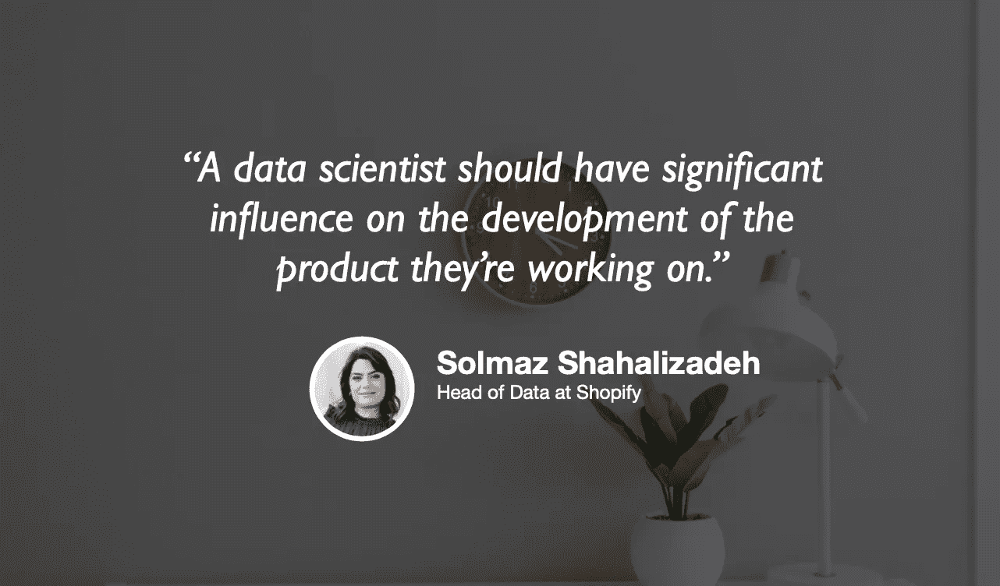

# 高增长公司中的数据科学

> 原文：<https://towardsdatascience.com/data-science-in-high-growth-companies-a6208480d101?source=collection_archive---------39----------------------->

## [苹果](https://podcasts.apple.com/ca/podcast/towards-data-science/id1470952338?mt=2) | [谷歌](https://www.google.com/podcasts?feed=aHR0cHM6Ly9hbmNob3IuZm0vcy8zNmI0ODQ0L3BvZGNhc3QvcnNz) | [SPOTIFY](https://open.spotify.com/show/63diy2DtpHzQfeNVxAPZgU) | [其他](https://anchor.fm/towardsdatascience)

## Solmaz Shahalizadeh 在 [TDS 播客](https://towardsdatascience.com/podcast/home)

背景图片由[萨曼莎·加德斯](https://unsplash.com/@srosinger3997)拍摄

*编者按:迈向数据科学播客的“攀登数据科学阶梯”系列由 Jeremie Harris 主持。Jeremie 帮助运营一家名为*[*sharpes minds*](http://sharpestminds.com)*的数据科学导师初创公司。可以听下面的播客:*

在过去的几个月里，我看到越来越多的主题之一是数据科学中产品思维的重要性。随着新的和有抱负的数据科学家深化他们的技术技能，并投入无数时间在 leetcode 上做练习题，产品思维已经成为许多申请人的一个非常严重的盲点。随着新工具的出现，这个盲点变得越来越重要，这些新工具抽象出了大量过去数据科学的日常工作，让数据科学家有更多时间发展主题专业知识，并专注于产品等式的商业价值方面。

如果有一家公司因在数据科学领域引领以产品为中心的思维而闻名，那就是 Shopify。如果 Shopify 有一个人在以产品为中心的数据科学方面花了最多时间，那就是 Shopify 的数据科学和工程主管 Solmaz Shahalizadeh。Solmaz 有着令人印象深刻的职业生涯，包括在 2013 年 IPO 前加入 Shopify，并见证了 Shopify 数据科学团队从少数几个人成长为一个关键的组织范围的努力，成千上万的商家今天依靠它谋生。

Solmaz 非常友好地加入了我的最新一集《走向数据科学》播客。以下是我最喜欢的一些外卖食品:

*   Shopify 在以产品为中心的数据科学领域取得成功的关键之一是其数据科学角色的垂直整合。在 Shopify 中，一名数据科学家不仅负责数据清理和模型构建，还负责将机器学习部署到生产中的每一步。在某种程度上，Shopify 的数据科学家是完全的产品所有者 Solmaz 认为这很重要，可以确保他们可以将他们正在处理的整个问题保存在 RAM 中，并利用从内外了解您的堆栈中获得的所有见解。
*   复杂的模型并不总是最好的解决方案。事实上，他们通常不是。Solmaz 指出，在预测的可靠性非常重要的情况下(在 Shopify 就是如此，商家的生计依赖于此)，简单且易于解释的模型通常是最好的。这并不是说 Shopify 不做深度学习或前沿 ML——但这不是他们的首选。毕竟，当一个简单的模型——甚至一个基于规则的系统——就足够好的时候，为什么要建立一个有许多活动部件的花哨模型呢？
*   Solmaz 鼓励有抱负的数据科学家建立他们关心的项目，而不是通过 Kaggle grinder。如果你处于学习过程的早期阶段，股票数据集是不错的，但只有当你进入你关心的数据集(最好是你自己收集的数据集)时，你才能展示你构建有用东西的能力，而不是 AUC 分数高但没有明确商业价值的模型。
*   Shopify 正在招人😀你可以访问他们的职业页面[这里](http://Shopify.com/careers)。

查看 Shopify 的[数据科学与工程博客](https://engineering.shopify.com/pages/data-science-engineering)，或者点击这里在 Twitter [上关注他们。](http://twitter.com/@ShopifyData)

你也可以在 Twitter 上关注 [Solmaz 这里](https://twitter.com/solmaz_sh)，在这里关注我。