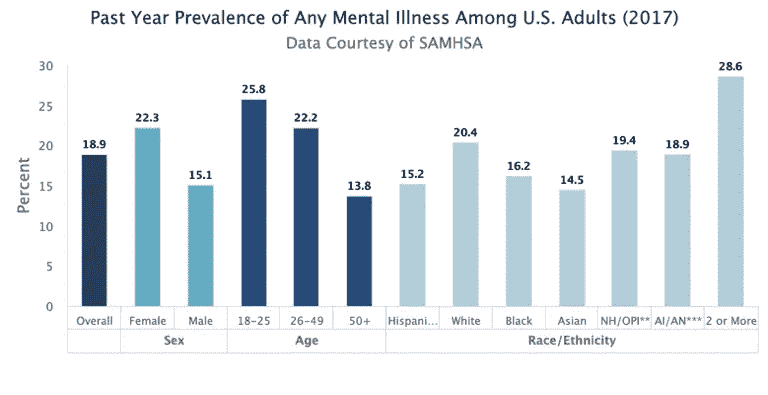
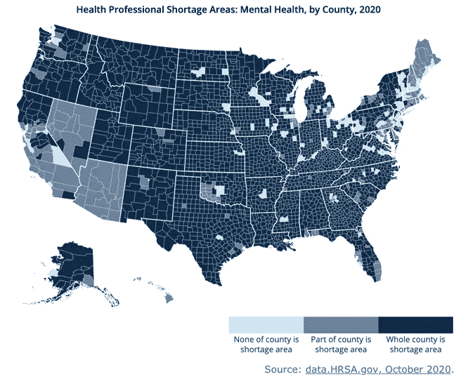
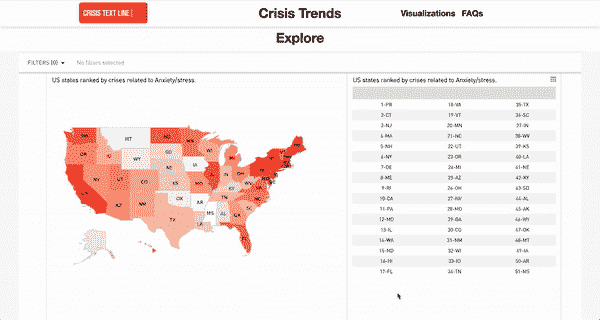
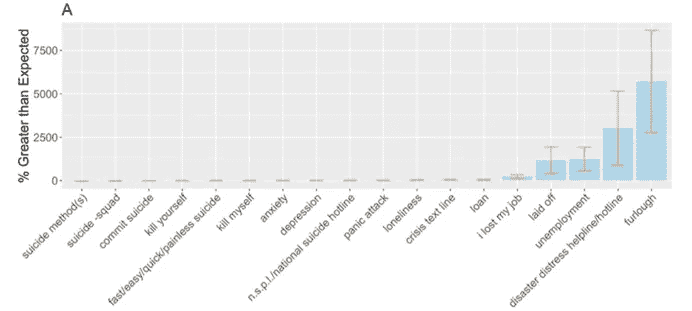

# 心理健康中的数据科学

> 原文：<https://towardsdatascience.com/data-science-in-mental-health-ccd09ba2148a?source=collection_archive---------14----------------------->

## [变更数据](https://towardsdatascience.com/tagged/data-for-change)

## 机遇和进步

照片由来自[派克斯](https://www.pexels.com/photo/time-lapse-photography-of-light-on-woman-s-head-2923402/?utm_content=attributionCopyText&utm_medium=referral&utm_source=pexels)的[深靛](https://www.pexels.com/@darkindigo?utm_content=attributionCopyText&utm_medium=referral&utm_source=pexels)拍摄

医疗保健数据科学几年来一直在快速发展，尽管使用数据来理解和解决心理健康问题已经落后于该领域的其他部分。然而，在许多方面，精神健康完全适合数据科学方法:美国精神疾病的负担是巨大的，往往没有得到解决，也没有被完全理解，这为数据驱动的研究和解决方案创造了巨大的潜力。在这篇文章中，我将强调将数据科学方法应用于精神健康问题的重要性，浏览代表该领域重要进展的 3 个案例研究，并描述我自己的一个使用谷歌搜索数据评估自杀行为的研究项目。

# 医疗保健中的数据科学

随着新数据源和分析技术的出现，数据科学在医疗保健领域的地位越来越重要。尽管几十年来一直是医疗保健不可或缺的一部分的学术研究和临床试验与“数据科学”新保护伞下的工作之间的界限有些模糊，但不可否认的是，新技术和数据源在医疗保健中的使用已经蓬勃发展。

除了传统的医疗保健数据来源，如患者病历、手写医生笔记、账单和索赔数据以及来自临床试验的数据，研究人员和数据科学家现在还可以访问基因组数据、电子病历(EMR)数据、来自可穿戴和移动设备的数据，以及代表社交媒体和互联网活动的数据。计算机化的发展和自然语言处理等分析技术的发展释放了现有数据源的新潜力，通过使用新数据源本身以及与这些现有数据源相结合，可以收集更多的见解。

数据科学在医疗保健领域最突出的三个应用如下:

1.  用于诊断目的的图像识别(例如，恶性肿瘤和器官异常)
2.  使用基因组学数据(如美国国立卫生研究院的 [1000 个基因组项目](https://www.genome.gov/27528684/1000-genomes-project))的精准医疗发展，倾向于关注心脏病和糖尿病等慢性病
3.  医院运营分析，通常看起来像标准的业务分析(例如，预测急诊室何时需要更多员工)

这三个例子代表了医疗保健数据科学的重要发展，但也证明了医疗保健数据科学通常专注于慢性疾病和医疗保健的业务方面。虽然有了很大的进步，但是心理健康方面的数据科学却落后了。

# 心理健康问题的负担

在美国，精神疾病的负担是非同寻常的。[大约五分之一的美国人患有精神疾病，在年轻人、女性、LGBTQIA+人群和某些少数群体中，这一比例甚至更高](https://www.nimh.nih.gov/health/statistics/mental-illness.shtml)。在 10 至 34 岁的人群中，[自杀是第二大死因](https://www.nami.org/mhstats)。

图片来自:[https://www . nimh . NIH . gov/health/statistics/mental-disease . shtml](https://www.nimh.nih.gov/health/statistics/mental-illness.shtml)

不幸的是，大多数有心理健康问题的人没有得到适当的治疗。2018 年，只有 43.3%患有精神疾病的成年人接受了治疗。在那些最终接受治疗的人中，症状出现和治疗开始之间的平均延迟是惊人的 [11 年](https://www.nami.org/mhstats)。虽然这种治疗差距有几个促成因素，但无法获得精神卫生服务提供者是最重要的因素之一。大约 40%的美国人生活在指定的精神卫生保健短缺地区，低收入美国人无法获得许多精神卫生专业人员，因为他们没有参加保险计划。

图片由 rhi hub([https://www.ruralhealthinfo.org/charts/7](https://www.ruralhealthinfo.org/charts/7))许可使用，数据来自健康资源和服务管理局(HRSA)。

精神疾病得不到治疗会给患者及其社区带来巨大的后果。有心理健康问题的人更有可能出现心血管和代谢疾病等身体状况，辍学，失业，无家可归，并被监禁。

# 数据科学如何提供帮助

很明显，在美国有巨大的心理健康需求没有得到满足。数据科学可以通过两种主要方式帮助弥合这一差距。

首先，数据科学可以帮助我们**更好地理解心理健康问题**。谁在经历心理疾病？哪些体征和症状是重要的诊断线索？是什么让一个人更有可能参与并坚持治疗？不同人群的心理健康问题是什么样的？

能够回答这些问题的数据越来越多，或者至少有可能收集。来自可穿戴设备的数据可以用于识别与精神疾病相关的生理标记，社交媒体和互联网活动可以提供对精神健康行为方面的洞察，医生和治疗师的笔记可以越来越多地使用自然语言处理进行分析，大脑扫描可能是诊断图像识别的理想候选。

其次，数据科学可以帮助我们**更好地理解和有效地实施心理健康问题的治疗**。许多患者在找到适合自己的方法之前，尝试了许多治疗师、治疗技术和药物。考虑到大多数患者在接受任何护理之前要等待多长时间，以及与尝试多种选择相关的成本和情感困难，这种寻找适当护理的广泛过程尤其成问题。因此，重要的是能够评估一种给定的治疗方法(正式的精神病治疗或其他)是否有效。如果是，它为谁工作？怎样才能让更多人接触到？

这些问题中的一部分可以通过标准的临床试验来解决，尽管它们经常受到小样本和非代表性样本的限制。评估自我指导治疗应用程序和聊天服务等新技术的分析对于评估这些干预措施的质量也至关重要。最终，基因组学和精确医学的进步可能会帮助患者找到一种比标准方法更有效地满足他们个人需求的治疗方法。此外，基于机器学习的聊天机器人和其他相关的人工智能仍处于起步阶段，但已经显示出作为最终治疗替代方案的巨大潜力。

使用数据科学改善精神卫生保健状况的机会很多，但更多的公司、提供商和个人必须推动这些可能性成为现实。

# **挑战** s

在推进心理健康数据科学的道路上，有几个值得注意的挑战，尽管它们远非不可克服。

精神健康问题仍然被高度污名化，这既提出了资金问题，也提出了数据问题。尽管对精神健康的兴趣和意识肯定在增长，但对癌症这样的疾病仍然没有广泛的支持。此外，相对于与其他健康问题相关的数据，患者可能更关心如何使用代表其精神健康问题的数据。对许多人来说，考虑正在分析的最近一次膝盖手术的医生笔记，可能比考虑最近一次治疗会议的笔记更容易接受。与治疗师相比，患者也更容易对他们的骨科医生诚实，所以这些治疗记录实际上可能是质量较低的数据。这种耻辱也有助于保持心理健康相关数据的私密性和安全性。

此外，我们现有的治疗和诊断能力还有很大的改进空间。虽然随着时间的推移，数据科学肯定可以帮助解决其中的一些问题，但使用数据来诊断我们完全了解的疾病要比我们不了解的疾病容易得多。如果有明确的生物标志物或其他指标可以用来衡量治疗效果，那么评估治疗也更容易。许多研究现在依赖于患者的自我报告，这可能无法真正捕捉特定治疗的影响。

最后，仍然很难获得好的数据。当然，有用的数据比以往任何时候都多，而且有很多事情要做，但维护和共享精神卫生保健相关数据的基础设施往往很差。HIPAA 法律通常也会给获取任何医疗保健数据带来一些挑战。使数据质量进一步复杂化的是，大多数人没有接受精神健康问题的治疗，这意味着任何治疗数据都代表接受治疗的*人口，而不是需要*治疗的*人口。*

# 个案研究

尽管心理健康领域的数据科学不如医疗保健其他领域的数据科学发达，但这一领域已经开始了极其重要和令人难以置信的工作。下面，我将描述 3 个有前景的案例研究，它们展示了数据科学在彻底改变美国精神卫生保健状况方面的巨大潜力。

## 案例研究 1:危机文本行

[危机短信热线](https://www.crisistextline.org/)由训练有素的志愿者通过短信提供免费的全天候危机咨询。自 2013 年热线开通以来，这些志愿辅导员已经处理了超过 500 万次短信对话。作为一家技术公司，Crisis Text Line 认为使用他们的数据来改善他们提供的护理并增强我们对心理健康问题的更广泛理解非常重要。

有时，需要危机干预的短信发送者数量超过了可用的志愿者。虽然这种情况对任何需要帮助的人来说都是不理想的，但危机短信热线知道，有些人比其他人更迫切需要帮助。该公司使用机器学习模型来识别表明自杀风险较高的单词和表情符号，使他们能够将最高风险的短信发送者移到队列的前面。这些模型使用了导致积极救援(即使用紧急服务)的文本对话数据，这是一种新的非常重要的数据。众所周知，预测自杀企图和自杀死亡是非常困难的，该领域缺乏有效的筛选工具或其他有效的预测机制。因此，具有通过文本消息行为预测这些事件的能力，具有最终以更广泛的方式解决这种诊断弱点的巨大潜力。

这些机器学习模型产生的发现强调了在心理健康中使用数据驱动方法的重要性，因为较高自杀风险的指标不是特别直观。[事实上，使用“Advil”和“Ibuprofen”这两个词比使用“cut”、“die”、“suicide”或“kill”这两个词对自杀企图的预测性要高 14 倍，而哭丧着脸的表情符号比“自杀”这两个词的预测性高 11 倍](https://www.vox.com/science-and-health/2018/6/8/17441452/suicide-prevention-anthony-bourdain-crisis-text-line-data-science)依靠数据而非直觉，危机短信热线能够更准确、更高效地识别处于严重危机中的人员，并更迅速地提供援助。

除了开发这种风险检测工具，危机文本热线还致力于将他们的数据用于精神健康的整体改善。除了发布从他们的数据中收集的见解的常规博客之外，危机文本热线还拥有一个根据他们的数据构建的互动仪表板，允许用户探索美国各地情绪困扰的模式。用户可以按主题和地理区域进行过滤，以探索共同出现的问题、地理差异、时间序列模式以及描述特定问题的常用语言:

www.crisistrends.org 的屏幕截图

危机短信热线也采取措施，确保短信发送者与他们分享的敏感数据的安全。发短信的人可以[随时要求删除他们的数据](https://www.vox.com/science-and-health/2018/6/8/17441452/suicide-prevention-anthony-bourdain-crisis-text-line-data-science)，一个内置的算法[删除个人身份信息](https://www.vox.com/science-and-health/2018/6/8/17441452/suicide-prevention-anthony-bourdain-crisis-text-line-data-science)，比如姓名、电话号码和地点。

## 案例研究 2:三维聊天机器人埃莉

艾莉在行动:[https://www.youtube.com/watch?v=ejczMs6b1Q4](https://www.youtube.com/watch?v=ejczMs6b1Q4)

上图中的“埃莉”是由南加州大学创新技术研究所的研究人员创造的。该项目由国防高级研究计划局资助，目标是解决退伍军人中的 PTSD 问题。

艾莉的创造者[基于她的身体语言和言语模式](https://www.news.com.au/technology/innovation/meet-ellie-the-robot-therapist-treating-soldiers-with-ptsd/news-story/0201fa7cf336c609182cffd637deef00)来自描述现实生活中心理健康专家的许多小时的录制视频，她允许病人比他们在真人面前更开放和诚实。如果患者害怕被评判或识别，他们通常不愿意透露信息，这在退伍军人中尤其如此，因为在这个群体中，精神疾病被视为一种强烈的耻辱。

Ellie 不能取代传统治疗，而是被设计成一个“[数据收集器](https://hbr.org/2018/10/ais-potential-to-diagnose-and-treat-mental-illness)”来改进诊断过程。当患者对 Ellie 说话时，[会收集关于他们语速和回答问题前停顿时间的数据](https://hbr.org/2018/10/ais-potential-to-diagnose-and-treat-mental-illness)，以及患者脸上 66 个独特点的运动和位置。这一过程表明，患有创伤后应激障碍[的患者比没有创伤后应激障碍的患者更频繁地触摸他们的头和手](https://www.news.com.au/technology/innovation/meet-ellie-the-robot-therapist-treating-soldiers-with-ptsd/news-story/0201fa7cf336c609182cffd637deef00)，如果没有埃莉收集和分析的大量数据，这一诊断线索可能会被完全遗漏。事实上，在一项针对阿富汗患者的研究中，埃莉发现了比标准的退伍军人部署后健康评估更多的 PTSD 症状。

目前，Ellie 是一个非常有价值的、数据驱动的治疗支持工具。然而，这一模型的成功提供了希望，即类似人工智能的进步可能能够为传统疗法提供替代方案。这种技术可以增加获得护理的机会，并解决美国如此普遍的治疗短缺问题。

## 案例研究 3:四方健康

[Quartet Health](https://www.quartethealth.com/) 是一家总部位于纽约的心理健康科技公司，致力于通过四管齐下的综合方法提高心理健康护理的质量和可及性。

他们模式的第一部分包括与需要精神保健的人建立联系。这可以通过提供者转介、直接患者注册和对可能需要护理的人进行筛查来实现。这种创新的筛选过程是数据科学的切入点，因为机器学习模型被应用于患者的病史和行为模式，以寻找未诊断的精神健康问题的迹象。这种分析策略导致了几项有趣的发现，例如，一名患者反复测试心脏问题呈阴性[表明他可能患有焦虑症](https://hbr.org/2018/10/ais-potential-to-diagnose-and-treat-mental-illness)。

接下来，识别出的病人被匹配到适当的护理形式。在选择护理类型时，患者的个人偏好、临床适应症和保险范围都要考虑在内。可能性包括传统疗法和精神护理，以及在线项目。

四方模型的第三个方面与该公司使用数据驱动的决策来改善精神卫生保健的整体方法相一致。一旦患者被纳入护理，这种护理的质量是由四方监测随着时间的推移。通过持续收集和分析关于患者情况的数据，Quartet 可以快速识别治疗方法何时不起作用，并调整给定患者正在接受的护理。

最后，四方确保在整个过程中支持登记的患者。转诊提供者通常不会收到任何有关其患者精神健康治疗经验的更新，但 Quartet 将转诊提供者和精神健康护理提供者联系起来，以确保这些至关重要的利益相关者之间的沟通。四方还通过他们的“关爱导航员”团队为那些需要帮助的人提供额外的支持

这种数据驱动的模式已经被证明是有效的，并且正在被保险公司采用。Quartet 已经能够识别在困难的诊断或治疗后可能有心理健康问题的患者，已经将一些患者的急诊次数减少了 15-25 %,并且与传统方法相比，在更短的时间内将更多的患者与心理健康护理联系起来。

# 使用谷歌搜索数据理解新冠肺炎对自杀的影响

我的最后一个例子来自[一项我个人参与的研究](https://www.ncbi.nlm.nih.gov/pmc/articles/PMC7380602/)。随着新冠肺炎在 3 月和 4 月迅速在美国蔓延，我和我的团队开始好奇这种病毒以及用于遏制它的封锁可能对自杀倾向和自杀风险因素产生的影响。

我们推测疫情可能影响以下自杀风险因素:财务紧张和失业、孤独、焦虑、悲伤和压力水平增加。出于几个原因，我们决定使用谷歌搜索(通过[谷歌趋势](https://trends.google.com/trends/?geo=US)数据)来评估这些风险因素。首先，谷歌趋势数据在 4 月份可以立即访问，并且不依赖于被新冠肺炎患者淹没的医疗系统。此外，有重要的前期研究建立了谷歌搜索行为和自杀行为之间的联系。

我们分析了代表四个领域的 18 个查询:

*   **自杀特定查询:**自杀小队，自杀，自杀，自杀方法，自杀，快速/简单/快速/无痛自杀
*   **求助查询:**危机短信热线、全国自杀预防热线+全国自杀热线、灾难求助热线+灾难求助热线
*   **一般心理健康查询:**抑郁、惊恐发作、焦虑
*   **财务困难查询:**失业、失业、下岗、休假、贷款
*   **未分类查询:**孤独

我们使用了从 2020 年 3 月 1 日到 2020 年 4 月 18 日的每周搜索数据，出于这项研究的目的，我们将这一时期定义为早期疫情时期。自回归综合移动平均(ARIMA)模型根据一年的数据(2019 年 3 月 3 日至 2020 年 2 月 29 日)进行训练，并用于预测疫情早期的每周相对搜索量。然后计算观察值和预期值之间的百分比差异:

对于所有包含的查询，95% CIs 的百分比差异。图片作者。

具有 95% CIs 的百分比差异，限于具有较小百分比差异的查询，用于可视化目的。图片作者。

从上文可以看出，代表经济困难(自杀的一个已知风险因素)和灾难求助热线(在疫情早期得到广泛推广)的查询大幅增加。财务困难查询的提升尤其令人担忧，一项研究甚至发现搜索“下岗”是延迟 2 个月的实际自杀的最强预测因素。

当我们放大那些与金融查询的变化相比相形见绌的查询时，我们看到与自杀明确相关的搜索实际上适度减少了。这可能是因为在疫情的早期阶段，我们都在一起努力应对眼前的压力，形成了国家的社区意识。这种模式是有先例的，因为在国家灾难(如 911 袭击)后，自杀率下降[。然而，不幸的是，在 1918 年的流感和 2003 年的非典爆发后，自杀死亡人数出现了长期增长，我们预计，如果不采取适当的干预措施，自杀和自杀死亡人数可能会出现长期增长。](https://pubmed.ncbi.nlm.nih.gov/20435960/)

像我们这样的研究很重要，因为它们已经被用来吸引注意力和资源来研究新冠肺炎对精神健康的影响。我们的研究发表在 2020 年 7 月 24 日的《PLOS 一号》上，可以在这里找到。

# 结论

尽管心理健康领域将从数据科学使用的增加中受益匪浅，但该领域的发展落后于医疗保健其他领域。也就是说，一些组织已经取得了令人振奋的进步，如危机短信热线、南加州大学创新技术研究所和四方健康组织。这些项目的成功强调了数据科学应用在心理健康中的重要性和潜在益处。