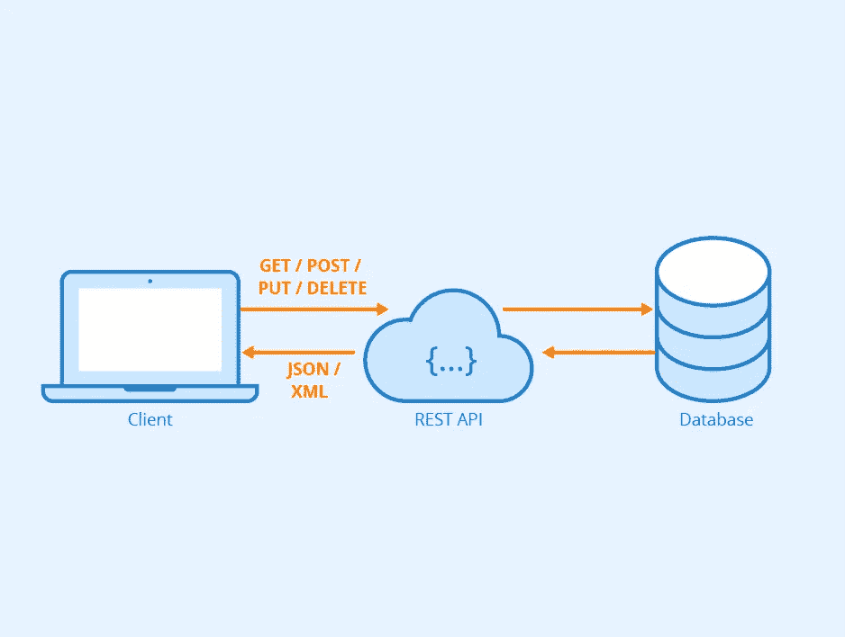
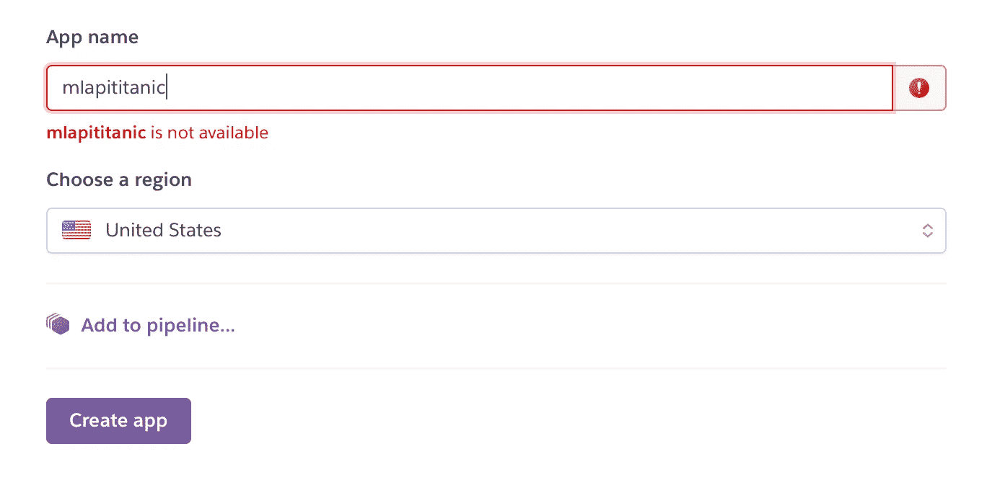

# 生产中的数据科学:构建 Flask APIs 以最佳实践服务 ML 模型

> 原文：<https://towardsdatascience.com/data-science-in-production-building-flask-apis-to-serve-ml-models-with-best-practices-997faca692b9?source=collection_archive---------14----------------------->

由 Jay Kachhadia 与 Canva 一起建造

在我之前关于[全栈数据科学:下一代数据科学家群体](/full-stack-data-science-the-next-gen-of-data-scientists-cohort-82842399646e)的博客获得大量关注后，我决定开始一个关于生产中的数据科学的博客系列。本系列将介绍技术栈和技术的基础，您可以熟悉这些技术，以面对真正的数据科学行业，例如机器学习、数据工程和 ML 基础设施。这将是一个如何通过部署你的模型和用行业中使用的最佳实践创建 ml 管道来把你的学术项目带到下一个层次的演练。

# 生产中的数据科学

听起来可能很简单，但这与在行业中为你的副业项目或学术项目实践数据科学是非常不同的。它在代码复杂性、代码组织和数据科学项目管理方面要求更多。在这个系列的第一部分中，我将带你们了解如何通过构建 API 来服务于 ML 模型，以便你们的内部团队可以使用它，或者你们组织之外的任何人都可以使用它。

在课堂上，我们通常会从 Kaggle 获取数据集，对其进行预处理，进行探索性分析，并建立模型来预测一些或其他事情。现在，让我们进入下一个层次，将您构建的模型和对数据的预处理打包到 REST API 中。嗯，什么是 REST API？等等，我很快会详细说明一切。让我们从定义我们将使用什么和它背后的技术开始。

# REST APIs

API 是应用程序编程接口，这基本上意味着它是一个计算接口，帮助您与多个软件中介进行交互。什么是休息？REST 是代表性的状态转移，是一种软件架构风格。让我用一个简单的图表向你们展示我所说的:

图片来自 astera.com

因此，在我们的情况下，客户端可以通过使用我们构建的模型与您的系统进行交互以获得预测，并且他们不需要我们构建的任何库或模型。如果你参加面试或申请高等教育，展示你的项目会变得更加容易。这是他们可以看到的工作，而不是写在你简历上的三行狗屎之类的东西。

在这里，我们将构建服务于我们的机器学习模型的 API，我们将在 **FLASK** 中完成所有这些工作。Flask 也是 python 的一个 web 框架。你一定听说过业内的两个大公司，Flask 和 Django。Flask 和 Django 都是令人惊叹的 python web 框架，但是在构建 API 时，Flask 速度非常快，因为它不太复杂，设计也很简单。Wohoo！因此，我们将再次经历行业中普遍使用的一些东西。在不浪费更多时间的情况下，让我们开始研究一些代码，并为 ML 模型构建我们的 API。

# 设置您的环境

第一步总是设置您自己的项目环境，这样您就可以将您的项目库及其版本与本地 python 环境隔离开来。有两种方法可以专门为你的项目设置 python 环境: **Virtualenv** 和 **Conda** 。只是为了保持一致，我将在整个项目中使用 Python 3.8.3，但你可以使用任何版本，这应该没问题。

用 pip 和 virtualenv 创建虚拟环境

用公寓创建虚拟环境

在您的终端中执行上述任何命令后。您将处于项目自己的虚拟环境中。如果你想在虚拟环境中安装任何东西，它就像普通的 pip 安装一样简单。在您从事任何项目时，创建虚拟环境始终是业内的标准做法。

一旦你进入虚拟环境，使用来自 github repo 的 requirements . txt:[https://github.com/jkachhadia/ML-API](https://github.com/jkachhadia/ML-API)

 [## jkachhadia/ML-API

### 将机器学习模型作为 API。在 GitHub 上创建一个帐户，为 jkachhadia/ML-API 开发做贡献。

github.com](https://github.com/jkachhadia/ML-API) 

请确保将 requirements.txt 文件从 repo 复制到您的项目文件夹中，因为我们稍后将使用它，我还将向您展示如何创建您自己的 requirements.txt 文件。将文件复制到项目文件夹并确保您处于刚刚创建的环境中之后，在终端中运行以下命令来安装项目所需的所有依赖项。

现在，一切都准备好了。

# 构建您的 ML 模型并保存它

对于这个项目，我们的主要目标是以 API 的形式打包和部署我们构建的 ML 模型。因此，我们将使用 Kaggle 的初始数据集[和一个带有特征工程的基本逻辑回归模型来构建我们的模型。如果你想知道我是如何构建基本模型的。代码可以在这个](https://www.kaggle.com/c/titanic) [Github repo](https://github.com/jkachhadia/ML-API) 上找到。你可以在 model_prep.ipynb ipython 笔记本中找到代码(假设你熟悉 ipython 笔记本)。这段代码的灵感来自于我发现的一个 kaggle 内核，因为这不是这里的主要目标。

我们将使用 [pickle](https://docs.python.org/3/library/pickle.html) 库来保存模型。反过来，您的模型是一个 python 对象，包含所有的方程和超参数，可以用 pickle 序列化/转换成字节流。

保存模型的示例代码

上述代码也可以在 model_prep 笔记本中找到。

# 有趣的部分——Flask API 创建和文件夹管理

我们现在将创建一个具有最佳实践的 Flask API。什么最佳实践？例如，如何创建一个干净的代码，可以交付到生产环境中，并且在出现任何问题时易于调试。

因此，首先，我们将创建一个 helper_functions python 脚本，其中包含我们需要的所有预处理模块。同样，这是您将在 model_prep 笔记本中找到的相同的预处理代码，但是我们用它来创建函数，以便在其他任何地方重用。

helper_functions.py 的代码

现在，我们不会硬编码我们将在最终 API 脚本中使用的变量或名称。因此，我们可以创建一个名为 configs.py 的单独的 python 文件，出于安全目的，它将基本上存储我们的所有变量。

让我们开始构建我们的 API。我们将从一个简单的开始:只是 hello world 的一个新版本。创建一个名为 app.py 的新文件，让我们导入启动和运行 API 所需的所有库。

我们已经导入了上述代码中的所有库，以及所有的帮助函数和变量配置。现在让我们初始化一个 flask 应用程序实例。

首先，让我们编写一个简单的 flask 类型 hello world，并为我们的 flask 应用程序创建一个新的路由。路由通常是功能支持的 URL。

恭喜你。你写了你的第一个烧瓶路线。现在让我们通过运行我们用 Flask 启动的 app 对象来运行它。

是啊！我们差不多完成了我们的第一次迷你演出。让我们在本地运行这个。打开您的终端并运行 app.py(确保您位于 app.py 所在的项目文件夹中，并且您位于我们之前创建的虚拟环境中)

呜哇！我们的 Flask 应用程序应该运行在 [http://127.0.0.1:5000](http://127.0.0.1:5000) 上。如果你用浏览器去那个网址。我们应该得到我们在第一个路由中添加的消息:“你好，来自泰坦尼克号数据的 ML API！”。超级爽！

让我们开始构建我们的新路线，这将是我们展示 ML 模型的方式。

在上面添加了预测/的新路径中，如果有人向 flask 应用程序的 URL 发送 get 请求以及 JSON 形式的原始数据，我们将按照创建模型的方式预处理数据，获取预测并发回预测结果。

request.get_json()将基本上为我们提供与 get 请求一起发送的 json 数据。我们将数据转换成数据帧，使用我们辅助函数 preprocess()来预处理数据帧，使用配置文件中的 model_name 和列名来加载带有 pickle 的模型，并对切片的数据帧进行预测。

做出预测后，我们将创建一个包含预测和预测标签元数据的响应字典，最后使用 jsonify 将其转换为 JSON，并将 JSON 返回。记住 200 是因为它是成功的。编辑后保存 app.py 后，仍在运行的 flask 应用程序将自动更新其后端以合并新的路线。

# 在本地测试我们的 API

为了在本地测试我们的 API，我们将只编写一个小的 ipython 笔记本，或者您可以在 github repo 中使用一个名为 testapi.ipynb 的笔记本

如果您在 python 终端或 ipython 笔记本中运行上述代码，您会发现您的 API 工作起来非常神奇。万岁！您已经成功地公开了您的模型，但是在本地:(

# 在 Heroku 上部署 ML API

Heroku 是一个云平台，帮助你在他们的云上部署后端应用。是的，我们将在云中部署我们的 ML 模型 API。

让我们开始吧。在 heroku.com 的[上创建您的账户。一旦你这样做，并前往仪表板，你将不得不创建一个新的应用程序。](https://www.heroku.com/)

Heroku 仪表板上部

你点击创建新的应用程序，并相应地命名为我命名为' mlapititanic '

我的不可用，因为我已经创建了它:p

厉害！现在，你可以点击你的应用程序，进入设置，将 python 添加到你的 buildpack 部分。

你也可以通过安装 [Heroku CLI](https://devcenter.heroku.com/articles/heroku-cli) 来实现这一点，我们最终将不得不这样做来部署我们的应用。

安装 CLI 后，您还可以从命令行创建一个应用程序，如下所示:

我喜欢 CLI 方式，因为我已经是一个 Ubuntu/Mac 用户 5 年了。

现在，我们将向该文件夹添加两个文件，即 Procfile 和 runtime.txt。

那是我的版本，但是你的可以不同

Procfile 基本上会用 gunicorn 运行你的应用。确保您的虚拟环境中安装了该软件。现在，正如我告诉你的，我们将讨论如何创建你自己的 requirements.txt 文件。

这基本上会将您的所有应用程序/虚拟环境的依赖项转储到 requirements.txt 文件中。

现在，如果你去 heroku 的部署部分，他们有关于如何部署的非常清楚的说明，但我会把它们放在下面。

这些命令会将您的代码推送到 heroku cloud，并使用依赖项构建您的 flask 应用程序。恭喜你！您已经将 ML API 部署到云/生产中。

现在你可以进入 https:// <your-app-name>.herokuapp.com/</your-app-name>

现在我们将测试部署的 API！

如果它正在运行。你都准备好了！呜哇！

# 结论

因此，我们用行业中使用的最佳实践构建了我们自己的 ML 模型 API，这可以用在你的其他项目中，或者你可以在你的简历中展示它，而不仅仅是像以前那样填写。这是真实的，互动的，证明你真的建立了一些东西。

在 gmail dot com 的[我的名字][我的名字]上提问，或者在 LinkedIn 的[上联系我们](https://www.linkedin.com/in/jkachhadia)。