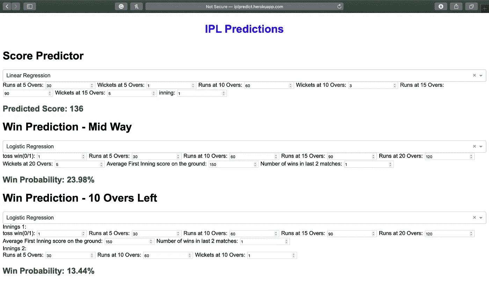

# 生产中的数据科学:使用 Dash 为您的数据科学项目快速构建交互式用户界面

> 原文：<https://towardsdatascience.com/data-science-in-production-quickly-build-interactive-uis-for-your-data-science-projects-with-dash-6568e7df5528?source=collection_archive---------26----------------------->

## 这篇博客讲述了如何使用机器学习创建 dash 应用程序，以及如何将您的数据科学项目部署到云中。

封面由 Jay Kachhadia 和 Canva 共同设计

在我之前的一篇关于[全栈数据科学:下一代数据科学家群体](/full-stack-data-science-the-next-gen-of-data-scientists-cohort-82842399646e)的博客获得大量关注后，我决定开始一个关于生产中的数据科学的博客系列。本系列将介绍技术栈和技术的基础，您可以熟悉这些技术，以面对真正的数据科学行业，例如机器学习、数据工程和 ML 基础设施。这将是一个如何通过部署你的模型和用行业中使用的最佳实践创建 ml 管道来把你的学术项目带到下一个层次的演练。这是本系列的第二部分，你可以在这里看一下第一部分:[生产中的数据科学:构建 Flask APIs 来服务具有最佳实践的 ML 模型](/data-science-in-production-building-flask-apis-to-serve-ml-models-with-best-practices-997faca692b9)

这篇博客将讲述如何快速构建使用机器学习的交互式 web 应用程序，以及如何将这些应用程序部署到 Heroku cloud 中。简历上任何可以展示的东西都比仅仅是文本的东西增加了 10 倍的价值。

# Dash:构建数据科学应用的 web 框架

[Dash](https://dash.plotly.com) 是由 Plotly 专门为数据科学和人工智能应用而构建的开源 web 框架。通常需要前端、后端和 DevOps 团队的全栈应用程序可以由数据科学家使用 Dash 在几个小时内完成构建和部署。是啊！你可以用 Python 做任何事情，这就是 beautiful❤.

我们将从头开始建造这整个东西(用 Canva 创建)

Dash 构建在 Flask、Plotly.js、React 和 React Js 之上，但在本练习中，我们将用 python 编写大部分代码，并嵌入一些 html 和 css 元素。

# 设置您的环境

第一步通常是建立您自己的项目环境，这样您就可以将您的项目库及其版本与本地 python 环境隔离开来。有两种方法可以专门为您的项目设置 python 环境: **Virtualenv** 和 **Conda** 。只是为了保持一致，我将在整个项目中使用 Python 3.7.3，但你可以使用任何版本，这应该没问题。

用 pip 和 virtualenv 创建虚拟环境

用 Conda 创建虚拟环境

在您的终端中执行上述任何命令后。您将处于项目自己的虚拟环境中。如果你想在虚拟环境中安装任何东西，它就像普通的 pip 安装一样简单。在您从事任何项目时，创建虚拟环境始终是业内的标准做法。

进入虚拟环境后，使用 app 文件夹中 github repo 的 requirements . txt:[https://github . com/jkachhadia/IPL-prediction/tree/master/app](https://github.com/jkachhadia/ipl-prediction/tree/master/app)

 [## jkachhadia/IPL-预测

### 此时您不能执行该操作。您已使用另一个标签页或窗口登录。您已在另一个选项卡中注销，或者…

github.com](https://github.com/jkachhadia/ipl-prediction/tree/master/app) 

现在，一切都准备好了！

# 预处理和构建模型

让我们让这变得更有趣一点，所以我们将为板球比赛建立预测模型，我们将使用来自 https://www.kaggle.com/nowke9/ipldata 超级联赛(IPL)上的 Kaggle:的数据集。IPL 时钟达到 4.62 亿，第 12 季电视观看时间为 3380 亿分钟。

 [## 2008-2019 印度超级联赛

### 逐球印度超级联赛(IPL)板球数据集

www.kaggle.com](https://www.kaggle.com/nowke9/ipldata) 

如果你已经克隆了上面分享的 repo，这里有一个 ipython 笔记本，向你展示如何预处理一个球接一个球的数据和匹配数据。这有点复杂，所以我不会在这里解释预处理步骤，因为这不是我们的主要目的。该笔记本产生 6 个预处理数据集，我们稍后将在 Dash 应用程序中使用这些数据集。我们将以这样一种方式构建应用程序，任何用户都可以调整模型参数来获得所需的预测。我们将建立 3 个模型:分数预测器，第一局后的获胜概率预测器，以及还剩 10 局时的获胜概率预测器。

# 构建我们的 Dash 应用程序

我们现在将开始处理一些代码来构建我们的 dash 应用程序。让我们创建一个名为 app.py 的新文件，并从导入我们需要的库开始。

现在让我们声明我们将在多个函数中使用的所有全局变量。

我们将导入所有预处理的训练数据，以节省我们的应用程序在预处理上的时间。所有的预处理步骤都在 ipython 笔记本中。

现在，让我们用一个外部 css 样式表启动我们的 dash 应用程序(样式表部分不是必需的)

## 设计应用布局

我们现在将使用 dash 的内部 html 组件定义来设计 web 应用程序的外观。有一些 html 和 css 知识是很好的，但不是必要的，因为它并不太复杂。

我们想要设计的布局

这是我们想要设计的 webapp 的布局，在 UI 设计方面非常简单。我们必须在 dash 布局中定义 UI 中的每一个元素。我们必须指定每个元素的 id 和样式，以便能够控制和获取数据，并在后端进行处理。理解的一个好方法是阅读和编写下面的代码，并与上面的 UI 进行比较。

我们想让它完全动态，这样当随机森林或神经网络被选中时，我们就可以选择调整模型参数，否则看不到它们。因此，当下拉选项改变时，我们将使用回调来动态地改变 UI。

这六个回调将使参数设置的可见性完全动态化，并且非常容易，因为当算法的下拉列表发生变化时，只需要一些条件语句来检查值和设置属性。

## 为 ML 添加逻辑

现在，我们将进行有趣的部分，即制作动态 ML 组件，当我们更新特征或模型参数时，该组件将快速更新预测。当特性或参数组件发生变化时，我们将再次使用 dash 回调来更新页面的预测组件。

正如你在上面看到的，我们增加了 3 个回调来更新预测。现在您需要的只是一些运行服务器的代码。

是啊！我们差不多完成了我们的第一次迷你演出。让我们在本地运行这个。打开您的终端并运行 app.py(确保您位于 app.py 所在的项目文件夹中，并且您位于我们之前创建的虚拟环境中)

Wohoo！您的应用应该在 [http://127.0.0.1:8050/](http://127.0.0.1:8050/) 上启动并运行！

# 在 Heroku 上部署 IPL 预测应用

Heroku 是一个云平台，帮助你在他们的云上部署后端应用。是的，我们将在云中部署我们的 dash 应用程序。

让我们开始吧。在 heroku.com 的[上创建您的账户。一旦你这样做，并前往仪表板，你将不得不创建一个新的应用程序。](https://www.heroku.com/)

Heroku 仪表板上部

你点击创建新的应用程序，并相应地命名为我的命名为“iplpredict”

我的不可用，因为我已经创建了它:p

厉害！现在，你可以点击你的应用程序，进入设置，将 python 添加到你的 buildpack 部分。

你也可以通过安装 [Heroku CLI](https://devcenter.heroku.com/articles/heroku-cli) 来实现这一点，我们最终将不得不这样做来部署我们的应用。

安装 CLI 后，您还可以从命令行创建一个应用程序，如下所示:

我喜欢 CLI 方式，因为我已经是一个 Ubuntu/Mac 用户 5 年了。

现在，我们将把两个文件 Procfile 和 runtime.txt 添加到 app 文件夹中。

Procfile

runtime.txt

Procfile 基本上会用 gunicorn 运行你的应用。确保您的虚拟环境中安装了该软件。现在，我们将介绍如何创建自己的 requirements.txt 文件。

这基本上会将您的所有应用程序/虚拟环境的依赖项转储到 requirements.txt 文件中。

现在，如果你去 heroku 的部署部分，他们有关于如何部署的非常清楚的说明，但我会把它们放在下面。

这些命令会将您的代码推送到 heroku cloud，并使用依赖项构建您的 flask 应用程序。恭喜你！您已经将 dash 应用部署到云/生产环境中。

现在你可以进入 https:// <your-app-name>.herokuapp.com/。还有，你可以在这里查看我的 app 版本:[http://iplpredict.herokuapp.com](http://iplpredict.herokuapp.com)</your-app-name>

如果它正在运行。你都准备好了！呜哇！

# 结论

因此，我们构建了我们自己的 dash web 应用程序，这可以用于您的其他项目，或者您可以在您的简历中展示它，而不仅仅是像以前一样填写您所做的内容。这是真实的，互动的，证明你真的建立了一些东西。Dash 还提供许多其他功能，比如构建实时可视化和仪表盘。

在 gmail dot com 的[myLastName][myFirstName]上提问，或者在 LinkedIn 的[上联系我们](https://www.linkedin.com/in/jkachhadia)。