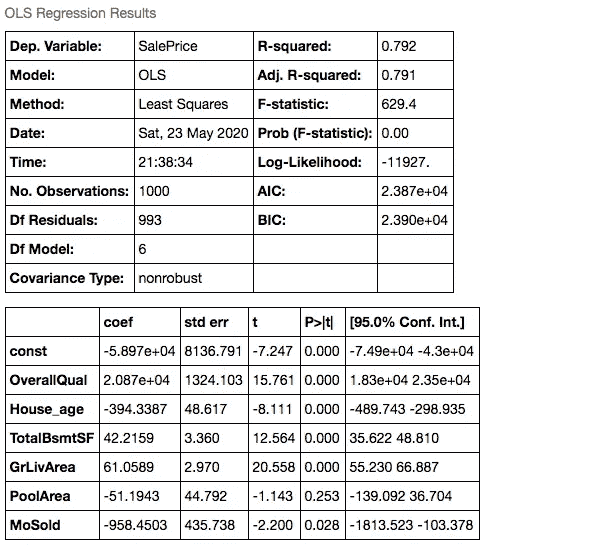
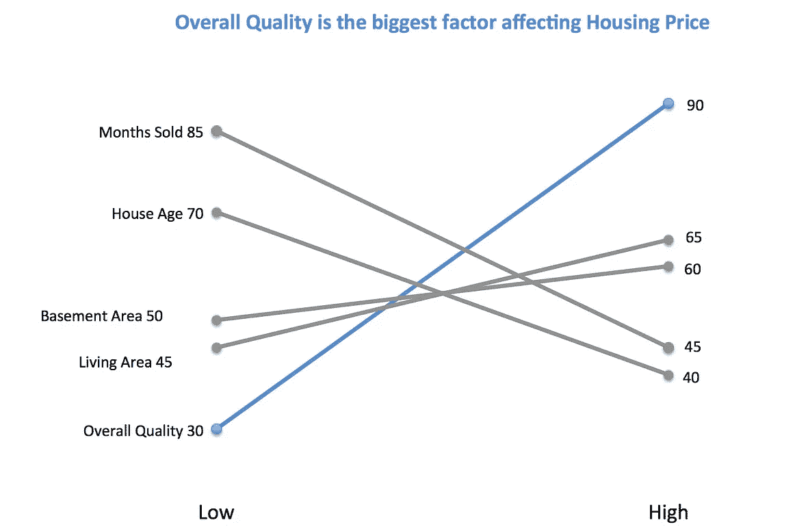

# 你准备好成为数据科学家了吗？

> 原文：<https://towardsdatascience.com/data-science-in-school-vs-at-work-2aebda0ccb23?source=collection_archive---------54----------------------->

## 学校与工作中的数据科学

伊万·班杜拉在 [Unsplash](https://unsplash.com/s/photos/contrast?utm_source=unsplash&utm_medium=referral&utm_content=creditCopyText) 上的照片

3 年前，我毕业于一所大学，获得了商业分析(大数据)学士学位。我渴望成为一名数据科学家，并希望应用我在学校学到的所有机器学习模型来改变世界。是的,“改变世界”甚至是我在那段时间的许多采访中使用的短语，因为我相信如此。

现在回顾过去 3 年，我会说我太年轻，对数据科学在现实世界中的应用过于理想化。在这篇文章中，我想谈谈数据科学在学校和实际工作中的区别。我希望这篇文章能够引起一些当前数据科学家的共鸣，也有助于为未来渴望成为数据科学家的人设定期望。

## 因素 1:数据可用性

对于数据可用性，我指的是数据数量和数据质量。它分解成多个问题。

> 我们有没有首先需要的数据？
> 
> 我们是否有足够数量的案例数据来创建有效的机器学习模型(用于训练和测试数据集)？
> 
> 数据质量如何？(缺失数据？良好的行业分布？)
> 
> 数据集的更新程度如何？
> 
> 数据是否以您想要的格式存在？

**在学校:老师**会提供一个数据集，或者我们需要去寻找自己的数据集。即使我们被要求找到我们自己的数据集，我通常做的是去世界银行，使用它的一个宏观经济数据集。这是因为世界银行的数据集是完整的，而且通常质量良好。

我们的大部分努力都集中在建立机器学习模型上，而不是找到一个好的数据集或清理数据。

不幸的是，除非你属于谷歌或脸书这样的科技巨头，否则数据集不容易获得，尤其是高质量的数据。我们需要从网上搜集数据或者从第三方供应商那里购买数据。

由于样本大小或预测因子数量的数据限制，有时我不能应用随机森林算法或甚至训练测试分裂，因为它们需要最少的数据行或列。此外，如果我从事数据科学项目，我大约 90%的时间都在做数据工程或清理数据集，以确保它处于良好状态。

## 因素 2:业务需求

图片来自 Unsplash[的 Sharon McCutcheon】](https://unsplash.com/photos/rItGZ4vquWk)

这听起来有点不公平，因为学校并不是一个正常的商业实体。然而，这正是不同之处。学校并不依赖你的机器学习模型来盈利，因此启动项目所需的业务水平存在很大差异。

**在学校:**我可以拿起任何问题陈述，用我的机器学习模型去解决。尽管由于实现的难度，这个问题可能没有太大的价值，但我仍然可以做到。

例如，在学校，我**将 GDP 与预期寿命**联系起来，这似乎没有直接的商业价值。

**在工作中:**人们做的每一个项目都会得到报酬，公司绝对不想把钱浪费在低商业价值的项目上。在我们开始一个数据科学项目之前，我们需要确保这是一个值得探索的**问题陈述，**或者理想情况下，问题陈述应该来自业务所有者。

在项目过程中，我们会**不断地与企业主就我们正在建设的东西进行沟通，并检查我们是否朝着正确的方向前进**。这是因为最终企业主将是使用你的产品或见解的人。

## **因素 3:数据科学或数据分析或数据可视化**

这与前面的业务需求因素有关。当你有一个问题陈述和数据集时，你会应用机器学习模型或简单的数据分析还是简单地在 Tableau 上可视化数据？这肯定取决于具体的使用案例，但在学校和工作中可能会有所不同。

**在学校:**作为一名数据科学的学生，我曾经把尽可能多的机器学习模型放到学校的项目中。

> 好的，我们可以在这里进行情感分析，对数据集进行聚类，然后对每个聚类进行回归

这听起来很酷，但是有时问题可以通过不同组的简单平均来解决。

> 不，那太简单了，不酷，教授不会喜欢的

工作中:我会努力寻找最简单的解决方案。最后，我意识到许多问题可以通过数据可视化来解决，比如散点图或简单的数据集合。在现实生活中，许多数据问题并不复杂，也不适合使用数据科学方法。

## 因素 4:结果的呈现

我的代码输出结果(左)**影响房价的因素——你更喜欢哪个？**作者的简单图解(右)

我喜欢这个话题。当我第一次在工作中向业务部门展示我的数据科学结果时，我使用了 Jupyter 笔记本中我的回归模型结果的截图，并向他们解释了我的 R 平方、P 值等。当我看着他们的脸，我知道有什么不对劲…

**在学校:**如果你以前上过学校的统计或数学模块，你可能会遇到以下几件事:

1.  一本很厚的教科书(我家里还有一本叫《概率》的，我现在用它来增加显示器的高度)
2.  一页一页的公式和证明
3.  教授可能会在黑板上绘制一些图表，这些图表对用户不友好，可读性差，并试图向我们解释每一个细节。

是的，当人们在学校听到我关于数据科学项目的报告时，可能会有这种感觉。我可以创建许多幻灯片，其中许多是证明概念的数学公式。当谈到解释的结果时，通常只是代码结果的截图，很少强调业务接下来可以做什么。遗憾的是，如果我们在做小组陈述，我们总是让一个弱势的队友来陈述“发现或后续步骤”,因为这很容易解释。

**在工作中:**我们应该避免在演示中使用技术术语，因为观众很可能一点也不懂。如果我们向企业展示，他们并不关心我们做了多少艰苦的工作才得出这样的结论，比如造了多少模型，创造了多少新功能。他们想听到的只是结果和他们如何利用你的模型的见解。我们应该避免使用回归结果的截图，而是使用用户友好的图表来说明变化或差异。

## 因素 5:模型性能预期

很抱歉，我不得不在这里使用一些术语。回归模型的 r 平方表示模型可以解释的目标变量的变化百分比。R 平方越高，你的模型越好。

**在学校:**我通常会选择质量好、能给我带来好结果的数据集。我不想在一个项目上花几个星期，最后得出的结论是没有相关性。对于我的回归输出，我通常可以得到 R 平方≥0.8，这意味着 80%的变量变化可以用模型来解释。我记得有一次我的模型只给了我 0.3 R 平方，我想谁会使用这种模型< 0.5 R 平方。

**工作中:**对于工作中的第一个数据科学项目，我的最佳调整 R 平方是 0.1，这意味着该模型只能解释 10%的变化。我非常失望。原来我至今在工作中的数据项目中，从来没有得到过任何模型≥0.8 R 平方的。有一定的道理因为如果 R 平方这么大，可能意味着结论或多或少是常识，然后为什么我们首先需要开始这个项目。这里的要点是，我们不应该期望我们的机器学习模型在我们的工作中达到同样的健康水平和令人敬畏的性能，因为现实生活中有太多意想不到的因素或噪音。

# 结论或建议:

我并不是想阻止人们成为数据科学家，不同公司的情况可能不同。但是，我觉得当人们作为数据科学家进入职场时，有一个合理的预期是好的。我从 3 年的工作经验中学到的几点:

1.  数据工程很重要。即使你不渴望成为一名数据工程师，掌握一些这方面的知识和技能也是很好的，也是必要的。
2.  数据可视化非常重要。人们可能不理解你的模型，但大多数人更容易接受可视化图表和图形。我喜欢使用 Tableau，因为它是交互式的和简单的，但是 Python 库也是免费的和强大的。
3.  模型结果的解释和展示非常重要。如果你不能很好地解释一个模型，它是没有用的。即使你的预测准确率是 99%，如果你不能很好地解释这些发现或见解，它也不会被采纳。
4.  在我个人看来，理解商业问题是最重要的。我们应该就数据科学模型能够带来什么以及用户需要什么达成一致。我们应该用最简单有效的方法来解决用户的问题，这可能需要领域知识。

如果您对想要阅读的新数据主题有任何反馈或建议，请在评论框中提出！感谢阅读！