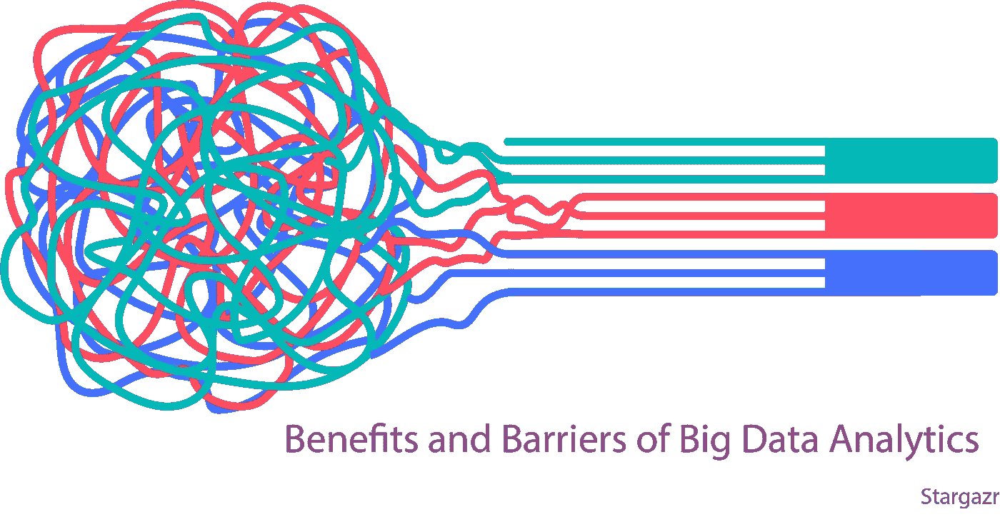
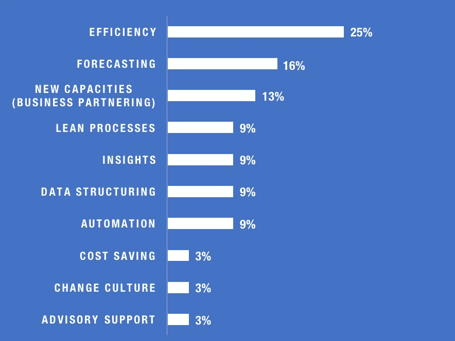
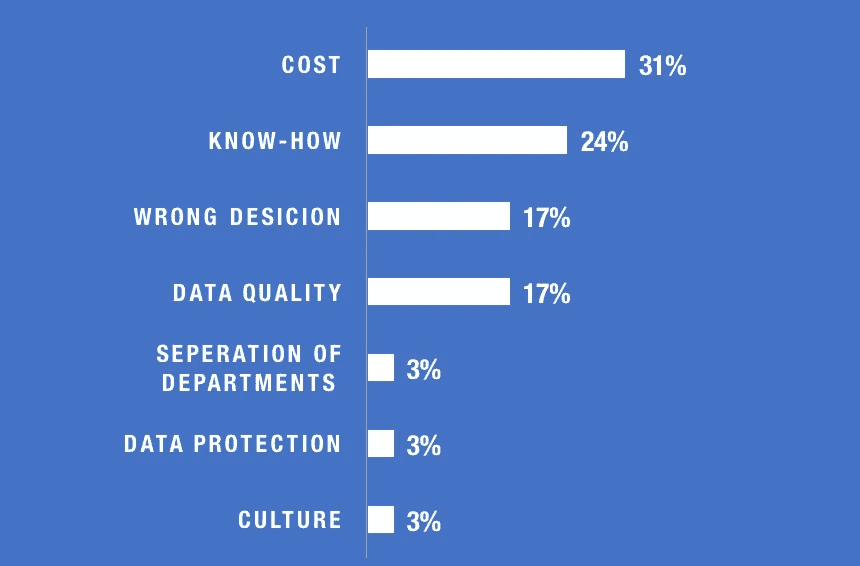

# 大数据分析在控制方面有哪些优势和障碍？

> 原文：<https://towardsdatascience.com/data-science-in-the-real-world-d53af9ba7230?source=collection_archive---------49----------------------->

## [**现实世界中的数据科学**](https://medium.com/towards-data-science/data-science-in-the-real-world/home)

## **控制中的大数据分析**

在我们关于大数据分析在控制中的第一篇博客中，我们分享了关于大数据分析在控制中的当前成熟度的结果，这在德国处于初级阶段。近年来，大数据分析在控制中的使用**有所增加**，但分析工具的潜力比目前已知的更大。将大数据分析纳入控制仍面临**众多障碍和阻碍，**这可能是一些受访者对未使用大数据分析且仍未拥有自动化流程的控制者评价很低的原因。在这篇博客中，我们将分享我们关于大数据分析在控制方面的潜在障碍和优势的发现。

最近的研究表明，虽然数字化影响了整个公司，但管制员面临着新的潜力和挑战。财务总监可以利用数据分析技术来回答有关潜在销售发展的问题。

特别是预测分析软件解决方案已经在组织中获得了关注。预测分析可以被视为商业智能的一部分，商业智能侧重于未来预测，以实现更好的规划和决策，而商业智能侧重于报告和分析历史数据。

在竞争激烈的行业中，准确的销售预测对于通过预测销售数据来管理风险至关重要。预测准确性会影响公司规划流程的效率、目标实现程度、总成本和客户需求满足程度。文献中广泛记载了导致错误销售预期的失败预测过程。

对使用数据的兴趣导致采用大数据分析来改善决策过程的趋势日益增长。大数据分析被定义为“高级分析技术在大数据集上运行的地方”。回归分析、机器学习和模拟等各种大数据分析技术有助于分析数据并提供新的见解。越来越多的组织将投资集中在大数据分析上，以获得有价值的见解，从而为管理会计部门带来竞争优势。

由于数据驱动市场的竞争日益激烈，企业正在采用最先进的信息技术来获得竞争优势。控制或**管理会计**部门的**的角色直接受到大数据分析工具的影响，因为在使用信息支持管理方面，控制者是公司的核心单位。挑战之一是从这些无处不在的信息量中获得洞察力。然后，收到的见解将用于制定决策和调整组织流程以产生价值。**

**大数据分析对控制的影响**

虽然“审计员”一词在德语国家很常见，但“管理会计师”在美国和英国等英语国家是一个公认的术语。在比较这两种职业时，审计员的任务通常在一个范围内考虑，不仅侧重于会计问题，也侧重于管理问题。在我们的博客中，术语“控制者”和“管理会计”的意思是一样的，在控制和管理会计文献中很常见。

近年来，技术发展对管理会计的影响在国际上得到广泛的规范分析。最近的研究表明，尽管数字化影响了整个公司，但管理会计面临着新的潜力和挑战。大数据分析的成功使用需要技术的实施，技术可以处理、存储和收集大量涉及数据多样性、可变性、速度和价值的数据。这些技术使这项任务能够从各种未开发的数据源中发现以前未知的模式、相关性和信息，从而通过及时和更明智的决策，在利润和效率、速度和服务、产品方面提高竞争力。

利用预测分析的组织将投入大量资源来收集、处理、准备并最终分析预测数据，因此期望获得更深入的见解和知识。对于任何类型的数据来说，除了大小之外，最重要的是高质量。

公司中的人员需要开发支持性的文化、适当的能力以及知识，而结构(即协作和组织部门结构)需要支持预测分析计划。特别是，IT 相关部门和业务部门的协作对预测分析起着重要作用，因为组织应该将技术和领域知识结合起来。

大数据分析的功能有助于高级分析从分散在不同数据库中的琐碎信息构建事件、场景或感兴趣的对象的图片。公司，特别是其控制单位，可以应用他们从大数据分析中获得的洞察力来增强他们的决策流程，以成功实现他们的业务目标。大数据分析的总体重点是提取基本见解，它基于**数据挖掘和统计技术**。以前基于直觉的高管行动现在可以通过数据驱动的数学模型来实现。

现在，管制员还可以利用大数据分析场景，并考虑季节性波动。预测的准确性会影响公司规划过程的效率、目标实现的程度、总成本和满足客户需求的水平。

随着新的预算实践的出现，大数据和信息在预算编制中可能是有用的。企业资源规划系统数据可以与外部和非财务数据相结合，预算编制可以有新的发展。

因此，公司的决策是基于来自**分析结果**的证据，而不仅仅是他们经理的直觉。还必须考虑商业文化方面和技术方面，例如合适的基础设施和用户友好的界面，以获得大数据分析的竞争优势。

**大数据分析在控制方面的障碍和优势**

在国际管制员协会(ICV)的“管制员大会”期间，我们通过调查收集数据。这次会议于 2019 年 5 月在慕尼黑举行，口号是“为你的未来做好准备——想法。学习。网络”。它被认为是欧洲最大的控制会议。

使用大数据分析当然有一些优势，但也涉及风险。必须考虑到，并非所有受访者都指出了一个或多个优势或风险。因此，这项研究假设受访者在每种情况下在我们的关系。我们刚刚在第一篇博客中看到，组织已经慢慢采用大数据分析。

为了确定采用大数据带来的潜在好处，我们的调查问道:“如果您的组织实施了某种形式的大数据分析，使用大数据分析会带来哪些好处？”最有可能的益处(见图 2 顶部)是调查受访者最常选择的，随着列表的向下进行，益处的可能性下降

**实现高效快速的控制:**最常见的输入是效率的提高(25%)。在做决策时，用精益(9%)和自动化流程(9%)来指导业务会是一个巨大的优势。及时获得信息并尽早做出决定至关重要。

**获得透明度:**就管理公司而言，预测是最重要的学科之一。16%的受访者提到预测是一项优势。此外，还提到了通过大数据分析获得洞察力(9%)。

**为控制者赋权:**在控制者向业务合作伙伴转变角色方面，对新能力的渴望(13%)似乎是在控制中实施大数据分析的一大优势。

图二。大数据分析在控制方面的优势

为了了解哪些障碍比其他障碍更有可能，该报告的调查问道:“在您的组织中，实施大数据分析的最大潜在障碍是什么？最有可能的障碍(见图 3 顶部)是调查受访者最常选择的障碍，随着列表向下，障碍的可能性下降。

**高实施成本**:毕竟，实施这种大数据分析工具的成本最有可能被提及(32%)。

**技能不足:**调查受访者指出缺乏专业知识(24%)是不使用大数据分析的原因。

**错误指示和质量差:**最常见的情况是，缺乏工具作为决策的依据，导致错误决策(17%)。也许还造成了糟糕的数据质量(17%)。

图三。大数据分析在控制方面的障碍

本文旨在通过提出一个理论上成立的解释模型，整合来自不同学科现存研究的经验验证的发现，来提供对观察到的发现背后的基本原理的增强理解。根据定量研究的结果，成本被确定为最大的挑战。行业内的公司似乎不准备为这样的实现支付高成本。因此，他们将无法看到使用大数据分析的可持续优势。

最常提到的好处是效率的提高。通过大数据分析应用程序获得的洞察力可以使公司经理实时获得需求预测，自动做出更换决策，并确定成本低效率的根本原因。这些措施可以减少交付周期、成本、延迟和流程中断，从而最终创造价值。此外，从供应商方面来看，可以通过分析供应商的数据来监控绩效，从而提高质量或价格竞争力。因此，本文假设这些优势可以节省成本，但是高昂的投资成本仍然是一个障碍。