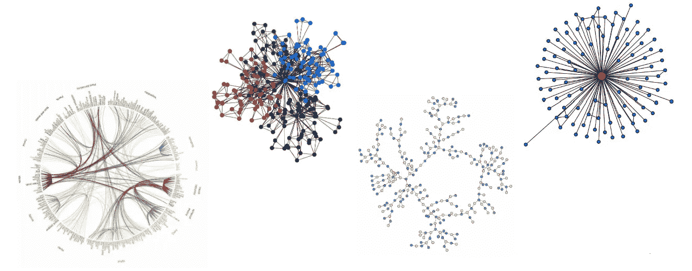
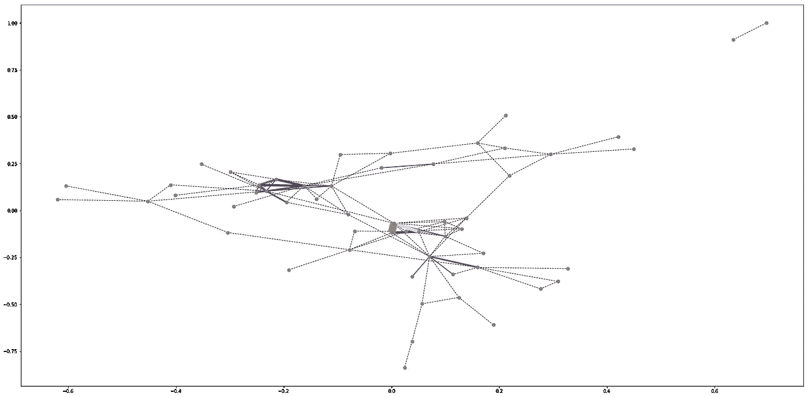

# 网络图和风险资本

> 原文：<https://towardsdatascience.com/data-science-in-venture-capital-8c13ec0c8458?source=collection_archive---------35----------------------->

## 如何使用网络图来监控风险投资基金之间的共同投资

## 介绍

风险投资家努力投资有潜力在未来引领市场的新兴公司。尽管投资于科技公司，但风投基金的日常活动过去过于手工化，基于感觉和印象，而不是数据。

当然，大多数时候，数据是不可用的，决策必须由主观方面来指导。在这种情况下，经验和基金的网络非常重要。有时，数据是可用的，创投资本家可以用它来指导他们的决策。

在本文中，我将展示如何根据共同投资来可视化风险投资基金之间的联系。为此，我们将借助网络图。



网络图—示例

## 为什么是网络图？

我们的网络图对希望了解竞争对手互动的风险投资基金、打算创建多元化投资组合的基金的基金，甚至是计划路演的初创公司都很有用。网络图也是进行详细聚类分析的好工具。

在这里，我们将关注算法，解释将在第二篇文章中详述。我们将使用 Python 和库 Networkx，它非常灵活，适合我们的需要。在我们的无向网络图中，每个节点代表一个风险投资基金，边厚表示两个基金之间共同投资的数量。

边缘颜色:

*   黑色虚线:1 个共同投资
*   蓝色:2 项共同投资
*   绿色:3 项共同投资
*   红色:4 项共同投资
*   紫色:5 项共同投资
*   7 项共同投资
*   橙色 16:共同投资

你可能想知道为什么联合投资的数量从 7 跳到 16(最大值)。这是两家政府支持基金的特例。

下图显示了我们网络图的一部分。我们可以看到，一些基金有许多共同投资，根据共同投资标准，有三个主要类别。


网络图—输出

在继续之前，让我们了解我们的数据来源！

## 数据

数据只来自 Crunchbase。在现实生活中，我们从不同的来源收集数据，如风投基金网站、媒体和公开文件。这很重要，因为相关比例的投资并不在 Crunchbase 的平台上。

在这篇文章中，我只关注巴西的基金和创业公司，但它可以很容易地复制到任何其他国家。l 也没有考虑每个基金的投资或投资组合公司的数量，但它可以很好地反映在节点大小中。

## 数据清理

我们来编码吧！

现在我将展示如何根据 Crunchbase 的输出来组织数据。

首先，我们导入所有的库。

```
import matplotlib.pyplot as plt
import networkx as nx
import pandas as pd
import numpy as np
from itertools import combinations
```

我们需要读取两个数据集。df_investors 包括总部设在巴西且至少有一项投资的所有机构风险资本基金的名称。df_startups 包括资金总额超过 30 万美元的巴西初创公司的名称，以及它们的投资者的名称。

```
# Investors datasetdf_investors=pd.read_csv("Investors.csv")
print(len(df_investors))# Startups datasetdf_startups=pd.read_csv("companies.csv")
print(len(df_startups))
```

让我们看看数据集是什么样子的。

```
df_investors.head()
```


```
df_startups.head()
```


df_startups 数据集中的列“Investors”包括所有的投资者。我们将筛选出巴西投资者。

```
# each investors in one row 
# we will use .split() and .stack()df_startups = (pd.DataFrame(df_startups.Investors.str.split(',').tolist(), index=df_startups.Organization)
               .stack().reset_index([0,"Organization"]))df_startups.rename({0: 'Investors'}, axis=1, inplace=True)
df_startups["Investors"] = df_startups["Investors"].str.lstrip()# merging the datasets to get only the brazillian investorsdf=pd.merge(df_startups, df_investors, how="outer")df=df[df["Location"]=="Brazil"].dropna().drop(["Location"],axis=1).reset_index(drop=True)df.sample(5)
```


有更有效的方法来获得上面的结果，但是当我们有不同的数据源时，合并数据集很容易实现。

现在我们将排除只有一个投资者的创业公司，因为它们与我们的分析无关。

```
# we only want startups with more than one investor# df_aux with the number of investors per startup
df_aux=pd.DataFrame(df["Organization"].value_counts().reset_index())
df_aux.rename({"Organization": 'Number_of_investors',"index":"Organization"}, axis=1, inplace=True)# merging the datasets 
df=pd.merge(df, df_aux, how="outer")# filtering the dataset to get only the startups with more than one investors 
df=(df[df["Number_of_investors"]>=2].sort_values(by=['Organization','Investors'])).drop(["Number_of_investors"],axis=1)df.head()
```


现在我们有 207 条记录，代表了导致至少一个联合投资的投资数量。实际数字比这个大，但由于我们的数据来源和采用的标准，这就是我们的数字。

在继续之前，让我们创建一个投资者所有可能组合的列表。很快就有用了。

```
# unique investors name
comb=df["Investors"].sort_values().unique()# list with all the combinations of investors
cc = pd.Series(list((combinations(comb,2))))
```


印刷(梳)


cc.head()

现在，我们将创建一个字典，其中每个键代表一个风险投资基金，值将是该基金支持的初创公司。

```
# creating a dictionary 
# each key represents one investorsco_investments = { i : None for i in comb }for investors in df["Investors"]:
    co_investments[investors]=set()# each value represents the investments     
for startups,investors in zip(df["Organization"],df["Investors"]):
    co_investments[investors].add(startups
```


现在，我们将创建一个新的数据框架，它将负责存储风险投资基金之间的共同投资计数。“*共同投资*”列是投资者的 2 长度组合，“ *#共同投资*”显示每个组合的共同投资数量。每个创业公司有两个以上投资者是很常见的，我们正在考虑。

*感谢*[*Daniel Gribel*](https://medium.com/u/5904750d29e0?source=post_page-----8c13ec0c8458--------------------------------)*，帮助我修正和完善这一步！*

```
#let's create a new df, which will be in charge to store the countage of the co-investments# new data frame 
data=pd.DataFrame(data = {'Co-investment': cc.apply(lambda x: str(x)[1:-1].replace("'",""))})
data=pd.concat([data, data["Co-investment"].str.split(', ', expand=True)], axis=1).rename({0:'Fund1', 1:'Fund2'}, axis=1)#let's count the intersection among the investments
count=[]
for fund1,fund2 in zip(data["Fund1"],data["Fund2"]):
    count.append(len(co_investments[fund1].intersection(co_investments[fund2])))

data["# Co-investments"]=count# filtering to get only the pairs with co-investments 
data=data[data["# Co-investments"]!=0]data.sample(5)
```


上面的数据框将作为网络图的输入。

## 绘制图表

Networkx 使用 Dijkstra 算法在加权网络中寻找最短路径。让我们从创建一个无向图开始。

```
G = plt.figure(figsize=(30,15))
G = nx.Graph()
```

现在，我们将读取数据帧 df_network_1，以在图中添加加权边。我们还将设计我们的图表，根据共同投资的数量，在边缘添加不同的颜色和厚度。

```
# adding the edges with the information from df_network_1
    for i,j,w in zip(data["Fund1"],data["Fund2"],data["# Co-investments"]):
        G.add_edge(i,j,weight=w)# weights represents the number of co-investments 
    # the max values is 16 co-investments 
    s1 = [(u, v) for (u, v, d) in G.edges(data=True) if d['weight'] == 1]
    s2 = [(u, v) for (u, v, d) in G.edges(data=True) if d['weight'] == 2]
    s3 = [(u, v) for (u, v, d) in G.edges(data=True) if d['weight'] == 3]
    s4 = [(u, v) for (u, v, d) in G.edges(data=True) if d['weight'] == 4]
    s5 = [(u, v) for (u, v, d) in G.edges(data=True) if d['weight'] == 5]
    s6 = [(u, v) for (u, v, d) in G.edges(data=True) if d['weight'] == 7]
    s7 = [(u, v) for (u, v, d) in G.edges(data=True) if d['weight'] == 16]pos = nx.spring_layout(G)  # positions for all nodes# nodes
    nx.draw_networkx_nodes(G, pos, node_size=50, node_color="gray")# edges
    nx.draw_networkx_edges(G, pos, edgelist=s2,
                           width=2, alpha=1, edge_color='blue')nx.draw_networkx_edges(G, pos, edgelist=s1,
                           width=1, alpha=1, edge_color='black',style="dashed")nx.draw_networkx_edges(G, pos, edgelist=s3,
                           width=3, alpha=1, edge_color='green')nx.draw_networkx_edges(G, pos, edgelist=s4,
                           width=4, alpha=1, edge_color='red')nx.draw_networkx_edges(G, pos, edgelist=s5,
                           width=5, alpha=1, edge_color='purple')

    nx.draw_networkx_edges(G, pos, edgelist=s6,
                           width=7, alpha=1, edge_color='pink')nx.draw_networkx_edges(G, pos, edgelist=s7,
                           width=16, alpha=1, edge_color='orange')plt.axis('on')
```



网络图:至少一个共同投资

上图是我们最终的结果！为了更好的可视化，我隐藏了这些名字，但是它们在详细的分析中很有用。我们可以注意到，一些基金有很强的联系，这意味着它们有许多共同投资。


我在图表中突出显示了一些组。第一组包括第一批巴西风险投资基金，他们从政府那里筹集资金来培育生态系统。第二组包括最活跃的基金，那些有大量投资、退出和独角兽的基金。第三组包括私人风投和政府支持的风投，它们通过投资农业综合企业初创公司而联系在一起。

下图是从[flouring](https://flourish.studio/)输出的，这是一个平台，它允许我们在不编码的情况下将电子表格转化为交互式在线图表。


网络图—蓬勃发展

## 最终意见

上面的图表代表了巴西风险投资基金之间的联系，为了获得结论性的结果，我们需要寻找除 Crunchbase 之外的其他数据来源(funds 的网站就是一个很好的来源！).跨时间的网络图也是一个很好的方式来形象化新资金是如何进入市场的。

监控共同投资的网络图只是风险投资如何在日常活动中使用数据的一个例子。自从我开始从事数据驱动型风险投资基金的工作以来，我发现了几种利用公开和专有数据丰富投资决策的方法。

*如果你发现任何错误，请不要犹豫联系我！我最近开始在数据科学世界中冲浪，尽管我热爱它，但我是一个业余爱好者。*