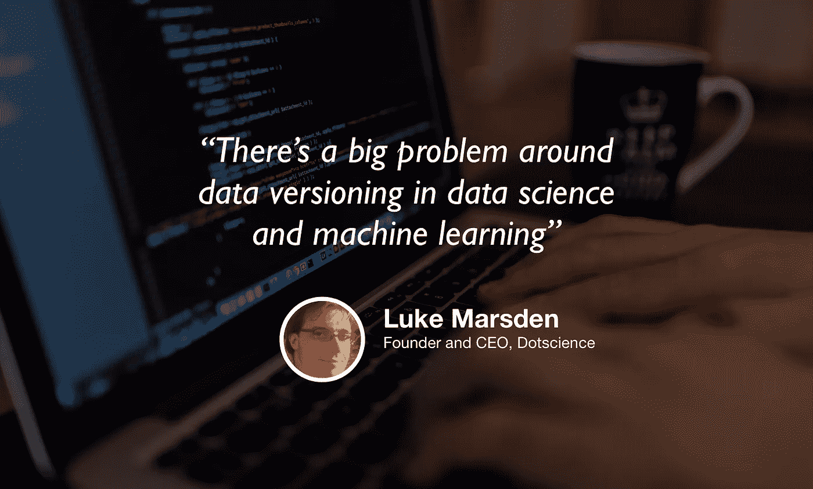

# 数据科学基础设施和 MLOps

> 原文：<https://towardsdatascience.com/data-science-infrastructure-and-mlops-ba0da1c4d8b?source=collection_archive---------27----------------------->

## [苹果](https://podcasts.apple.com/ca/podcast/towards-data-science/id1470952338?mt=2) | [谷歌](https://www.google.com/podcasts?feed=aHR0cHM6Ly9hbmNob3IuZm0vcy8zNmI0ODQ0L3BvZGNhc3QvcnNz) | [SPOTIFY](https://open.spotify.com/show/63diy2DtpHzQfeNVxAPZgU) | [其他](https://anchor.fm/towardsdatascience)

## 卢克·马斯登在 [TDS 播客](https://towardsdatascience.com/podcast/home)

*编者按:迈向数据科学播客的“攀登数据科学阶梯”系列由 Jeremie Harris、Edouard Harris 和 Russell Pollari 主持。他们一起经营一家名为*[*sharpes minds*](http://sharpestminds.com)*的数据科学导师创业公司。可以听下面的播客:*

你训练你的模型。您可以使用验证集来检查它的性能。你调整它的超参数，设计一些特征，然后重复。最后，您在测试集上试用它，它工作得非常好！

问题解决了？嗯，可能不会。

五年前，您作为数据科学家的工作可能已经结束了，但数据科学生命周期正在逐渐扩展，包括基本测试之后的步骤。这不应该令人惊讶:现在机器学习模型正被用于生死攸关和任务关键的应用程序，数据科学家和机器学习工程师面临越来越大的压力，以确保可靠地解决特征漂移等影响，确保数据科学实验是可复制的，以及确保数据基础设施是可靠的。

这一集的嘉宾是卢克·马斯登，他让这些问题成为了这部作品的焦点。卢克是数据基础设施初创公司 [Dotscience](https://dotscience.com/) 的创始人兼首席执行官，该公司正在为数据科学版本控制开发一个类似 git 的工具。Luke 在职业生涯中的大部分时间都致力于解决大规模基础设施问题，并对数据科学和 MLOps 的发展方向有很多看法。以下是我最大的收获:

*   在传统的软件工程中，版本控制允许开发人员在不影响彼此的情况下为相同的代码库做出贡献。这是一个重要的工具，但它在数据科学中的对等物要难得多。这是因为除了静态代码，数据科学版本化还必须考虑不同的数据集版本和不同的超参数值，所有这些都需要指定，以确保结果的可重复性。
*   在生产环境中，模型性能不会随着时间的推移而保持不变。当然，你的模型在第一天可能会工作得很好，但是随着世界的变化，或者用户需求的发展，一个曾经工作得很好的推荐器或者预测模型在将来可能会变得完全不可靠。这就是为什么持续的性能监控是生产过程中的一个关键因素。
*   开源是一件值得参与的大事，尤其是在数据科学领域。Luke 的建议是从摘容易摘到的果子开始(即使是一个简单的改进文档的拉请求也会帮你弄脏你的手！).
*   尽管工作描述在不断变化，但科学家今天需要的许多基本技能数据在未来很可能仍然至关重要。这些通常包括数据分析、统计和定量推理的能力。
*   额外收获:如果你对学习一些 git 感兴趣，Luke 推荐 [katacoda，](https://www.katacoda.com/)一系列互动教程，你可以从你的浏览器中探索。

你可以[在推特上关注卢克](https://twitter.com/lmarsden)在推特上关注我[在推特上关注我](https://twitter.com/jeremiecharris)

我们正在寻找能与我们的观众分享有价值的东西的客人。如果你碰巧知道谁是合适的人选，请在这里告诉我们:[publication@towardsdatascience.com](mailto:publication@towardsdatascience.com)。