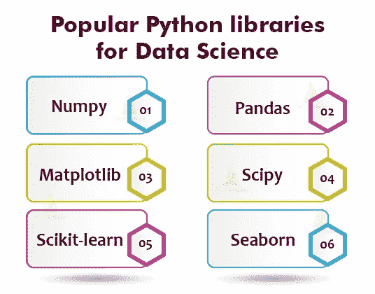
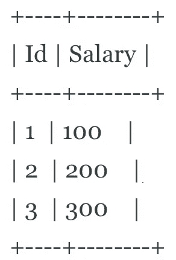

# 数据科学实习面试问题

> 原文：<https://towardsdatascience.com/data-science-internship-interview-questions-c4e56740d3e4?source=collection_archive---------28----------------------->

图片来自 [Pixabay](https://pixabay.com/illustrations/artificial-intelligence-brain-think-3382507/)

# 介绍

数据科学是一个有吸引力的领域。这很有利可图，你有机会从事有趣的项目，而且你总是能学到新东西。因此，进入数据科学领域竞争非常激烈。开始数据科学职业生涯的最佳方式之一是通过数据科学实习。

在这篇文章中，我们将看看**要求的一般**知识水平，典型面试流程的组成部分，以及一些面试问题示例。请注意，强调“一般”一词是因为具体情况因公司而异。

# 数据科学实习面试需要什么？

数据科学实习面试和全职数据科学家之间的最大区别是，通常不会期望你知道关于机器学习或深度学习概念的极其具体的细节。

然而，您将被期望拥有能够在其上构建的基本构建块——这包括 Python、R 或 SQL、统计和概率基础，以及基本的机器学习概念。

下面是一个基本知识和技能的列表，它将使你成为一个有吸引力的候选人:

## Python 还是 R

来自 [TechVidan](https://techvidvan.com/tutorials/python-for-data-science/) 的 Python 数据科学库

你应该有脚本语言的编程经验，最好是 Python 或 r。如果你是 Python 程序员，你还应该对流行的库有基本的了解，如 **Scikit-learn** 和 **Pandas。**

**你应该知道的:**你应该知道如何编写基本的函数，对各种数据结构及其用途有基本的了解。您还应该了解 Scikit-learn 的基本(但也是必不可少的)功能，如 test_train_split 和 StandardScaler。对于 Pandas 来说，您应该能够轻松地操作数据帧，就像使用 SQL 编写查询一样。

例如，您可能需要构建一个简单的机器学习模型来预测产品的销售量。在这种情况下，如果您是 Python 用户，理解 Scikit-Learn 库将非常有用，因为它已经提供了许多预构建的函数，就像上面提到的那些。

**如何准备:**尝试 Kaggle 上的数据科学项目或面试查询上的带回家作业，以了解您可能需要完成的项目。

为了更好地了解 Scikit-Learn，使用它建立一个简单的机器学习模型或浏览一些其他人已经完成的数据科学项目将是一个好主意。

最后，尝试在面试查询中练习 Python 问题，以了解他们可能会问你什么。 [*了解更多* ***如何解决 Python 数据科学面试题***](https://www.interviewquery.com/blog-python-data-science-interview-questions/) *。*

## 结构化查询语言

来自[黑客和黑客](https://hackersandslackers.com/welcome-to-sql-modifying-databases-and-tables/)的 SQL 数据库

你不需要在关系数据库方面有太多的经验，但至少你应该知道 SQL 是如何工作的。如果你在竞争一份数据科学家的实习工作，那么你很可能会为一家拥有海量数据的公司工作。你需要自己浏览这些数据来解决问题。

**你应该知道:**你应该能够编写基本的查询，你应该知道如何使用 SQL 查询操作数据。公司将 SQL 纳入他们的家庭案例研究中是非常常见的，因此您非常了解 SQL 是非常重要的。

> ***例题:***
> 
> 编写一个 SQL 查询，从表中获取第二高的薪水。例如，给定下面的雇员表，查询应该返回第二高的薪水。如果没有第二高的薪水，那么查询应该返回

**如何准备:**模式为学习基础 SQL 提供了很棒的资源，在这里[可以找到](https://mode.com/sql-tutorial/introduction-to-sql/)。此外，您可以在网上找到大量的 SQL 练习题和练习案例研究。

> [查看我们的**SQL 面试问题终极指南**](https://www.interviewquery.com/blog-sql-interview-questions/)

## 统计与概率

图片来自 [Unsplash](https://unsplash.com/photos/jrh5lAq-mIs)

**你应该知道的:**你应该对基本概念有一个坚实的理解，包括但不限于概率基础、概率分布、估计和假设检验。统计学的一个非常常见的应用是条件概率，例如，假设客户购买了产品 C，那么他们购买产品 B 的概率是多少？

如何准备:如果这些概念对你来说听起来很陌生，你可以利用一些免费的资源，比如可汗学院或佐治亚理工学院。

## 机器学习概念

来自[福布斯](https://www.forbes.com/sites/kalevleetaru/2019/01/15/why-machine-learning-needs-semantics-not-just-statistics/#3322ac3b77b5)的机器学习

虽然不指望你成为专家，但你应该很好地理解基本的**机器学习模型**和概念。如果工作描述说你将从事建筑模型的工作，这种情况尤其明显。

**你应该知道的:**这包括但不限于线性回归、支持向量机和聚类等概念。理想情况下，你应该对这些概念有一个基本的理解，并且明白什么时候使用各种机器学习方法是合适的。

例如，您可能需要对产品的价格点进行线性回归，以确定销售量。也就是说，作为实习生，你不需要生产或部署机器学习模型。

> 了解如何应对不同的 [**机器学习面试问题**这里](https://www.interviewquery.com/blog-machine-learning-interview-questions/)。

## 领域知识

你应该拥有你所申请的领域的**领域知识(如果你没有，你应该去学)。**

例如，如果你申请营销部门的数据科学职位，了解不同的营销渠道(如社交媒体、联盟、电视)以及核心指标(如 LTV、CAC)将是一个好主意。

# 数据科学实习面试流程

图片来自 [Unsplash](https://unsplash.com/photos/7aakZdIl4vg)

同样，面试过程最终取决于你申请的公司。但是一般来说，大多数公司(如果不是全部的话)在面试过程中都有一般的步骤，我会在下面解释。

作为一名实习生，你能做的最糟糕的事情就是不去研究这家公司做什么，以及它的文化使命和价值观。

## 初步筛选

通常，公司的招聘人员或招聘经理会进行初步筛选(通常是电话筛选)。这样做的目的是让受访者更好地了解角色，面试官也能更好地了解受访者。

你应该预料到他们会问你对这个职位和公司的兴趣，为什么你认为你很适合，以及与你过去经历相关的问题。在极少数情况下，你也可能会被问到一两个简单的技术问题。

面试官只是想确定你真的对这家公司感兴趣，你是一个很好的沟通者，并且你没有发出危险信号。

## 带回家的箱子

对于现在的许多数据科学实习来说，公司会要求你完成一项带回家的挑战。这意味着他们会给你一定的时间来完成他们给你的案例研究，这通常反映了你在实际工作中会遇到的问题。

这样做是为了看看你将如何处理一个问题(即你的思维过程)，以及你是否具备解决这个问题所需的基本知识。案例的例子包括**清理数据集**和**建立机器学习模型**以做出给定的预测，或者**查询数据集**和**分析数据**，或者两者的结合。

## 现场面试

最后是现场面试，包括一到六轮面试。这些面试由**行为和技术**面试问题组成。在其中一轮比赛中，你可能还需要当场完成一个案件。

虽然他们试图确保你对成功担任该角色所需的基础知识有深刻的理解，但他们也会评估你的行为、动机，并最终评估你是否适合该团队。确保你有最好的表现，但不要忘记做你自己！

# 面试问题

下面是 10 个你应该知道的面试问题:

*   什么是 p 值？
*   什么是正规化，它试图解决什么问题？
*   你怎么能把年龄和收入之间的关系转换成线性模型呢？
*   如果你有两个重量相等的骰子，得到和为 4 的概率是多少？
*   在争论和清理数据集时，您会采取哪些步骤？
*   什么是交叉验证，为什么需要交叉验证？
*   举例说明在确定机器学习模型的有效性时，准确度何时不是最佳指标。
*   内部连接和外部连接有什么区别？

# 感谢阅读

*   更多独家面试解说，查看 [**面试查询**](https://www.interviewquery.com/) **！**
*   查看我的 [**Youtube 频道**](https://www.youtube.com/channel/UCcQx1UnmorvmSEZef4X7-6g) 获取更多面试指南，以及解决问题的技巧&。
*   在面试查询博客上找到更多数据科学面试指南，如 [T **he 新毕业生获得数据科学工作指南**](https://www.interviewquery.com/blog-new-grad-guide-on-landing-data-science-job/) 或[**亚马逊数据分析师面试指南**](https://www.interviewquery.com/blog-the-amazon-data-analyst-interview/) 。

*原载于 2020 年 7 月 14 日 https://www.interviewquery.com***。**