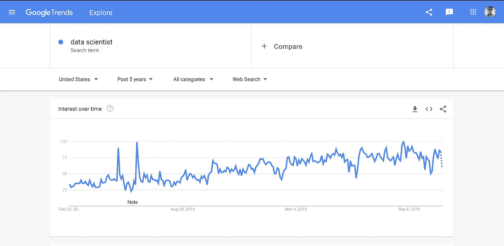
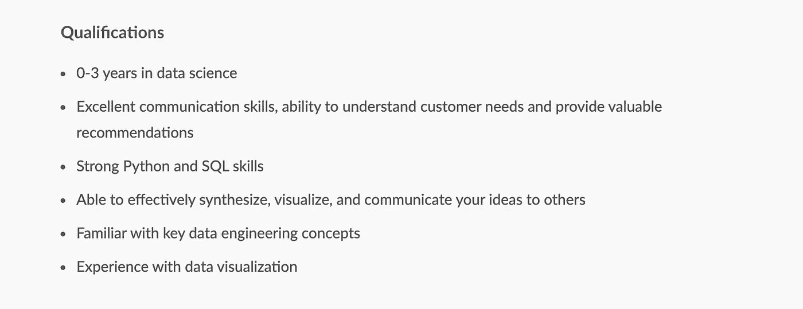
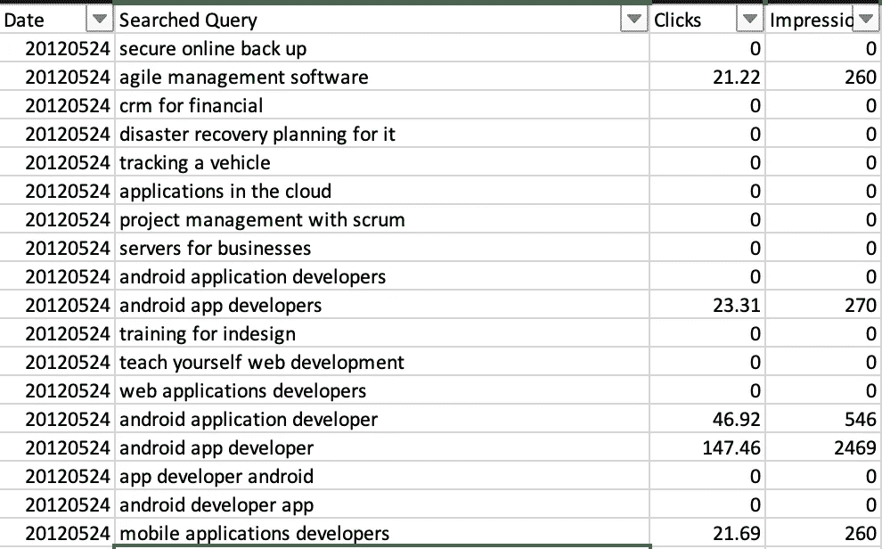
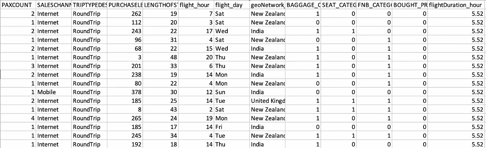

# 数据科学面试问题—初学者指南

> 原文：<https://towardsdatascience.com/data-science-interview-questions-beginners-guide-7b3034373ccb?source=collection_archive---------33----------------------->

## 在数据科学面试中，你应该期待什么样的问题？


塞巴斯蒂安·赫尔曼在 [Unsplash](https://unsplash.com?utm_source=medium&utm_medium=referral) 上的照片

各位数据从业者好
众所周知，**数据科学正在崛起**。
我相信你们很多人都知道，数据科学家被称为 21 世纪最性感的工作**，不管这意味着什么。**

****

**数据科学家的谷歌趋势**

**这很酷，但数据科学行业仍然相对较新，在这个行业中，流行词汇被公然抛出，责任模糊，头衔凭空产生。**

**想想吧。**

****数据科学是关于数据如何工作的知识。让我们回到 20 世纪，在那个时代，企业没有我们今天拥有的奢侈技术。企业用笔和纸记录下他们的交易，以后他们会用这些来了解他们的业务。****

*   **一周中的哪一天，企业产生的收入最多？**
*   **在所有的产品中，哪一个卖得最好？**
*   **客户通常会花多少钱购买该业务？**

**这些类型的问题可以通过一点数学计算和数据处理来轻松回答。那时，企业雇佣你所谓的“统计学家”来做这件事。因此，统计学家和数学家**从那时起就继承了**的报告角色，这就是为什么数学和统计学是今天成为报告数据分析师的一些核心先决条件。**

**然而，事情发生了变化。随着互联网的发展，商家开始在网上经营。人们把大部分时间花在互联网上，这就是为什么你现在正在阅读我的文章。**

**根据 [digitalcommerce360](https://www.digitalcommerce360.com/article/global-ecommerce-sales/) 。仅电子商务市场**一项**就稳步上升。
随着每年约 20%的支出增长，
电子商务市场在 2019 年达到了超过 3.46 万亿美元。**

**现在，企业经营网站和应用程序，而不是实体店。现在可以在数据库中找到数据，而不是纸和笔。**

**这就是你进来的地方。**

****

**克里斯蒂娜@ wocintechchat.com 在 [Unsplash](https://unsplash.com?utm_source=medium&utm_medium=referral) 上的照片**

## **数据科学家**

**你应该拥有足够的**数学**知识来处理数据，以及**编程**知识来知道如何以一种有效的方式存储、操作和建模数据。**

**时至今日，大多数雇主都雇佣数据科学家来管理、组织他们的数据，并从中提取真知灼见，用于描述性分析和预测性分析。
他们中的少数人**

**将工作分成数据工程、数据分析和数据科学，在这些领域中，角色得到了更好的定义。
因此，如果你想得到这样一个职位，你需要具备广泛的数据知识。**

**如果你仍然对数据科学家的角色感到困惑，
我会在这里深入讨论这个角色**

**[](/why-are-data-engineers-equally-as-important-as-data-scientists-545898929444) [## 为什么数据工程师与数据科学家同等重要

### 数据工程师重要吗？

towardsdatascience.com](/why-are-data-engineers-equally-as-important-as-data-scientists-545898929444) 

## 为什么你应该关心

作为一个新兴行业，数据科学的角色在公司中的定义并不严格。
你问问周围，不同公司的数据科学家职责不同。

他们中的一些人管理整个数据仓库，包括 ETL/ELT **管道**、仓库架构和表结构

其中一些更加面向分析，产生惊人的可视化效果并与企业主交流

他们中的一些人通过建模数据创造数据**产品**如图像和音频识别

他们中的一些人做到了以上所有的事情

因此，与通常会收到编码问题的传统软件工程师不同，没有人真正知道在数据科学面试中会遇到什么——这就是为什么你应该从曾经经历过的人那里收集经验。

## 我的背景

**您可以在这里** **查看我的作品** [**的完整作品集。**](https://nickefy.github.io/porfoliosite/)

我叫梁家杰。
我是我国访问量最大的**网站/应用**之一的商业智能/数据团队的一员，该网站/应用为用户提供了一个买卖二手物品的市场。我在这里已经快两年了。

现在，我的角色包括一些核心职责。我已经完全构建并设计了 ELT **管道**，它从相关来源提取数据到我们的数据仓库中，方便业务分析师使用。
我已经在这里写了[。](/data-engineering-basics-of-apache-airflow-build-your-first-pipeline-eefecb7f1bb9)

[](/data-engineering-basics-of-apache-airflow-build-your-first-pipeline-eefecb7f1bb9) [## 数据工程 Apache 气流的基础——构建您的第一条管道

### 如果你从事技术工作，你很有可能需要管理数据。

towardsdatascience.com](/data-engineering-basics-of-apache-airflow-build-your-first-pipeline-eefecb7f1bb9) 

我在改进我们的**数据仓库功能**方面做了很多工作，包括实现流管道、适当的元数据管理、表结构等等。我还大量参与了 [**机器学习项目**](/python-for-data-science-a-guide-to-classification-machine-learning-9ff51d237842) 的技术角色，将新的数据产品引入我们的网站和 app。除此之外，我还执行相关的**分析**以协助产品经理做出商业决策，并维护所述分析的自动化以备将来使用。

在此之前，我在两家大型金融机构工作，其中一家是我国最大的银行。两个角色都在数据团队中，第一个是实习生，第二个是业务分析师。

在我所有的工作转换中，我接触到了大量与数据科学相关的面试，从首席执行官最近可能涉及或可能不涉及欺诈案件的大型航空公司，到销售床垫的中型公司。

当我开始的时候，我不知道在这些采访中会遇到什么，也不知道当时在网上能找到什么有用的资源。因此，我将分享我对数据科学面试问题的看法，**揭示**面试官经常问的问题和期望。

让我们深入研究一下。

# 你的工作


制造商在 [Unsplash](https://unsplash.com?utm_source=medium&utm_medium=referral) 上 [NESA 的照片](https://unsplash.com/@nesabymakers?utm_source=medium&utm_medium=referral)

他们通常从平常开始。你的背景、你的激情和你的目标。一旦解决了这个问题，他们就会想要检查你的一些工作。

我总是会想到这样的问题:

*   你做过什么样的项目？
*   在你目前的职位上，你的职责是什么？
*   到目前为止，你有哪些显著的**成就**？

我知道，你认为这太明显了，不是所有的面试官都会问这些问题吗？

好吧，如果这是显而易见的，为什么大多数受访者缺乏一个**平台/空间**来展示他们的工作？
有备而来，如果你能主持一个网站，用适当的**文档**和**代码**展示你所有的成就，那会给你加分不少。你会惊讶于如今这种情况是多么罕见。
如果你是应届毕业生，展示一些你的项目。这是引出话题的好方法。

如果你缺乏前者，你需要非常好地解释你的工作。
尽量避免先确立你的团队已经取得的成就。相反，更多地关注你做了什么，越具体越好。
确保提及您使用的技术，如 GCP 平台和神经网络。

# 技术问题


照片由 [Clément H](https://unsplash.com/@clemhlrdt?utm_source=medium&utm_medium=referral) 在 [Unsplash](https://unsplash.com?utm_source=medium&utm_medium=referral) 上拍摄

我参加过一些面试，他们一个技术问题都不问。另一方面，我参加过一些面试，为了获得面试机会，我不得不完成一个 4 小时的技术测试。各不相同。

如果你能像我之前提到的那样有效地展示你的作品，我就不会那么担心这部分了。但是，一个数据科学家在技术上受到考验是很正常的。因此，你可以期待这类问题。

# 结构化查询语言

数据科学家必须**从某个地方获取数据。公司通常将所有数据存储在 SQL 数据仓库中，供像你这样的分析师查询。**

如果你不能流利地使用 SQL，这是你面试失败的危险信号之一。

除了基础知识，以下是你应该知道的主要话题:

*   连接
*   总计
*   过滤器
*   联盟
*   案例陈述

他们通常测试你的方式是给你一个数据集，并要求你给出一个结果作为回报。下面是我遇到的最棘手的一个例子:

```
Given customerID, date and revenue columns. 
For each date, how do I show the highest revenue row for each customer?
```

如果你能在脑子里算出答案，并立即读出来，而不是试图写出答案，这会给你加分。

```
Select * from (
Select
date,
customerID,
revenue,
sum(1) over (partition by date order by revenue desc rows unbounded preceding) as row_num
from dataset ) where row_num = 1
```

理论问题也会冒出来。像“左连接是如何工作的”这样的问题根本不应该促使你写出任何解决方案。相反，你的解释显示了你对 SQL 的理解程度。下面用我自己的话回答一下。

```
left join works by joining 2 tables with a key while keeping all the rows from the left table.
```

我也遇到过无法回答的问题，比如:

```
How does an outer join work?
```

我友好地回答说，我以前从未在查询中使用过外连接，
，因此无法回答这个问题。

有许多**方法**来解决一个 SQL 查询。我通常想到的解决方案涉及左连接和内连接，这就是为什么我缺乏外连接知识。
不要害怕承认你不知道某事，只要你能很好地解释你的理由。

请记住，数据科学仍然是一个**不断发展的行业**。
甚至对于**谷歌云平台**，在撰写本文的几个月前他们刚刚发布了一个新的管道解决方案**谷歌云融合**。
不可能有人知道最新的每一个**技术**和**编程语言**。因此，只要你有选择，承认这一点是可以的。

# 数据操作


[Webaroo](https://unsplash.com/@webaroo?utm_source=medium&utm_medium=referral) 在 [Unsplash](https://unsplash.com?utm_source=medium&utm_medium=referral) 上拍摄的照片

在获得数据后，数据科学家通常不得不
**操纵数据**成他们想要的形式。使用什么方法并不重要，但是复杂的操作至少需要某种编程语言。

根据您的角色，对编程语言的要求会有所不同。如果你更多的是在业务方面工作，普通的 excel 可能会有用。如果你更多地从事工程方面的工作，公司可能会要求你掌握某些编程语言。

这是由于该公司正在使用的技术堆栈的限制。
这里有一个例子，一家公司正在使用**谷歌云数据流**将数据摄取到**谷歌 BQ 中。**默认情况下，数据流只允许 **Java** 或 **Python** 作为它们的编程语言。因此，如果你的角色涉及数据流，你将需要掌握其中一种语言。



数据科学家角色的要求

有些公司要求你掌握**特定的**编程语言来进行数据操作。如果你能用不同的语言展示你的能力，你就能很快学会第二种语言，一定要告诉他们这一点。

以下是我被问到的关于**处理**数据的主要话题:

*   自然语言处理
*   熊猫
*   Numpy
*   矩阵
*   列表和词典
*   For 循环+ If/else
*   正则表达式

这些主题可能会出现理论问题。
类似这样的事情:

*   什么是矩阵的转置？
*   普通链表和 Numpy 数组有什么区别？
*   什么是 tokenize？

有些公司会针对这一部分进行**代码测试**。
我通常会得到一个包含特定主题数据的 CSV 文件。
然后他们会要求具体的调查结果作为回报。
这里有一个例子。



样本数据集

```
Given the CSV file regarding searched queries, what are the top 5 keyword phrases that has the highest click-through-rate on weekends? Document your steps and demonstrate the method you have used
```

我不会详细讨论这个解决方案，因为它太长了。
涉及的步骤有:

1.  使用自然语言处理来识别关键词
2.  写一个函数来识别周末
3.  为 CTR 创建新列
4.  可视化结果

这个问题需要很强的熊猫和自然语言的知识。
这里有一篇关于 [**熊猫**](/python-for-data-science-basics-of-pandas-5f8d9680617e) 的文章，可能会帮助你掌握**基础知识**。

[](/python-for-data-science-basics-of-pandas-5f8d9680617e) [## 用于数据科学的 Python 熊猫指南

### 10 分钟内完成数据探索指南

towardsdatascience.com](/python-for-data-science-basics-of-pandas-5f8d9680617e) 

# 机器学习


安迪·凯利在 [Unsplash](https://unsplash.com?utm_source=medium&utm_medium=referral) 上拍摄的照片

啊是的。大家最喜欢的话题。

> *忘掉人工智能吧——在大数据这个勇敢的新世界里，我们应该提防的是人工白痴。——***汤姆·查特菲尔德**

在处理了描述性的(过去的)数据之后，我们现在有能力使用机器学习来预测未来的价值。代替 if-else 语句，我们让机器通过提供数据来发现数据集中的规则。

机器学习带来了许多可能性。然而，它仍然是一门新的学科，只有很少一部分数据从业者能做好。
因此，当你知道机器学习与你的角色有关时，用机器学习的**核心知识**来武装自己就显得尤为重要。

# 理论

我多次被问到机器学习的问题，
通常是从我进行过什么样的机器学习项目开始，如果有的话。
我的回答永远是**是的**，我一定会给他们看我的作品。对话就是从这个时候开始的。

例如，我给他们看了我做的一个分类项目[这里](/python-for-data-science-a-guide-to-classification-machine-learning-9ff51d237842)。

[](/python-for-data-science-a-guide-to-classification-machine-learning-9ff51d237842) [## 用于数据科学的 Python 分类机器学习指南

### 如何正确执行分类机器学习并对其进行评估

towardsdatascience.com](/python-for-data-science-a-guide-to-classification-machine-learning-9ff51d237842) 

他们通常以此为基础开始提问。他们通常会问一些理论性的问题，比如:

*   **分类**和**回归**有什么区别？
*   回归算法有哪几种？
*   你为什么选择使用这种特殊的算法？
*   如何处理**不平衡数据**？

如果你了解机器学习的核心，你应该能够流利地回答这些问题。这里有几个可供阅读的主题:

*   机器学习算法
*   数据预处理
*   取样操作
*   特征选择
*   培训模型
*   评估模型

之后，他们会决定你是否能胜任这个角色。一些公司也为机器学习分发**代码测试**。我已经得到了一些，让我给你看一个例子。

```
**Prediction Model development****Problem Statement:** Based on customer search behaviour you have to predict whether a customer will buy additional products/services.
```



机器学习数据集

我不会详细介绍这个解决方案，因为它是一个全面的机器学习过程。
涉及的步骤有:

1.  处理**数值**和**分类**数据
2.  **培训**模型
3.  **评估**模型&拣选算法
4.  视觉化的发现

我还被详细问到如何评估我的模型。
仅仅回答**准确性**是不够的，你必须明白它们是评估你的模型的多种不同的指标

*   精确
*   回忆
*   f1-分数

# 产品


由 [Kon Karampelas](https://unsplash.com/@konkarampelas?utm_source=medium&utm_medium=referral) 在 [Unsplash](https://unsplash.com?utm_source=medium&utm_medium=referral) 上拍摄的照片

作为一名数据科学家，您也应该对产品有一些基本的了解。在实现您的模型/数据产品之后，您应该知道如何**跟踪该产品的成功**。

你的**沟通**技能在这里发挥了巨大的作用，因为你通常需要向非技术人员传达你的发现。并不总是非黑即白。通常是来来回回的**讨论**来找出你对事物产品方面的思考过程。

这里有一个产品问题的例子。

```
A **classifieds** business company had just revamped their site from legacy stack into the new react stack. Hence, the website looks different aesthetically. There are some function changes as well, for example, a page usually displays 20 listings, but now it displays 10 per page.**Explain how you would prove that the revamp of the site is a success.****Explain how functions like the listing change affects our metrics.**
```

同样，答案是主观的。

```
I would start off by asking what are the success metrics the business was tracking before the revamp and continue tracking those. The usual metrics would be daily/weekly/monthly active users and time spent on site. We should also look at page load times, as new revamps may cause performance issues.For the function changes, we should look at them separately. For the listing change, I assume the listings are bigger due to the decrease in amount. Hence, it may cause an increase of CTR into the listings. That’s the first thing I would look at.Having lesser listings will also mean that customers spend less time on a page and more time navigating through pages. Hence, I will also look at the time spent per page and pagination clicks.
```

他们可能会用一些假设/论点反驳你。这是你的思维过程和经历(如果有的话)闪耀的地方。
产品知识需要**经验**。通常情况下，如果你是这个行业的新人，你不会被问及这个问题。

# 摘要


卡洛斯·阿瑟·M·R 在 [Unsplash](https://unsplash.com?utm_source=medium&utm_medium=referral) 上拍摄的照片

谢谢你走了这么远。这意味着你真的对在数据行业谋得一个职位充满热情。我很高兴。

请理解我不可能在这篇文章中包括所有的内容。相反，这些是我的**个人经历**，也是我被问得最多的话题。我知道有些话题没有被提及。

*   重数学相关
*   深度学习(严重依赖经验)
*   深度可视化

这样的例子不胜枚举。请记住，数据是不断发展的，每天都会有新的技术需要学习。这是工作描述的一部分。这就是它的有趣之处。

如果你已经掌握了我在这篇文章中提到的所有主题。你从根本上为在数据行业工作做好了准备。自信一点，打扮一下，展示一下。在朋友面前练习，你就可以开始了。记住，不是他们寻找合适的人选，而是你寻找合适的公司。

最后，拒绝是完全正常的。
听我的。在我的团队中，我们在某个时间点突然需要更多的人数，但是没有任何候选人。如果有人提交申请，他们会马上被录用。另一方面，我看到更多合格的候选人申请我的团队，但我们没有能力接纳他们。

求职就是在正确的时间出现在正确的地方。不要把拒绝放在心上，保持一致。

# 在你走之前

我们的数据之旅还没有结束。在这个行业缺乏人才的情况下，用适当的数据和机器学习知识来教育自己将使你在获得数据角色方面具有优势。请继续关注，在我的下一篇文章中，我将讨论如何为自己创建数据科学投资组合，以及更多数据行业的故事、指南和经验。与此同时，请随意查看我的其他文章，以暂时填补您对数据的渴望。

像往常一样，我引用一句话作为结束。

> 消费者数据将是未来两到三年的最大区别。谁能打开大量数据并战略性地使用它们，谁就能赢。”——**安吉拉·阿伦茨**

## 订阅我的时事通讯，保持联系。

***感谢*** *的阅读！如果你想与我取得联系，请随时通过 nickmydata@gmail.com 或我的* [*LinkedIn 个人资料*](https://www.linkedin.com/in/nickefy/) *联系我。你也可以在我的*[*Github*](https://github.com/nickefy)*中查看之前写的代码。***