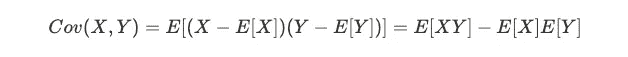
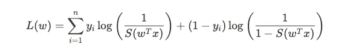

# 数据科学访谈:机器学习

> 原文：<https://towardsdatascience.com/data-science-interviews-machine-learning-d9080e7185fb?source=collection_archive---------38----------------------->

## 机器学习技术指南和 20 个挑战性问题

马库斯·温克勒在 [Unsplash](https://unsplash.com/photos/f57lx37DCM4) 上拍摄的图片

# 概观

这篇文章将在数据科学访谈中提供关于机器学习理论的技术指导。它并不全面，但旨在突出每个主题中的关键技术点。讨论的问题来自这个数据科学采访[时事通讯](https://datascienceprep.com/)，其中有来自顶级科技公司的问题，并将涉及到即将出版的[书](http://acethedatascienceinterview.com/)。

# 数学先决条件

## 随机变量

随机变量是概率和统计中的一个核心话题，面试官通常希望了解原理和操纵它们的基本能力。

对于任何给定的随机变量 X，它具有以下性质(下面我们假设 X 是连续的，但是类似的情况适用于离散的随机变量)。期望值(平均值)由下式给出:

方差由下式给出:

对于任何给定的随机变量 X 和 Y，协方差(关系的线性度量)由下式定义:

协方差的归一化是 X 和 Y 之间的相关性:

## 概率分布

概率分布有很多种，面试官通常不会测试你是否记住了每种分布的具体属性(尽管了解基本属性很有帮助)，但更多的是为了让你能够将它们恰当地应用到具体的情况中。正因为如此，数据科学面试中最常讨论的一个就是正态分布，它有很多现实生活中的应用。对于单个变量，均值和方差参数的概率密度由下式给出:

对于拟合参数，有两种通用方法。在最大似然估计(MLE)中，目标是在给定似然函数的情况下估计最可能的参数:

由于 X 的值被假定为 i.i.d .，则似然函数变为:

取对数是很方便的(因为 log 是一个单调递增的函数，最大化对数似然等于最大化似然):

拟合参数的另一种方式是通过最大后验估计(MAP ),其假设先验分布。

其中以前的相似对数似然适用。

## 线性代数

一般来说，除非有具体的机器学习重点，否则面试官不会指望你深入钻研线性代数。然而，复习基础知识仍然是有帮助的，因为它有助于理解各种算法和理论基础。线性代数中有许多子主题，但有一个子主题值得简单讨论，那就是特征值和特征向量。在力学上，对于某些方阵 A，我们有一个向量 x 是 A 的一个特征向量，如果:

由于矩阵是线性变换，特征向量是这样的情况，即矩阵在该向量上的结果变换产生与之前相同的方向，尽管有一些比例因子(特征值)。特征值和特征向量有很多现实生活中的使用案例:例如，识别大型数据集的方向(在 PCA 中讨论)，或者对于动力系统(系统如何振荡以及它将多快稳定)。

将方阵分解成其特征向量称为特征分解。注意，虽然不是所有矩阵都是正方形的，但是通过奇异值分解(SVD ),每个矩阵都有一个分解:

尽管数学细节超出了本文的讨论范围，但在技术面试之前，特征分解和奇异值分解都值得仔细研究一下。

# 偏差-方差权衡

由于过度拟合和模型选择的相关性，这是采访中偶尔会问到的话题。对于任何模型，我们通常都试图估计一个真实的基础:

其中 w 通常是零均值和高斯随机变量的噪声。如前所述，MLE 和 MAP 是推断参数的合理方法。为了评估模型的拟合程度，我们可以将 y 的误差分解如下:

1.  偏差(这些值与真实的潜在 f(x)值的接近程度)
2.  方差(基于训练输入的预测变化量)
3.  不可减少的误差(由于固有的噪声观测过程

在偏差和方差之间有一个权衡，这是一个思考不同模型如何运作的有用框架。总体目标是控制过度拟合(而不是从样本中很好地概括)以产生稳定和准确的模型。

# 线性回归

这种方法是最常教授的方法之一，有许多现实生活中的应用，从预测房价到研究医学试验的功效。面试官问这个问题通常是为了评估你对基本公式的理解，偶尔也会评估一些理论与现实生活应用的相关性。

在线性回归中，目标是估计以下形式的 y = f(x ):

其中 X 是数据点矩阵，β是权重向量。在最小二乘法中，线性回归使残差平方和(RSS)最小，其计算公式如下:

在回归分析中，可以通过多元高斯函数使用 MLE 来估计β值:

这导致与最小化 RSS 相同的结果。对于映射上下文，可能存在β的先验，这导致岭回归，该岭回归惩罚权重以防止过度拟合。在岭回归中，目标函数变成最小化:

# 降维

## 主成分分析

这个话题在采访中不太常见，但在讨论数据预处理或特征工程时经常被提及。将数据分解成更小的变量集对于汇总和可视化数据非常有用。这个整体过程被称为降维。一种常见的降维方法是主成分分析(PCA)，它将数据重构到一个较低的维度设置中。它寻找向量 x(假设它是 p 维的)的少量线性组合来解释 x 内的方差。更具体地说，我们希望找到权重的向量 w，以便我们可以定义以下线性组合:

受以下条件限制:

因此，我们有下面的过程描述，其中首先我们找到具有最大方差的第一个分量，然后找到与第一个分量不相关的第二个分量，并迭代地继续这个过程。这个想法是以 k 维结束

使用一些代数，最终结果是 X 的协方差矩阵的特征分解，由此第一主分量是对应于最大特征值的特征向量，等等。

# 分类

## 总体框架

由于现实生活中的大量应用，分类是面试中经常被问到的问题。科技公司喜欢询问如何将客户和用户分成不同的类别。

分类的目标是将给定的数据点分配到 K 个类中的一个，而不是一个连续值(如在回归中)，有两种类型的模型。第一种是生成型，它对 X 和 y 之间的联合概率分布进行建模。也就是说，对于输入 X，我们希望使用以下类标签对任意数据点 X 进行分类:

X 和 Y 之间的联合分布由下式给出:

对于每个给定的 k 类，我们有:

最大化后验概率的结果意味着类之间将存在决策边界，其中所得后验概率相等。

第二种是鉴别性的，其通过选择最大化后验概率分布的类来直接学习决策边界:

所以这两种方法最终都选择了一个最大化后验概率的预测类；区别只是在方法上。

## 逻辑回归

一种流行的分类算法是逻辑回归，在面试中经常与线性回归一起被问到，作为一种评估分类算法基础知识的方法。在逻辑回归中，我们采用线性输出，并使用 sigmoid 函数将其转换为 0 到 1 之间的概率:

在矩阵形式中，决策如下所示，其中如果输出至少为 0.5，则 1 是目标类:

逻辑回归的损失函数是对数损失:

注意，后验模型是直接建模的，因此逻辑回归是一个判别模型。

## 线性判别分析

线性判别分析(LDA)在面试中不是一个常见的话题，但却是一个有趣的话题，因为它是一个生成模型，而不是判别模型(如逻辑回归)。它假设给定某个类 k，来自该类的任何数据的分布遵循多元高斯分布:

回想贝叶斯规则，最大化标签上的联合概率等同于最大化后验概率，因此 LDA 的目标是最大化:

特别是，我们有:

其中每个 k 的 f(x)是类密度函数。LDA 假设密度是多元高斯的，并且还假设协方差矩阵在所有类中是公共的。产生的判定边界是线性的(因此得名)，因为也有二次判别分析，其中边界是二次的。

# 决策树

决策树和随机森林在面试中经常被问到，因为它们是灵活的，在实践中通常表现良好的模型。特别是，它有助于对两者如何被训练和使用，以及特征分裂如何发生(熵和信息增益)有一个基本的理解。

## 培养

决策树是一种可以用树的方式表示的模型，其中在每次分裂时，都有基于特征的分离，从而产生各种叶节点，由此产生结果(分类或回归)。在本次讨论中，我们将重点讨论分类设置。它们从根开始以贪婪和递归的方式被训练，其中目标是选择增加特定数据点属于哪个类的最大确定性的分裂。

## 熵

随机变量 Y 的熵量化了其值的不确定性，对于具有 k 个状态的离散变量 Y，由下式给出:

对于简单的伯努利随机变量，当 p = 0.5 时该量最高，当 p = 0 或 p = 1 时该量最低，这与定义直观一致，因为如果 p = 0 或 1，则结果没有不确定性。一般来说，如果一个随机变量具有高熵，那么它的分布比偏斜分布更接近均匀分布。

考虑任意拆分。我们有 H(Y)从开始的训练标签，并说我们有一些特征 X，我们想分裂。我们可以用信息增益来表征不确定性的降低，信息增益由下式给出:

该数量越大，通过在 x 上进行分割，Y 中的不确定性减少得越多。因此，一般过程是评估考虑的所有特征，并选择最大化该信息增益的特征。然后，递归地继续两个结果分支的过程。

## 随机森林

通常，单个决策树可能容易过度拟合，因此在实践中，随机森林通常会产生更好的样本外预测。随机森林是一种集合方法，它利用许多决策树并对它们的决策进行平均。它通过两种方法来减少过拟合和树之间的相关性:1) bagging(自举聚合)，其中一些 m < n(其中 n 是总数)的数据点通过替换被任意采样并用作训练集，2)在每次分裂时考虑特征的随机子集(以防止总是在任何特定特征上分裂)。

# 使聚集

聚类是一个受欢迎的采访主题，因为有许多现实生活中的应用。这通常是为了数据可视化，并可用于识别异常值，这在欺诈检测等情况下很有用。这也有助于对在这种情况下如何学习参数有一个基本的了解，与先前的 MLE/MAP 方法相比。

## 概观

聚类的目标是将数据集划分为仅查看输入要素的各种聚类。这是无监督学习的一个例子。理想情况下，聚类有两个属性:

1.  给定聚类内的点彼此相似(高聚类内相似性)
2.  不同聚类中的点彼此不相似(低聚类间相似性)。

## k 均值聚类

k-均值聚类将数据划分为 k 个聚类，并通过任意选择 k 个聚类中每个聚类的质心开始。迭代地，它通过将点分配到最近的聚类来更新分区，更新质心，并重复直到收敛。

数学上，K-means 通过最小化以下损失函数(给定点和质心值)来解决以下问题:

迭代过程继续，直到聚类分配更新不再促进目标函数。

## 高斯混合模型

高斯混合模型(GMM)是一种模型，其中对于任何给定的数据点 x，我们假设它来自 k 个聚类之一，每个聚类具有特定的高斯分布。

也就是说，在我们拥有的 K 类中:

其中，π系数是聚类的混合系数，经过归一化处理，总和为 1。设θ表示 K 个类别中每个类别的未知均值和方差参数，以及 K 个混合系数。那么可能性由下式给出:

因此对数似然是:

可以使用期望最大化(EM)来迭代计算参数，这将在下面讨论。

## 期望最大化

期望最大化(EM)是一种估计潜在变量参数的方法，例如上面的 K-means 和 GMMs 的两个例子，其中一些变量可以直接观察到，而其他变量是潜在的，不能直接观察到。特别是，对于聚类，聚类分配是潜在变量，因为它不是直接观察到的。一般步骤如下，以 Z 为潜变量，X 为观测变量，未知参数θ。

假设电流参数由下式给出:θ’。第一步是估计:

使用当前的参数估计。第二步是估计最有可能使数据对数似然最大化的θ*，计算公式如下:

并且迭代地继续直到收敛。

# 20 个机器学习面试问题

1.  假设我们有一个分类器，它为特定贷款申请欺诈的可能性产生一个介于 0 和 1 之间的分数。在这种情况下:a)什么是假阳性，b)什么是假阴性，以及 c)就美元而言，它们之间的权衡是什么，以及应该如何相应地对模型进行加权？
2.  假设您需要为欺诈检测生成一个二元分类器。您会查看哪些指标，每个指标是如何定义的，每个指标的解释是什么？
3.  你会得到一个非常大的单词库。你如何识别同义词？
4.  描述生成模型和判别模型，并分别给出一个例子。
5.  什么是偏差-方差权衡？它是如何用方程式表达的？
6.  定义交叉验证流程。使用它的背后动机是什么？
7.  假设您正在对新上市公司的年收入进行建模。你会使用哪种功能？需要采取什么样的数据处理步骤，运行什么样的模型？
8.  什么是 L1 和 L2 正则化？两者有什么区别？
9.  定义函数凸的含义。一个机器学习算法不是凸的例子是什么，并描述为什么是凸的。
10.  描述梯度下降和随机梯度下降背后的动机。
11.  解释什么是决策树中的信息增益和熵。
12.  描述助推背后的理念。举例说明一种方法，并描述它的优缺点。
13.  假设我们正在运行概率线性回归，它很好地模拟了一些 y 和 x 之间的潜在关系。现在假设所有输入都添加了一些噪声ε，这与训练数据无关。新的目标函数是什么？你是怎么计算的？
14.  k-means 聚类中对于 k 个聚类和 n 个样本点使用的损失函数是什么？使用 1)批量梯度下降，2)使用学习率ε对聚类 k 的聚类均值进行随机梯度下降来计算更新公式。
15.  假设我们使用高斯混合模型(GMM)对欺诈性交易进行异常检测，将传入的交易分为 K 类。用公式描述模型设置，以及如何评估后验概率和对数似然。我们如何确定一项新交易是否应被视为欺诈？
16.  什么是期望最大化？它什么时候有用？用公式描述设置的算法。
17.  阐述 SVM 背后的背景，并展示其旨在解决的优化问题。
18.  在机器学习的背景下描述熵，并在数学上展示如何在假设 N 个状态的情况下最大化熵。
19.  假设您正在运行线性回归，并将误差项建模为正态分布。说明在这种设置中，最大化数据的可能性相当于最小化残差平方和。
20.  假设 X 是一个单变量高斯随机变量。X 的熵是多少？

# 感谢阅读！

如果你有兴趣在数据科学面试中进一步探索概率和统计，请查看这份[简讯](https://datascienceprep.com/)，它每周三次向你发送练习题。另外，请留意即将出版的[书](http://acethedatascienceinterview.com/)！