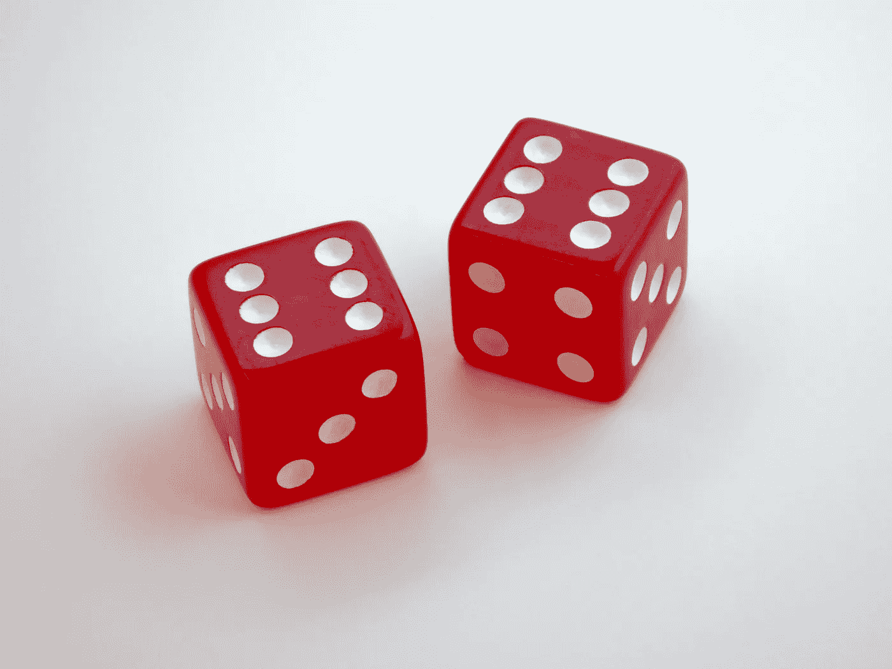

# 数据科学访谈:概率与统计

> 原文：<https://towardsdatascience.com/data-science-interviews-probability-and-statistics-31b9d03309c4?source=collection_archive---------16----------------------->

## 要研究的主题和 20 个要检查的问题

布雷特·乔丹在 [Unsplash](https://unsplash.com/photos/4aB1nGtD_Sg) 上的图片

# 概观

概率和统计是每个数据科学家都应该熟知的重要领域。所有数据分析的基础是概率和统计，它们构成了发展和评估假设的批判性思考的基础。

不要指望很快学会所有的主题，许多主题涉及许多子主题，这些子主题本身就是一个终身学习的过程，但一般来说，拥有强大的统计背景对大多数数据科学面试来说很重要。这篇文章将提供一些非常高层次的主题和两个主题中的 10 个示例问题。讨论的问题来自 https://datascienceprep.com/的[，涵盖了顶级科技公司的面试问题。](https://datascienceprep.com/)

# 概率基础和随机变量

概率的开端是从思考样本空间、基本计数和组合原理开始的。虽然没有必要了解组合学的所有细节，但了解基础知识和简化问题的某些方法是有帮助的。这里的一个经典例子是“星条”计数法。

另一个要研究的核心话题是随机变量。了解期望、方差、协方差等很重要。以及基本的概率分布。无论是做简单的例子还是专注于应用方面，熟练掌握基本计算通常会对面试很有帮助。

# 概率分布

对于随机变量建模，了解各种概率分布的基础知识是必不可少的。理解离散和连续的例子，结合期望和差异，是至关重要的。采访中讨论的最常见的分布是均匀分布和正态分布，但也有许多其他众所周知的特定用例分布(泊松分布、二项式分布、几何分布)。

大多数情况下，知道基本知识和应用程序就足够了——抛硬币属于哪一种情况？等待一个事件呢？诸如此类。然而，能够对期望值，方差，或者其他更高的矩进行求导并没有坏处。这很可能会出现，尤其是如果面试非常注重数据的话。

# 假设检验

这是统计推断背后的支柱，可以分解成几个主题。第一个是中心极限定理，在研究大样本数据时有重要作用。接下来包括假设检验的核心要素:抽样分布，p 值，置信区间，I 型和 II 型错误，等等。理解这里的数学细节对于掌握底层机制是很重要的。每一个都有重要的数学细节需要理解，还有计算问题之外的应用。最后，值得看看各种涉及比例的测试，以及其他假设测试。

这些概念中的大多数在 A/B 测试中起着至关重要的作用，这是面试中经常被问到的话题，也是所有实验的基础。因此，不仅要理解技术细节，还要从概念上理解 A/B 测试是如何操作的，假设是什么，可能的陷阱，在实际产品中的应用等等，这些都是很有用的。

# 建模

凭借对概率分布和假设检验的深刻理解，建模大量使用了这两种方法，并添加了特定的理论概念和技术。由于这是一个相当宽泛的术语，我们将称之为建模，因为这些领域通常与 ML 有很强的统计交集，并且包括诸如线性回归、最大似然估计、贝叶斯统计等主题。其中的每一个都会涉及许多数学细节和其他理论细节。

在许多实际应用中使用的统计方法的理论基础中，每个领域都起着重要的作用。对于专注于建模和机器学习的面试来说，了解这些话题是必不可少的。

# 概率问题

1.  你和你的朋友正在玩游戏。你们两个将继续扔硬币，直到出现序列 HH 或 TH。如果 HH 先出现，你就赢了。如果 TH 先出现，你的朋友就赢了。你赢的概率有多大？
2.  七场系列赛到 7 场的概率是多少？
3.  假设你画一个圆，随机选择两个和弦。那些弦相交的概率是多少？
4.  1/1000 的人患有某种特定的疾病，如果你患有这种疾病，有一个测试是 98%正确的。如果你没有这种疾病，有 1%的错误率。如果有人检测呈阳性，那么他们患病的几率有多大？
5.  有 50 张 5 种不同颜色的卡片。每种颜色都有编号从 1 到 10 的卡片。你随机抽取 2 张牌。它们不是同一颜色也不是同一号码的概率是多少？
6.  西雅图的三个朋友，每个人都告诉你下雨了，每个人都有 1/3 的概率说谎。西雅图下雨的概率有多大？假设西雅图任何一天下雨的概率是 0.25。
7.  假设你掷三个骰子，一个接一个。你以严格递增的顺序获得 3 个数的概率是多少？
8.  在看到第一张王牌之前，你希望从一副标准牌中抽出多少张牌？
9.  假设你得到一枚不公平的硬币，不知道是正面还是反面。你如何用这枚硬币产生公平的赔率？
10.  假设您有 N 个参数为μ和σ的正态分布的独立同分布图。那些抽牌中 k 大于某个值 Y 的概率是多少？

# 统计问题

1.  用通俗易懂的语言描述 p 值。
2.  假设您正在运行多元线性回归，并且相信有几个相关的预测因子。如果回归结果确实相关，它们会受到什么影响？你会如何处理这个问题？
3.  解释权力背后的统计背景。
4.  描述 A/B 测试。有哪些常见的陷阱？
5.  求均匀分布 U(a，b)的均值和方差。
6.  你从均匀分布[0，d] n 次取样。你对 d 的最佳估计是多少？
7.  推导几何分布随机变量的期望。
8.  一枚硬币被抛 1000 次，550 次都是正面朝上。你认为硬币有偏差吗？为什么或为什么不？
9.  MLE 和 MAP 有什么区别？用数学描述一下。
10.  给定一个随机伯努利试验生成器，如何返回从正态分布中采样的值？

# 感谢阅读！

如果你有兴趣在数据科学面试中进一步探索概率和统计，请查看这份[简讯](https://datascienceprep.com/)，它每周三次向你发送练习题。