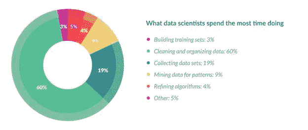
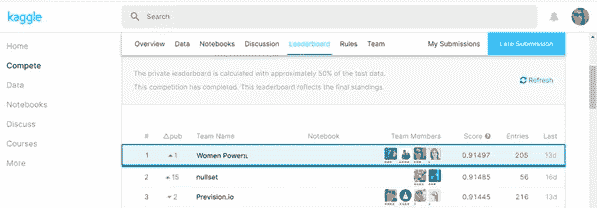
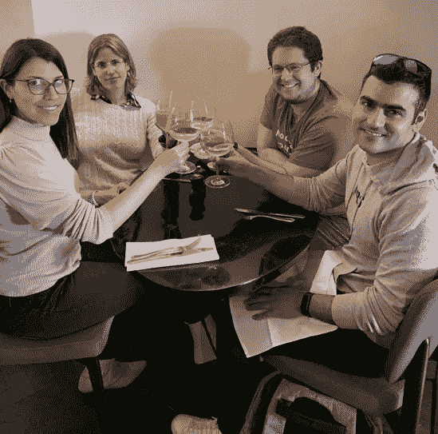

# 数据科学是一项团队运动

> 原文：<https://towardsdatascience.com/data-science-is-a-team-sport-1164545da7a2?source=collection_archive---------40----------------------->

## (以及我们如何在 Kaggle WiDS2020 数据马拉松中赢得第一名)

尽管官方数字在增长，但女性仍占世界数据科学家的少数。尽管学术界多次试图吸引女性，并在计算机科学课程中建立性别平等，但像 WIDS 这样的组织的活动在激发兴趣和为女科学家打开大门方面卓有成效。

一年一次，一些全球性的活动和比赛有助于提升女性在数据科学领域的地位(WIDS)。其中一项活动是名为“WiDS Datathon 2020”的 Kaggle 竞赛，这已经成为许多有抱负的女性数据科学家的传统。

今年比赛的目标是预测一名入院病人是否能在重症监护室存活(二元分类问题)，假设他或她的 24 小时入院图表和个人人口统计数据的数据记录是可访问的。

竞争者被提供了来自患者的超过 130，000 个医院重症监护病房(ICU)访问记录的数据集。在一年的时间内，从阿根廷、澳大利亚、新西兰、斯里兰卡、巴西的医院到美国的 200 多家医院，跨越了不同的地理区域。

自然地，这种类型的预测模型(患者的存活概率)可以有益于在重症监护病房中治疗患者的紧急程度的优先化和决策过程。它可能有助于对抗这些单位的发病率(尽管今天，冠状病毒的情况可能会影响模型的准确性，因为训练的统计分布不包括冠状病毒感染的患者！).

这是一场发人深省的基于表格分析的比赛！来自世界各地的 951 组数据科学家参加了一场紧凑的比赛。

作为机器学习中典型的表格分类问题，我们必须在流水线的每个阶段使用一些技巧。同时，我们还为表格数据整合了最先进的集成技术和创新的测试时间扩充(TTA)。要深入了解我们的解决方案，请点击此处的链接。

ML 经典管道(来源:Nurit Cohen Inger)

在本文中，我想分享一些与数据科学开发生命周期高度相关的**关键成功因素**。

# 首要因素—团队合作

首先，谁在我们的团队里？

我们的团队由几个 Kaggle 福音传道者组成:首先是已经是 Kaggle 比赛大师的 Seffi Cohen、Dan Ofer、Noa Dagan (MD .)和我(Nurit)。让这个团队如此独特的是，所有成员都有广泛的实用数据科学背景和强大的医疗保健背景。

数据科学是一项团队运动(来源:帕斯卡·斯威尔在 T2 大学的照片)

简单概述一下我们的攻击方式，将有助于处理类似的问题:

我们的攻击计划是“分而治之”。我们将工作量分配给团队成员，每个人都专注于自己的特定任务。碰巧的是，每个部分单独在排行榜上得分都很高(交叉验证得分和排行榜)。

然而，最终——我们将不同的提交整合成一个中心管道。我们将这些模型整合到最终提交的作品中，从而得到了迄今为止最出色的分数。

以最小的重叠划分工作量，并提前计划每个结果的集成是非常重要的。

# 第二个因素—领域专业知识

幸运的是，我们船上有一名医生！我们的队员诺亚。

我们在管道的第一阶段投入了大量的精力，通常称为探索性数据分析(ed a)。

我们探索了 183 个独立特征(协变量)中的每一个，以及它们与二元目标变量*“医院 _ 死亡”*的相关性。这给了我们超越其他团队的优势，因为我们发现了隐藏在特征下的真正宝藏。我们竭尽全力寻找性能最佳的型号。

有了这些领域知识，我们计划了 ML 管道的下一部分；我们聪明地估算缺失值并提取新特征。所有这些都极大地提高了我们的排行榜分数！

例如，我们创建了一个名为[*【mosely _ dead】*](https://www.youtube.com/watch?v=xbE8E1ez97M)的“黄金”特征，它将来自不同生物功能或与生命不相容的测量的洞察力进行分组(并提供了一个出色的结果分离)。

> **大部分死亡和全部死亡有很大区别；大部分是死的，小部分是活的。所有人都死了，通常你只能做一件事。(来源:公主新娘)**

长话短说，领域专家的参与对于在数据科学开发过程中获得更好的结果至关重要！

# 第三个因素—强大的功能工程

《福布斯》的一项调查声称,“数据科学家花费大约 80%的时间来准备和管理用于分析的数据。76%的数据科学家认为数据准备是他们工作中最不愉快的部分”。

*清理大数据:最耗时、最不愉快的数据科学任务(来源:福布斯)*

嗯，是真的。考虑到比赛的时间框架(6 周)，我们花了很多时间来创建我们认为可以预见的完美功能工程程序。

> **健壮的特征工程是非常有益的。**

我可以证明这个事实。一个模特就能让我们在这场比赛中获得第 14 名！

因此，如果你能在这个阶段分配足够的时间做到最好，即使有时它可能被认为是最不愉快的一个阶段，请放心，这将是非常有益的。

# 第四个因素— AutoML 工具还不够，但是…

我们尝试了各种自动机器学习(AutoML)工具。他们的成绩平平(在交叉验证阶段和排行榜上)。但是，如果您只想在致力于开发基于数据科学的项目之前尝试接受或拒绝某个假设时使用这些工具，那么所有这些工具都足够好了。我想对于一些项目来说，这些工具的结果已经足够好了。

我们确实使用了一些先进的技术来增强 H2O 管道的编码。那对我们的成功有一点贡献。我们还使用 Sparkbeyond 来“强力”提取特征。

总而言之，竞争是激烈的。获胜者是根据浮点后的第五位数字来判断的，足够好并不简单。在人类数据科学家的参与下使用 AutoML 工具的某些部分可能有帮助，也可能没有帮助。

Kaggle 竞争大约是浮点之后的第五位数(来源:Nurit Cohen Inger)

# 第 5 个因素——组装总是有效的

当然，我们在 100 多个不同的实验中尝试了数百个模型实例的组合。此外，新的和不规则的实现测试时间增加(TTA)的表格数据。

这个众所周知的、被证明有效的技巧在比赛中总是奏效。我们使用了不同的数据集——插补技术、特征和数据生成。此外，特征选择阶段从 7 种不同的方法进行。

因此，除了我们上面提到的强大的功能工程，这可能会使我们排在第 14 位，还有一个优雅，新颖的合奏让我们排在第一位…

# 外卖食品

> 有竞争总会推动你走向卓越，你尽最大努力，然后每天都有所改进；)

总结一下我从这次激动人心的经历中得到的收获:我认为我们的秘方是不同方法和队友的集合。两人都为在此次竞赛中成功找到数据科学问题的解决方案做出了巨大贡献。

选择正确的团队是至关重要的，因为不同的技能和专业知识给了我们不同的观点和方法。当然，准确的团队合作，因为数据科学是一项团队运动！

旧金山，我们来了！(图片来源:Nurit Cohen Inger)

**努里特·科恩·英格**

白天是数据和人工智能战略家，晚上是热情的卡格勒

*感谢* [*什洛莫·卡沙尼*](https://www.quora.com/q/sdtdlrnniytihlja/How-to-land-a-job-in-AI-Deep-Learning) *的启发性言论*