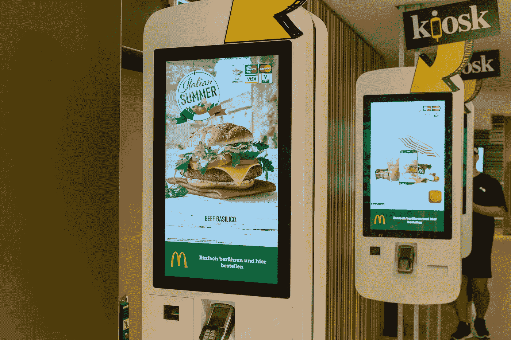

# 数据科学即将开花结果。但是它的根已经在这里很久了。

> 原文：<https://towardsdatascience.com/data-science-is-about-to-blossom-but-its-roots-have-been-here-for-a-very-long-time-e1f05be0774e?source=collection_archive---------62----------------------->

> “数据分析的未来可能包括巨大的进步、真正困难的克服，以及为科学和技术的所有领域提供巨大的服务。会吗？”
> 
> 约翰·图基，来自《数据分析的未来》

在 [Unsplash](https://unsplash.com/photos/U3sOwViXhkY) 上由 [Franck V.](https://unsplash.com/@franckinjapan?utm_source=unsplash&utm_medium=referral&utm_content=creditCopyText) 拍摄的照片

1962 年，数学家约翰·图基在他的论文《数据分析的未来》中指出，“很长一段时间以来，我一直认为自己是一名统计学家……但随着我对数理统计发展的观察……我逐渐感到，我的主要兴趣在于数据分析……”。然后，他将数据分析描述为“一门科学，一门由普遍存在的问题而非具体主题定义的科学”。在这些话中，图基陈述了数学仅仅是一组定义好的先验真理；数据分析是一门经验科学，知识可以通过不断的实验获得。图基似乎或多或少地将统计学定义为数学和数据分析的子集。根据图基，“数理统计的个别部分必须向数据分析或纯数学寻找它们的正当性”。

我们可以看到 Tukey 的观点在今天得到了回应，因为“数据科学”一词正在成为科技界的日常行话。此外，许多老牌大学只是在过去五年才开设了“数据科学”学位课程。这些项目中的许多都是现有统计学课程的延伸。可以肯定地说，这个领域已经很快成为它自己独特的学科。图基在论文结尾对数据在未来随着计算存储能力变得更强而发挥的重要性进行了预见性的理解:“……在有些情况下，计算机使原本完全不可行的事情变得可行……在这些情况下，提供答案的速度和经济性使计算机对大型数据集至关重要，对小型数据集非常有价值”。

快进到 1994 年。商业周刊发表了一篇题为数据库营销的文章。这篇文章详细描述了 80 年代商店中使用的新的结账扫描仪技术的兴起。设想是每台扫描仪将创建一个交易记录，存储每件购买商品的数据。反过来，这可以让零售商根据客户需求和购买历史了解广告内容。然而，最终，这种结账扫描仪热潮并没有实现它的承诺。公司根本没有技术基础设施或计算能力来处理这些海量数据，更不用说从中获得洞察力了。

然而，重要的是要注意，这个实验，即使失败了，也代表了一个非常重要的概念的早期版本。它代表了利用大规模分析来预测客户需求的愿景。这是在 80 年代，那时互联网还不是主流。事实上，到了 90 年代，一些公司已经能够在这种技术处于萌芽阶段时使用它。例如，Blockbuster Video 利用其会员和交易数据库来测试一个计算机化的系统，根据以前的租赁情况推荐电影。在所有公司中，Blockbuster 是内容推荐算法的早期研究人员，这简直是异想天开！

这篇文章中的以下引文听起来几乎像是今年的一篇文章:“公司正在收集关于你的大量信息，分析这些信息以预测你购买产品的可能性，并利用这些知识来精心设计营销信息，以使你这样做”。

# 那么，在过去的二十年里，是什么让数据和分析在几乎每个技术组织中都扮演了重要角色呢？

曼努埃尔·盖辛格在[的照片](https://www.pexels.com/photo/3d-server-serverroom-tech-1490877/)

简而言之，技术能力呈指数增长，而且是在相对较短的时间内。互联网成为企业和个人使用的主流工具。还记得收集数据的收银台扫描仪吗？在这个时代，存储海量数据基本上没有障碍。今天，我们收集了无数的数据，并且可以随时进行分析。而这些数据来源于无数独特的领域。这可能是医疗保健数据、社交媒体数据、客户数据；这样的例子不胜枚举。企业渴望利用他们的计算能力来分析这些数据，因为这是他们成功的关键。

存储和处理这些数据的计算能力如何？今天，GPU 能够以超乎想象的速度处理数据和执行数据密集型算法。⁴最重要的是，数据中心提供了异地数据存储的仓库。然后，云计算供应商可以按需向企业和个人提供这种存储。在 ***和*** 之上，全新的大数据分析范式被创造出来。实现这一目标的最著名的项目是 Apache Spark，这是一个始于加州大学伯克利分校 AMPLab 的开源实验。Spark 的出现彻底改变了大数据计算的格局；因为它完善了多机处理的范例。这允许数据分布在多个集群之间，并被并行处理，以最大化运行时效率。⁵此外，Spark 项目通过引入弹性分布式数据集(或 rdd)作为其基本数据结构，完善了 MapReduce 编程范式。⁶

# **这些企业的目标到底是什么？数据是“他们成功的关键”吗？**

bongkarn thanyakij 在[像素](https://www.pexels.com/photo/person-holding-white-printer-paper-3740390/)上拍摄的照片

嗯，可能性真是无穷无尽。数据科学几乎渗透到每个领域。⁴:虽然“机器学习”这个时髦词经常与令人兴奋的人工智能世界联系在一起，但在现实世界中，它大多只是一种向股东提供见解的手段。如前所述，用例非常丰富。

首先，数据可以对公司的广告策略产生非常积极的影响。数据分析的科学效率可以节省公司的广告费。这是因为浪费在未经计算验证的策略上的钱更少了。⁷:过去，你没有足够的数据存储能力来对如此庞大的数据集进行分析。现在，当对历史客户和交易记录进行分析时，公司可以确保他们的算法正在对需要优先考虑的确切营销策略进行分类。

接下来考虑医疗领域。也许一家制药公司想预测一种新药被采用的可能性。然后，他们可以挖掘历史索赔数据，并基于各种人口统计属性的诊断模式创建预测器。

数据甚至可以在航空安全方面取得进展。例如，西南航空公司和美国宇航局合作开展了一个文本挖掘项目，通过研究空中交通管制记录和飞机产生的数据内容来识别潜在的危险。⁸

我将暂时停止列出用例。但关键是，如果我想，我可以永远继续下去。你可以写一本关于每个业务领域和用例数据科学影响的百科全书。它对组织目标的影响已经真正地 ***即*** 深远了。无论企业的目标是提高投资回报率还是促进公众福祉，数据都会以某种形式发挥作用。

# 旁白:人工智能对自动化

图标信用: [Freepik](https://www.flaticon.com/authors/freepik)

以上用例比较符合 AI，机器学习，分类。但是在我们继续讨论自动化的用例之前，重要的是要注意自动化不要和人工智能混淆。而人工智能(及其子集，机器学习)旨在模仿人类可以 ***识别*** 的东西；自动化意味着不断模仿人类可以 ***做*** 的任务。换句话说，虽然人工智能算法必须对洞察力进行分类，但自动化算法必须不断模拟重复的任务。

然而，我们还必须考虑到这两者并不一定是相互排斥的，它们经常是携手合作的。说明这种想法的最佳用例是自动驾驶技术。在这种情况下，您正在自动执行长时间不间断驾驶的任务。然而，这项任务并不像简单的复制粘贴那么简单。有许多外来因素，如交通灯、标志和其他车辆。这就是人工智能被补充到组合中的地方。汽车将需要实现分类器来留意这些无关的因素，并学习如何对它们做出反应。

稍后，当我们谈到数据策略和策略的主题时，我可能会互换使用这两个术语。因为这两个术语确实不同，但它们紧密相关。既然我们已经清除了这个困惑，让我们继续更多的业务目标。

# 企业希望通过自动化实现什么样的结果？

照片由 [Marco Verch](https://www.flickr.com/photos/149561324@N03/) 在 [flickr](https://www.flickr.com/photos/149561324@N03/43591131451/in/photolist-QPVaTr-ehcCBa-VvRoCU-84Ewb6-8sW2QF-8xnqB-2fKBwVV-8xnqA-29pZWFV-pEgePC-ppXkYq-NhWxi3-pGmNQV-ppULsE-ppUHSj-pEgi1h-ppXk37-ppUKkE-ppVqoD-W9nbaj-5t5kCU-cft6C3-cft6J3-5v5QDi-6K7k13-Ci3mBw) 上拍摄

自动化的主要目标是纯粹的效率和生产力。据麦肯锡称，仅自动化一项就可以将全球年生产率从 0.8%提高到 1.4%。几个劳动部门已经在使用自动化。例如，澳大利亚矿业公司力拓(Rio Tinto)推出了自动化拖运卡车和钻机，极大地提高了生产率。⁴

至于长途货运，它很可能是下一个被自动化严重破坏的劳动力部门。想想美国 70%的货物都是通过长途卡车运输的。⁹:如果你可以用自动驾驶技术自动化所有卡车，让它们不间断地连续运行，那么你将拥有一个非常高效的供应链，尽管这曾经是不可能的。像这些纯粹依赖劳动密集型任务的行业，总是会看到自动化技术提高了效率。

但是自动化甚至可以应用到需要更多人际交流的行业。以客户服务领域为例。据估计，现在大多数客户服务交互都是自动化的。⁰亚马逊和花旗银行只是两家大公司，它们的客户服务基础设施在某种程度上依赖于虚拟助理。顾客服务自动化也在食品服务行业大量实施。例如，麦当劳在 2018 年制定了一项计划，到 2020 年，每个季度在 1000 家商店中增加自助服务亭。今天，我们看到了结果，因为售货亭在他们的餐馆里非常普遍。一份工作是否需要社交方面并不重要。自动化注定会以某种方式破坏它。

# 我们讨论了商业目标。但是“第四次工业革命”可能带来哪些负面影响呢？

罗布森·哈苏卡米·摩根在 [Unsplash](https://unsplash.com/photos/NKr0qBAkU4s) 上的照片

我们经常看到人工智能的出现与黑暗联系在一起。我们经常听到工厂工作和长途卡车驾驶等许多必不可少的劳动密集型工作将很快被 AI 取代。这无疑是一个需要考虑的重要伦理问题。虽然过去的工业革命创造了新的工作机会，取代了旧的工作机会，但人工智能革命似乎将彻底消除某些行业。预计取代它们的工作将是繁重的数学、计算和批判性分析。这些白领工作与他们即将取代的劳动密集型蓝领工作大相径庭。

培训老员工将会很困难，不仅因为他们正在适应全新的技能组合；而是因为他们可能根本没有兴趣学习这些新技能。想想这样一个事实，美国的卡车司机一般是接近退休的中年人，可能没有大学文凭。在这个年龄，这些人大概没有学习编程的欲望。最重要的是，他们正处于人生的关键时刻，这份工作是他们身份的重要组成部分。当我们经历人工智能革命时，这些都是需要解决的问题。我甚至可以说，政府需要制定人工智能战略来应对这些现象。

# 政府和公司如何合作实施人工智能战略？

插图鸣谢:由[rawpixel.com](http://www.rawpixel.com)在 [Freepik](https://www.freepik.com/free-vector/vr-technology-gaming-hacker-confirm-progressive_3229423.htm#page=1&query=robot%20shaking%20hand&position=47) 上设计

我们已经通过人工智能和自动化的主要优势——生产力——广泛地讨论了它们。但现在，我们必须将这一点与潜在的伦理含义相调和。根据麦肯锡的说法，政策制定者实际上有很大的动机为了他们的经济和选民的福祉而接受这些技术:“这种(生产率增长)将有助于确保未来的繁荣，并创造可用于帮助工人和社会适应这些快速变化的盈余”。⁴

换句话说，生产力和效率可以导致剩余和繁荣。随着商品和服务产出的快速增长，私人和公共部门都会产生经济盈余。麦肯锡提出了“公私合作”的理念，这种理念可以通过数字化让发展中国家摆脱贫困。⁴:但我想更进一步，说这种伙伴关系同样可以帮助发达国家。

毕竟，来自这些项目的更多私人收入可能意味着政府的更多税收，这些税收可以通过各种政府运营的举措回馈给人民。还记得对某些蓝领工人永久失业的担忧吗？政府也许可以用这笔钱为那些失业工人提供社会安全网或普遍的基本收入。⁴:也许这些下岗工人中的一部分可以选择参加一些政府资助的 STEM 培训项目。更好的是，这些项目也可以提供给年轻学生，让他们为日益增长的劳动力做好准备，这些劳动力迫切需要新的人才。

世界各国都已经在实施 AI 战略。2018 年，韩国承诺提供 20 亿美元用于人工智能研究、就业、人才和政府与“人工智能领域的初创企业和公司”的合作。同年，谷歌在加纳开设了非洲首个人工智能研究机构，致力于“与当地大学和研究中心合作，并与政策制定者合作研究人工智能在非洲的潜在用途”。⁴虽然人工智能革命确实有一些沉闷的影响；如果实施得当，它可以提供一个新的繁荣周期，让企业、政府和公民都能交换想法和收入。

# John Tukey 所说的“数据分析的未来”是什么？

照片由[像素](https://www.pexels.com/photo/black-and-silver-dslr-lens-1208074/)上的[科迪·金](https://www.pexels.com/@cody-king-433493)拍摄

数据、人工智能和自动化将成为自计算机和互联网以来最大的技术颠覆者。它们不仅会扰乱技术领域，还会决定未来几年政策的走向。我们探讨了技术能力的快速提升开启了数据时代的观点。但这回避了一个问题:这些数据驱动的技术是如何在所有行业和企业中如此一致地崛起的？

每个公司都试图走在新技术的最前沿。亚马逊使电子商务成为主流。因此，实体公司开始大量投资于自己的电子商务运营，以便跟上步伐。同样，谷歌、脸书和 LinkedIn 等科技巨头显然拥有极其强大的数据基础设施。这促使实体店之王沃尔玛(Walmart)等公司开发自己的数据战略。难怪从 1990 年到 2010 年，分析和数据科学领域的职场新人比例增加了 10 倍。⁵，这只会越来越多。

我将引用谷歌首席经济学家哈尔·瓦里安 2009 年的预言来结束我的演讲:“我一直在说，未来十年最性感的工作将是统计学家。人们认为我在开玩笑，但是谁会想到计算机工程师会是 20 世纪 90 年代最性感的工作呢？获取数据的能力——能够理解它、处理它、从中提取价值、可视化它、交流它——将是未来几十年非常重要的技能。⁶，这是真的。目前，有许多学生在学习，为甚至还不存在的工作做准备。数据、人工智能和自动化的主流性质相对较新。一旦这些工作有了成果。它们将是丰富的，而且对我们整个社会的运作是必不可少的。

引用和来源:

[1]:约翰·w·图基，《数据分析的未来》*《数理统计年鉴》*，第 33 卷，第 1 期，1962 年，第 1–67 页。，doi:10.1214/aoms/1177704711。

[2]:贝里，乔纳森。“数据库营销。”*Bloomberg.com*，彭博，1994 年 9 月 5 日，[www . Bloomberg . com/news/articles/1994-09-04/database-marketing。](http://www.bloomberg.com/news/articles/1994-09-04/database-marketing.)

[3]:按，吉尔。“数据科学的非常短的历史。”*福布斯*，福布斯杂志，2014 年 10 月 15 日，[www . Forbes . com/sites/Gil press/2013/05/28/a-very-short-history-of-data-science/。](http://www.forbes.com/sites/gilpress/2013/05/28/a-very-short-history-of-data-science/.)

[4]:“分析、人工智能和自动化的现在和未来。”*McKinsey.com*，麦肯锡&公司，2019 年 5 月 11 日，[www . McKinsey . com/featured-insights/digital-disruption/whats-now-and-next-in-analytics-ai-and-automation。](http://www.mckinsey.com/featured-insights/digital-disruption/whats-now-and-next-in-analytics-ai-and-automation.)

[5]:钱伯斯、比尔和马泰·扎哈里。*星火:权威指南*。奥莱利，2018。

[6]:“弹性分布式数据集(RDD)。”*Databricks.com*，Databricks，2020 年 5 月 15 日，databricks.com/glossary/what-is-rdd.

[7]:阿格拉瓦尔，AJ。“为什么数据对公司很重要，为什么创新即将到来。”*Inc.com*公司，2016 年 3 月 24 日[www . Inc . com/aj-agr awal/why-data-is-important-for-companies-and-why-innovation-is-the-way . html](http://www.inc.com/aj-agrawal/why-data-is-important-for-companies-and-why-innovation-is-on-the-way.html.)

[8]:“数据挖掘工具让飞行更安全、更高效。”*Nasa.gov*，美国宇航局，2013 年，spinoff.nasa.gov/Spinoff2013/t_3.html.

[9]:韦特海姆，乔恩。"自动化卡车运输上路了，这是一个技术里程碑，可能会扰乱成千上万的工作岗位."*Cbsnews.com*，哥伦比亚广播公司新闻，2020 年 3 月 15 日，[www . CBS News . com/News/无人驾驶卡车-可能-尽快-2021-60-minutes-2020-03-15/扰乱卡车运输业。](http://www.cbsnews.com/news/driverless-trucks-could-disrupt-the-trucking-industry-as-soon-as-2021-60-minutes-2020-03-15/.)

[10]:施耐德，克里斯蒂。“人工智能驱动的自动化客户服务是未来的 10 个理由。”*沃森博客*，IBM，2017 年 10 月 16 日，[www . IBM . com/blogs/Watson/2017/10/10-reasons-ai-powered-automated-customer-service-future/。](http://www.ibm.com/blogs/watson/2017/10/10-reasons-ai-powered-automated-customer-service-future/.)

[11]:哈夫纳，乔希。“麦当劳:你从触摸屏售货亭买的东西比一个人还多。因此，期待更多的售货亭。”*Usatoday.com*《今日美国》2018 年 6 月 7 日讯[www . USA Today . com/story/money/nation-now/2018/06/07/McDonalds-add-kiosk-citing-better-sales-over-face-orders/681196002/。](http://www.usatoday.com/story/money/nation-now/2018/06/07/mcdonalds-add-kiosks-citing-better-sales-over-face-face-orders/681196002/.)

[12]:基尔卡尔，肖恩。"人口统计学正在改变卡车司机管理."【Fleetowner.com】，FleetOwner，2017 年 9 月 20 日，[www . FleetOwner . com/resource-center/driver-management/article/21701029/demographics-is-changing-truck-driver-management。](http://www.fleetowner.com/resource-center/driver-management/article/21701029/demographics-are-changing-truck-driver-management.)

[13]: *政府将在国家人工智能项目上花费 2.2 万亿韩元*。朝鲜中央日报，2018 年 5 月 15 日，koreajoongangdaily.joins.com/news/article/article.aspx?aid=3048152。

[14]:克拉布特里，贾丝汀娜。"谷歌的下一个人工智能研究中心将是它在非洲大陆的第一个。"*Cnbc.com*，美国消费者新闻与商业频道新闻，2018 年 6 月 14 日，[www . CNBC . com/2018/06/14/Google-ai-research-center-to-open-in-加纳-非洲. html.](http://www.cnbc.com/2018/06/14/google-ai-research-center-to-open-in-ghana-africa.html.)

[15]:帕蒂尔，DJ。“建立数据科学团队。”2011 年 9 月 16 日，radar.oreilly.com/2011/09/building-data-science-teams.html?奥赖利，Radar.oreilly.comutm_source=feedburner。

[16]:“哈尔·瓦里安谈网络如何挑战管理者。”*McKinsey.com*，麦肯锡&公司，2009 年 1 月 1 日，[www . McKinsey . com/industries/technology-media-and-telecom munications/our-insights/Hal-varian-on-how-the-web-challenges-managers。](http://www.mckinsey.com/industries/technology-media-and-telecommunications/our-insights/hal-varian-on-how-the-web-challenges-managers.)