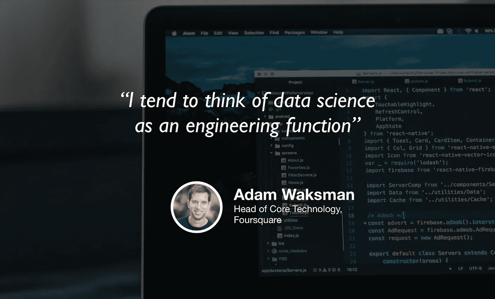

# 数据科学正在成为软件工程

> 原文：<https://towardsdatascience.com/data-science-is-becoming-software-engineering-53e31314939a?source=collection_archive---------7----------------------->

## [苹果](https://podcasts.apple.com/ca/podcast/towards-data-science/id1470952338?mt=2) | [谷歌](https://www.google.com/podcasts?feed=aHR0cHM6Ly9hbmNob3IuZm0vcy8zNmI0ODQ0L3BvZGNhc3QvcnNz) | [SPOTIFY](https://open.spotify.com/show/63diy2DtpHzQfeNVxAPZgU) | [其他](https://anchor.fm/towardsdatascience) | [剪辑](https://www.youtube.com/watch?v=iL_U63istBk)

## 亚当·沃克斯曼在 TDS 播客[上](https://towardsdatascience.com/podcast/home)

*编者按:迈向数据科学播客的“攀登数据科学阶梯”系列由 Jeremie Harris、Edouard Harris 和 Russell Pollari 主持。他们一起经营一家名为*[*sharpes minds*](http://sharpestminds.com)*的数据科学导师创业公司。可以听下面的播客:*

当我想到过去几年我在数据科学中看到的趋势时，也许最重要也最难忽视的是对模型的部署和生产的日益关注。当然，并非所有公司都需要将模型部署到生产中，但在那些需要的公司，数据科学团队在提供软件工程和机器学习解决方案方面面临越来越大的压力。

这就是为什么我想和 Foursquare 的核心技术负责人 Adam Waksman 坐下来谈谈。Foursquare 是一家建立在数据和机器学习基础上的公司:它们是第一批完全规模化的社交媒体推荐服务之一，获得了真正的牵引力，现在帮助超过 5000 万人在世界各国找到餐馆和服务。

我们的谈话涵盖了很多领域，从软件工程和数据科学之间的互动，到他对新员工的要求，再到整个领域的未来。以下是我的一些最佳建议:

*   软件工程师和数据科学家的技能正在趋同，至少在面向产品的数据科学应用方面是如此，比如构建推荐系统。数据科学家被要求负责部署和生产，软件工程师被要求扩展他们的技能集以包括建模。
*   作为一名数据科学家，确保你明智地利用时间的最佳方式是将数据科学视为一项产品开发职能。你的模型必须有多精确？尽可能让你的用户体验顺畅，可能不会更好。
*   历史上，数据科学和软件工程并没有像今天这样紧密结合，特别是在 Foursquare 这样的公司。随着时间的推移，集成似乎可能会继续，因此数据科学家开发良好的软件工程技能比以往任何时候都更重要。
*   然而，商业智能和分析可能仍然是软件工程和数据科学之外的一个独立部门，因为它对于促进高层战略决策是必要的。
*   数据科学经常被过分强调的一个方面是模型调优。作为一名数据科学家，你很少会专注于让一个模型好 1%；通常，获得一个“足够好”的模型并呈现在用户面前要重要得多，这就是为什么软件工程和部署技能比模型调整越来越重要。
*   创业公司和大公司在招聘时有非常不同的风险。因为他们需要快速招聘，初创公司在招聘新的数据科学家时容易犯更多的假阳性错误(所以他们愿意冒险聘用更多不寻常的申请人)，而企业规模的公司，职业生涯更长，角色更稳定，倾向于聘用他们有信心会留下来的人。

你可以在推特上关注我！我是 [@jeremiecharris](https://twitter.com/jeremiecharris) :)

## [夹子](https://www.youtube.com/watch?v=iL_U63istBk)

我们正在寻找能与我们的观众分享有价值的东西的客人。如果你碰巧知道谁是合适的人选，请在这里告诉我们:【publication@towardsdatascience.com】T4。