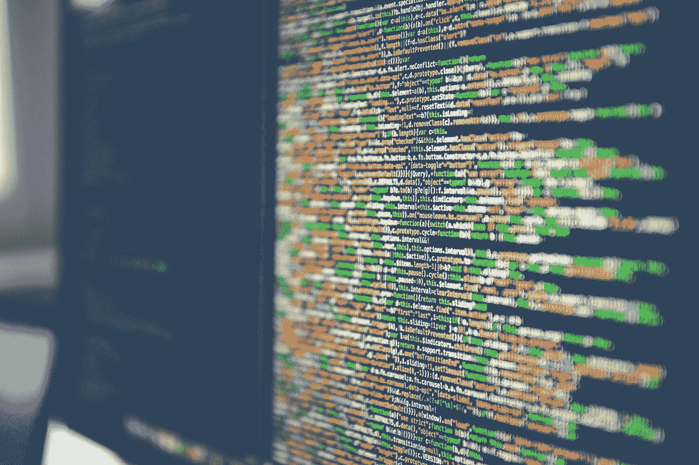
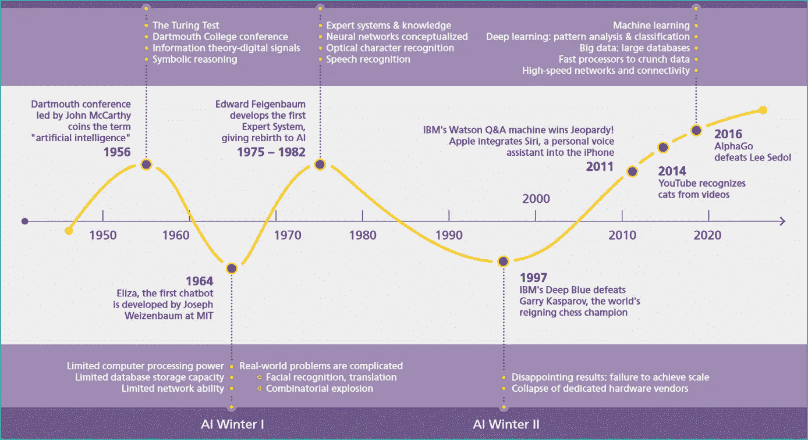
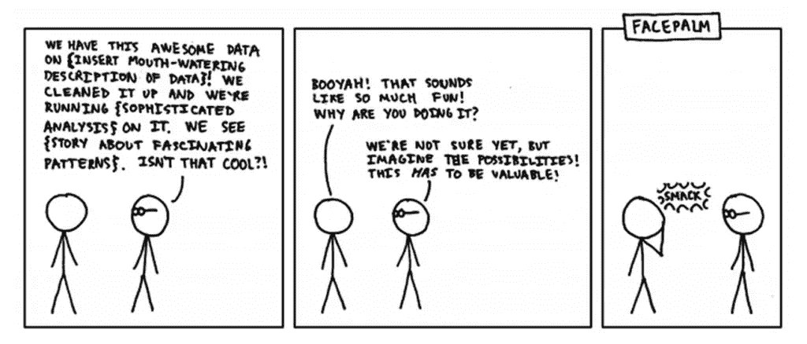
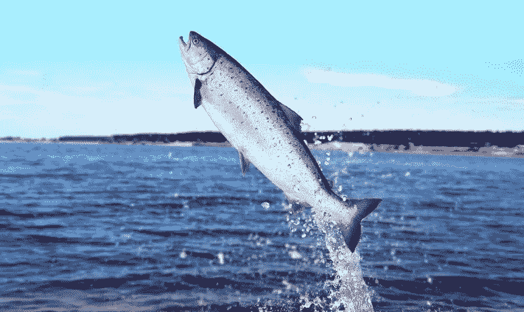
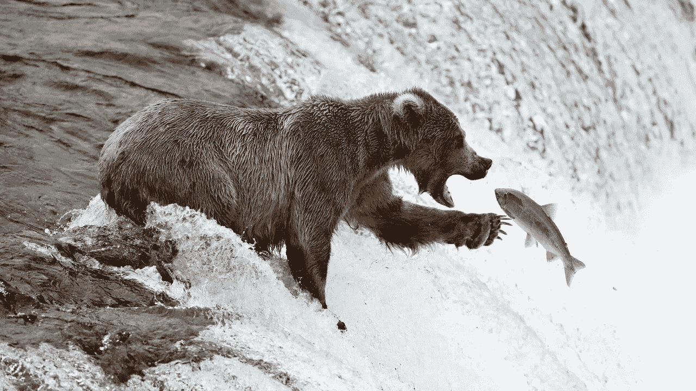

# 数据科学已经死了。商业科学万岁！

> 原文：<https://towardsdatascience.com/data-science-is-dead-long-live-business-science-a3059fe84e6c?source=collection_archive---------0----------------------->

## [商业科学](https://medium.com/tag/business-science)

## 任何人都可以从不起眼的鲑鱼身上学到的 5 课



由[马库斯·斯皮斯克](https://unsplash.com/@markusspiske?utm_source=medium&utm_medium=referral)在 [Unsplash](https://unsplash.com?utm_source=medium&utm_medium=referral) 上拍摄的照片

> 数据是一个不可靠的朋友，它几乎没有任何东西是科学的。那又怎样，数据科学？

在过去的 5 年里，我已经面试了 1000 多名数据科学家候选人，争夺 Evo Pricing 的一系列职位。在这个过程中，我了解到媒体正在描绘一个关于这个职业的基本谎言:向现成的算法扔数据真的不是重点。

从根本上重新思考是合适的，而且很可能早就应该进行了。

# 70 年的历史，2 段 1 图

从本质上来说，数据科学是一系列广泛的数字处理活动的崇高名称，这些活动大多是很久以前发明的，但最近通过应用大大增强的技术设备获得了新的生命:更多的数据、更强的处理能力、更合理的结果以及更低的价格。



三波[人工智能](https://en.wikipedia.org/wiki/Artificial_intelligence)根据 [Evo 定价](https://evopricing.com/)，基于 DHL 研究

随着存储和处理数据的成本下降，收集的数据量上升:非常简单的供求法则，或者你可以称之为数据的[价格弹性](https://en.wikipedia.org/wiki/Price_elasticity_of_demand)。价格下降，交易量上升。有人将不得不对所有这些东西做些什么。进入数据科学。

# 围绕数据科学的常见误解



Xcdk 漫画由 [Nicholas Oleh](https://www.blogger.com/profile/05711233078734221818) 在 [blogspot](https://quantumcomputingtech.blogspot.com/2019/06/machine-learning-xkcd.html) (CC)上创作

什么是[数据科学](https://datascience.berkeley.edu/about/what-is-data-science/)？

根据伯克利的说法:*对专业技术人员来说，这是最有前途和最受欢迎的职业道路之一。*

在我看来,“数据科学”这个名字暗示了在寻找问题的过程中作为解决方案的特殊方法。*这里，一些数据；我们能用它做什么，任何事？*

实际上，这听起来不太理想，不仅是为了建立自己的职业生涯，也是一种商业策略:让我们投入大量资金收集所有这些数据，总有一天会有好的结果。

不幸的是，19 世纪的[工业革命](https://en.wikipedia.org/wiki/Industrial_Revolution)让我们的学校和大学培养了大量的[蓝领](https://en.wikipedia.org/wiki/Blue-collar_worker)工人，以便高效地为预先包装好的问题提供统一的答案；从那以后几乎没有什么变化。

> 不如训练人类问正确的问题，让机器找到答案？

# 数据科学可能是职业生涯的死胡同

即使数据科学的许多风格越来越受欢迎，如人工智能和所有其他与之相关的营销宣传，该职业通常只对早期终身学习者有好处。

年薪超过 8 万英镑的良好前景听起来可能很有吸引力，但平均水平掩盖了挑战的复杂性。**要想在数据方面取得真正的成功，一个人必须擅长于具体的、有影响力的和定义明确的问题**，而不是成为数据方面的通才专家，或者更糟糕的是成为科学方面的专家*，从学术角度来看，后者大多已经过时了——如开篇图片所示。*

*数据和算法是强有力的工具。但是，就像任何工具一样，它们的好坏取决于人们如何使用它们。*

# *发展商业科学以取得成功*

> *如何利用数据取得成功？关注要解决的问题，要做的工作，而不是数据。*

*对于那些关注盈利用例的人来说，*商业科学*给出了所有正确的想法:*

*   ***待定义、研究的业务问题&已解决***
*   ***科学、数据驱动的方法***
*   *业务影响:可衡量的、客观的结果。*

*对于非营利和其他用例，逻辑是相似的:从问题/假设开始，使用严格的方法，然后回到学习标准/问题，验证任何影响是否被证明。冲洗并重复，不要分心。*

*现在的问题是如何完成工作？我们可以直接从一个显然很搞笑的类比中学到很多。*

# *三文鱼第一课:从末端开始*

**

*照片由 [freejabber](https://freejabber.com/see/classification-fish-fish-classification-according-to-their-fat-content-classification-of-fishing-gear-based-on-construction-materials/classification-fish/YedTWFjY20uY2x1YggnvJ1/) 拍摄*

*不起眼的鲑鱼，除了味道鲜美之外，在其[5-10 年的寿命](https://en.wikipedia.org/wiki/Salmon)中也做了很多事情:它首先从末端(河口)开始，然后才回到源头(河泉)产卵/产卵，然后为下一代鲑鱼留出空间。*

*小鲑鱼在泉水旁边出生，然后随着它的成长向下游游去，了解海洋中发生的所有令人兴奋的事情，然后返回河流，在那里它可以坚持自己的生殖权利。*

*普通的数据科学家可以从不起眼的鲑鱼身上学到很多东西。花太多时间在数据上，然后游向越来越多的数据，可能会让你游得很舒服(智力懒惰)，但这是一种幼稚的策略，不会带来长期的成功。*

*更成熟的鲑鱼会从下游开始，在开始缓慢而痛苦地逆流而上，同时逐渐缩小它们游过的数据量(水)之前，敏锐地专注于确定它们计划解决的问题(河流)以及它们想要产生的影响。*

# *三文鱼第二课:拒绝瀑布方法*

*我在[麦肯锡&公司](https://www.mckinsey.com/)做了 10 年的管理顾问。在我任职期间，我严格遵循传统的*瀑布方法:*前期投入大量的时间、精力和客户预算。深入研究一切。煮沸海洋，如果你愿意的话——在这个过程中，杀死所有可怜的鲑鱼！*

**

*照片由 [Evo 定价](https://evopricing.com/) (CC)提供*

*总的来说，当时我的团队会制定一个初始假设，然后寻找适当的数据来证明或反驳这一点。叫做[假设驱动思维](https://www.valuewalk.com/2015/07/using-hypothesis-driven-thinking-in-strategy-consulting/)。最好的情况是，一种有效的准科学方法；最糟糕的是，这是一个昂贵的[确认偏差](https://en.wikipedia.org/wiki/Confirmation_bias)的例子，数据被用来证明一个事先已经达成共识的决定是正确的。*

*这一理论可能适合高度战略性的长期计划，但肯定不会让客户知道明天早上和后天该做什么，因为世界变得更快、更复杂、更混乱。正如我的董事长[罗伯特·戴蒙德](https://www.linkedin.com/in/rodiamond/)喜欢说的那样，企业像电影一样运行，而不是像照片一样运行。*

*这种方法可能会回答错误的问题，而且肯定无法创造出自我学习的反馈，而这种反馈对于在市场不断动荡的情况下继续取得成功至关重要。今天**的数据是模型**！*

*归根结底，这就是为什么敏捷开发的整个概念被发明出来。允许增量调整。*

# *三文鱼第三课:80/20 避开熊*

*在每一个令人尊敬的瀑布顶端，即使是敏捷的鲑鱼也必须面对它的克星，那种毛茸茸的大野兽。*

**

*小心熊。图片:[死亡之跃](https://www.flickr.com/photos/peterstahl/29497900284/)作者[彼得·斯塔尔](https://www.flickr.com/photos/peterstahl/)(版权所有)*

*在逆流游泳时，每条鲑鱼都可能面临意想不到的挑战，显然是不可逾越的障碍，可怕的捕食者。过去看起来平静的水流变成了翻滚的瀑布，突然变得难以驾驭。*

*在不顾一切地试图超越自己的力量时，大马哈鱼遇到了它的克星，等待午餐的长毛大熊。*

*[**完美主义**](https://www.psychologytoday.com/us/basics/perfectionism) **是商业科学家的克星。***

> *完美主义是一种让生活成为成就或外表的无尽成绩单的特质。这可能是通向不快乐的快速而持久的途径。*

*水(数据)可能很快成为熊咬的藏身之处。一个淹死的地方，而不是畅游的地方。最好采取不同的、更务实的方法。*

*[*80/20*](https://en.wikipedia.org/wiki/Pareto_principle) *是治疗方法*——专注于真正重要的事情，绕过障碍，而不是试图穿过它们。游来游去，寻找躲避熊的方法。**边缘案例通常对业务影响很小甚至没有影响**！所以何必呢？*

# *三文鱼第四课:少(数据)就是多(讲故事)*

*应该花更多的时间准备数据驱动的结果，而不是研究它们。这是更多的时间，实际上是更多的时间，而不是最后一分钟匆忙的时间。*

*大马哈鱼出生在水很少的地方(数据)——提出一个狭窄的问题；然后进入研究的广阔海洋，有[大数据](https://en.wikipedia.org/wiki/Big_data)和大水帮忙；但之后又回到了小水域。因为解释一个结果意味着挑选和设计影响。*

> *数据驱动的工作是自下而上的；但是沟通必须自上而下才能有效。*

*在某种程度上，商业科学家应该**停止煮沸数据的海洋，开始思考信息:**从零开始，如何独自传达信息？从[自下而上切换到自上而下](https://en.wikipedia.org/wiki/Top-down_and_bottom-up_design)模式。*

*不创建花哨的数据，即高度动态和混乱的数据，因此只对技术人员感兴趣。但实际上，*提炼出信息*。更少的数据和更多的时间来规划沟通。*

*有效的沟通总是从*所以什么*开始，因此也是从最后开始，然后再回到这个断言的百万个理由，以及支持这个结论的百万个数据点。*

*我强烈推荐阅读[芭芭拉·明托*的*](https://www.amazon.com/Pyramid-Principle-Logic-Writing-Thinking/dp/0273710516/ref=sr_1_1?dchild=1&keywords=pyramid+principle&qid=1592406755&sr=8-1)金字塔原理来深入了解使用事实进行有效的逻辑叙事。*

# *三文鱼策略 5:布丁中的证据*

*从最后开始，从有形的影响及其衡量方法开始，是赢得认可和获得信心的关键，否则可能会被认为是模糊的算法能力 *pro se* 。确定黑盒是否工作需要使用。*

> *你只能通过实际使用卫星导航来了解它的工作原理，而不仅仅是通过研究它。*

*我特别热衷于定价和供应链应用，在这两种情况下，最大的收获往往是在上游完成的战略工作:规划、设计。但是有一个但是。如果你不能迅速展示出有形的价值，你永远也不会接触到这类东西。*

*所以我建议从生命周期结束时开始，比如再订购(对于供应链)和降价(对于定价)。即使我非常清楚，例如，最好的降价是你根本不提供的，因为计划从一开始就是准确的。但是，如果没有先在一些有形的东西上赢得人心，打乱计划会有多难呢？*

# *做一个真正的商业科学家，钱会随之而来*

> *学习其他人都在学习的完全相同的数据科学技术，或者投资学习直觉无法与数据驱动的影响相竞争的特定、不受欢迎的业务应用程序，会更有回报吗？*

*先找到自己的利基，忘掉机器学习，直到你会有一个你想解决的令人兴奋的问题。离开麦肯锡后，为了开始实施我的商业科学理念，我在一个下午就自学了我需要了解的所有知识，但我真的很清楚自己想做什么吗？*

*在那一天之前，我可能花了十多年的时间，才达到一种专业水平，让我对自己想要处理的特定问题感到舒服。*

**要获得博士学位*，你首先需要一个研究问题——不像理科硕士，别人会给你所有的问题。*

**要成为企业家*，你首先需要一个独特的商业想法——不像职业生涯，别人会给你所有的问题。*

*这是一种人生哲学。*

***敢于逆流而上**，而不是仅仅成为另一名数据科学家，选择追求更有成就感&回报丰厚的商业科学家职业。*

**快乐的鲑鱼游泳！**

*PS 如果对商业科学这个话题感兴趣，更多阅读与见解:*

*[](/how-to-monitor-pricing-professionally-444ecff7a450) [## 数据科学如何揭示新冠肺炎期间隐藏的定价机会

### 使用 4 & 9 框架检测无人提及的 20%的价格上涨，等等

towardsdatascience.com](/how-to-monitor-pricing-professionally-444ecff7a450) [](/fashion-is-broken-science-is-fixing-it-b771b1ab5b59) [## 时尚被打破了。科学正在修复它

### 转变 5 个核心时尚流程

towardsdatascience.com](/fashion-is-broken-science-is-fixing-it-b771b1ab5b59) [](https://medium.com/datadriveninvestor/20-new-business-science-courses-now-live-for-free-7c300200b566) [## 20 门新的商业科学课程现已免费开放

### 介绍 Evo 大学，第一所由公司全团队打造的人人免费大学

medium.com](https://medium.com/datadriveninvestor/20-new-business-science-courses-now-live-for-free-7c300200b566) 

```
Get free access to your monthly summary of Business Science, new software and University-level learning:[**Free access**](https://evouser.com/register)Any questions? Feel free to connect with me on [Linkedin](https://www.linkedin.com/in/fabrizio-fantini/)
```