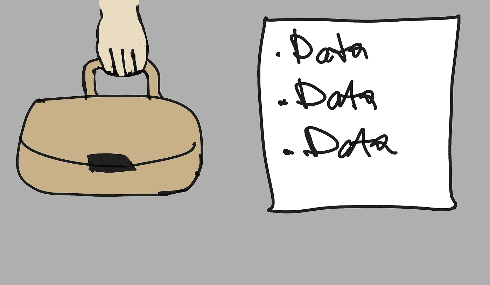

# 德国数据科学就业市场:演变与存在的问题

> 原文：<https://towardsdatascience.com/data-science-job-market-in-germany-evolution-and-present-problems-5a388f3c2d92?source=collection_archive---------13----------------------->

三份工作简介进入了德国市场

## 欧洲最大经济体数据科学家就业市场概览。

在过去的三年里，我确实写了并寄出了 200 多份求职申请。作为一个非欧盟公民，我有很大的就业压力，以保持我留在欧洲的权利。我三分之一的邮件都以面试告终。

从统计角度来看，这个数字应该是 1.500 左右。我总是在找到新工作之前就找到了。尽管如此，我还是想总结一下我的印象，并勾勒出德国三个最典型的数据科学工作。

# 作为德国电子商务现象的数据分析

在过去的三年里，德国的数据科学就业市场呈现出两个主要发展趋势。它从描述性分析转向编程，然后转向云工程。

当我第一次决定我的统计知识不应该安息时，那是 2016 年。

德国以前就有结合数据科学和商业分析的职位描述。他们被称为“WirtschaftsinformatikerIn”，意思是“信息系统经济学家”。时至今日，它仍然是德国大学的热门专业。这些工作主要是由大型工业公司发布的，这些公司拥有足够的数据来进行有意义的分析。

在 21 世纪初，网上商店几乎成为了每一种商业形式的必需品。十年后，许多人注意到他们已经收集了大量的客户数据。他们开始寻找有效利用数据的方法。

这就是两个新职位如何加入德国就业市场的原因。数据分析师会处理各种类型的数据，并有广泛的目标。商业智能专家将关注收入、利润、投资、现金流、物流和成本。

过了一段时间，很明显，简单的表格很无聊，不能让利益相关者满意。另一种工作出现了:数据可视化专家。这个下降得很快。除了几家大型咨询公司，没有一家公司有这么多图表要做。你不需要一个全职员工来做这件事。此外，从各种意义上来说，几乎不可能从你以前没有做过的数据中得出任何有根据的结论。一个可视化只是分析的一部分，而不是一门独立的艺术

在数据可视化从招聘信息板上消失后不久，商业团体面临下一个问题。

# 数据工程的兴起

网上商店的数据太复杂了，无法用你花钱买到的大多数可视化工具来处理。编程语言脚本必须在原始数据和漂亮的图表之间架起桥梁。那时，雇主开始发布 R 和 Python 程序员的招聘信息。

顺便说一下，在极少数情况下，您会使用 R 或 Python 进行统计建模。这样的工作在德国仍然很少见，雇主更喜欢猎头而不是等待应聘者。你不会在招聘栏上看到很多这样的公告。

原始数据和数据可视化之间的差距缩小后，一个新的差距被确定。原始数据的纯度和可信度长期以来被认为是理所当然的。但是在你的在线平台上追踪顾客是一件复杂的事情，因为有许多竞争者提供他们的工具。

每家公司都不时感到有必要从一种技术转向更好的技术。结果，数据迁移成了你在采访中经常听到的一个新词。

渐渐地，数据科学家不能接受公司的第三份工作，这一点变得很明显。他需要数据工程师的支持。他们将构建提取-转换-加载流程，检查数据一致性，并执行数据迁移。

在所有这些波动中，这些公司同时收集的数据变得更加庞大。德国电子商务商业界迎来了云时代。云和数据工程师融为一体。

那么，让我总结一下。

我们有:

*   商业分析师
*   一个数据科学家，实际上是一个统计学家
*   数据和/或云工程师。

这些是目前德国就业市场上最常见的职位。

# 定义问题和就业

然而，这些并不完全是杜撰的简介。就业市场更倾向于提供不同比例的业务、数据和云任务的职位。

我的观点是，数据总是有相同的生命周期，即收集、处理和分析。许多雇主确实认为，这三种人只是最好的拥有者。

有时候会很困惑。一则公告说，一家电子商务公司招聘一名商业分析师。在面试中，你意识到他们没有任何合适的数据来开始。此外，许多人没有认识到干净数据的重要性，在拥有工程师之前需要一名分析师。

许多人认为数据工程和数据分析可以在相同的数据上并行运行。当然，分析师和工程师会相互交流，但分析师永远是数据业务价值创造链的最后一环。

如果我们至少有三个工作剖面，我们可能需要一个好的项目经理或产品负责人来协调它们。我的印象是，德国的一些公司认识到了数据驱动项目的组织复杂性。我偶然发现了一些数据经理的招聘公告，但这种情况并不多见。

我没有说“我们需要一个团队领导”。根据项目的不同，上面提到的三者会或多或少甚至毫无关系。我们不希望在每天的团队会议上，领导只和一个人说话，而其他人感到厌烦。此外，如果你有一个人，他能理解这三者，让他代替你的 CTO。

# 云宇宙

一些当代的云设法创造了整个生态系统，你呆在里面，就像在一个泡泡里。Salesforce 和 AWS 只是最近的两个例子。

与这样的云一起工作的人变得过于狭隘专业化。你必须记住许多特性，因为它们中的许多很快就会从你的平台上退出。你无法跟上替代技术的发展。大云通过提供培训、课程等来帮助他们的超级用户。其中一些甚至是免费的，比如 Salesforce Trailheads。

雇主夸大或错误地认为自己是一名熟练工人，对一个大平台有丰富的经验。许多雇主认为证书是申请人的必备条件。这使得人们投入更多的时间来建立和维护他们与单一平台的联系。因此，他们减少了申请需要其他技术的工作的机会。

数据人员停止相互交流。相反，他们会参加由他们目前所在的特定平台安排的活动和社区。

公司从大云购买许可证，因为大老板希望有可靠的支持。他们相信一个完美的案例队列比 GitHub 更能解决他们的问题。在那里，你没有排队，但必须主动寻找解决方案。

大云分离数据工程师。

# 需要在电话中澄清的问题

所以，我的建议是找一家使用开源技术的公司。此外，在申请工作或去面试之前，有几个问题你可以在电话里问:

-你要用什么数据？

-它从哪里来？

-数据准备好进行分析了吗？

-有正在进行的项目吗？他们怎么样了？

-你将参与什么项目？

-数据团队有多大(如果有)？

-其他人是做什么的(工程、项目管理、建模等。)?

-有领队吗？他是技术人员还是管理人员？

-如果没有团队领导，谁是你的直接上司？

和你未来的老板或同事打个电话可以为双方节省很多时间。

在我看来，很多公司都痴迷于“数据科学”这个词，因为它听起来很好听。你必须确保你最终会进入一个能为公司和你的未来创造价值的环境。