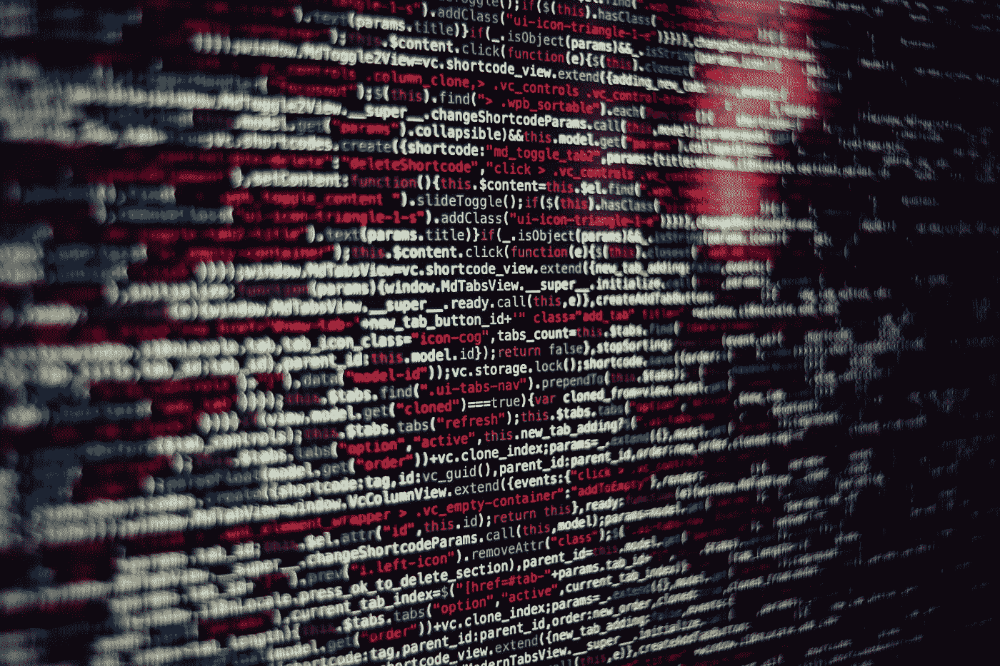

# 数据科学学习路径

> 原文：<https://towardsdatascience.com/data-science-learning-path-88fa39c469fb?source=collection_archive---------36----------------------->

## 学习数据科学、机器学习和深度学习的可靠计划

[来源](https://unsplash.com/photos/hbb6GkG6p9M)

对学习数据科学、[、机器学习](https://www.machinelearningnuggets.com/)、深度学习感兴趣？这里有一个坚实的计划来做到这一点。

## 用于数据科学的 Python

Python 是数据科学、机器学习和深度学习中最常用的语言。这很容易理解。所以我建议你从熟悉这门语言开始。不过，需要理解的最重要的概念是**数据结构**和 **Python 函数**。

## 数值计算的数值

一旦掌握了 Python，现在就可以继续学习 NumPy 了。NumPy 是一个用于数值计算的软件包，例如平均值等。大多数其他数据科学软件包也是基于它构建的，因此这是一项必备技能。这里要理解的最基本的一项是 [**NumPy 数组**](https://www.machinelearningnuggets.com/numpy-tutorial/) 和它们上面的**操作**。

> 查看 Python 中的[完整数据科学&机器学习训练营](https://www.mlnuggets.com/complete-data-science-machine-learning-bootcamp-in-python)立即开始学习。

## 熊猫的数据操作

接下来，你需要一个用于**数据清理**和**操作**的工具。熊猫就是一个建立在 NumPy 基础上的工具，它可以做到这一点。由于大多数数据通常不干净，这是一个你必须拥有的工具。这里要理解的最重要的事情是**熊猫数据帧**以及如何**操纵它们**

## 用 Matplotlib 可视化

既然你可以清理和操作你的数据，如果你能以一种可视化的方式分享你的分析就好了。输入 Matplotlib。这是一个可以用来可视化数据分析结果的工具。你可以用它来可视化**类别**、**分布**、**关系**——仅举几例。

## Seaborn 的美丽可视化

Seaborn 构建在 Matplotlib 之上，将会给你比 Matplotlib 更好看的视觉效果。这个工具很容易使用。然而，重要的是要注意，如果你想执行非常复杂的视觉效果，你可能必须回到 Matplotlib。

## 使用 Plotly 进行交互式可视化

[Plotly](https://plotly.com/python/) 允许你创建可以互动的视觉效果。例如，当你**将**悬停在某个区域上时，可以看到更多信息，而**可以放大和缩小你的可视化效果。您还可以使用与 Plotly 集成的 Mapbox 进行高级可视化操作，如**映射**。**

## 使用 Dash 的交互式 Web 应用程序

[Dash](https://dash.plotly.com/) 是一个 web 框架，它将使您能够使用 Plotly 构建**交互式数据科学应用**。任何在 Plotly 中实现的可视化也可以在 Dash 中实现。该工具通过标签经由 **Dash HTML 组件提供所有 Html。**它应该通过 **Dash 核心组件提供高级交互视觉效果。**其工作原理是**破折号回调**。你通常会给这些回调函数提供一些**输入**和**输出**。每当输入发生变化，Dash 就会启动回调函数。很神奇，对吧？

## 使用 Streamlit 的数据科学应用

如果你正在寻找 Dash 的替代品，那么 Streamlit 就是你的选择。这是一个开源框架，数据科学家和机器学习工程师可以在几个小时内创建出**漂亮的**、**高性能的**应用。

## 使用 Power BI 台式机构建仪表板

如果你**不想写任何代码**，那么你可以看看 **Power BI Desktop** 。尽管如此，在将数据导入到 Powe BI Desktop 之前，您仍然需要找到一种清理数据的方法，我想不出比使用 Python 更好的方法了。

> 参加 Python 中的[完整数据科学&机器学习训练营](https://www.mlnuggets.com/complete-data-science-machine-learning-bootcamp-in-python)立即开始学习。

## 机器学习

接下来你可以做的就是深入机器学习的世界。在这里，你将学到进行**监督**和**非监督**机器学习的最酷的技巧。开源的 [**Scikit-Learn**](https://scikit-learn.org/) 包将提供你需要的所有工具。这里你的重点将是了解**数据**如何**准备**用于机器学习模型，**数据分割**以及**评估**你的机器学习模型。

## 关联规则挖掘

这是一种用于发现产品之间关系的技术。如果你在超市等零售领域工作，你会发现它很有用。这项技能可以帮助你通过识别**经常一起购买的物品**来增加销售额。例如，在药房中，您可能会发现购买药物 A 的患者也购买了药物 B。询问购买了药物 A 的患者他们的处方中是否也有药物 B 才有意义。你已经在网上商店或学习平台上看到了这种技术，其形式是**经常一起购买**部分。

## 自然语言处理

如今我们有如此多的文本形式的数据。这些数据可以从博客以及 Twitter 等社交网站上获得。在这个世纪，从数据中获取意义的能力是一项不可或缺的技能。然而，处理文本数据并不容易。你必须找到一种用数字形式表示文本数据的方法。好消息是，有很多工具可以让你做到这一点。

## 深度学习

一旦你掌握了机器学习的复杂性，现在是你研究深度学习的时候了。这只是机器学习的一个实现，涉及到神经网络的**应用。这些网络模仿人脑的工作。当你有一个大的数据集时，深度学习是最常用的。它还广泛用于计算密集型过程，如图像分类、[图像分割](https://heartbeat.fritz.ai/a-2019-guide-to-semantic-segmentation-ca8242f5a7fc)和[物体检测](https://www.kdnuggets.com/2019/08/2019-guide-object-detection.html)。最流行的工具是 [TensorFlow](https://heartbeat.fritz.ai/serving-tensorflow-models-3989df5d7d53) 、 [Keras](https://heartbeat.fritz.ai/introduction-to-deep-learning-with-keras-c7c3d14e1527) 和 [PyTorch](https://heartbeat.fritz.ai/introduction-to-pytorch-for-deep-learning-5b437cea90ac) 。**

## 自动化机器学习

这是一个相当新的领域，但它正像风暴一样席卷全球。想象一下，如果你可以把你的数据输入一个模型，它会为你做任何事情。这包括**数据处理**和**调整**模型以获得最佳结果。这是 **AutoML** 的承诺。能够让你做到这一点的工具包括 [**自动学习**](https://automl.github.io/auto-sklearn/master/) 和 [**自动 Keras**](https://heartbeat.fritz.ai/automated-machine-learning-in-python-5d7ddcf6bb9e) 。

> 查看 Python 中的[完整数据科学&机器学习训练营](https://www.mlnuggets.com/complete-data-science-machine-learning-bootcamp-in-python)立即开始学习。

## 最后的想法

希望这能让你了解你的数据科学学习之路会是怎样的。这只是冰山一角，一旦你学会了这些，你会惊奇地发现你仍然可以在互联网上找到大量的数据科学工具和技术。不过，关键是要开始。

如果你想了解所有这些以及更多，请使用这一有限的[优惠优惠券](https://www.mlnuggets.com/complete-data-science-machine-learning-bootcamp-in-python)参加 Python 中的 [**数据科学&机器学习训练营。**](https://www.mlnuggets.com/complete-data-science-machine-learning-bootcamp-in-python)