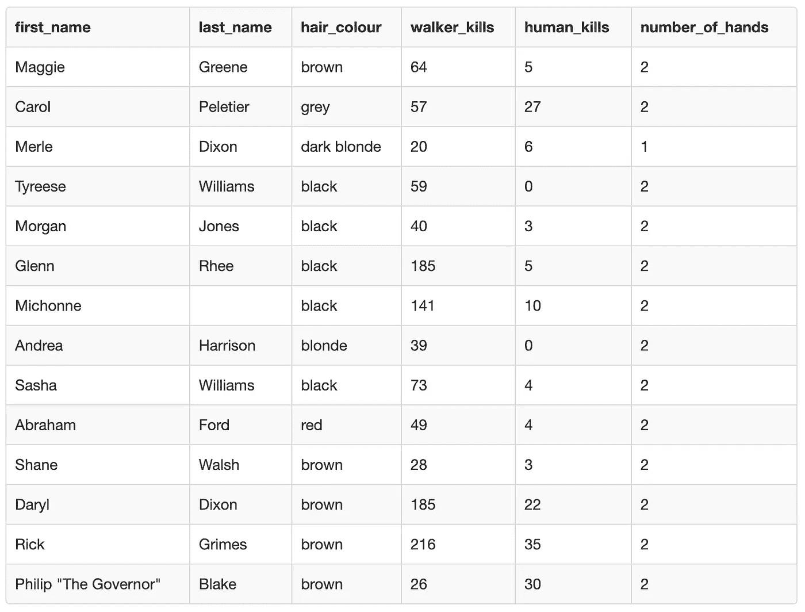

# 如何使用 SQL 从表中选择数据

> 原文：<https://towardsdatascience.com/data-science-lesson-2-selecting-data-using-sql-3aaf8258619d?source=collection_archive---------30----------------------->

## [在保持社交距离的同时学习数据科学](https://towardsdatascience.com/tagged/ldswsd)

## 以行尸走肉为例，说明如何使用 SQL 来选择感兴趣的数据


[丹尼尔·延森](https://unsplash.com/@dallehj?utm_source=medium&utm_medium=referral)在 [Unsplash](https://unsplash.com?utm_source=medium&utm_medium=referral) 上拍照

# 介绍

虽然在家里自我隔离，但我和我的朋友们决定作为一个小组一起学习数据科学。到目前为止，我们已经上了一节课，我对这个团队的热情感到非常高兴。通过提问，我的朋友们帮助我解释得更清楚，并互相帮助学习。希望我们能够保持这一势头，并继续共同开发新的数据科学技能。

如果您想在全球疫情期间加入我们学习数据科学，请随时关注。你可能想回到[上一课](/learn-data-science-while-practicing-social-distancing-lesson-1-making-a-table-using-sql-13fb9678282b?source=friends_link&sk=b46bc4fad9475cd04619ccb18ee01232)以便从头开始。否则，如果您对学习如何使用 SQL 从表中选择数据特别感兴趣，那么您就来对地方了。

# 前一课

在[上一课](/learn-data-science-while-practicing-social-distancing-lesson-1-making-a-table-using-sql-13fb9678282b?source=friends_link&sk=b46bc4fad9475cd04619ccb18ee01232)中，我们学习了如何使用 SQL 创建一个表并将一些数据放入其中。这是使用 CREATE TABLE 和 INSERT INTO 关键字完成的。为了好玩，我们在示例中使用了儿童节目 Bluey。

# 这一课

现在我们已经知道了如何从第一课创建数据表，让我们学习如何访问它。

使用 SQL 关键字 SELECT，您可以访问表中的所有数据、特定的列或特定数量的记录。在本课中，我们将逐一介绍这三种情况。此外，我们将练习如何使用 SELECT DISTINCT 关键字选择数据而不包含重复值。

与上一课中作为例子的儿童节目不同，本周我们将使用《行尸走肉》。当然不是给孩子们的😉

# 我们想要解决的问题

在《行尸走肉》第一季中，有一些好人和一些坏人，还有一些介于两者之间。但是我们想找出最致命的前 5 个角色。

为了找出谁最擅长杀人，我们需要找出我们想要使用的标准。《行尸走肉》中的人物出动了很多‘行尸’，但也有相当一部分还杀死了几个人类。

我们将把最致命的角色定义为杀死最多僵尸的角色。然后，如果杀死僵尸的人数有一个平手，杀死最多人类的人将被誉为两人中最致命的角色。

# 数据

我们有一个包含《行尸走肉》中角色信息的表格，我们将用它来解决我们的问题。数据集主要来自[这篇文章](https://screenrant.com/the-walking-dead-deadliest-best-characters-season-7-kill-stats/)。我稍微改变了一些数字，以说明本课的一个要点。



因此，现在我们需要找出如何从表中选择正确的数据，找出谁是最致命的。

# 从表中选择所有数据的语法:

就像我们在第一课中看到的，您可以使用星号来表示您想要选择表中的所有数据。运行查询时，将返回表中所有可用的列。

```
SELECT
    *
FROM 
    name_of_table;
```

这是您可以编写的最简单的查询之一。

## **为什么代码中会有缩进？**

缩进在 SQL 中不做任何事情。我这样做只是为了让我的代码更容易阅读。一般来说，你应该遵守你的组织风格指南中的缩进规则。然而，我们没有一个风格指南，所以你可以用任何你喜欢的方式来组织你的代码。重要的是要知道在其他编码语言中，比如 Python，缩进是有效的。如果你没有在 Python 中使用正确的缩进，你的代码将会抛出一个错误。

# 选择特定列的语法:

如果只想从较大的表中选择特定的列，可以列出希望从查询中返回的列的名称。

```
SELECT 
    name_column_one, 
    name_column_two, 
    name_column_five
FROM
    name_of_table;
```

这非常有用，特别是对于非常宽的数据集，其中的列比结果表中显示的要多得多。例如，如果您正在查看人口普查数据，但只对许多可用列中的几列感兴趣，那么如果您只选择感兴趣的那些列，就更容易看到您想要的值。

**问题 1:** 你能说出上表中有多少列吗？

# 选择特定数量记录的语法:

关键字 LIMIT 可用于选择特定数量的记录。当使用 LIMIT 时，从表的顶部开始，只返回指定数量的记录。如果您的数据按特定顺序排列，这将非常有用。

如果您想按感兴趣的列对数据进行排序，可以使用 ORDER BY 关键字。ORDER BY 放在 FROM 语句之后。若要使用 ORDER BY，您需要指定要使用哪一列来决定数据返回的顺序。

您还可以分别使用 ASC 或 DESC 来决定是按升序还是降序排列。

```
SELECT 
    *
FROM
    name_of_table 
ORDER BY
    name_column_one DESC
LIMIT 10;
```

上面的代码将从表中选择所有的列，并返回前 10 条记录。这是在根据第一列中的值对它们进行降序排列之后。

# 没有重复值的选择语法:

SELECT 和 SELECT DISTINCT 的语法是相同的。不同之处在于它返回的结果。

```
SELECT DISTINCT
    name_column_one
FROM
    name_of_table;
```

SELECT DISTINCT 只返回所选列的不同值，因此所有重复项都将被删除。如果您只选择一列，这很容易理解。但是，您也可以使用 SELECT DISTINCT 来选择列的唯一组合。

```
SELECT DISTINCT
    name_column_one,
    name_column_five
FROM
    name_of_table;
```

因此，使用上面的代码，您将得到第一列和第五列中的值的不同组合。即使第一列中有重复的值，如果在相同的行中第五列有不同的值，也将返回这两行。

# 现在让我们试着解决我们的问题

1.  去[http://sqlfiddle.com/](http://sqlfiddle.com/)(或者你可以用[https://www.db-fiddle.com/](https://www.db-fiddle.com/)，因为我发现 SQL fiddle 最近停机了一段时间)
2.  在左边的框中放入创建表并插入到下面的查询中

```
CREATE TABLE walking_dead(
    first_name varchar(255),
    last_name varchar(255),
    hair_colour varchar(255),
    walker_kills int(255),
    human_kills int(255),
    number_of_hands int(255)
);INSERT INTO walking_dead (first_name, last_name, hair_colour, walker_kills, human_kills, number_of_hands)
VALUES
    ('Maggie', 'Greene', 'brown', 64, 5, 2),
    ('Carol', 'Peletier', 'grey', 57, 27, 2),
    ('Merle', 'Dixon', 'dark blonde', 20, 6, 1),
    ('Tyreese', 'Williams', 'black', 59, 0, 2),
    ('Morgan', 'Jones', 'black', 40, 3, 2),
    ('Glenn', 'Rhee', 'black', 185, 5, 2),
    ('Michonne', '', 'black', 141, 10, 2),
    ('Andrea', 'Harrison', 'blonde', 39, 0, 2),
    ('Sasha', 'Williams', 'black', 73, 4, 2),
    ('Abraham', 'Ford', 'red', 49, 4, 2),
    ('Shane', 'Walsh', 'brown', 28, 3, 2),
    ('Daryl', 'Dixon', 'brown', 185, 22, 2),
    ('Rick', 'Grimes', 'brown', 216, 35, 2),
    ('Philip “The Governor”', 'Blake', 'brown', 26, 30, 2)
;
```

3.单击“构建模式”按钮

4.在右边的框中输入您的问题

5.运行下面的查询，看看它是否会返回您所期望的结果:

```
SELECT
    hair_colour, 
    number_of_hands
FROM
    walking_dead
ORDER BY
    hair_colour ASC, number_of_hands DESC;
```

**提示:**注意列的排列顺序以及结果中的重复值

6.运行下面的查询，看看它是否会返回您所期望的结果:

```
SELECT DISTINCT
    hair_colour, 
    number_of_hands
FROM
    walking_dead
ORDER BY
    hair_colour ASC, number_of_hands DESC;
```

**提示:**注意添加 DISTINCT 关键字如何改变返回的结果

7.运行下面的查询，看看它是否会返回您所期望的结果:

```
SELECT
    first_name, 
    human_kills
FROM
    walking_dead
ORDER BY
    human_kills DESC
LIMIT 10;
```

**提示:**注意返回记录的顺序和数量。

8.运行下面的查询，看看它是否会返回您所期望的结果:

```
SELECT
    first_name, 
    human_kills
FROM
    walking_dead
ORDER BY
    first_name ASC
LIMIT 10;
```

**提示:**注意与之前的查询相比，返回的结果有所不同。

**练习 1:** 编写一个查询来选择该表中的所有数据

**练习 2:** 编写一个查询来创建数据集中所有**不同**姓氏的列表

**练习 3** :编写一个查询，创建该数据集中所有**不同**姓氏、头发颜色组合的列表

**练习 4:** 选择前 5 名最致命角色的全名、行者 _kills 和人类 _kills。这是基于杀死僵尸是最重要的，其次是杀死人类的标准。

# 我们是如何学习这一课的

我们学习小组里至少有一个《行尸走肉》的超级粉丝。她很高兴得到一个僵尸为基础的教训😜

该小组的一些成员比我们最初计划的时间表晚了一点，他们仍在学习这一课。但是当学校放假的时候，你有三个孩子要照顾，你能做什么呢？或者你正在努力让你的公司和员工度过这次金融危机。与我一起学习数据科学的女性在她们的生活中有很多其他事情要做，所以我完全理解她们有时会妨碍我。

话虽如此，但每个人在力所能及的情况下，似乎仍然热衷于完成这一课。我的伙伴们这周已经完成了课程，他们做得非常好。他们似乎很好地掌握了从表格中选择的基本知识。我迫不及待地想看看，当我们转到一些稍微复杂一点的 SQL 方法时，它们会怎么样。

# 下一课

在下一课中，我们将重点关注数据过滤。在 SQL 中有许多不同的方法来过滤表，但是我们将集中学习使用关键字 WHERE、AND、OR、LIKE、in、BETWEEN 和 NOT。

除了数据，我的另一个爱好是绘画。你可以在 www.katemarielewis.com 的[找到我的野生动物艺术](http://www.katemarielewis.com)

# 社交距离学习数据科学的所有课程(LDSWSD)

[](https://towardsdatascience.com/tagged/ldswsd) [## Ldswsd -走向数据科学

### 阅读《走向数据科学》中关于 Ldswsd 的文章。共享概念、想法和代码的媒体出版物。

towardsdatascience.com](https://towardsdatascience.com/tagged/ldswsd)