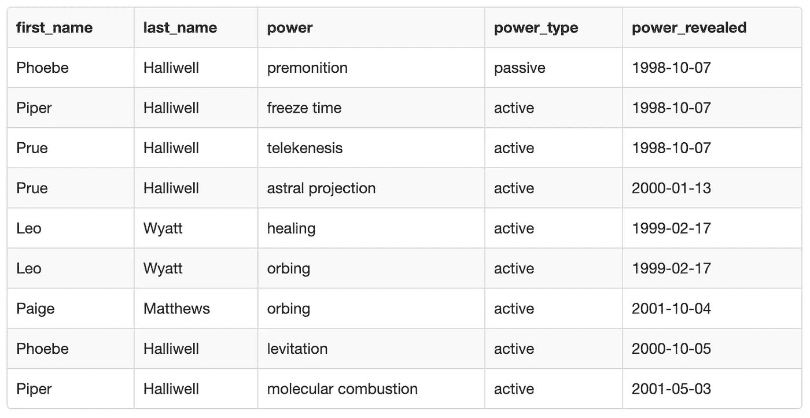
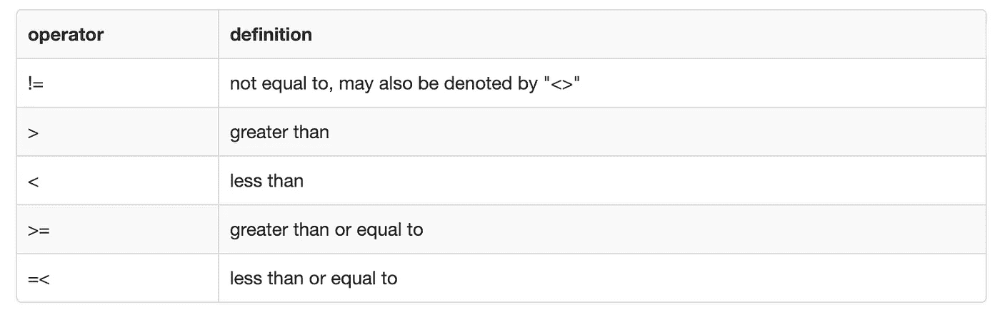
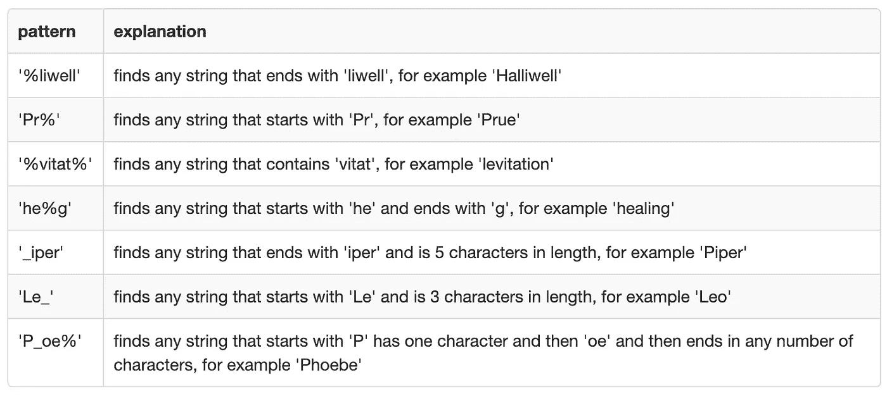

# 如何使用 SQL 过滤数据集

> 原文：<https://towardsdatascience.com/data-science-lesson-3-filtering-data-using-sql-45d90986487f?source=collection_archive---------12----------------------->

## [在保持社交距离的同时学习数据科学](https://towardsdatascience.com/tagged/ldswsd)

## 以 Charmed 为例，说明如何使用关键字 WHERE、AND、OR、LIKE、IN、BETWEEN 和 NOT 使用 SQL 从表中过滤数据


由[卢多维克·沙雷特](https://unsplash.com/@ludo_photos?utm_source=medium&utm_medium=referral)在 [Unsplash](https://unsplash.com?utm_source=medium&utm_medium=referral) 上拍摄的照片

# 介绍

在过去的几周里，我一直在帮助我的一小群朋友学习 SQL。他们想学习数据科学，因为他们被困在社交距离中，有更多的空闲时间。我认为这是一个伟大的想法，并提出帮助指导他们通过它。

这是我们使用 SQL 的第三课。如果你想加入学习，请随时回到第[课](/learn-data-science-while-practicing-social-distancing-lesson-1-making-a-table-using-sql-13fb9678282b?source=---------1-----------------------)并投入其中。或者，如果您只是想学习如何使用 SQL 过滤数据，我希望这一课对您有所帮助。

# 前一课

在[上一课](/data-science-lesson-2-selecting-data-using-sql-3aaf8258619d?source=---------0-----------------------)中，我们重点介绍了从表中选择数据的不同方法。以行尸走肉为例，我们从一个表中选择所有数据，选择特定的列，选择有限数量的记录，选择不同的值，并对结果进行排序。我们使用 SELECT、SELECT DISTINCT、LIMIT、ORDER BY 关键字来实现这一点。

# 这一课

这一课我们可以真正了解 SQL 的一些更常用的函数。既然我们已经知道了如何制作一个表，将一些数据放入其中并选择数据，那么我们可以学习如何在选择数据时操作数据。我们将重点学习筛选表。

最重要的是，我们将学习 WHERE 语句的作用。此外，我们将练习使用关键字 AND、OR、LIKE、In、BETWEEN 和 NOT 与 WHERE 连用。

# 我们想要解决的问题

《魅力》是我成长过程中最喜欢的电视节目之一。我过去常常把每一集都录下来，然后和我妹妹一起看几遍，然后在下一周我们就会看到新的一集。这就是为什么我选择用《魅力》中的角色作为本周的例子。

我们有一个关于 charmed 中一些角色的数据表，但我们只想选择表中的一部分。我们的问题是，我们只想要有血缘关系的姐妹的信息，只想要 2001 年之前透露的她们的活跃力量的信息。

在这节课中，我们将学习从魅力信息表中选择感兴趣的数据所需的技巧。

# 数据

下表包含了《魅力》中角色的数据。如果每个角色有多重能力，他们可以在表格中有多行。此外，我们还有关于这些异能的额外信息，比如异能的类型和显现时间。



# 使用 WHERE 过滤数据的语法

向查询中添加 WHERE 语句意味着将对表进行筛选，以便只返回满足 WHERE 语句后的条件的记录。我以前写过一篇文章[比较 SQL](/what-is-the-difference-between-a-having-clause-and-a-where-clause-in-sql-ed74e0a8ad6d) 中的 WHERE 和 HAVING，以防你想阅读如何使用 WHERE 的另一个例子。

下面你可以看到 WHERE 子句的一个最简单的版本。

```
SELECT 
    *
FROM
    name_of_table
WHERE
    name_column_one = value_of_interest
;
```

Equals 不是唯一可以用于 WHERE 语句的运算符。其他常见的运算符包括:



因此，根据您想要达到的结果，您可以使用任何适合您的目的的操作符。

## 如果您希望您的结果满足多个条件，该怎么办？

您可能希望筛选数据，使其满足两个或更多条件。在这种情况下，您可以使用和。例如，如果希望一列等于感兴趣的值，而另一列只包含大于另一个感兴趣的值的值，则可以用 and 分隔这两个条件。在这种情况下，将只返回满足查询中所有条件的记录。

```
SELECT 
    *
FROM
    name_of_table
WHERE
    name_column_one = value_of_interest
  AND
    name_column_five > second_value_of_interest
;
```

## 如果只需要满足可用条件中的一个呢？

如果你不需要你的过滤器非常严格，只需要满足一个或另一个条件，那么你可以使用 or。通过用 OR 替换 AND，这意味着如果一个记录满足可用条件之一，那么它将被返回，而不是它必须满足查询中的两个条件。

```
SELECT 
    *
FROM
    name_of_table
WHERE
    name_column_one = value_of_interest
  OR
    name_column_five > second_value_of_interest
;
```

如果你想变得有点棘手，你甚至可以一起使用 OR 和 and。您只需要在 OR 部分加上括号，这样首先满足条件，然后也需要满足 and 条件。

```
SELECT 
    *
FROM
    name_of_table
WHERE
      (name_column_one = value_of_interest
    OR
      name_column_five > second_value_of_interest)
  AND
    name_column_two != third_value_of_interest
;
```

## 如果不知道利息的确切值呢？

如果您不想精确匹配某个值，而是希望条件查找模式匹配，可以使用 like。

```
SELECT 
    *
FROM
    name_of_table
WHERE
    name_column_one LIKE pattern_of_interest
;
```

您可以使用许多不同的模式。要编写它们，您可以使用由%或 _ 组成的通配符。%用于表示一个、多个字符或根本不表示字符。%通配符非常通用。相反，_ 仅用于表示单个字符。因此，它允许你在创建模式时更加具体。

下表显示了您可以使用通配符创建的一些示例模式:



## 如果你有很多感兴趣的价值观呢？

在许多情况下，您可能希望根据值列表来筛选数据。这就是中的 SQL 关键字发挥作用的地方。它的工作方式与您在带有多个 OR 条件的 WHERE 语句中使用等号的方式相同。这只是编写查询的一种更加干净和简单的方式。返回的记录只需要与 in 语句中列表中的一个值匹配。

```
SELECT 
    *
FROM
    name_of_table
WHERE
    name_column_one IN (value_1, value_2, value_3, value_4, value_5)
;
```

如果您想变得更复杂，您甚至可以将另一个查询放入括号中来选择值列表。另一个查询中的这种类型的查询称为**子查询**。

```
SELECT 
    *
FROM
    name_of_table
WHERE
    name_column_one IN (
        SELECT 
            name_column_two 
        FROM 
            name_of_table)
;
```

## 如果你有一大堆感兴趣的价值观呢？

如果您有大量感兴趣的值，并且不想列出包含所有值的列表，您可以使用关键字 BETWEEN。在这种情况下，您需要提供起始值和结束值。这两个值由 AND 关键字分隔。

许多不同的数据类型可以用作 BETWEEN 的起始值和结束值。例如，您可以使用整数、浮点数、日期或字符串。

```
SELECT 
    *
FROM
    name_of_table
WHERE
    name_column_one BETWEEN value_1 AND value_2
;
```

## 如果您有多个想要排除的值，该怎么办？

如果希望排除而不是包含特定的值，可以使用关键字 NOT。在这种情况下，我在 In 子句前放 NOT。正如您所料，只有不匹配列表中任何值的记录才会被返回。

```
SELECT 
    *
FROM
    name_of_table
WHERE
    name_column_one NOT IN (value_1, value_2, value_3, value_4, value_5)
;
```

NOT 也可以用于其他条件，而不仅仅是 IN。但我认为这是使用 NOT 的最有用的例子之一。

# 现在让我们试着解决我们的问题

1.  去 http://sqlfiddle.com/的(或者你可以用 https://www.db-fiddle.com/的，因为我发现 SQL fiddle 最近停机了)
2.  在左边的框中放入创建表并插入到下面的查询中

```
CREATE TABLE charmed(
    first_name varchar(255),
    last_name varchar(255),
    power varchar(255),
    power_type varchar(255),
    power_revealed date
);INSERT INTO charmed(
    first_name,
    last_name,
    power,
    power_type,
    power_revealed
)
VALUES
    ('Phoebe', 'Halliwell', 'premonition', 'passive', '1998-10-07'),
    ('Piper', 'Halliwell', 'freeze time', 'active', '1998-10-07'),
    ('Prue', 'Halliwell', 'telekenesis', 'active', '1998-10-07'),
    ('Prue', 'Halliwell', 'astral projection', 'active', '2000-01-13'),
    ('Leo', 'Wyatt', 'healing', 'active', '1999-02-17'),
    ('Leo', 'Wyatt', 'orbing', 'active', '1999-02-17'),    
    ('Paige', 'Matthews', 'orbing', 'active', '2001-10-04'),
    ('Phoebe', 'Halliwell', 'levitation', 'active', '2000-10-05'),
    ('Piper', 'Halliwell', 'molecular combustion', 'active', '2001-05-03')
;
```

3.单击“构建模式”按钮

4.在右边的框中输入您的问题

5.运行下面的查询，看看它是否会返回您所期望的结果:

```
SELECT 
    *
FROM
    charmed
WHERE
    power_type = 'active'
;
```

6.运行下面的查询，看看它是否会返回您所期望的结果:

```
SELECT 
    *
FROM
    charmed
WHERE
    power_type = 'active'
AND
    power_revealed!='1998-10-07'
;
```

7.运行下面的查询，看看它是否会返回您所期望的结果:

```
SELECT 
    *
FROM
    charmed
WHERE
    power_type = 'active'
OR
    power_revealed!='1998-10-07'
;
```

**注意:**将这个查询的结果与前一个查询的结果进行比较。所改变的只是“或”被“和”所取代

8.运行下面的查询，看看它是否会返回您所期望的结果:

```
SELECT 
    *
FROM
    charmed
WHERE
    first_name LIKE 'P%'
;
```

9.运行下面的查询，看看它是否会返回您所期望的结果:

```
SELECT 
    *
FROM
    charmed
WHERE
    power IN ('orbing', 'healing')
;
```

10.运行下面的查询，看看它是否会返回您所期望的结果:

```
SELECT 
    *
FROM
    charmed
WHERE
    first_name NOT IN (SELECT 
                           first_name
                       FROM
                           charmed
                       WHERE
                           first_name LIKE 'P%')
;
```

11.运行下面的查询，看看它是否会返回您所期望的结果:

```
SELECT 
    *
FROM
    charmed
WHERE
    first_name NOT LIKE 'P%'
;
```

**注意:**将这个查询的结果与前一个查询的结果进行比较

12.运行下面的查询，看看它是否会返回您所期望的结果:

```
SELECT 
    *
FROM
    charmed
WHERE
    power_revealed BETWEEN '1999-01-01' AND '2000-12-31'
;
```

13.运行下面的查询，看看它是否会返回您所期望的结果:

```
SELECT 
    *
FROM
    charmed
WHERE
    power BETWEEN 'astral projection' AND 'healing'
;
```

**练习 1:** 编写一个查询，该查询过滤表以仅包括血亲(Prue，Piper，Phobe，Paige)，仅包括有效的异能，并且仅包括 2001 年之前显示的异能。

**练习 2:** 看看是否有其他方法可以编写不同的查询来选择与第一个练习中相同的数据。你能想到的不同方法越多越好。尽可能多地使用本课中不同的 SQL 关键字。

# 我们是如何学习这一课的

我觉得在这一课中，在过去几周的介绍性课程之后，我们真正进入了 SQL 能做什么的实质内容。我们的学习小组在我们的进展中有点分散，因为人们有许多其他的承诺。所以全组还没有完成这一课。

然而，那些做得很好的人。人们似乎喜欢练习 2 的开放性和用几种不同方法解决同一问题的挑战性。

希望小组中忙碌的成员能够赶上其他人，这样我们就可以很快再次学习同一课。

# 下一课

现在我们知道了如何筛选数据，下一课我们将学习如何汇总数据。我们将使用关键字 MIN、MAX、COUNT、AVERAGE 和 SUM，并以辣妹为例进行说明。

除了数据，我的另一个爱好是绘画。你可以在 www.katemarielewis.com 的[找到我的野生动物艺术](http://www.katemarielewis.com)

# 社交距离学习数据科学的所有课程(LDSWSD)

[](https://towardsdatascience.com/tagged/ldswsd) [## Ldswsd -走向数据科学

### 阅读《走向数据科学》中关于 Ldswsd 的文章。共享概念、想法和代码的媒体出版物。

towardsdatascience.com](https://towardsdatascience.com/tagged/ldswsd)