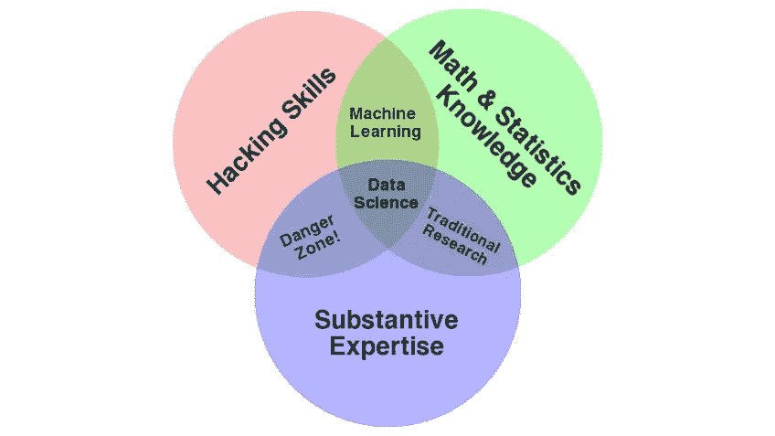

# 数据科学，机器学习还是人工智能:我应该从哪里开始？

> 原文：<https://towardsdatascience.com/data-science-machine-learning-or-ai-where-should-i-start-32a860564387?source=collection_archive---------23----------------------->

图片由 [StartupStockPhotos](https://pixabay.com/users/StartupStockPhotos-690514/?utm_source=link-attribution&utm_medium=referral&utm_campaign=image&utm_content=849806) 来自 [Pixabay](https://pixabay.com/?utm_source=link-attribution&utm_medium=referral&utm_campaign=image&utm_content=849806)

剧透:答案往往是“以上都不是”。

这些天，人们几乎可以在看新闻时不接触到数据科学、机器学习或人工智能。而且有一个很好的理由——通过互联传感器和设备收集的数据的爆炸，加上人工智能的突破，加上计算能力的急剧增长，已经将这些主题推到了每个科技公司的优先事项清单的首位。由此产生的对具有这些技能的技术人才的需求有据可查——根据 LinkedIn 2019 年的“新兴工作”报告，[在过去四年中，需要这些技能的职位的招聘量每年增长 74%](https://www.marketwatch.com/story/the-no-1-job-of-2019-pays-140000-and-its-hiring-growth-has-exploded-74-2019-12-10?siteid=yhoof2&yptr=yahoo)。数据科学家和人工智能工程师的平均工资远高于 10 万美元，该领域的顶级专家的工资高达几十万美元。

因此，各种各样的大学和私人教育课程如雨后春笋般涌现，以满足快速增长的行业对这一人才的需求，从私人训练营到数据科学、机器学习或人工智能方面的大学硕士和博士课程。随着各年龄段的人被该领域令人兴奋的工作机会和高薪所吸引，对这些项目的需求正在激增。但是，对于那些希望进入这个领域或扩展自己技能的人来说，一个核心问题往往是不清楚的:

> 我应该学习数据科学、机器学习还是人工智能？真的有区别吗？

对上述问题的简短回答是“是”。但是差异并不总是清晰的，它们之间的界限有时是模糊的。许多大学提供“数据科学”、“机器学习”或“人工智能”(或三者的某种组合)的研究生课程，他们自己在解释他们的重点方面做得很差，偶尔会与同行大学不一致地应用这些术语。这使得许多感兴趣的学习者不清楚他们应该关注这些领域中的哪一个。如果不清楚这些术语，新的学习者就会不知从哪里开始涉水阅读这些主题的大量文章、书籍、在线课程和视频。不幸的是，很容易从错误的地方开始，很快就超出了你的能力，并因其复杂性而气馁。

# 那么这些术语之间有什么区别呢？

我们先从“数据科学”说起。数据科学是指收集分析数据的方法、工具和实践，以获得见解，从而支持决策。数据科学是一个宽泛的术语，因此，真正的数据科学家必须具备广泛的技能，包括编程、数学/统计以及所需应用领域的领域知识。

数据科学维恩图。由[引来康威](http://drewconway.com/zia/2013/3/26/the-data-science-venn-diagram)

成功的数据科学家能够将强大的编程技能与数学和统计知识以及关于他们正在解决的问题的足够深入的领域知识相结合。数据科学家为组织执行一系列活动，包括数据收集和处理、分析建模和机器学习以及数据可视化。数据科学家研究广泛领域的问题，从社会科学到农业再到消费品。因此，数据科学家的就业市场在公司、政府和非营利组织中都很广阔。

“机器学习”通常被认为是计算机程序通过示例而不是显式编程的规则来“学习”或提高性能的能力。机器学习是数据科学家用来分析和解释数据的关键工具之一。反过来，应用机器学习的软件工程师依赖数据科学的技术和工具来准备用于 ML 的数据。虽然一些组织已经创建了专门的 ML 工程师角色，但在许多其他组织中，创建 ML 模型的责任落在了软件工程师或数据科学团队身上。无论一个人是专门的 ML 工程师还是负责实施 ML 模型的软件开发人员，组织中的这一功能都需要强大的数学基础、对机器学习理论及其算法的理解以及对编程的合理熟练程度的结合，以用代码实施模型。虽然每个行业都有需求，但 ML 工程师最常见于网络/科技公司和特定行业的软件公司。

“人工智能”通常用于描述能够复制与人类思维相关的认知能力的机器。该领域作为一个研究领域可以追溯到 20 世纪 50 年代中期，并由几个子领域组成，如计算机视觉和机器人技术。“人工一般智能”或广义上复制人类思维的能力，与“狭义人工智能”之间通常有所区别，在狭义人工智能中，机器学习完成一项非常具体的任务。人工智能领域的许多最新进展都是使用机器学习技术实现的，尽管该领域还包括专家系统或智能搜索等领域。

数据科学和人工智能领域都使用机器学习作为中心工具。在数据科学中，机器学习通常被用作数据分析工具，以揭示数据中的模式，有时还进行预测。在人工智能领域，机器学习是创造智能代理的关键。通常在人工智能中，用于机器学习的数据来自硬件或传感器，机器学习工具被近乎实时地使用，以使机器能够采取行动。连接所有三个领域的另一个关键要素是，数据科学的工具被用来清理、处理和分析作为输入的数据。虽然数据来源可能不同，但通常使用相同的技术和编程工具。

# **该学哪个？**

这个问题的答案很大程度上取决于你的目标是什么。对于在不同领域从事数据分析的科学家和研究人员来说，彻底了解数据科学的工具是一个很好的起点。对于寻求将智能构建到软件或硬件产品中的工程师来说，机器学习或更一般的人工智能可能是一条逻辑路径。

如果你不确定你想去哪里，只是想开始，从数据科学基础开始(同时复习编程和微积分/线性代数/统计)很难出错。最终，数据是在所有这些领域取得成功的关键，因此，一套强大的处理、清理、分析和可视化数据的技能，以及这样做所需的统计知识，将会很好地为您服务，无论您最终走向何方。

**然而，在你开始学习任何这些领域之前，我会确保你在你渴望应用这些技术的领域/行业有足够坚实的领域知识基础**。如果你正在进入大学或刚刚开始你的职业生涯，在花时间学习数据科学/机器学习/人工智能之前(或至少同时)，建立你的领域知识是很重要的。除非你计划以构建新算法的 ML/AI 研究为职业，否则你将在自己感兴趣的领域内使用这些工具作为应用的一部分。也许你能够成功做到这一点的最大贡献者是拥有足够的领域知识来彻底理解你试图解决的问题以及数据科学/ ML / AI 如何在解决问题中发挥作用。

我们很幸运生活在这样一个时代，在每一个领域都有各种各样的内容。挑战在于如何最好地在其中导航。希望这个总结能让你更好地了解从哪里开始。祝你好运，祝你旅途愉快！