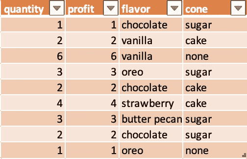
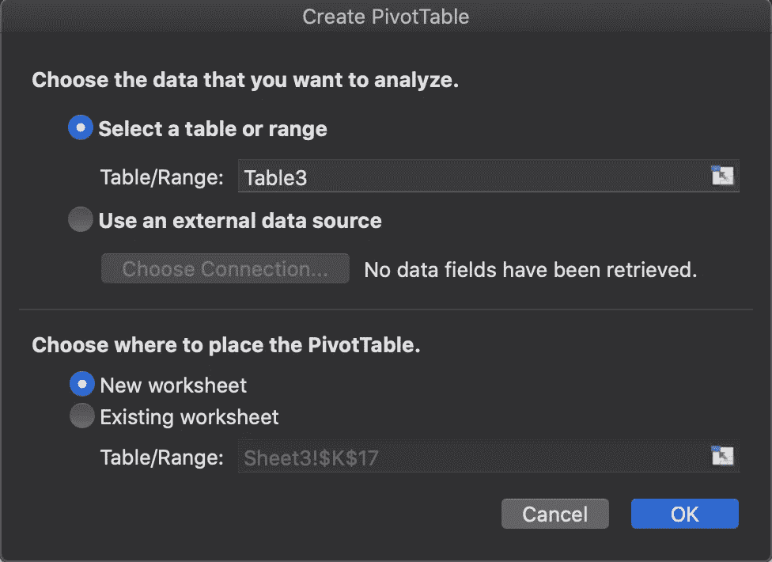
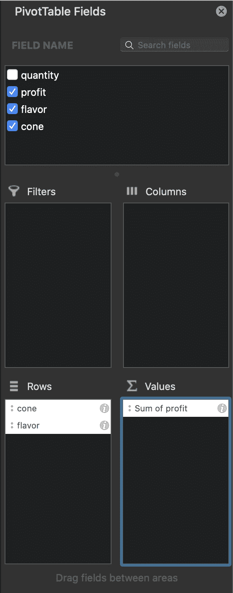

# 数据科学，认识数据透视表

> 原文：<https://towardsdatascience.com/data-science-meet-pivot-tables-a55db867225c?source=collection_archive---------65----------------------->

图片来自 Pixabay。

## 试用 Excel 最强大的数据分析工具之一

# 介绍

所有数据科学家都认识到拥有一个组织有序、干净整洁、随时可以分析的数据集的重要性。在 Python 和 Pandas 中，或者在 R 和 TidyR 中，数据可以被排序到可访问的行和列中，但是排序数据、过滤特定值和设置特定块以供查看的过程可能会很繁琐，并且会产生错误。使用 Excel 中的数据透视表，可以以简单省时的方式组织、过滤和重新过滤数据，并对其进行操作。本教程将介绍如何在 Excel 中创建数据透视表，以及它们提供的简单数据操作能力。

# 创建数据透视表

首先在 Excel 中打开数据集，如果数据集是. csv 文件，将其保存为 Excel 工作簿(。xlsx)。只选择你的数据，点击右上角的“格式为表格”按钮，选择你喜欢的任何配色方案。这应该将你所有的数据着色并组织成一个整洁有序的表格。这里有一个关于假“冰淇淋店”数据的小例子:

现在，是时候创建数据透视表了！单击电子表格上的任意位置，从插入选项卡中，单击“数据透视表”按钮。在“表格/范围”中输入表格的名称，如下所示。您可以通过单击表格并转到出现的“表格”选项卡来找到表格的名称—名称在最左侧。单击确定。

一个带有“数据透视表字段”侧栏的新工作表弹出，但是还没有创建数据透视表。这是有趣的部分！数据透视表允许您按照自己的意愿组织数据，并轻松切换分类。下面是我如何组织数据的一个例子:

流程是选中一个框，将线条向下拖动到四个字段之一，然后根据需要对类别进行排序/操作。在这个例子中，我首先在 Rows 字段中列出 cone，然后是 flavor，所以我的数据是按 cone 类型分组的，然后是该类别中的 flavor(类似于 group-by 函数)。值(或列)是每种口味和甜筒类型的利润总和，我可以通过单击“I”并选择不同的计算方法，将该字段更改为平均利润、最大/最小利润、中间利润等。

真的就这么简单！—通过拖动一些框并将 Sum 改为 Average，我可以快速制作一个完全不同的表格，并真正操作任何东西来满足我的数据分析需求。

相同的数据，新的表格。

# 结论

就是这样！整个过程到此结束——在不到 5 个步骤的时间里，您就有了一个整洁有序的数据表，您可以根据需要轻松地对其进行操作、计算、过滤和组织。图片使用代码创建此数据框:生成平均值、对行内的行进行分组以及查找总计的过程需要冗长的代码，并且需要数据科学家投入过多的时间和精力。Excel 将整个过程压缩到一个数据透视表工具中，使数据分析既简单又省时。我鼓励每个人至少尝试一次用 Excel 进行数据分析！—这些能力真的很简单，但却很强大。