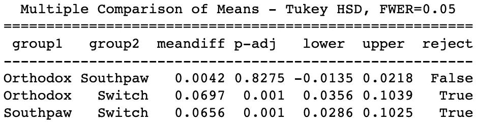

# 数据科学遇上 UFC:一个斗士的姿态真的给了他们优势吗？

> 原文：<https://towardsdatascience.com/data-science-meets-ufc-does-a-fighters-stance-really-give-them-an-advantage-fdc6141f6e29?source=collection_archive---------25----------------------->

## 试图定量回答格斗运动中的一个古老问题。

安德留斯·彼得鲁塞尼亚([https://www.flickr.com/photos/andriux_uk_events/18781656035](https://www.flickr.com/photos/andriux_uk_events/18781656035))授权重新使用的图像

康纳·麦格雷戈对何塞·奥尔多是 UFC 历史上最快的淘汰赛之一，结果爱尔兰人仅用了 13 秒就赢了。它让一个极具天赋的左撇子(麦格雷戈)对阵巴西不败的东正教徒，后者被一些人认为是有史以来最伟大的 MMA 轻量级选手。裁判大个子约翰·麦卡锡宣布比赛时间到后几秒钟，奥尔多向前冲去，挥出一记左勾拳。康纳后退一步，用自己一记完美的左钩拳反击。奥尔多躺在地板上，康纳继续用拳头猛击他，这时裁判宣布比赛结束。

就这么简单。(【https://giphy.com/conormcgregor】T2

那么，康纳的胜利有多少可以归因于他的非正统立场呢？本文采用定量方法回答以下问题:

> "拥有一个非正统的姿势会让一个拳手在拳击场(或八角场)有优势吗？"

如果有读者不熟悉格斗运动中的各种姿势，我会给你留一个谷歌，现在给你一个简短的描述:

*   **正统的**拳手大多**惯用右手**站立时左肩向前，右肩向后。
*   **左撇子**个人通常**左撇子**站立时右肩向前，左肩向后。
*   **转换**拳手可以被认为是**双手灵巧**并且有能力在正统和左撇子姿势之间无缝转换。
*   存在一些其他的姿态，但它们非常罕见，这将在后面的分析中看到。

人们常说，非正统的战士有优势；这通常被认为是因为他们人数较少，这意味着当他们最终面对一个非正统的对手时，一个战士不太能够预测他们的非正统对手的行动。据信，在网球、板球和棒球等其他运动中也存在同样的优势。为了给出一些数字背景，德国奥尔登堡大学的 Florian Loffing 博士在 2009 年至 2014 年间进行了一项研究，他收集了羽毛球、壁球、网球、乒乓球、板球和棒球前 100 名球员的名字和惯用手。他的发现是，在男子棒球比赛中，30%的人是左撇子，而在女子网球比赛中，这个数字是 19%。这些数字远远高于总人口，男性和女性分别约为 10.3%和 7.7%。

这种优势实际上存在于 MMA 领域还是只是一种普遍的误解？如果它确实存在，仅仅是因为战士们对非正统的对手准备不足，还是有比看起来更多的原因？

在接下来的部分中，我将带您了解我解决这些问题的方法，从数据收集、清理和特征工程，到分析，最后是我对结果的解释。

如果您想了解代码，请访问以下链接中的 GitHub 库:

> [https://github.com/ravimalde/ufc_fighter_stance](https://github.com/ravimalde/ufc_fighter_stance)

# 数据收集—网络搜集

在对正统派和非正统派战士进行任何比较之前，我需要掌握一些数据。方便的是，UFC 维护着一个网站，上面有该组织中每个战士的详细资料。这以表格的形式呈现，如下所示。

【http://ufcstats.com/statistics/events/completed?page=all 号

至关重要的是，这张表中包含的信息是关于战士的立场，以及他们的胜利，失败和平局。由此有可能衡量每个拳手的成功，并确定两种姿势之间是否有显著差异。

我使用了 BeautifulSoup 和 requests 库来抓取，因为这为解析 HTML 提供了一个简单的框架。从上面的图片中可以看出，字母表中的每个字母都有一个网页，如果我要获得每个战士的信息，所有这些都需要被抓取。“A”、“B”和“C”页面的 URL 如下:

【http://www.ufcstats.com/statistics/fighters?char=a】T4&page = all

“char= **a** & page”中的“a”变为“b”…

[http://www.ufcstats.com/statistics/fighters?char=b&page = all](http://www.ufcstats.com/statistics/fighters?char=b&page=all)

然后' char= **b** & page '中的' b '变成了' c'…

【http://www.ufcstats.com/statistics/fighters?char=c】T4&page = all

对字母表中的每个字母如此类推。

下面的代码片段展示了如何在一个遍历字母表的 for 循环中完成网页抓取，每次更新 url 以遍历每个页面。

要了解数据是如何被组织成 pandas 数据帧的，请查看本节之前链接的 GitHub 知识库。为了简洁起见，这里不概述这个过程。下图显示了创建的数据帧的前 5 行。

# 数据争论—清理和功能工程

刮擦是成功的。我现在有了 UFC 组织中每个战士的信息，甚至更好的是，这些数据是由组织本身提供的，因此这些数据必定是高质量的，并且可以随时进行分析。

不完全是。

从上面的数据图可以看出，很多信息都丢失了。对于一些战士来说，诸如身高、臂展和站姿等细节是缺失的，尽管这些是最基本的数据。由于分析的重点是姿态，所有在姿态栏中没有输入的战斗机都被忽略了。不幸的是，这将数据集中包含的战士数量从 3405 减少到 2571。哎哟！

然后是一些特征工程，这意味着将原始特征(胜、负、平)转换成对分析更有用的新特征。我需要创建一个标准化的标准来衡量每个战士的成功率。我想到了两种方法:

1.  赢:输比率(总赢数/总输数)
2.  胜利:总战斗比率(总胜利数/总战斗数)

赢:输比率的问题是，如果一个战士是不败的，这个比率将是无限的，因为将有一个除以 0。因此，胜率:总战斗率是我选择的衡量标准。然而，新的战斗机也给这种方法带来了问题。如果 UFC 家族的新成员在第一次战斗后有 100%的胜率，这将会扭曲结果并降低分析的质量。我只想要在分析中充分证明自己的拳手，所以我删除了所有少于 5 场比赛的个人。这将数据帧中的行数从 2571 减少到 2421。

其余数据集的细分如下:

*   正统——1886 年战士
*   左撇子——430 战斗机
*   Switch — 98 战斗机
*   开放姿态— 6 架战斗机
*   侧身— 1 战斗机

到目前为止，数据清理已经间接移除了除了一个侧身格斗者之外的所有人和几乎所有的开放式格斗者。由于这两个类别的样本量很小，我从分析中去除了这些物质。

# 统计分析—是时候回答问题了！

这些数据经过了反复推敲和争论，现在已经准备好进行可视化了。乍一看，正统拳手和左撇子拳手的胜率分布非常相似。这令人惊讶，因为左撇子通常被认为是一种优势。看起来转换拳手比正统拳手和左撇子拳手都更成功。这并不令人惊讶。

作为一名数据科学家，我不能接受我对箱线图的解释是事实，这可能只是因为对换战士赢的次数更多。为了确定是否存在统计学上的显著差异，需要进行单向 ANOVA(方差分析)测试。要使单向方差分析成为该数据集的有效分析方法，必须满足两个假设:

1.  残差的分布(每个数据点与其组的平均值之间的差)必须是正态的。
2.  这些组必须是同方差的。

为了检查残差的分布，我使用 statsmodels 库创建了一个 Q-Q 图。这将绘制理论分位数(正态分布)与样本分位数的关系图。该图是相当线性的，这意味着分布接近正常。单向 ANOVA 检验足够稳健，可以处理轻微违反正态条件的情况，因此我认为第一个假设得到了满足。

为了测试同质性，我使用了 scipy 库中的 Levene 测试。这返回了大于我设置的阈值 0.05 的 P 值，意味着这些组是同异方差的，并且满足 ANOVA 的第二个条件。

方差分析检验的两个假设如下:

*   H0(零)——正统拳手、左撇子拳手和转换拳手的胜率没有区别。
*   哈(另类)——正统、左撇子和转换拳手的胜率是有区别的。

我再次使用 statsmodels 库进行方差分析。它返回的 P 值低于预定的阈值 0.05，即使考虑 Bonferroni 校正以减少假阳性的机会。这意味着我应该拒绝零假设，并且在姿态的胜率之间确实有显著的差异。然而，ANOVA 测试并没有告诉我们哪些组之间存在差异。

为了找出哪些姿势的表现彼此不同，我进行了 Tukey 的 HSD 测试，也是来自 statsmodels 库。下表显示，对于正统转换比较和左撇子转换比较，应该拒绝零假设。对于正统-左撇子的比较，应该接受零假设；也就是说，正统拳手和左撇子拳手的胜率没有显著差异。

接下来，使用 Cohen 的 d 公式计算显著成对比较的效应大小。这产生了以下结果:

*   正统转换:d = 0.46
*   左撇子开关:d = 0.45

小于 0.2 的效果大小被认为是小的，大于 0.8 的值被认为是大的。效应大小越大，变量之间的关联越强；这意味着大约 0.5 的影响大小表明，当考虑到转换与正统和左撇子时，拳手的姿势和胜利:总战斗比率之间有相当强的关系。

每种姿态平均胜率如下:

*   东正教:0.70
*   左撇子:0.70
*   开关:0.76

# 结果的解释

Loffing 博士对左撇子运动员的研究发现，在时间压力较大的运动中，左撇子的代表性更强。他发现棒球、板球和乒乓球是节奏最快的运动，而且这些运动中左撇子运动员的数量也最多。阿伯泰大学的斯科特·哈迪博士提出，这“可能是由于左撇子能够处理快节奏信息的方式”，从而导致更快的反应时间。

答案可能在于左撇子和右撇子的认知差异吗？[https://unsplash.com/photos/3KGF9R_0oHs](https://unsplash.com/photos/3KGF9R_0oHs)

《神经心理学杂志》2006 年发表的一项奥地利研究发现，左撇子的半球间 times⁴(大脑左右半球之间的交流)明显更快。因此，科学发现表明，左撇子运动员可能有一些认知优势，但这尚未证明是职业体育运动中左撇子过多的主要原因。

从数据集中有姿势信息的拳手中，我发现 22%是左撇子。这是一般人群中左撇子代表的两倍多！这是因为他们的反应时间更快吗？有可能，但如果是这样的话，我们也希望看到他们比正统战士有更高的胜率，但我们没有。正如本文开头所提到的，另一个可能的原因是，在较低水平的竞争中，战士较少接触非正统的对手，因此给了非正统的个人一个优势，从而在精英水平上有更高的代表性。然而，一旦达到这种精英水平，他们的成功并不比其他姿态高，因为战士们在训练营中不懈地准备对抗与他们战斗之夜对手风格相似的陪练。这可能会消除左撇子的任何意外优势。

那么为什么转换战士比其他姿势有更高的胜率呢？原因可能正如人们所料:

*   第一个是，换装战士的箭筒里可能有更多的箭。他们能够从更多的角度进攻和防守，当他们在比赛中途改变立场时，可以打乱对手的比赛计划。
*   第二个原因是，当准备一个转换对手时，一个拳击手必须花时间准备一个正统的对手和一个左撇子对手，这导致对两种风格的准备不足。

抱歉，康纳，左撇子拳手在八角形拳台上不太成功。([https://giphy.com/conormcgregor](https://giphy.com/conormcgregor)

# 改进和未来项目

正如你可能已经注意到的，switch 战斗机的样本量对于这次分析来说是非常小的。对于任何统计分析，更大的样本量总是首选的，因为它减少了机会在你的任何发现中所起的作用。如果有人对自己进行类似的分析感兴趣，我建议扩大你的数据来源，包括其他 MMA 组织，如 Bellator 和 One Championship。事实上，分析的范围可以扩大到包括其他战斗运动，如拳击和泰拳，因为同样的原则适用于战士的立场。

展望未来，我的个人目标是创建一个 UFC 战斗预测器。这将允许用户输入来自该组织的任何两名战士，并使用机器学习算法输出每个战士获胜的百分比机会。如果你对此感兴趣，请在接下来的几个月继续关注。目前，感谢您的阅读！

# 引文

[1]Florian loff ing 博士，精英互动球类运动中的左撇子和时间压力(2017)

 [## 精英互动球类运动中的左撇子和时间压力

### 频率依赖性选择可以确保动物和非动物物种中多态性的维持[ 1，2]。在…

royalsocietypublishing.org](https://royalsocietypublishing.org/doi/10.1098/rsbl.2017.0446) 

[2] UFC 战斗机统计

 [## 统计| UFC

### 编辑描述

www.ufcstats.com](http://www.ufcstats.com/statistics/fighters?char=a&page=all) 

[3]《卫报》:斯科特·哈迪博士

 [## 为什么左撇子擅长某些精英运动而不擅长其他运动？

### 从板球运动员瓦西姆·阿克兰到棒球投手克莱顿·克肖和乒乓球明星丁宁，体育界…

www.theguardian.com](https://www.theguardian.com/science/2017/nov/22/why-do-left-handers-excel-at-certain-elite-sports-but-not-others) 

[4] Cherbuin N，Brinkman C,“左撇子个体的大脑半球相互作用是不同的”( 2006)

 [## 左撇子的大脑半球互动是不同的。

### 神经心理学。2006 年 11 月；20(6):700-7.

www.ncbi.nlm.nih.gov](https://www.ncbi.nlm.nih.gov/pubmed/17100514)