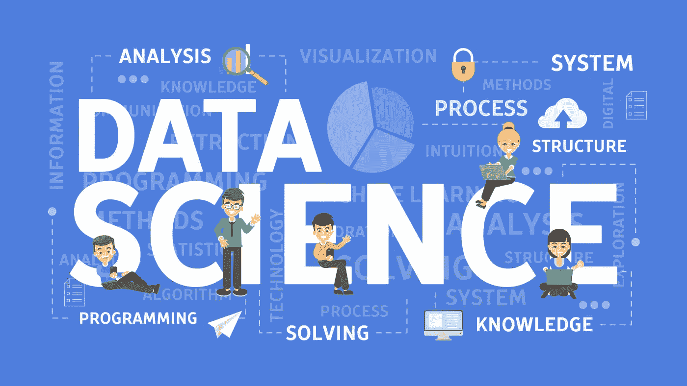
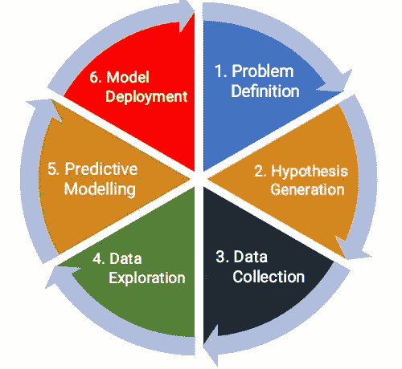
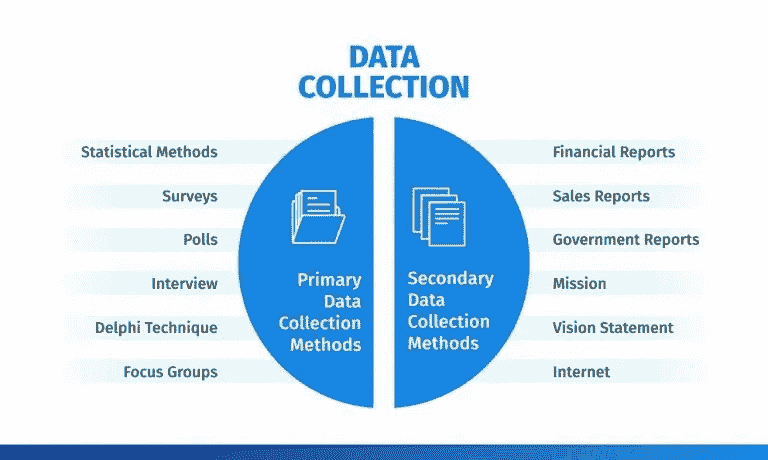
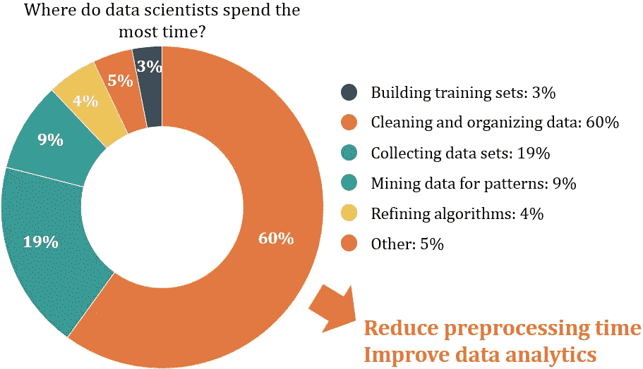
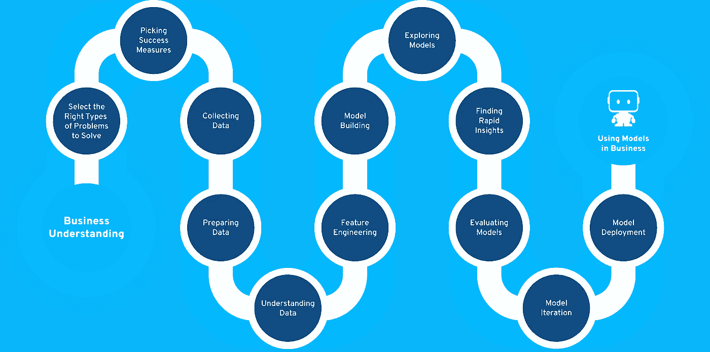

# 数据科学模型构建生命周期

> 原文：<https://towardsdatascience.com/data-science-model-building-lifecycle-78d7564d80d7?source=collection_archive---------47----------------------->

图 1:通过[syzygyedu.com](http://syzygyedu.com/introduction-to-the-world-of-data-science/)拍摄的照片

# 介绍

当我们遇到一个商业分析问题时，不承认绊脚石，我们继续执行。在意识到不幸之前，我们试图实现和预测结果。

> **但是这些结果揭示了解决问题的策略吗？**

答案是**否**。我们无法提出一个对业务理解没有任何意义的解决方案。为了提高产品质量，创造市场战略，建立品牌认知，提升客户满意度，我们必须消除复杂性。

在本文结束时，您将了解数据科学建模生命周期中涉及的解决问题的步骤。此外，您可以预测更有意义的解决方案，帮助组织提高生产力。

# 目录

1.  问题定义
2.  假设生成
3.  数据收集
4.  数据探索/转换
5.  预测建模
6.  模型部署
7.  关键要点

让我们深入了解每个模型构建步骤，

> 数据科学是从海量数据中提取有意义见解的过程。数据驱动的科学由统计数据、预定义的科学功能、分析方法和可视化技术组成，以传递信息。

图 2:通过[datasciencecentral.com](https://www.datasciencecentral.com/profiles/blogs/the-lifecycle-of-data)拍摄的照片

数据科学模型构建生命周期包括一些需要遵循的重要步骤。如果您对开发数据科学模型感到焦虑，那么只需坚持以下步骤。

# 1.问题定义

图 3:照片通过[freepik.com](https://www.freepik.com/free-photos-vectors/problem)

构建模型的第一步是更全面地理解工业问题。在商业中，直到客户在使用服务时遇到任何困难，问题才会发生。

为了确定问题的目的和预测目标，我们必须适当地定义项目目标。因此，为了进行分析，我们必须首先认识到障碍。记住，优秀的结果总是取决于对问题的更好理解。

# 2.假设生成

图 4:通过[campuscareerclub.com](https://www.campuscareerclub.com/steps-in-formulation-of-hypothesis/)拍摄的照片

假设生成是一种猜测方法，通过这种方法我们可以得到一些与预测目标有显著相关性的基本数据参数。在收集数据之前，我们找出影响目标变量的重要特征。

你的假设研究必须深入，考虑所有利益相关者的每一个观点。我们寻找能够影响结果的每一个合适的因素。假设生成侧重于您可以创建的内容，而不是数据集中可用的内容。

我们举一个贷款审批预测的例子。我们必须获得一些关键的数据特征，这些特征将决定是否批准申请人的贷款请求。这里我们介绍一些特性:

*   收入:如果申请人收入较高，应该很容易获得贷款。
*   **教育:**教育程度越高，收入越高，因此我们可以批准贷款请求。
*   **贷款额度:**额度越小，贷款获批几率越高。
*   **工作类型:**永久或临时
*   **以前的历史:**如果申请人尚未偿还其最后一笔贷款金额，则不能批准额外的贷款请求。
*   **房产面积:**寻找申请人的私有房产面积(城市/农村)。
*   **EMI:**EMI 支付越少，贷款获批的可能性越高。

如您所见，我们已经构建了一些可能影响贷款批准请求的因素。记住，模型的智能将直接取决于你研究的质量。

# 3.数据收集

图 5:通过[mafrome.org](https://mafrome.org/150th-jubilee-data-collection/)拍摄的照片

如果您已经很好地生成了一个假设，那么您就知道要从各个来源收集哪些数据。数据收集是从与分析问题相关的来源收集数据，然后我们从数据中提取有意义的见解进行预测。

收集的数据必须:

*   回答假设问题的熟练程度。
*   详细阐述每个数据参数的能力。
*   有效性来证明你的研究。
*   准确预测结果的能力。

图 6:照片通过[questionpro.com](https://www.questionpro.com/blog/data-collection-methods/)

为了做出有效的决策，我们从已有的资源中收集数据。在上图中，我们列出了您可以从中收集数据的所有主要和辅助数据收集方法。在无数个瞬间收集关于产品需求、服务、当前趋势和客户反馈的数据。

# 4.数据探索/转换

图 7:照片通过[analyticsindiamag.com](https://analyticsindiamag.com/10-best-data-cleaning-tools-get-data/)

您收集的数据可能是不熟悉的形状和大小。它可能包含不必要的特性、空值、意外的小值或巨大的值。因此，在将任何算法模型应用于数据之前，我们必须首先探索它。

通过检查数据，我们可以了解数据中明显的和隐藏的趋势。我们找到了数据特征和目标变量之间的关系。你可能听说过一些技术:“探索性数据分析和特征工程”，属于数据探索。

通常，数据科学家投入 60–70%的项目时间来处理数据探索。

数据探索涉及几个子步骤:

## 特征识别:

*   您需要分析哪些数据功能可用，哪些不可用。
*   识别独立变量和目标变量。
*   确定这些变量的数据类型和类别。

## 单变量分析:

我们逐一检查每个变量。这种分析取决于变量类型是否是分类的和连续的。

*   连续变量:我们主要寻找数据集中的统计趋势，如均值、中值、标准差、偏斜度等。
*   分类变量:我们使用频率表来了解每个类别的数据分布。我们可以应用 **value_counts()** 或**values _ counts(normalize = True)**函数测量值的出现次数和频率。

## 多变量分析:

双变量分析有助于发现两个或多个变量之间的关系。我们可以找到相关性**热图**在连续变量和分类变量的情况下，我们寻找它们之间的关联和分离。

## 填充空值:

通常，数据集包含空值，这会降低模型的潜力。对于连续变量，我们使用特定列的平均值或模式来填充这些空值。对于出现在分类列中的空值，我们用最频繁出现的分类值替换它们。请记住，不要删除这些行，因为您可能会丢失信息。

## 特征工程:

我们从现有的过滤数据中设计更有意义的输入数据，以加强机器学习模型。在这里，我们结合了两个数据特征，将分类参数转换为连续参数，缩小了连续变量的范围，等等。有一些有意义的特征工程技术，例如，

*   **宁滨**
*   **对数变换**
*   **一键编码**
*   **缩放**
*   **分组**
*   **异常值处理**
*   **特征分割**

阅读[这里的](/feature-engineering-for-machine-learning-3a5e293a5114)了解更多关于特征工程技术的信息。

# 5.预测建模

图 8:通过[disrubtionhub.com](https://disruptionhub.com/glance-predictive-modelling/)的照片

预测建模是一种基于输入测试数据创建统计模型来预测未来行为的数学方法。

预测建模涉及的步骤:

## 算法选择:

当我们有了结构化数据集，并且我们想要估计连续的或分类的结果时，我们使用监督机器学习方法，如回归和分类技术。当我们有非结构化数据，并希望预测某个特定输入测试样本所属的项目群时，我们使用无监督算法。一个真正的数据科学家应用多种算法来获得更准确的模型。

## 列车型号:

在分配算法并方便地获得数据后，我们使用应用首选算法的输入数据来训练我们的模型。这是确定独立变量和预测目标之间的对应关系的动作。

## 模型预测:

我们通过向训练好的模型提供输入测试数据来进行预测。我们通过使用交叉验证策略或 ROC 曲线来测量准确性，ROC 曲线可以很好地导出测试数据的模型输出。

# 6.模型部署

图 9:qrvey.com 通过[的照片](https://qrvey.com/blog/qrveys-unique-cloud-deployment-model/)

没有什么比在实时环境中部署模型更好的了。它有助于我们获得对决策过程的分析见解。为了让客户满意，您需要不断地用额外的特性更新模型。

为了预测商业决策、规划市场战略和创造个性化的客户兴趣，我们将机器学习模型集成到现有的生产领域中。

当你浏览亚马逊网站，注意到产品推荐完全基于你的好奇心。和亚马逊一样，网飞根据你的观看历史和几个兴趣给你电影的建议。您可以体验到利用这些服务的客户参与度的提高。这就是部署的模型如何改变客户的心态，并说服他购买产品。

# 7.关键要点

图 10:digitalag.osu.edu 通过[拍摄的照片](https://digitalag.osu.edu/ag-sensing/research-projects)

通过阅读文章，我们总结出以下几点:

*   理解商业分析问题的目的。
*   在查看数据之前，先提出假设。
*   从众所周知的资源中收集可靠数据。
*   将大部分时间投入到数据探索中，从数据中提取有意义的见解。
*   选择签名算法来训练模型，并使用测试数据进行评估。
*   将模型部署到生产环境中，以便用户可以使用它，并制定策略以有效地做出业务决策。

# 最终路线图

图 11:通过[datarobot.com](https://www.datarobot.com/wiki/citizen-data-scientist/)的照片

所有人都在这里，

在我的下一篇文章中再见。

> **你好👋我希望你能从我的文章中获得知识。如果你愿意支持我，请随意给我买些咖啡🙏☕**
> 
> 【https://www.buymeacoffee.com/amey23】T5[T6](https://www.buymeacoffee.com/amey23)
> 
> **或通过 ameypband23@gmail.com 联系我**
> 
> **乐意为您效劳。**