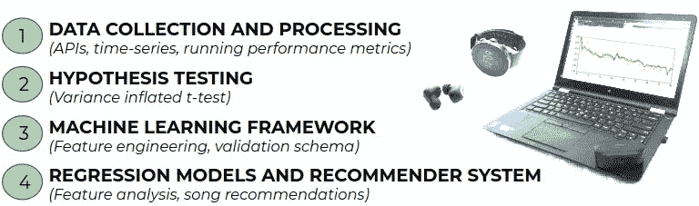
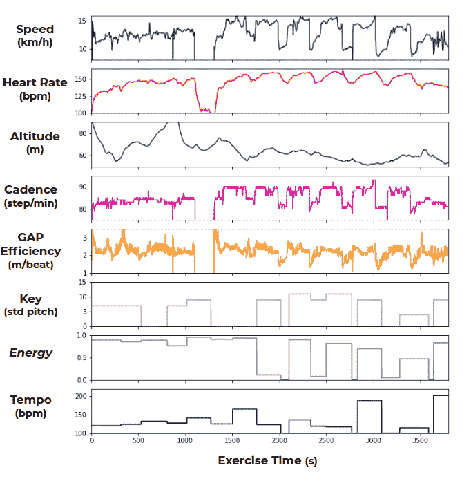
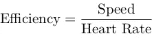
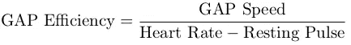
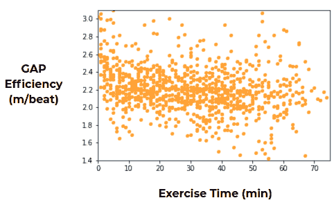
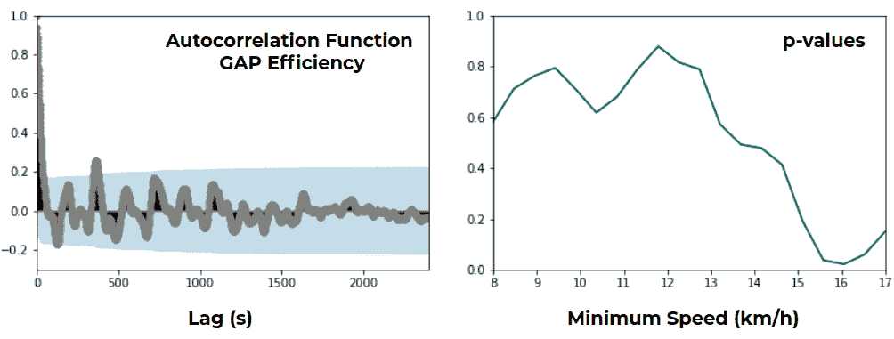

# 数据科学、音乐和体育。第 1 部分:数据收集-假设检验

> 原文：<https://towardsdatascience.com/data-science-music-and-sports-part-1-data-collection-hypothesis-testing-2f2b85406726?source=collection_archive---------60----------------------->

## 一项评估音乐对跑步的影响的实验，并开发一个推荐系统来提高成绩

*照片由* [*作者*](https://www.linkedin.com/in/jgonzalez-fraile/)

***可穿戴设备和移动设备被广泛用于记录和提供与健康和身体表现相关的许多活动的实时信息。在下面的文章中，我们描述了我们为评估音乐对跑步的影响所做的实验。通过同步时间序列的统计分析和机器学习，我们开发了一个个性化的歌曲推荐系统，可以提高您的运行性能。***

***在第 1 部分(你在这里)中，我们介绍了实验设置、数据收集和处理，以及音乐对跑步影响的初步评估。***

*在* [*第二部分*](/data-science-music-and-sports-part-2-regressions-recommender-system-75ea9dd4d803) *中，我们介绍了特征工程、验证模式、回归模型以及推荐系统的构建。*

你有没有想过锻炼时听的音乐对你的表现有什么可测量的影响？试图找到这个问题的答案是一个很好的动机，通过几周的禁闭和未来不确定和主要是单独训练课程的前景来锻炼。在这些博客文章中，我们描述了一个案例研究，目标是开发一个音乐推荐系统来提高运动成绩。我们结合使用流行的流媒体应用程序对音乐记录的分析，以及通过知名运动手表品牌在跑步锻炼中记录的身体数据。我们关注完整解决方案工作流程背后的**数据科学**构建模块，而不是编码。然而，我们指出了一些有助于在 Python 环境中重现工作流的库和函数。嗯，只有在你锻炼了几个星期的跑步能力之后；).

**我们在这里介绍的数据科学原理适用于利用时间序列实现多种目的的解决方案:**监控健康状态；提高驾驶安全；在敏感活动中提高注意力；提高工作绩效；或者只是为了获得你最喜欢的运动训练。它们适用于供应链需求、销售预测、贸易或医疗和药物测试等领域的解决方案，更不用说现实世界的应用了。

# **实验设置**

为了实验，我们记录了几周的跑步锻炼数据。此处引用的图和数字基于单个转轮( **N=1 统计分析**)；我们对第二个流道进行了类似的设置，以进一步验证该过程。

随着智能设备的运行，我们已经在处理任何数据科学项目中最具挑战性的部分之一:**数据记录。**这项研究包括 52 份不同的锻炼记录。来自运动手表的数据包含 **GPS、加速度计和心率传感器**数据(光学手腕传感器)。同时，我们收集并同步在练习期间流传送的**音乐的数据(如果有的话)。我们还从离训练地点最近的气象站收集**气象数据**。这导致时间序列**的**组合具有一秒的采样率，除了天气数据，其在跑步锻炼中的变化我们忽略。**

处理完数据后，我们首先尝试一个简化的假设检验**来评估音乐对跑步表现的影响**。其结果表明，多变量分析是必要的。因此，我们训练一组**回归算法，旨在预测跑步锻炼的每个下一个时间间隔**中的跑步表现。他们将预测建立在截至该时间点的所有记录数据的基础上。我们检查增加与锻炼中播放的音乐相关的特征是否提高了算法的预测能力。我们为此研究(调整后的)[决定系数](https://en.wikipedia.org/wiki/Coefficient_of_determination)，因为该系数说明了响应变量(运行性能)和预测器特征之间的依赖强度。通过研究音乐特征是否提高了系数，我们可以评估音乐对跑步的实际影响。我们利用回归器，构建一个解决方案，由**选择在每次跑步练习中最大化性能的歌曲，推荐给**进行流式播放。

*图片由* [*作者*](https://www.linkedin.com/in/jgonzalez-fraile/)

在这个过程中有很多需要注意的地方，我们会在整篇文章中讨论。其中最具限制性的是实验参与者的样本。只有两名跑步者参加了这项活动，所以这里的结果说明了音乐对他们跑步表现的影响。此外，一个可推广的实验设计应该以跑步练习的重复为目标，将所有条件的变化最小化，除了正在播放的音乐的变化。也就是说，在一天中的同一时间，在相同的天气条件下，在相同的预赛疲劳程度下，在相同的跑道上进行固定距离和高度的锻炼，并进行相同类型的测试。为一个人保持这样一个单调的设置和几千分钟的跑步时间会挫败我们尝试自己的动力。相反，我们决定按照不同的跑步计划进行训练。虽然这在评估音乐对表现的影响时会有影响，但是概括这个实验并不在最初研究的范围之内。我们仍然希望管道，工作流程和讨论的想法，将激发未来的通用方法。

# **数据收集:带有极坐标的运动数据**

## **极地访问链接 API**

对于每一次跑步练习，我们都使用 Polar 设备(Polar Vantage M)来记录跑步的物理变量。类似的实验也可以用其他设备进行，例如 Garmin 或 Suunto 的设备。对于每次锻炼，运动手表会以每秒的采样率记录 GPS 轨迹、心率和跑步节奏。将设备与 Polar flow 应用程序同步后，记录的数据可供用户使用。

对于自动数据收集，我们使用官方的 [Polar Accesslink API](https://www.polar.com/accesslink-api/?python#polar-accesslink-api) 。对于几个开发的函数，我们利用了 API 周围的公共 [python 包装器](https://pypi.org/project/polar-accesslink/)。API 在事务模式下工作以获取记录的数据，仔细研究数据可用性的含义和检索练习的最佳实践。为了获取任何用户数据(包括锻炼记录)，每个用户必须在数据收集之前接受开发的应用程序的相关访问权限。只有这样，新的应用程序才能访问新的练习。

*一次跑步锻炼的时间序列。我们显示了用 Polar Accesslink API 收集的速度、心率、高度和节奏；导出的间隙效率；以及通过 Spotify API 收集的在锻炼过程中流动的歌曲的基调、能量和节奏。*

如上图中的练习所示，使用 API，我们从几个 Polar 设备传感器中恢复数据。对于这个实验，我们没有使用原始的 GPX 轨迹文件，而是消耗了 API 直接提供的**速度**，以及**心恨、海拔**和**跑步节奏**。每次锻炼的平均持续时间(距离)为 56 分钟(11 公里)，总记录为 **2200 分钟**(给定装置采样率 **131974 秒**)。我们决定遵循一个不同的训练计划，而不是重复完全相同的练习。锻炼包括基础跑、渐进跑、速度跑、爬坡跑和法特莱克跑(如图中的锻炼情况)。课程的结构通常是相似的:大约 25 分钟的热身，主要的运动，最后是短暂的恢复跑。这三个阶段可以在上图中观察到。

事实上，我们没有以可控的方式测试运行性能，这增加了实验的复杂性。我们如何定义和衡量跑步表现？在跑步训练中，我们的目标不是在特定的跑道上跑得尽可能快。这意味着，我们不能仅仅用完成一条赛道所需的时间来衡量成绩。相反，**我们需要定义一个对所有不同的法特莱克跑、基础跑、渐进跑、速度跑和坡道跑都有效的跑步表现指标。**

## **差距效率:一个运行绩效指标**

为了定义跑步表现指标，我们研究了心率和跑步速度。正如可以在文献中找到的那样(看一下这里的[和其中的参考文献)，这两个变量之间的关系可以与锻炼的改善相关。这个想法是，在高强度跑步期间，如果我们设法保持恒定的速度，心率往往会随着时间的推移而增加。相反，如果我们以恒定的心率跑步，速度会随着时间而降低。此外，在耐力训练后，稳态亚极量运动期间的心率随时间而降低。因此，我们可以假设**心率和速度之间的关系是评估跑步表现**和长期训练效果的代理。我们从一个简单的指标定义开始，我们称之为运行效率:](https://www.researchgate.net/publication/8101146_Heart_Rate_Running_Speed_Relationships_During_Exhaustive_Bouts_in_the_Laboratory)

有了合适的单位，效率就是我们每次心跳前进的距离。请注意，当观察两个不同的跑步者时，比较他们以这种方式定义的效率可能对评估谁是更好的跑步者没有用处。然而，这里我们总是比较跑步者在某个时间的效率和其他时间的效率。这样，效率的显著提高可能与性能的提高有关。

到目前为止，这个定义忽略了一个重要的变量:仰角增益。为了包括它的影响，我们使用了一个**等级调整步速** (GAP)模型。这些模型的想法是找到一个跑步者用同样的努力可以达到的等效速度，但是是在平地上跑，而不是在实际的坡度上。至于具体的差距模型，我们基于斯特拉发[这里](https://medium.com/strava-engineering/an-improved-gap-model-8b07ae8886c3)展示的模型。给定当前和先前时间戳的高度和距离，我们计算梯度。梯度通过查看间隙模型曲线来设置步速调整；一旦乘以速度，我们就得到间隙速度。这确实是我们用于最终定义的量。在一些经验观察之后，我们还决定使用跑步者的**心率相对于静息脉搏**的差异:

如上图所示，我们展示了之前相同法特莱克练习的差距效率分布。我们注意到，我们用于实验的运动手表设备没有气压计。高度是基于 GPS 信号测量的，这是不确定性的来源。为了处理这一点，**我们训练了一个简单的基于**[***k-means***](https://en.wikipedia.org/wiki/K-means_clustering)***聚类方法****的异常检测算法。我们通过观察速度、心率和海拔来决定海拔测量是否有效，或者是否是不精确的测量。如果不被接受，间隙校正被设置为 1，因此间隙速度只是原始速度。此外，我们将最大修正值设置为 17%的梯度，因为这是我们根据已知的赛道地图计算出的最大梯度。在任何情况下，大多数练习都是平的，以避免不正确的海拔读数或不适合在山上跑步而导致的偏差。*

**

**作为练习开始后时间的函数的差距效率。散点图包括所有记录的练习。以 1 分钟的间隔对值进行采样，这些点描述了该分钟内的平均间隙效率。**

*在上图中，我们展示了一名参与者所有锻炼的差距效率与锻炼时间的散点图。对于该图，我们采用一分钟内的平均间隙效率对间隙效率进行重新采样。我们减少了没有足够运动的时间，这对应于热身后拉伸的阶段。在组合所有不同的记录练习之后，不再有明显的练习结构。与上图中的 fartlek 相反，其相位在间隙效率图中仍然有些可见。散点图中显示的是差距效率随练习时间而降低的**趋势:请注意绘制点上的负趋势。鉴于差距效率的定义和上述发现，这是预料之中的。纵轴上的变化是训练类型、天气条件、预赛疲劳以及我们将要评估的音乐流的结果。这些变化也是由于持续的耐力训练。经过几周的实验，我们的差距效率有上升的趋势。***

*我们注意到，锻炼的平均间隙效率与 Polar 提供的 [*跑步指数*](https://support.polar.com/en/support/tips/Running_Index_feature) 之间存在明显的相关性。在陡坡跑步中出现了一些差异，因为跑步指数似乎低估了与间隙效率相关的努力(反之亦然)。然而，所有练习的总体趋势是一样的。*

## ***极坐标数据技术细节***

*除了***polar-access link***包装器之外，练习数据的处理可以用 ***Pandas、*** 来完成，包括时间序列的常用函数(如 *shift* 和 *rolling* )，加上 ***datetime*** 模块中的一些函数，以及您首选的 *k-means 的实现(例如从**

**来自极性传感器的异常读数的处理可能具有挑战性。其中一些读数是运动手表有限的精确度所固有的，比如我们已经讨论过的高度测量。速度和心率测量通常是稳定的，问题较少。请注意，在锻炼时暂停手表会阻止与音乐流媒体应用程序记录的数据进行任何准确的同步。我们**避免暂停设备**上的锻炼记录，而是使用了分段选项。因此，在一些锻炼阶段需要特殊处理:刚开始后，拉伸时，在红绿灯处停下来等。为我们在[第二部分](/data-science-music-and-sports-part-2-regressions-recommender-system-75ea9dd4d803)中描述的回归模型找到并纠正这些需要一点想象力，再加上一些更反常的检测。不过不要太复杂。**

# ****数据收集:Spotify 的音乐数据****

## ****Spotify 和 Spotipy****

**对于音乐唱片，我们使用 **Spotify** 应用程序。请注意，一小部分练习是在没有任何音乐的情况下完成的，以便与*无声*练习进行比较。使用官方的 [Spotify API](https://developer.spotify.com/documentation/web-api/reference-beta/) 自动检索跑步时播放的音乐。对于一些函数，我们使用一个公开可用的 Python 包装器， [Spotipy](https://spotipy.readthedocs.io/en/2.13.0/) 。从 API 中检索任何数据都必须遵循一个授权模式。特别是，由于我们感兴趣的不仅仅是音乐特性，还有特定用户播放的歌曲，这些必须事先提供适当的许可。**

**为了获得一个练习的音乐特征，我们检索相应用户最近播放的歌曲。请注意，由于配额相当有限，最好在每次练习后自动获取歌曲。一旦我们播放了歌曲(以及它们的时间戳)，我们需要获得一些**歌曲特征**。这些是一些**量化的**描述符来描述歌曲，这样我们就可以估计它们对跑步表现的影响。为此，任何音乐爱好者都会觉得 Spotify API 很吸引人，因为它提供了大量的音乐信息。音乐分析确实是一个充满活力的领域，有着广阔的发展前景，例如最近使用深度学习的音乐一代的发展。然而，对歌曲的深入分析超出了这个实验的最初重点。相反，我们直接使用 Spotify API 计算和提供的音乐功能列表。在这里看看他们的定义[。](https://developer.spotify.com/documentation/web-api/reference/tracks/get-audio-features/)**

## ****歌曲特色****

**歌曲特征包括基本描述符，如歌曲的 ***持续时间*** (需要同步 Polar 和 Spotify 记录)、速度*、使用数字符号的估计总体*(标准音高类别)、模态*、拍号 ***、*** 录音 ***响度***像****能量****这样的东西被定义为一种*强度和活动的知觉尺度；***和**，*与歌曲上人声的存在有关；一个与检测一张唱片上的受众有关的特征，**；*****声学****；*还有节奏的其他方面的特征，如歌曲的*或***。****************

**对这些特征的计算缺乏控制似乎是一种限制。然而，它们可以通过 API 直接获得，并且它们被链接到直观的定义，这对于我们最初的解决方案的范围来说是足够的。我们把对另类音乐特性的深入探索留给了未来。在上图的底部，我们描绘了在法特莱克练习中播放的歌曲的基调、*能量*和节奏。这些是类似阶跃的时间序列，因为不考虑歌曲内的变化。我们让 Spotify 根据几个不同性质的播放列表播放歌曲。我们主动选择播放不同的音乐来丰富实验。**

## ****Spotify 数据技术细节****

**除了使用 Spotify API，你可能还需要 ***熊猫*** 。需要特别注意将音乐数据与运动手表记录同步。**

# ****自相关时间序列的假设检验****

**一旦数据收集过程就绪，我们将继续研究在播放音乐的练习和没有播放音乐的练习之间，测量的间隙效率值是否存在差异。对于两种类型的练习，间隙效率的分布显示出相似的形状。然而，有音乐的练习的平均间隙效率比其他练习的稍大。为了评估这种差异的统计意义，我们进行了假设检验。我们首先要处理的事实是，间隙效率表现出相当大的自相关性。这种情况在 45 秒左右的滞后时尤为明显。它们是基于心率定义的间隙效率的结果，心率是对跑步努力的反应。**

****

***左图:上述 fartlek 练习的差距效率自相关函数。右图:学生 t 检验的 p 值，用方差膨胀系数进行了调整，这些值是针对可变的最低要求速度(km/h)显示的。***

**这在上图的左面可以看到。在那里，我们显示了用于说明的跑步练习的间隙效率自相关函数。自相关减少，并在大约 45 秒的滞后之后不再显著。由于练习的结构，有一些次要的峰值。对于上面的法特莱克，大约 360 秒的滞后有显著的正自相关。以及在大约 120 秒处的第三(几乎)显著的负自相关。这是因为 fartlek 分为 6 个高强度的 4 分钟间隔，然后是 2 分钟的慢速跑步。请注意，当将所有练习放在一起考虑时，不同结构的法特莱克、基础、进度、速度和坡道跑的组合，除了小滞后的初始自相关之外，消除了任何显著的自相关。**

**自相关的存在会影响统计检验的结构。学生的 *t 检验*例如假设测量样本是独立的，但是当存在相当大的自相关时，这就不成立。由此产生的结果是低估了样本方差，因为我们会错误地认为测量值比实际测量值多。当方差出现在检验统计量的分母中时，它会被夸大，导致对零假设的不合理拒绝。简单地说，如果我们不考虑自相关性，通过一个普通学生的 t 检验，我们可以得出结论，音乐练习与其他练习的差距效率有显著差异。为了解决这个问题，我们实现了一个如[这里](https://journals.ametsoc.org/jcli/article/10/1/65/28481/Resampling-Hypothesis-Tests-for-Autocorrelated)所描述的适应性测试。这个想法是为了说明自相关计算**方差膨胀因子**包含在测试统计中。这些校正也被称为时间去相关或调整后的有效样本大小。**

**经过这种调整后，修正 t 检验的结果表明，当包括所有记录的数据点时，有音乐和无音乐锻炼之间的差距效率差异在统计上不显著。然而，这仍然是一个过于简化的测试。这个测试没有考虑实验中所有其他变量的影响。如果我们根据跑步速度来比较音乐对差距效率的影响呢？这就是我们在上图右侧面板中显示的内容。我们将来自*方差膨胀* *t-test、*的 *p 值*描述为最小所需速度的函数，以将数据点包括在测试中。有趣的是，**一旦我们开始关注速度更快的运动阶段， *p 值*就会下降**。这就是，听不听音乐之间的差异变得更加显著。这种情况发生在 16km/h 左右，此时差值接近 95%的置信水平。对于更高的速度，差异开始变小，并且 *p 值*再次增加。**

**一个合理的解释是，当我们考虑所有数据点时，包括缓慢阶段(热身、恢复等)，测试显示音乐对间隙效率没有显著影响。但当我们加速到次最大努力时，音乐流会发挥一些作用，差距效率的差异变得更大。直到我们达到一个速度(和努力)太高，音乐不再发挥作用。这与一些现有的关于音乐对体育运动影响的文献是一致的，检查分离[这里](http://thesportjournal.org/article/music-sport-and-exercise-update-research-and-application/)。虽然解释很有趣，但我们所做的测试仍然**过于简单，无法得出结论**。但它指出，需要对变量进行整体考虑，以评估音乐对跑步表现的影响。这进一步激发了我们在本博客系列的第 2 部分中提出的使用回归变量的**多元分析。****

**变量之间的相关性研究和其他初始描述性分析，揭示了这些差异。但是为了限制这篇文章的篇幅，我们没有在这里明确地展示它们。这些发现反映在博客系列的第二部分中。**

## ****自相关数据技术细节****

**为了计算自相关函数，我们使用***stats model****模块中的函数，例如 *plot_acf。*对于方差膨胀*t-检验*我们实现了我们自己的检验，但是使用了***scipy . stats****模块用于*t-检验*累积分布函数。****

# ****展望****

**可穿戴设备为我们提供了在体育锻炼中连续记录数据的可能性。我们已经描述了如何收集和处理 Polar 设备和 Spotify 应用程序记录的跑步锻炼数据。我们已经对音乐对跑步表现的影响进行了简单的分析。我们构建的数据集将在博客系列的第二部分中使用，以进一步评估这一点，并构建一个可以提高我们运行性能的音乐推荐系统。**

*****续*** [***第二部分***](/data-science-music-and-sports-part-2-regressions-recommender-system-75ea9dd4d803) ***:回归与推荐系统*****

***此处提到的品牌都没有直接参与本实验***