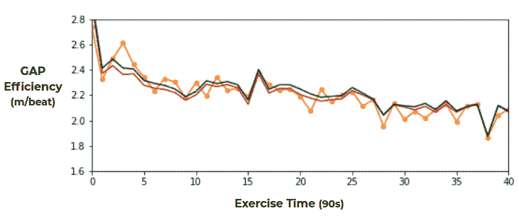

# 数据科学、音乐和体育。第二部分:回归推荐系统

> 原文：<https://towardsdatascience.com/data-science-music-and-sports-part-2-regressions-recommender-system-75ea9dd4d803?source=collection_archive---------63----------------------->

## 一项评估音乐对跑步的影响的实验，并开发一个推荐系统来提高成绩

*照片由* [*作者*](https://www.linkedin.com/in/jgonzalez-fraile/)

便携式记录设备的日益普及导致了人工智能解决方案在多个领域的兴起，如体育科学。在这一系列的博客文章中，我们描述了我们为评估音乐对跑步的影响而进行的实验。通过对跑步锻炼记录的统计分析，我们开发了一个个性化的歌曲推荐系统，可以提高你的跑步成绩。

在第 2 部分(你在这里)中，我们介绍了机器学习框架:特征工程和验证模式。我们描述了使用回归来评估音乐对跑步表现的影响，并且我们构建了一个个性化的音乐推荐系统来增强它。

*在* [*第一部分*](/data-science-music-and-sports-part-1-data-collection-hypothesis-testing-2f2b85406726) *中，我们介绍了实验设置、数据收集和处理，以及音乐对跑步影响的初步评估。*

可穿戴设备记录的数据是健康和体育行业应用的强大资源。在这个博客系列中，我们描述了一个利用跑步锻炼中收集的数据的案例研究。我们使用 Polar 运动手表来记录身体数据，而 Spotify 应用程序则播放音乐。使用相关的 API，在第 1 部分中，我们构建了数据集并介绍了实验设置。我们定义了一个指标来评估运行性能(**差距效率**)，讨论了数据集的多个方面。我们的结论是，要确定音乐对运动表现的影响，多变量分析是必要的。所有的数据都准备好了，我们现在开始分析。

我们构建了一个**机器学习**解决方案，将跑步锻炼中记录的数据作为输入，直到特定的时间点。该解决方案处理该数据并预测锻炼的下一个时间间隔的跑步表现。它基于**回归算法**、**、**，这些算法是按照为时间序列定制的**验证模式**对之前的锻炼记录集合进行**、**训练的。通过这个过程，我们建立了算法的初始能力，以利用收集的数据集预测未来的运行性能。接下来，我们添加与流传输的**音乐**相关的输入**特征**，并量化这种添加对回归预测能力的影响，特别是对调整后的决定系数的影响。当这种添加导致显著改善时，这表明音乐可能对跑步表现变量有真正的影响。我们展示了如何在每个相关时间找到最大化预测间隙效率的歌曲**。**解决方案变成了**音乐** **推荐系统来** **提升运行性能。**

这篇文章中的方法和技术适用于处理时间序列的许多问题，例如销售或需求预测。我们关注数据科学概念，而不是编码实现。然而，我们在整篇文章中列出了在 Python 环境中重现工作流的相关库和关键函数。

# **特色工程**

## **数据重述和重采样**

练习的数据由 Polar 以每秒的采样率记录，有关数据收集的详细信息，请参见[第一部分](/data-science-music-and-sports-part-1-data-collection-hypothesis-testing-2f2b85406726)。在我们的实验中，有几个原因需要重新采样。首先，间隙效率被定义为涉及速度和心率的比率:

由于心率对努力的变化是反应性的，这些变化只有在一段时间后才会在间隙效率中显示出来。第二，一秒钟的采样率对运动手表传感器的有限精度更敏感。当速度、心率或海拔高度的异常读数在一段时间间隔内下降时，处理这些读数会更容易。第三，我们有兴趣研究跑步时听一段时间歌的效果。解决方案必须在该时间范围内提供建议，没有必要每秒都提供建议。有了这些动机，我们**将锻炼数据重新采样成 90 秒的间隔**。

*从跑步锻炼到 1.5 分钟间隔的时间序列。我们描绘了根据极坐标数据计算的速度、心率和间隙效率；以及从 Spotify 数据中播放的歌曲的调、能量和节奏。*

有了这些时间窗，差距效率不再仅仅主要由先前的样本工作给出。累积疲劳的影响(通过自锻炼开始以来的速度、海拔增益或心率的记录)、相同时间间隔内的努力或听音乐的影响都将对算法的预测能力产生更大的影响。初看起来，重采样的具体大小可能是任意的。我们试验了各种大小，结论是 1.5 分钟是一个**很好的平衡选择**。它超过了 45 秒的阈值，此时间隙效率自相关不再重要。它给我们留下了足够的记录数据点来训练回归者。

在上图中，我们展示了我们在本博客系列的[第 1 部分](/data-science-music-and-sports-part-1-data-collection-hypothesis-testing-2f2b85406726)中用于演示的 fartlek 练习的一些重采样分布。对于每 1.5 分钟的时间间隔，这些值被定义为该时间内记录数据的平均值。

## **滞后、滚动和扩展窗口**

利用重采样数据，我们给出了特征工程过程。我们遵循一种基于多种大小的移动时间窗口的方法。窗口的大小取决于数据与 *t* 的接近程度。这个想法是，我们越回溯到过去，数据就越不需要详细。为了让回归变量预测跑步锻炼时间 *t* 的差距效率(**回归变量目标**，我们输入以下信息:

*   在 *t-1、t-2、t-3、t-4* 和 *t-5 的**心率、速度、步频、间隙速度、仰角增益和间隙效率**。*
*   从 *t-6* 到 *t-15 这些变量的平均值。*
*   从开始到 *t-1，这些变量的平均值。*
*   **从开始到 *t-1* 运行的时间和距离**。
*   **之前练习**的平均间隙效率。
*   **温度、湿度、风速和大气压**。

这些加起来有 49 个**输入特征**。这种构造起初看起来有点武断，我们实际上测试了几种变化。我们添加和删除变量，我们包括更多和更少的滞后，增加和减少移动窗口大小等。在每个数据科学项目中，**特征工程是建模**最重要的部分之一。特性的最终选择源于验证阶段本身，因为添加更多的特性不一定能提高性能。**我们输入足够的信息特征，同时避免让模型面临维数灾难及其所有后果**。

*为了预测跑步锻炼在时间 t 的差距效率(回归量目标)，回归量特征根据之前时间间隔的信息以及天气信息构建。参见正文中的描述。*

## **编码技术细节**

对于重采样和特征工程过程，我们使用 ***熊猫。*** 时间序列的一些有用函数是滞后特征的 s*shift*，移动平均窗口的 *rolling* ，可变大小窗口的 *expanding* 。

# **训练和验证:锚定前向链接**

## **验证模式**

在特征工程过程之后，我们有来自许多跑步练习的多个数据点来训练。因此，解决方案涉及多个时间序列(每个跑步练习一个)，我们需要一个仔细的模式来选择和验证模型。天真的交叉验证过程很容易导致数据泄露，因为我们最终可能会使用未来的数据点来训练一个预测过去的模型。这似乎不像销售预测、交易或供应链需求等其他预测问题那样敏感。但是考虑到我们在[第一部分](/data-science-music-and-sports-part-1-data-collection-hypothesis-testing-2f2b85406726)中描述的长时间耐力训练对差距效率的影响，我们在这里也需要小心。

对于验证过程，我们使用一个叫做锚定前向链接的**嵌套交叉验证**模式。这个过程(和变化)也被称为日前向链接，或滚动原点重新校准评估。正如在任何数据科学问题中一样，我们**首先分离**一些最近的运行练习**来构建测试集**。这些仅在最后使用，以估计样本外的估计模型性能。来自其余跑步练习的数据点构建了训练和验证集。我们需要**一直**保持这些跑步练习**的**时间顺序**。这些多个时间序列用于执行模型选择:**

*   我们选择**第一**训练**阶段**的跑步练习次数。在下图中，我们从训练和验证集中一半可用的跑步练习开始。
*   对于每个模型和超参数选择，我们**在来自该选择的数据点集合**上训练回归器。一旦被训练，模型**在**上预测来自训练和验证集中**下一个可用锻炼记录**的数据点。
*   我们将最后一次跑步练习添加到我们用于训练的练习集合中，然后**依次重复**这个过程。
*   一旦我们穷尽了训练和验证集中可用的跑步练习，我们就**平均**所有**计算的验证指标**(在下面的例子中，V1 到 V9)以获得特定模型和超参数选择的验证指标。

这些**验证指标用于选择模型和超参数的最优选择**。为了评估样本外的性能，我们继续进行一个类似的正向链接过程，添加我们在测试集中分离的跑步练习，并在最后对指标进行平均。

我们决定**锚定**训练窗口，始终包括第一次记录的练习的所有内容。通过这种方式，我们**最大化了我们在每一步用于训练的数据点**。或者，我们可以在每个步骤上实现固定大小的滚动窗口，确保我们总是使用等量的最近记录的练习进行训练。然而，随着我们向前发展，拥有更多数据点的影响超过了拥有旧数据的影响，因为耐力训练对差距效率的改善是缓慢的。

*锚定正向链接:每个块代表一个跑步锻炼记录(它本身包含多个数据点)。最近的跑步练习被分开以测试估计的模型性能。其余跑步练习的数据点构建了我们用于模型选择的集合。正文中描述了顺序过程。*

## **回归度量**

为了评估添加额外输入特性的影响，我们研究了常规和调整后的**决定系数** ( *r* )。我们还研究了平均绝对误差(MAE ),而不是平方误差，因为我们不希望指标过多地受到异常值的影响。

# **回归模型**

作为第一个基准，我们考虑一个**简单的**解决方案，它只是预测在时间 *t* 在 *t-1 观察到的间隙效率。*如果我们不能改进该模型的结果，这将表明在实验中缺乏预测能力。幸运的是，这里的情况并非如此。

至于机器学习回归器池，我们考虑一族具有组合 L1(拉索)和 L2(岭)正则化项的线性模型。它们结合了线性和**多项式特征**，以允许非线性关系。由于它们不是数据饥渴算法，我们考虑**支持向量回归**，测试几个内核。我们训练随机森林回归器，因为它们通常有助于设定合理的模型基准。我们还基于 **XGBoost** 训练梯度推进回归模型。正如我们将看到的，这些通常会导致对稀缺数据集的过度拟合。

转到日益复杂的模型，我们研究了**卷积神经网络** (CNN)和**长短期记忆** (LSTM)网络的性能。对于这两种情况，代替上述的特征工程过程，我们在跑步练习中直接输入记录到预测时间 *t* 的重新采样的跑步变量。CNN 的想法是将变量的光谱视为具有多种颜色的*伪*图像(每个特征一种颜色)。我们预计这些是数据饥渴模型，暂时在实验中扮演次要角色。一旦我们积累了更多的训练数据，我们期待有一个深入的探索。

对于所有模型，有限的数据集给**带来了额外的压力，以确保适当的正则化技术到位**。请注意，一些正则化过程需要进行特征缩放。

## **模型技术细节**

线性回归是从***scikit-learn****(elastic net)。*从那里，我们使用*管道、多项式特征、* *缩放器、mean_absolute_error、*和 *r2_score* 函数，以及*RandomForestsRegressors*和 *SVR* 。对于梯度增强，我们依赖于 ***xgboost*** *、*，而神经网络是使用 ***Keras*** *实现的。*我们使用 ***itertools*** 到实现嵌套的交叉验证模式。

# **差距效率预测**

## **基本输入功能**

验证后，最佳模型的表现优于朴素模型，验证 MAE 为 0.14，比朴素模型小 47%。跑步锻炼数据中的部分模式因此被这个最佳模型恰当地捕获。由于累积的疲劳、慢步速阶段后间隙效率的增加、海拔增益的影响或天气变量，这些都是练习中间隙效率差异的部分原因，所以练习期间间隙效率的总体负趋势。如最佳决定系数*r*0.3 所示，而对于简单模型，该系数为负。尽管如此，最佳模型值仍然不太乐观。

正如我们在[第 1 部分](/data-science-music-and-sports-part-1-data-collection-hypothesis-testing-2f2b85406726)中解释的，我们遵循了不同的跑步计划，包括法特莱克跑、基础跑、渐进跑、速度跑和爬坡跑。与我们在固定轨道上反复运行的设置相比，变化的计划有许多好处，但它有一个众所周知的缺点。间歇效率受心率和跑步速度的影响。在一个多变的计划中，跑步的速度是不断变化的，而且几乎所有的时间都由跑步者的意愿决定。例如，在上述图中的 fartlek 中，在从 11 公里/小时到 13 公里/小时的渐进热身后，fartlek 以大约 15 公里/小时的目标速度跨越 6 个 4 分钟的间隔，每个间隔之后是大约 10-11 公里/小时的低速 2 分钟，最后是 11 公里/小时的恢复阶段。这些目标速度是训练计划的一部分，它们根据具体的跑步时段而变化。由于我们没有向回归算法提供这些信息，因此这些速度上的变化，以及间隙效率上的大部分变化，对于回归模型来说是随机的。

## **添加速度**

因此，为算法提供一些额外的信息似乎是合理的。理想情况下，我们将输入跑步锻炼的类型(法特莱克、进度、节奏等)，以及不同阶段的目标速度。这里，作为其代理，我们提供在时间**的**实际速度作为输入。***这样，在 *t* 预测间隙效率变得与已知速度下的心率预测相关。我们使用实际速度而不是计划速度的事实可能会使预测有一点偏差。但是由于这个实验是关于在次最大努力下的跑步表现，目标速度和实际速度在 1.5 分钟的时间间隔内没有太大差别。随着这一增加，模型的预测能力增加，最佳模型预测间隙效率的验证 MAE 为 0.11，系数 *r* ~0.69。*

## ***音乐功能***

*最后，我们添加歌曲特性，如我们在[第 1 部分](/data-science-music-and-sports-part-1-data-collection-hypothesis-testing-2f2b85406726)中所述。这些是一首歌曲的定量描述符列表:*持续时间、音调、调式、速度、拍号、响度*，加上一些 Spotify 计算的特征:*能量、乐器性、语速、活跃度、声音、效价和可跳性。*所有这些特征在这里定义[。为了预测在时间间隔 *t，*的间隙效率，我们为在同一时间间隔 *t 期间流传送的音乐添加特征。*由于时间窗口的大小是 1.5 分钟，我们期望音乐的潜在效果已经在同一窗口中可见。检查我们在第一部分](https://developer.spotify.com/documentation/web-api/reference/tracks/get-audio-features/)的[中讨论的](/data-science-music-and-sports-part-1-data-collection-hypothesis-testing-2f2b85406726)[解离](http://thesportjournal.org/article/music-sport-and-exercise-update-research-and-application/)的内容。*

*一旦添加了**音乐特征**，嵌套交叉验证后的最佳模型导致预测能力的明显**增加。验证平均误差降低到 0.097，决定系数增加到 *r* ~0.71。该系数表示响应变量(间隙效率)和预测特征之间的依赖强度。这是通过计算与输入要素的方差相关的间隙效率的方差比例来实现的。因此，这种改进看起来很有希望，因为系数的增加可能表明音乐对跑步表现的实际影响。***

*然而，在给定当前数据集的情况下，改进仍然**不具有统计显著性**。尽管[调整后的决定系数](https://en.wikipedia.org/wiki/Coefficient_of_determination#Adjusted_R2)也有所增加，但验证 MAE 和 *r* 的改进都小于估算时的不确定性。现在抛弃这些改善不仅仅是统计上的侥幸还为时过早。可能的情况是，当我们收集更多的数据时，我们会得到一个具有统计学意义的结果。但即使在那种情况下，我们仍然需要进一步的探索。决定系数通常是因果分析的一部分，但对它的改进并不直接意味着因果关系。此处介绍的研究将通过进一步的领域专业知识、更一般化的实验和深入的因果推理研究(包括扩展的敏感性分析)进行补充。目前，我们假设预测能力的增加与音乐对跑步成绩的影响有关，这样我们就可以继续构建推荐系统。*

**

**上图中记录的 fartlek 练习的差距效率(橙色)、最佳模型的预测(棕色)以及使用推荐系统的预测(深绿色)。**

## ***模型可解释性***

*嵌套交叉验证后的最佳模型是支持向量和线性回归的集合，具有结合 L1 和 L2 项的相当大的正则化因子。线性回归消耗高达三次的多项式特征的组合，而二次和三次组合被严格过滤为交互项的小选择。在验证过程中，通过监控调整后的决定系数来优化过滤过程。这种组合击败了更复杂的算法，如 XGBoost 树或我们构建的神经网络。我们还考虑了一个基于梯度推进线性回归的模型，但它倾向于过度拟合和模糊模型的可解释性。最终的**集合**是基于平均的**。***

*至于特征对预测的总体影响，最大的影响是由于时间 *t.* 处的速度，预测也受到包括心率、速度和几个滞后处的间隙效率的组合的严重影响。最近滞后的要素对预测的影响更大，影响随着时间的推移而减小。近期心率和速度与预测负相关，而近期间隙效率与预测正相关。累积的高度增益也有助于预测，在这种情况下，较大的值会降低间隙效率:跑步时爬坡会增加很多疲劳。至于天气特征，风越大，预测的间隙效率越低。考虑到风对疲劳的影响，这是意料之中的。有趣的是，大气压越高，间隙效率越高。这与[文献](https://pubmed.ncbi.nlm.nih.gov/25710483/)中的发现一致，检查那里的中长跑结果。*

*对于这项研究中的跑步者，最大的音乐特征效果由*能量*给出。Spotify 将这一变量定义为强度和活动的*感知指标。*它越大，预测的间隙效率越高。与速度的相互作用项为正，这意味着这种影响随着速度的增加而增加。这与第 1 部分的[的 *p 值*图的讨论一致。由于*乐器演奏度*和*语音演奏度*越大，间隙效率越小，因此避免乐器和/或主要语音音轨可以获得更好的运行性能。对于具有更大的*可跳舞性*的歌曲，间隙效率往往更高，这也具有与速度的正交互项。最后，键越低(标准节距等级)，预计该转轮的间隙效率越高。这是我们用这种方法得出的结论类型的简要概述。正如我们在](/data-science-music-and-sports-part-1-data-collection-hypothesis-testing-2f2b85406726)[第一部分](/data-science-music-and-sports-part-1-data-collection-hypothesis-testing-2f2b85406726)中强调的，这些**仅适用于本次实验的跑步者(N=1 统计分析)**。类似的过程将被用于对任何其他人的记录进行个性化。*

# ***推荐系统***

*我们使用训练好的模型来构建一个音乐推荐系统。在新的跑步锻炼中，每当一首歌曲将要结束时，该解决方案都会处理到该点为止的所有锻炼记录数据。当假设在选定的池中流式传输每首歌曲时，它对跑步锻炼的下一个间隔中的间隙效率进行预测。从这些中，**系统**找到并**推荐**导致**最高间隙效率预测的**歌曲**。**因此，**最大化预测行驶性能**。一旦下一首歌曲将要结束，系统就用更新的跑步锻炼记录重复这个过程。*

*歌曲库由随机选择的 100 首跑步者在训练中听的歌曲组成。我们的目标是最大限度地提高性能，同时保持推荐符合跑步者的口味。请注意，**建议**是为特定跑步者定制的**，而**也是为跑步锻炼的特定条件定制的**。这些是天气、记录的速度、心率、步频、仰角增益和到 *t* 的间隙效率，以及跑步者为下一阶段训练计划的速度。***

*在上图中，您可以看到我们在整个博客系列中用于说明的 fartlek 的预计间隙效率。实际记录的间隙效率以橙色显示，包括音乐特征的上述最佳模型的预测是棕色线。在深绿色中，我们描绘了预测的间隙效率，如果跑步者没有听实际跑步锻炼记录中的音乐，而是听了推荐者建议的歌曲。对于这种特殊的练习，平均间隙效率的改善大约为 1%。在下图中，我们展示了记录中一次连续运行的三条差距效率曲线，以及同一次运行的系统建议。*

**

**渐进运行记录的差距效率(橙色)，最佳模型的预测(棕色)，以及推荐系统的预测(深绿色)。**

*为推荐器设计一个完全功能性的解决方案超出了这个初始实验的范围。这需要与 Polar 设备和 Spotify 应用程序进行实时集成，以便根据实时运行条件更新推荐的音轨。我们将对这种解决方案及其推广的深入探索留到将来。*

**

**以上渐进跑推荐歌曲。截图自*[*Spotify for Linux*](https://www.spotify.com/es/download/linux/)*。**

# ***展望***

*我们已经描述了如何使用来自跑步锻炼的数据来构建音乐推荐系统。我们已经从 Polar 设备和 Spotify 应用程序的记录中展示了功能工程流程。我们已经详细介绍了为选择最佳回归模型而构建的训练和验证模式。这些算法根据锻炼时间点之前的可用数据预测未来的跑步表现。音乐功能的加入提高了算法的预测能力。我们利用这一点开发了一个推荐系统。它会在每次跑步锻炼中推荐最能提高跑步成绩的歌曲。*

*如上所述，结果仍然没有统计学意义。我们将继续收集数据，用更大的数据集重新评估它们。这将允许我们深入构建一个完整的解决方案。*

**这里提到的品牌都没有直接参与过这个实验**