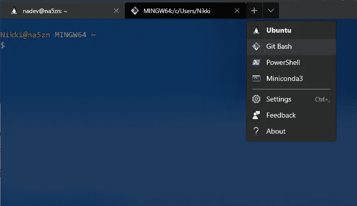

# Linux 2 的 Windows 子系统上的数据科学——什么、为什么和如何？

> 原文：<https://towardsdatascience.com/data-science-on-windows-subsystem-for-linux-2-what-why-and-how-77545c9e5cdf?source=collection_archive---------6----------------------->

## 为数据科学建立一个 WSL 2 环境是很耗时的，但是非常值得。

吉菲，[https://giphy.com/gifs/ZS8GB00AWC6kw](https://giphy.com/gifs/ZS8GB00AWC6kw)

# 你想用 Windows 编程！？

当一名崭露头角的数据科学家决定为大学购买一台新的笔记本电脑时，他们不可避免地会向他们的朋友、同学或 Stack Overflow 提出这样的问题:“我应该为数据科学使用什么操作系统？”这个问题在程序员中就像“我应该使用制表符还是空格”一样有争议如果你问我，这个问题没有单一的*最佳*答案。每个人的答案基于个人偏好、经验和外部限制。

对某些人来说，答案可能是 Windows。比如，你是否因为工作场所的要求而局限于 Windows？你没有预算换一台新的苹果机器吗？您是否没有时间或知识在您的 PC 上安装 Linux 操作系统？Windows 和微软 Office 套件是你最熟悉的吗？或者，您可能不想更换所有花了一大笔钱购买许可证的 Windows 软件。

Windows *可以*处理数据科学，尤其是如果你除了用一些常用的包安装 Python、Anaconda 和 R 之外，没有做太多的事情。如果你是大学一年级的学生，这种设置会非常好。但是，你的工作变得越复杂，你在 Windows 上遇到的缺点就越多。你可能会遇到速度问题，兼容性严重不足，调试比它应该的要困难得多，几乎每个栈溢出帖子都给你指示只有*才能在 Unix/Linux 中工作。*

## 为什么要用 Linux 的 Windows 子系统？

为了克服在 Windows 中编程的限制，您可以在同一台机器上双引导 Linux 和 Windows，并根据您的任务需要在分区之间切换。但是你可能对这个过程不太适应，而且每次切换任务时登录和退出是多么痛苦啊。因此，接下来您可能会考虑在 Windows 中启动虚拟机环境。尽管它们被认为是与 Windows 操作系统隔离的，但它们通常难以设置、难以复制，并且充满了兼容性问题。

如果您想极大地改善您在 Windows 上的开发体验，我建议您放弃前面提到的选项，转而考虑 Linux 的 Windows 子系统(WSL)。你不仅可以获得更好的性能和更少的问题，还可以训练自己在一个非常接近完整的 Linux 或 Apple OS 的环境中编程。稍后切换到这些系统之一，或者将您的代码转移到这些系统之一应该很容易。

但是，如果您刚刚开始使用命令行，并且完全不熟悉命令行，那么这个选项可能对您来说太多了。WSL 2 目前不支持 Linux 中的 GUI 应用程序。(尽管微软计划在未来支持它们。)因此，虽然您可以通过命令行 100%地使用 Anaconda，但您将错过一些有用的 GUI，如 Anaconda Navigator。最终，你会想要脱离 GUI 工作——如果不是为了速度，而是为了让家人和朋友相信你是超级黑客的那种不可思议的感觉。但这种转变会随着时间的推移而到来，在跑之前先学会走并没有错。

Tenor，[https://tenor . com/view/patience-young-grasshopper-gif-10391979](https://tenor.com/view/patience-young-grasshopper-gif-10391979)

## 那么 WSL 2 到底是什么？

WSL 的最初版本是在 Windows 之上的一个层，允许你在 Windows 10 上运行 Linux 可执行文件。这是一个好的开始，但是仍然不能提供完全的 Linux/GNU 支持。真正的魔力来自微软 2019 年发布的 WSL 2。这种新的架构提供了自己的 Linux 内核，而不是兼容层。因此，您可以获得更快的性能，对系统调用的完全兼容性，在 Linux 内核上运行更多应用程序(如 Docker)的能力，并且更新将会发布，而无需等待微软为 WSL“翻译”更改。

基本上，有了 WSL 2，您将能够在 Windows 上的全功能 Linux 环境中流畅地工作！还有一些功能将两种系统完美地融合在一起。您可以让 Linux 环境像您的浏览器或 IDE 一样打开 Windows 程序。您可以使用普通的文件资源管理器或命令行浏览 Windows 和 WSL 文件系统中的文件。在某些 IDE 上，即使 IDE 软件安装在 Windows 中，您也可以使用 Linux 内核来运行和调试您的代码。

## 哇！听起来棒极了。我如何尝试它？

遵循微软[关于如何安装 WSL 2](https://docs.microsoft.com/en-us/windows/wsl/install-win10) 的说明。必须是 Windows 10，必须更新到版本 2004，build 19041 或更高版本。获得此更新可能有点棘手。对于一些用户(比如我自己)，检查更新和安装最新的可用版本仍然不能让我得到这个需要的版本。如果发生这种情况，您可以按照指示使用 Windows Update 助手手动安装所需的内部版本。

您需要选择一个 Linux 发行版来安装。这可以在以后更改，如果您愿意，您甚至可以安装多个发行版。如果不熟悉或者没有偏好，选择 Ubuntu。请务必记下您为发行版设置的用户名和密码。您的 Linux“home”文件夹将位于“\\wsl$\Ubuntu\home\{username}”，您的密码将用于需要管理员权限的命令。

## 呃，但是我怎么用 Linux 呢？

目前，你几乎必须通过命令行终端、文件浏览器和运行在浏览器中的应用程序(如 Jupyter Notebook)来做所有事情。尽管微软已经宣布计划增加 GUI 应用程序支持以及 GPU 硬件加速。

终端应用程序和终端外壳有多种风格。我建议从 Windows 终端开始。这个最近发布的微软应用程序使用起来很快，允许你自定义主题、按键绑定和覆盖默认行为。最棒的是，你可以在一个窗口中为不同的环境打开标签式终端。因此，您可以拥有单独的概要文件来轻松启动 Powershell、Ubuntu、Bash、Anaconda 或许多其他受支持的环境。



Windows 终端环境选择

使用微软 GitHub 上的[指令来安装 Windows 终端，然后点击向下插入符号和设置来编辑你的 *settings.json* 文件。你可以阅读](https://github.com/Microsoft/Terminal)[文档](https://docs.microsoft.com/en-us/windows/terminal/customize-settings/global-settings)来熟悉设置选项，或者查看我的设置文件的[要点。](https://gist.github.com/NA-Dev/1dd9e8bc4d8873d93b84cc07bb5ec55f)

默认包含 WSL 发行版和 Powershell 的配置文件。要自定义这些概要文件并添加更多，请编辑 *settings.json* 中的“概要文件”对象。“默认”对象将默认设置应用于所有配置文件。

```
“profiles”: {
  “defaults”: {
    “acrylicOpacity”: 0.85000002384185791,
    “background”: “#012456”,
    “closeOnExit”: false,
    “colorScheme”: “Solarized Dark”,
    “cursorColor”: “#FFFFFF”,
    “cursorShape”: “bar”,
    “fontFace”: “Fira Code”,
    “fontSize”: 12,
    “historySize”: 9001,
    “padding”: “0, 0, 0, 0”,
    “snapOnInput”: true,
    “useAcrylic”: true,
    “startingDirectory”: “%USERPROFILE%”
 }
}
```

接下来，您需要在“列表”数组中添加特定终端应用程序的配置文件设置。列表中的每一项都需要一个用大括号括起来的唯一 guid 标识符。通过在 Powershell 中键入`new-guid`或在 Ubuntu 中键入`uuidgen`来生成新的 guid。然后，您可以自定义选项卡的名称和图标，使用哪个可执行文件打开命令行，以及从哪个目录开始。一定不要在列表的末尾留下任何逗号，因为这是无效的 json 语法，并且会抛出错误。

```
“profiles”: {
  “defaults”: {
    ...
  },
  "list: [
    {
      “guid”: “{2c4de342–38b7–51cf-b940–2309a097f518}”,
      “name”: “Ubuntu”,
      “source”: “Windows.Terminal.Wsl”,
      “startingDirectory”: “//wsl$/Ubuntu/home/nadev”
    },
    {
      “guid”: “{61c54bbd-c2c6–5271–96e7–009a87ff44bf}”,
      “name”: “PowerShell”,
      “tabTitle”: “PowerShell”,
      “commandline”: “powershell.exe”
    }
  ]
}
```

通过在 *settings.json 的顶层将其 guid 和括号设置为“defaultProfile”来选择默认情况下将在新标签中打开的配置文件。*

```
“defaultProfile”: “{2c4de342–38b7–51cf-b940–2309a097f518}”
```

> 现在您已经设置好了，可以开始使用 Linux 的 Windows 子系统了！

查看一些常见的终端命令[来学习如何从命令行导航目录。](https://en.wikibooks.org/wiki/Guide_to_Unix/Commands/File_System_Utilities)

# 现在，进入环境设置

我将向您简要介绍我在 WSL 中为数据科学安装的应用程序。

## 代码编辑器或 IDE

就像终端应用一样，有大量的代码编辑器可供选择。每个人都有自己的偏好，无论你的偏好是什么，在尝试了几个之后，都是非常好的！ [Visual Studio 代码](https://code.visualstudio.com/)非常受欢迎，它的特色是[一个专门为 WSL2 设计的扩展](https://code.visualstudio.com/docs/remote/wsl)。我很轻松地获得了 Jupyter 笔记本、Python 代码和使用 WSL2 的调试器。

如果您想尝试一些更奇特的 Python 编码，请查看 JetBrains 产品套件中的 [PyCharm](https://www.jetbrains.com/pycharm/) 。与 VS 代码不同，只能使用付费许可的 PyCharm 或者申请[免费学生许可](https://www.jetbrains.com/community/education/)。PyCharm 允许您[使用 WSL Python 作为您的解释器](https://www.jetbrains.com/help/pycharm/using-wsl-as-a-remote-interpreter.html)，现在[在您的 WSL2 文件系统中支持 Git](https://blog.jetbrains.com/idea/2020/06/intellij-idea-2020-2-eap3-support-for-git-installed-in-wsl2-java-completion-improvements-and-more/) 。这个系统可能需要更多的工作才能与 WSL2 完全兼容。例如，我不能让调试器或 Jupyter 工具窗口工作。

## 饭桶和饭桶狂欢

Git 是跟踪代码变更、版本控制和备份存储库文件的标准。Windows 和您安装的每个 Linux 发行版都有不同的文件系统，您需要在每个发行版上安装 Git。

对于您的 Windows 文件系统，安装 [Git for Windows](https://git-scm.com/download/win) 并选择推荐的选项。这个安装还包括 Git Bash 终端应用程序。我喜欢使用 Git Bash 而不是 Powershell，因为命令语法就像 Linux 中的 Bash，所以你在任何地方都使用相同类型的命令。Powershell 更适合编写自动化脚本和使用 Windows 服务器的用户。因为我们要经常使用这个新的终端应用程序，所以将它作为新的配置文件添加到您的 Windows 终端设置中。

```
“profiles”: {
  “defaults”: {
    ...
  },
  "list: [
    ...,
    {
      “guid”: “{8d04ce37-c00f-43ac-ba47–992cb1393215}”,
      “name”: “Git Bash”,
      “tabTitle”: “Bash”,
      // the -i -l commands below are added to load .bashrc
      “commandline”: “\”%PROGRAMFILES%\\git\\usr\\bin\\bash.exe\” -i -l”,
       “icon”: “%PROGRAMFILES%\\Git\\mingw64\\share\\git\\git-for-    windows.ico”
    }
  ]
}
```

在 Linux 发行版上，git 通常已经包含在内，但是您可以在 Windows 终端的 Ubuntu 概要文件中运行`sudo apt-get install git`来安装它或者更新到最新版本。

如果您没有帐户，请立即创建一个。你可能想进入你的 GitHub 帐户设置>电子邮件，隐藏你的个人电子邮件地址。在这种情况下，您将获得一个生成的电子邮件地址，以便在配置 Git 时使用。这让你可以在不向公众透露你的个人邮箱地址的情况下提交给 GitHub。下一次你尝试推送 GitHub 时，会要求你输入用户名和密码，这些凭证会被保存起来以备将来使用。

一旦你创建了一个 GitHub 账户。在 Ubuntu 和 Git Bash 中运行下面的命令，在 Git 中配置您的姓名和电子邮件地址。该配置将存储在一个名为*的文件中。gitconfig* 位于您的主目录*中。*

```
git config --global user.name "Your Name"
git config --global user.email "your_email@domain.com"
git config --global credential.helper store
```

我还将在这里多提一点关于 Bash 的内容。在 Windows 和您的发行版中，会有一些文件在 Bash 打开时被执行。这些是*。巴沙尔*，*。bash_profile* ，以及可选的*。轮廓*。如果您在文件浏览器中看不到它们，您可能需要[将隐藏文件设置为可见](https://support.microsoft.com/en-us/help/14201/windows-show-hidden-files)。要在命令行中查看它们，输入 ls`ls -a`(- a 选项显示所有文件，包括隐藏的文件)。我将让您研究这些文件的用途，但通常前两个文件会自动生成，您将在*中编辑个人别名和环境变量。轮廓*。在更改这些文件之后，您需要运行`source ~/.bashrc`来加载更改。

## 康达

如果您计划使用 Python 和 R 进行数据科学方面的工作，conda 使管理环境和包变得更加容易。你可以安装 [Miniconda](https://docs.conda.io/en/latest/miniconda.html) 来获得你需要的启动程序，或者安装 [Anaconda](https://www.anaconda.com/products/individual) ，它已经预装了大量的软件包。不过，如果安装在 WSL 中，Anaconda Navigator GUI 将无法工作，只能安装在 Windows 中。我用以下命令在 Ubuntu 中安装了 Python 3 的 Miniconda，但有些人也在 Windows 中安装它。(如果你知道为什么人们在两种环境下安装，而不仅仅是 WSL，请在评论中告诉我。)

```
# To install Anaconda for Python 3wget https://repo.anaconda.com/archive/Anaconda3-2020.02-Linux-x86_64.sh
sh ./Anaconda3-2020.02-Linux-x86_64.sh# To install Miniconda for Python 3

wget https://repo.anaconda.com/miniconda/Miniconda3-latest-Windows-x86_64.exe
sh ./Miniconda3-latest-Windows-x86_64.exe
```

完成安装后，关闭并重新打开 Ubuntu 终端，输入`which python`和`which conda`。根据您安装的软件包，您应该获得以下路径集之一。

```
# Path to Python executable in Anaconda
/home/{username}/anaconda3/bin/python
/home/{username}/anaconda3/bin/conda# Path to Python executable in Miniconda
/home/{username}/miniconda3/bin/python
/home/{username}/miniconda3/bin/conda# Then update all installed packages
conda update --all
```

如果没有，打开*。配置*并适当添加以下导出行之一，输入`source ~/.bashrc`，然后重试。

```
# Add Anaconda Python to PATH
export PATH=/home/{username}/anaconda3/bin:$PATH# Add Miniconda Python to PATH
export PATH=/home/{username}/miniconda3/bin:$PATH
```

现在您已经准备好使用 conda 来创建环境了。最好将包放在您的基础环境之外，并为不同类型的项目创建一个新环境。这防止了兼容性问题。有关[管理环境](https://docs.conda.io/projects/conda/en/latest/user-guide/tasks/manage-environments.html#creating-an-environment-with-commands)的更多信息，请参见文档。

```
# To create an environment called 'pandasenv' with the pandas package installed.conda create --name pandasenv pandas
```

## Jupyter 笔记本

要向他人展示您的作品，您可能会从使用 Jupyter 笔记本开始。该工具允许您在 conda 环境中运行 python 代码，用 markdown 注释代码，并显示图表和其他视觉效果。Anaconda 预装了 Jupyter 笔记本。在 Miniconda 上，打开您的 Ububtu 终端(您的基本 conda 环境将被自动激活)，并键入以下内容进行安装。

```
conda install jupyter
```

与我们检查使用正确的 python 可执行文件的方式类似，我们还想使用`which jupyter`检查 jupyter。

```
# Path to Jupyter executable in Anaconda
/home/{username}/anaconda3/bin/jupyter# Path to Jupyter executable in Miniconda
/home/{username}/miniconda3/bin/jupyter
```

对我来说，这条路是不正确的，需要一些调查才能找到问题。在安装 Miniconda 的过程中，它的 bin 目录被添加到了*内的$PATH 中。bashrc* 。这很棒，因为它告诉操作系统在运行命令时搜索该目录中的可执行文件。但是我的本地 bin 目录也被添加到了*中。轮廓*。这导致了$HOME/。在$HOME/miniconda3/bin 之前检查 local/bin 中的可执行文件。为了解决这个问题，我将 Miniconda 导出行移到最后执行，方法是在 */home/{username}/中创建我的文件的一部分。轮廓*如下图所示。

```
# set PATH so it includes user's private bin if it exists
if [ -d "$HOME/.local/bin" ] ; then
    PATH="$HOME/.local/bin:$PATH"
fi# set PATH so it includes miniconda's bin
if [ -d "$HOME/miniconda3/bin" ] ; then
    PATH="$HOME/miniconda3/bin:$PATH"
fi
```

当使用`jupyter notebook`命令启动 Jupyter Notebook 时，你会注意到弹出一条警告消息，要么你的浏览器无法启动，要么它试图启动一个无法显示 Jupyter Notebook 的文件。为了解决这个问题，我们需要做一些事情。首先，通过向*添加以下内容，向您的路径添加一个浏览器变量。轮廓*。

```
# Path to your browser executableexport BROWSER='/mnt/c/Program Files (x86)/Google/Chrome/Application/chrome.exe'
```

接下来，通过生成 Jupyter 配置文件并取消注释下面列出的行，告诉 Jupyter Notebooks 不要试图使用在 WSL2 中不起作用的重定向文件来启动。

```
# Generate a config file at /home/{username}/.jupyter/jupyter_notebook_config.pyjupyter lab --generate-config# Uncomment the linec.NotebookApp.use_redirect_file = False
```

就是这样！您的 Jupyter 笔记本现在应该可以在浏览器中正确启动，网址为 [http://localhost:8888/](http://localhost:8888/) 。

我希望这个系统能为你服务，也能为我服务。如果您有任何问题或改善这种环境的建议，请在下面留下评论。