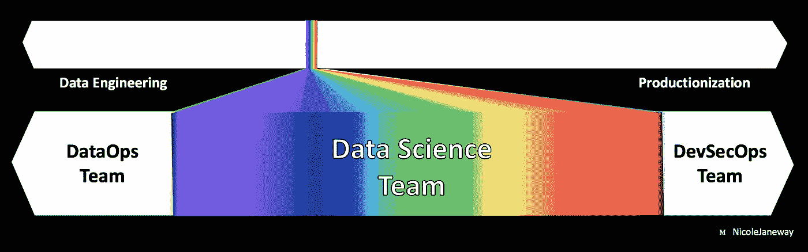

# 你的机器学习模型有可能失败吗？

> 原文：<https://towardsdatascience.com/data-science-planning-c0649c52f867?source=collection_archive---------25----------------------->

## b [理解大数据](https://towardsdatascience.com/tagged/making-sense-of-big-data)

## 规划过程中要避免的 5 个失误

由 [Artem Maltsev](https://unsplash.com/@art_maltsev?utm_source=medium&utm_medium=referral) 在 [Unsplash](https://unsplash.com?utm_source=medium&utm_medium=referral) 上拍摄的照片

**TL；博士** —在机器学习中产生出色的统计分析和突破的意图中，不要被数据科学规划过程中的这**五个常见错误**绊倒。

[作为一名联邦顾问](/6-months-data-science-e875e69aab0a)，我与从事科学研究、支持退伍军人、提供医疗服务和维护医疗供应链的美国政府机构合作。数据科学是一个非常重要的工具，可以帮助这些团队推进他们的任务驱动的工作。我在确保我们**不会在数据科学模型上浪费时间和精力**方面投入了大量精力:

*   不要投入生产
*   不要提供可操作的见解
*   不要让某人的生活变得更容易

根据我的经验，我将分享来之不易的关于数据科学规划过程中的五个失误的教训，如果你遵循这些建议，就可以避免这些失误。

1.  [关注敏捷性和多样性](#0abd)
2.  [针对最终用户需求的设计](#bcfd)
3.  [生产计划](#dfc4)
4.  [了解数据债务](#4575)
5.  [追求机器学习之外的选择](#fb79)

## 动机

就像可见光光谱一样，我们作为数据科学家所做的工作构成了更广泛范围的一小部分。数据科学家对数据生命周期的盲目会导致他们的机器学习项目失败。

数据科学只是支持组织中数据科学活动所需工作的一小部分。

数据生命周期跨越从*规划*到*归档*的整个旅程。在大型组织中，可能有一个单独的团队负责将数据整理成可用于高级分析的形式所需的[数据操作](https://medium.com/atlas-research/data-science-team-eae84b1af65d#155d)工作。可能还有另一个团队 [DevSecOps](https://medium.com/atlas-research/data-science-team-eae84b1af65d#a352) ，负责将模型投入生产的工作。在小型组织中，数据科学家可能负责管理端到端的数据管道。

无论您的组织处于这个范围的哪个位置，数据科学家在项目规划过程中拥有对数据生命周期的清晰观点都是有益的。在这篇文章中，我分享了五个建议，以支持项目规划所有阶段的高级分析、机器学习和模型部署。

首先，如果数据所有者、消费者和利益相关者共享基本水平的**数据素养**会很有帮助。 [*数据管理知识体系*](https://amzn.to/32oK8hH) 是很好的参考资料。

这个 600 多页的页面在我的数据科学咨询工作中仍然非常有用，并且在有人试图就数据管理的重要性与我争论时也非常有用。

阅读更多关于**如何获得数据管理技能**:

 [## 你从未听说过的最好的数据科学认证

### 数据策略最有价值培训实用指南。

towardsdatascience.com](/best-data-science-certification-4f221ac3dbe3) 

## #1 —关注敏捷性和多样性

敏捷方法指的是一套**价值和实践**来增强软件开发的灵活性和责任性。[敏捷宣言的四个价值观](https://agilemanifesto.org/):

1.  **个人和互动** *超过流程和工具*
2.  **工作软件** *综合文档*
3.  **客户协作** *合同谈判*
4.  **响应变更** *超过遵循计划*

一个由 17 个白人发明的项目规划规程与推进多元化有什么关系？敏捷鼓励**与代表整个组织中**不同职能角色**的利益相关者频繁互动**。

 [## 敏捷方法能释放多样性吗？

### 在过去十年左右的时间里，有很多研究表明，多元化提高了团队的创新能力…

medium.com](https://medium.com/iamtech-series/can-agile-methodology-unlock-diversity-6dd4db28d689) 

正如从商业角度来看，多样性会导致更好的软件的产生——性别、种族、民族和其他个人特征的多样性可以增强创造性解决问题的能力。

敏捷方法重视**对变化的响应**。它需要**快速的迭代周期**，这依赖于团队内部的**信任和开放**。像**回顾和回顾**这样的会议结构可以帮助团队停下来反思他们是否在为所有团队成员推广有效的工作方式。总之，敏捷团队应该利用这些实践和价值观，目的是充分享受多样性的好处。

[用 Booz Allen Hamilton 首席数据科学家兼该组织非裔美国人网络职业发展委员会主席 Sian Lewis](https://www.youtube.com/watch?v=h9ejBuHH99I&feature=youtu.be&t=225) 的话说:

> 无数研究表明，你的团队越多元化，他们就越成功。我把多样化等同于成功。我是一个人——我享受成功。

阅读更多关于多元化对业务成果的**影响**:

 [## 多元化赢了:包容有多重要

### 《多元化必胜》是麦肯锡调查多元化商业案例系列的第三份报告，紧随《为什么…

www.mckinsey.com](https://www.mckinsey.com/featured-insights/diversity-and-inclusion/diversity-wins-how-inclusion-matters) 

如何**关注敏捷性和多样性**:

*   在你的工作流程中设计**短迭代**并且**在每次迭代中获得涉众的反馈**
*   **积极寻求多样性**促进不同的思维方式
*   通过经常与你的团队讨论工作方式，创造一个开放和信任的环境

## #2 —为最终用户的需求而设计

数据科学文化鼓励[玩具项目](/build-full-stack-ml-12-hours-50c310fedd51)和 [Kaggle 竞赛](/10-data-science-competitions-for-you-to-hone-your-skills-for-2020-32d87ee19cc9)探索新的想法，磨砺技能，磨练舞蹈战斗技能。虽然这些能力很重要，但数据科学家还需要练习项目范围界定的关键技能。斗争#2 指的是认为数据科学计划可以在一开始没有彻底调查最终用户需求的情况下取得成功。

数据科学家应该采用 [**以人为中心的设计**](https://medium.com/atlas-research/model-selection-d190fb8bbdda#9d9b) 的方法，通过访谈直接向最终用户学习，然后反复测试并设计一个考虑了他们反馈的解决方案。虽然 HCD 的工作可以由大型组织中的独立团队来完成，但如果可能的话，数据科学家最好直接与用户合作。

*HCD 也是打开技术问题解决工具巨大新市场的钥匙。v* ia [99%隐形](https://99percentinvisible.org/episode/the-next-billion-users/)。

与谷歌的[下一个 10 亿用户计划](https://nextbillionusers.google/)合作， [99%不可见](https://99percentinvisible.org/)团队为全球新用户探索了软件开发的潜在陷阱:

*   *技术出错—* 试图将小店主的交易分类账数字化，而没有先咨询店主是否需要解决这个问题
*   *技术做得好—* 通过电影车提供基于网络的教育和娱乐

HCD 原则可以帮助产生**快乐的技术体验**，确保机器学习应用和人类用户之间的**无缝交接**，以及 [**尽可能最大程度地减轻负反馈循环**](https://medium.com/atlas-research/model-selection-d190fb8bbdda#1ac9) 。

阅读更多关于**HCD 对全球获取技术的影响:**

 [## 下一个十亿用户:超越西方的数字生活

### 下一个十亿用户:西方之外的数字生活 Amazon.com。*符合条件的免费*运输…

amzn.to](https://amzn.to/3pKrafk) 

如何**根据最终用户的需求进行设计**:

*   在项目早期创建一个**面试时间表**
*   确保数据产品**为最终用户解决问题**
*   **在每个迭代周期寻求反馈**

我只能想象这就是 Kaggle 如何决定决胜局。通过 [giphy](https://giphy.com/gifs/fallontonight-jimmy-fallon-tonight-show-jojo-siwa-1zJEcsB4MQ8DOAXCg6/links) 。

## #3 —生产计划

[87%的数据科学产品**从未投入生产**](https://venturebeat.com/2019/07/19/why-do-87-of-data-science-projects-never-make-it-into-production/) 。这些问题包括:

*   不切实际的利益相关者期望
*   未能使用敏捷方法和 HCD 进行计划
*   缺乏开发运维部署技能，如修剪和容器化

再加上一点数据科学的修补工作(*“我想我的 Jupyter 笔记本电池出了故障”*)——毫不奇怪，10 个数据科学项目中有 9 个永远见不到天日。

 [## 又一个 AI 冬天？

### 如何部署更多的 ML 解决方案——五种策略

towardsdatascience.com](/the-last-defense-against-another-ai-winter-c589b48c561) 

鉴于到目前为止我部署的唯一数据产品[是这个](/6-months-data-science-e875e69aab0a)[基于集群的 Neighborhood Explorer dashboard](/walkthrough-mapping-gis-data-in-python-92c77cd2b87a)，我将把它留给更有经验的人来指导您完成部署过程。[优利系统公司的机器学习顾问丽贝卡·比尔布罗](https://rebeccabilbro.github.io/kubernetes-ml-unboxing/)，也是[黄砖](https://www.scikit-yb.org/en/latest/index.html)软件包的共同创建者，她写道:

> 数据科学家应该了解如何部署和扩展他们自己的模型…过度专业化通常是一个错误。

她为数据科学推荐了 Kubernetes 上的课程和阅读材料。这个容器管理工具代表了云部署中的主导力量。**容器化**允许应用程序组件在各种环境中运行——例如其他计算机、服务器、云——并提供了虚拟机的轻量级替代方案，因为容器与主机操作系统共享资源，而不需要客户操作系统。

在开发中，容器有助于克服数据科学家、软件工程师和 DevOps 从业者使用的多种环境带来的挑战。在生产中，容器向客户交付**微服务**以响应网络请求。

在云计算原生计算基金会调查的公司中，84%的公司在 2019 年使用容器进行生产，78%的公司使用 Kubernetes 来管理他们的部署。Kubernetes 提供了供应、联网、负载平衡、安全性和伸缩性——使容器部署简单、一致和可伸缩的所有必要元素。

随着容器化日益成为主流，这种方法为数据科学模型部署开辟了新的领域。缩放资源可以让一个模型更好地**服务** **需求高峰**。此外，Kubernetes 支持在边缘上进行**部署——减少延迟，节省带宽，改善隐私，并在总体上支持更智能的机器学习。此外，它还可以管理部署策略，如 **A/B 测试、蓝绿部署和金丝雀发布**。**

阅读更多来自 [Caleb Kaiser](https://medium.com/u/ae1782e046c3?source=post_page-----c0649c52f867--------------------------------) 的关于如何**优化你的生产模型**的内容:

 [## 如何降低机器学习推理的成本

### 优化推理成本的完整清单

towardsdatascience.com](/how-to-reduce-the-cost-of-machine-learning-inference-4b466be90ba4) 

如何**计划生产化**:

*   熟悉**部署工具**，如 [Heroku](https://www.heroku.com/) 、 [Streamlit](https://www.streamlit.io/) 、 [Docker](https://docs.docker.com/get-started/) 和 [Kubernetes](https://kubernetes.io/docs/home/)
*   **在规划阶段指定用于部署的资源**，尽早使用 [DevOps 专业知识](https://medium.com/atlas-research/data-science-team-eae84b1af65d#a352)
*   在您的部署策略中包括**监控和模型重新部署**的规范

## #4 —了解数据债务

如果您在[进行 EDA](/10-underrated-python-skills-dfdff5741fdf#1f2a) 时发现了数据质量问题，然后默默地继续进行您的数据科学项目，那么您正在使您组织的数据债务永久化。据数据战略家约翰·拉德里:

> 即使是最简单和最基本的数据管理，拖延的时间越长，都会产生巨大的成本。

术语**数据债务**为衡量与低质量数据相关的成本提供了量化和基本原理。它基于技术债务的概念，指的是选择快速和肮脏的解决方案而不是更深思熟虑的长期解决方案的影响。

正式的**数据治理文档**应该通过提出报告数据问题的计划来解决数据债务问题。这样，它们就可以在上游得到纠正。再次引用约翰·拉德里的话:

> 像所有的债务一样，数据质量问题最终必须偿还——要么随着时间的推移慢慢偿还(带利息),要么一大笔钱还清债务。

在问题的源头解决问题要比在分析阶段进行临时修补好得多。一个有效的**数据质量报告过程**可以采取内部网门户的形式，在那里问题可以被发送到指定的数据质量团队(或者至少发送到数据源所有者)。

补救数据债务的行动不足是第四个难题，因为数据科学从业者通常没有接受过有效数据管理方面的足够培训。与软件开发和数据工程等更成熟的领域相比，很少有认证计划被视为数据科学家的标准。我真的希望在**数据策略** 中看到更多对[正式培训的强调。](/best-data-science-certification-4f221ac3dbe3)

阅读更多关于如何将软件工程的**最佳实践**应用于机器学习的信息:

 [## 5 篇必读的数据科学论文(以及如何使用它们)

### 让你在机器学习游戏中保持领先的基本理念。

towardsdatascience.com](/must-read-data-science-papers-487cce9a2020) 

如何**避免数据欠账**:

*   将高质量数据的好处和低质量数据的风险与您的**组织的战略目标**联系起来
*   授权最终用户**通过正式的数据质量报告流程向指定团队或数据源所有者报告数据质量问题**
*   进行**数据质量评估**，包括评估元数据的质量

## #5 —追求机器学习之外的选择

我们已经讨论了三个关键流程(**敏捷方法**、**以人为中心的设计**、和**数据质量报告**)以及两个支持数据科学的关键团队(**数据操作**和**开发安全操作**)。

冒着用我 3 磅重的 [*数据管理知识体系*](https://amzn.to/32oK8hH) *，*副本打你脑袋的风险，设置高级分析需要大量的幕后工作。[麦肯锡的数据科学顾问同意](https://www.mckinsey.com/~/media/McKinsey/Business%20Functions/McKinsey%20Analytics/Our%20Insights/Why%20data%20culture%20matters/Why-data-culture-matters.ashx)的观点，并警告说，不应该以科学项目的心态来对待计划。

艾肯数据框架通过 [*数据管理知识体系*](https://amzn.to/2F0MGcM)

与马斯洛的需求层次一样，如果不首先满足数据治理、数据架构、数据质量、元数据等方面的生理和安全需求，就无法实现数据科学。艾肯金字塔**的基础层**。

在假设需要用数据科学来解决组织挑战之前，有必要调查一下，在直接分析之后，将精力投入到数据质量改进项目中是否更好。[据商业情报专家罗布·柯利](https://www.dataengineeringpodcast.com/power-bi-business-intelligence-episode-154/):

> 最令人震惊的是我们要走多远。和我们一起工作的人都会说‘我们这里真的很原始’。我们远远落后于形势，”
> 
> 但是每个人都这么说。当我在 X 公司工作时，我认为世界上其他公司都把基础工作做好了。他们没有。
> 
> 每个人都还处于黑暗时代。

不是所有的问题都是数据科学的问题。组织的数据成熟度可能不足以进行高级分析。这没关系——正如罗伯所说:

> 下一件大事:有史以来第一次把基础做好。

数据科学是更大生态系统的一部分，是业务改进的重要组成部分，也是数据驱动行动的核心要素。它代表了数据相关活动的顶峰。因此，它需要得到强大的数据管理实践的支持。

阅读有关数据科学基础知识的更多信息**:**

** [## 如何进入数据科学领域

### 今年，我完成了一个训练营，并立即获得了一份数据科学的工作。如果我不得不回到过去，通过…

towardsdatascience.com](/new-data-science-f4eeee38d8f6) 

如何**追求机器学习之外的选择**:

*   通过 [**学习 SQL**](https://mystery.knightlab.com/) **和理解** [**数据建模**](https://amzn.to/3eQvPYe) 来投资您的数据工程技能
*   投资于您执行**直截了当的分析和传达**结果以进行有效决策的能力
*   确保数据科学概念证明**是为部署**而非学习而设计的** 

## **摘要**

**从事数据科学工作听起来很棒。通过帮助组织**利用他们的数据作为战略资产**，有很大的潜力让世界变得更美好。避免这 5 个潜在的问题将有助于提高您解决问题的能力，以交付有效的数据产品。**

****如果你喜欢这篇文章**，请在 [Medium](https://medium.com/@nicolejaneway) 、 [LinkedIn](http://www.linkedin.com/in/nicole-janeway-bills) 、 [YouTube](https://www.youtube.com/channel/UCO6JE24WY82TKabcGI8mA0Q?view_as=subscriber) 和 [Twitter](https://twitter.com/Nicole_Janeway) 上关注我，了解更多提高你的数据科学技能的想法。当“ [**资源在 2021 年增强您的数据科学**](https://page.co/brmmnm) ”发布时，请注册以获得通知。**

*****免责声明*** *:* 本文包含了一些书籍的附属链接，如[*【DMBOK】*](https://amzn.to/32oK8hH)， [CDMP 考试](/best-data-science-certification-4f221ac3dbe3)所需的参考指南。通过这些链接购买书籍有助于支持我在数据科学和数据策略方面的写作——提前感谢。**

****在部署机器学习模型的道路上，你担心哪些漏洞？请在评论中告诉我。****

## **提升 Python 技能的文章**

** [## 10 项被低估的 Python 技能

### 使用这些技巧来改进您的 Python 编码，以获得更好的 EDA、目标分析和功能，从而提升您的数据科学水平

towardsdatascience.com](/10-underrated-python-skills-dfdff5741fdf)  [## 面向临床文本的命名实体识别

### 使用 pandas 将 2011 i2b2 数据集重新格式化为用于自然语言处理(NLP)的 CoNLL 格式。

medium.com](https://medium.com/atlas-research/ner-for-clinical-text-7c73caddd180)  [## 如何利用 Spotify 的 API 并在 Streamlit 中创建用户界面

### 如何交互式可视化 Spotify API 数据的演练

towardsdatascience.com](/how-to-utilize-spotifys-api-and-create-a-user-interface-in-streamlit-5d8820db95d5)  [## 我看到你没有戴面具…

### 我如何使用 Keras 制作我的第一个图像分类模型

towardsdatascience.com](/so-i-see-that-youre-not-wearing-a-mask-6631746c7559)  [## 越狱

### 我们应该如何设计推荐系统

towardsdatascience.com](/how-to-design-search-engines-24e9e2e7b7d0)**