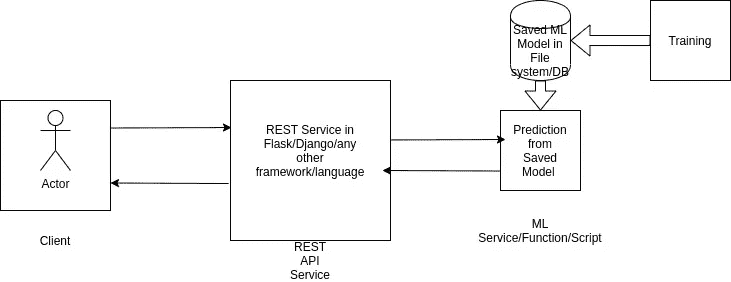
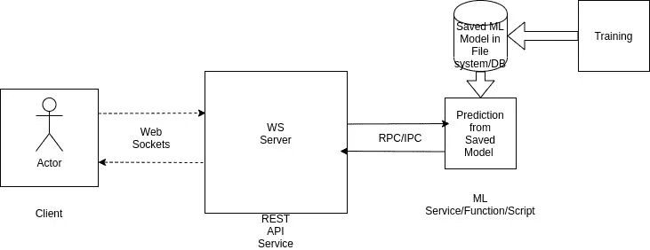
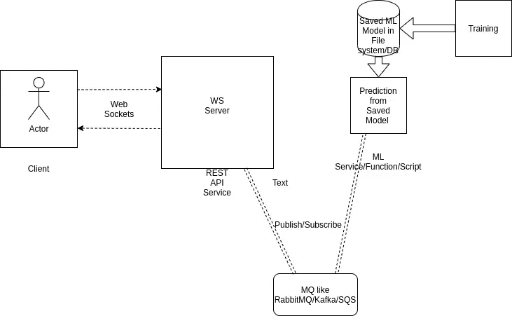
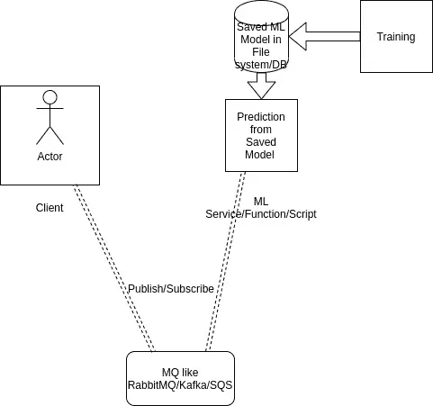

# 数据科学生产管道-分布式设计方法

> 原文：<https://towardsdatascience.com/data-science-production-pipelines-distributed-design-approach-d1e9dd6e6c3b?source=collection_archive---------29----------------------->

## 针对生产环境的大规模数据科学管道中涉及的“如何”和“什么”设计方法的系统指南(但也可用于开发/测试环境)。

> 生产级数据科学应用程序的架构设计非常类似于将正确的部分放在正确的位置，同时考虑很少的前进。

来源:[像素](https://www.pexels.com)

*案例研究*-**建立分类模型，根据声纳信号检测表面是金属还是岩石**

代码脚本、数据信息和配置可在[**https://github . com/bmonikraj/medium-data science-pipeline-tutorial**](https://github.com/bmonikraj/medium-datascience-pipeline-tutorial)找到

我们将在*讨论*各种部署方法的*架构风格*，更多地关注这些方法的优缺点，并强调这些方法的关键领域。因此，我们不太关注代码中到底发生了什么。如果你想讨论更多关于分布式开发模式和机器学习实现的内容，请发邮件到 [bmonikraj@gmail](mailto:bmonikraj@gmail) 进行进一步讨论。

我仍然建议您浏览上述 Github 库，并按照 README.md 文件中提到的说明，在您的机器上尝试这些，只是为了让您的手有点脏！

在阅读了 Github 存储库中的 README.md 之后，我将强调其中的要点，这些要点对我们的讨论至关重要:

1.  经过训练，其中一个工件组是{ predictor.py，clf_model.sav }。这可以被视为一个逻辑工件单元，我们在下文中将其称为 **_PREDICTOR_** 。
2.  另一个工件组是{ service.py }。这也是一个逻辑工件单元，我们在下文中称之为 **_SERVICE_** 。
3.  最后一个脚本(不会把它当成神器:D)是{ client.py }，可以用来测试:基本上是 **_CLIENT_** ，此后。

[泰勒·维克](https://unsplash.com/@tvick?utm_source=medium&utm_medium=referral)在 [Unsplash](https://unsplash.com?utm_source=medium&utm_medium=referral) 上拍摄的照片

## 我们的重点领域—

> 我们试图将重点放在部署 ML/数据科学模型即服务(MLaaS/DSaaS)的用例上。

## 设计(1)——服务于 ML 服务的 REST APIs

架构图-> **使用 ML 服务作为 REST APIs 的阻塞调用机制|** 来源:作者设计

**建筑-**

*   _CLIENT_ 是使用输入进行呼叫的客户端(HTTP 客户端，可以是脚本、web 应用程序、移动应用程序、桌面应用程序等)。
*   对作为 REST 端点的 _SERVICE_ 进行的 HTTP 调用
*   _SERVICE_ 对同一平台内的 _PREDICTOR_ ML 服务/函数/脚本进行远程过程调用/基于进程间通信的调用。
*   响应以相反的方向流动，从 _ PREDICTOR _--> _ SERVICE _--> _ CLIENT _。
*   更容易实现授权/身份验证模型，因为 _SERVICE_ 充当实现控制的业务层。
*   模型应该是静态的。

**优点-**

*   易于实现，非常熟悉各大开发商
*   没有分布式设计，因此没有令人头痛的同步问题
*   _SERVICE_ 和 _PREDICTOR_ 保持在相同的平台上，因此没有平台间通信(服务器间)的开销。
*   设计得相当快。
*   适用于预测时间非常快的用例(可以使用分析器进行验证)
*   更容易实现授权/身份验证模型，因为 _SERVICE_ 充当实现控制的业务层。

**缺点-**

*   服务和预测者之间的往返时间必须小于客户端和服务之间的 HTTP 超时时间
*   需要较长时间的 ML 预测在这些情况下很难实现，因为它将面临超时。
*   大多数情况下，不适合大数据使用情形。

## 设计(2)——为 ML 服务的网络套接字

架构图-->**使用 ML 服务作为套接字的非阻塞调用机制|** 来源:作者设计

**建筑-**

*   _CLIENT_ 是使用输入进行呼叫的客户端(Web Socket 客户端，可以是脚本、Web 应用程序、移动应用程序、桌面应用程序等)。
*   对 WS 服务器 _SERVICE_ 进行的 WS 调用。
*   _SERVICE_ 在同一平台内对 _PREDICTOR_ ML 服务/函数/脚本进行远程过程调用/基于进程间通信的调用。
*   响应以相反的方向流动，从 _ PREDICTOR _--> _ SERVICE _--> _ CLIENT _
*   更容易实现授权/身份验证模型，因为 _SERVICE_ 充当实现控制的业务层。
*   模型应该是静态的。

**优点-**

*   实现起来并不困难，对主要的开发者非常熟悉，并且在 WS 实现上有很好的社区支持。
*   没有分布式设计，因此没有令人头痛的同步问题
*   _SERVICE_ and _PREDICTOR_ 保持在同一平台上，因此没有平台间通信(服务器间)的开销。
*   设计得相当快。
*   适用于预测时间非常快的用例(可以使用分析器进行验证)
*   _SERVICE_ 和 _PREDICTOR_ 之间的往返时间并不重要，因为无论何时响应就绪，它都会被发送到 _CLIENT_ by _SERVICE_ 中。因此，对客户端的响应是从服务推送的，而不是从服务拉取的。
*   更容易实现授权/身份验证模型，因为 _SERVICE_ 充当实现控制的业务层。

**缺点-**

*   _CLIENT_ 和 _SERVICE_ 之间的通信不是无状态的，因此 _SERVICE_ platform 的内存需求很高。
*   对于在一个时间单位内有多个连接的用例来说，这并不好，因为 _SERVICE_ 迟早会与 multiple _CLIENT_ 有非常多的打开连接。
*   _CLIENT_ 需要在 Socket base 的“发送”—“接收”机制中实现。

## 设计(3)——服务于 ML 服务的 Web Sockets 和 MQ[这在上面提到的 [Github](https://github.com/bmonikraj/medium-datascience-pipeline-tutorial) 库中实现]

架构图-> **使用 ML 服务作为套接字的无阻塞调用机制与 MQ|** 来源:作者设计

**架构-**

*   _CLIENT_ 是使用输入进行呼叫的客户端(Web Socket 客户端，可以是脚本、Web 应用程序、移动应用程序、桌面应用程序等)。
*   对 WS 服务器 _SERVICE_ 进行的 WS 调用。
*   _SERVICE_ 将输入消息发布到 MQ 上商定的主题，由 _PREDICTOR_ 使用，处理并再次将结果发布到 MQ 上的主题，由 _SERVICE_ 使用。
*   响应以相反的方向流动，从 _ PREDICTOR _--> _ SERVICE _--> _ CLIENT _
*   更容易实现授权/身份验证模型，因为 _SERVICE_ 充当实现控制的业务层。
*   模型应该是静态的。
*   MQ 需要高度可用和可靠，因为它可以作为单一的故障源。

**优点-**

*   分布式设计，因此可以通过云原生应用的 12 因素应用原则轻松实现云原生。
*   _SERVICE_ and _PREDICTOR_ 可以在不同的平台上，因此通过设计进行分布。可以垂直和水平缩放。
*   每个应用程序，如 _SERVICE_ and _PREDICTOR_ 都可以打包为 docker，并在 K8s、Docker Swarm、AWS EKS 等上进行编排，从而实现扩展。
*   适用于*预测时间不太快的用例*(可以使用分析器进行验证)
*   _SERVICE_ 和 _PREDICTOR_ 之间的往返时间并不重要，因为无论何时响应就绪，它都会被发送到 _CLIENT_ by _SERVICE_ 中。因此，对客户端的响应是从服务推送的，而不是从服务拉取的。
*   更容易实现授权/身份验证模型，因为 _SERVICE_ 充当实现控制的业务层。

**缺点-**

*   对于分布式应用程序，通过 MQ 进行通信，输入和它们各自的响应之间的同步变得至关重要，需要小心处理。
*   应用程序必须以相当云本地和 Devops 友好的方式编写。
*   _CLIENT_ 和 _SERVICE_ 之间的通信不是无状态的，因此 _SERVICE_ platform 的内存需求很高。
*   在进程间通信的 MQ 模型中，异步通信和回调没有什么困难。
*   _CLIENT_ 需要在 Socket base 的“发送”—“接收”机制中实现。

## 设计(4) —为 ML 服务的 MQ

架构图-> **使用带有 MQ 的 ML 服务的非阻塞调用机制|** 来源:作者设计

**建筑-**

*   _CLIENT_ 是带有输入的发布消息(客户端可以是脚本、web 应用、移动应用、桌面应用等)。
*   _SERVICE_ 已经不存在了。
*   _CLIENT_ 将输入消息直接发布到 MQ 上商定的主题，由 _PREDICTOR_ 使用，处理后将结果再次发布到 MQ 上的主题，由 _CLIENT_ 使用。
*   响应以相反的方向流动，从 _ PREDICTOR _--> _ CLIENT _
*   难以实施授权/身份验证模型，因为它必须完全分布式且专门用于实施控制。
*   模型应该是静态的。
*   MQ 需要高度可用和可靠，因为它可以作为单一的故障源。

**优点-**

*   分布式设计，因此可以通过云原生应用程序的 12 因素应用程序原则轻松实现云原生。
*   _PREDICTOR_ 可以是“n”个不同平台，因此通过设计来分布。可以垂直和水平缩放。
*   _PREDICTOR_ 可以打包为 docker，并在 K8s、Docker Swarm、AWS EKS 等平台上进行编排，从而实现扩展。
*   适用于*预测时间不太快的用例*(可以使用分析器进行验证)
*   _CLIENT_ 和 _PREDICTOR_ 之间的往返时间并不重要，因为无论何时响应就绪，它都会被发送到 _CLIENT_ by _PREDICTOR_ 中。因此，对 _CLIENT_ 的响应是从 _PREDICTOR_ 推入的，而不是从 _PREDICTOR_ 拉出的。
*   架构变得无状态。

**缺点-**

*   难以实现授权/认证模型 as _SERVICE_ 充当用于实现控制的业务层。
*   对于分布式应用程序，通过 MQ 进行通信，输入和它们各自的响应之间的同步变得至关重要，需要小心处理。
*   应用程序必须以相当云本地和 Devops 友好的方式编写。
*   在进程间通信的 MQ 模型中，异步通信和回调没有什么困难。
*   _CLIENT_ 需要在 MQ 协议的“发布”—“订阅”模型中实现。

正如在许多 ML 讲座、演讲、博客、书籍和文章中多次提到的，没有一个盒子适合所有尺寸。作为开发人员，我们必须正确理解业务用例、瓶颈、难点、需求、SLA 和成本，以选择一种部署拓扑。

毫无疑问，由于分布式、云原生和松散耦合拓扑以及 MQ 是服务间通信的核心，所以在 MQ 节点/集群的可靠性、高可用性和安全性方面需要非常小心。

正如我在上面重点介绍的“静态”模型一样，为了简单起见，当业务用例需要“动态”模型、需要频繁重新训练的模型、基于强化学习的不断变化的模型以及具有流和连续输入数据的模型时，我们甚至需要考虑“训练”阶段的分布式体系结构，其中有一个集中的模型存储位置，PREDICTOR_ 可以从中提取模型并进行预测。我们可以再次使用 RabbitMQ、Kafka、SQS 等 MQ 通过流接收数据，运行预定的后台作业(可能使用**芹菜**或**气流**)来训练模型，并在中央模型库为 _PREDICTOR_ consumers 发布模型。同样，这需要同步的另一个方面，这是需要注意的。

除此之外，使用基于 MQ 的分布式体系结构，如果需要，您可以实现“警报”机制。

在结束语上，感谢大家耐心看完这篇文章。对于讨论任何与本文相关的，甚至与本文无关的，带有一些令人毛骨悚然的 ML/部署用例/问题/障碍的内容，请不要犹豫，发送邮件至 [bmonikraj@gmail](mailto:bmonikraj@gmail) 。

乔恩·泰森在 [Unsplash](https://unsplash.com?utm_source=medium&utm_medium=referral) 上的照片