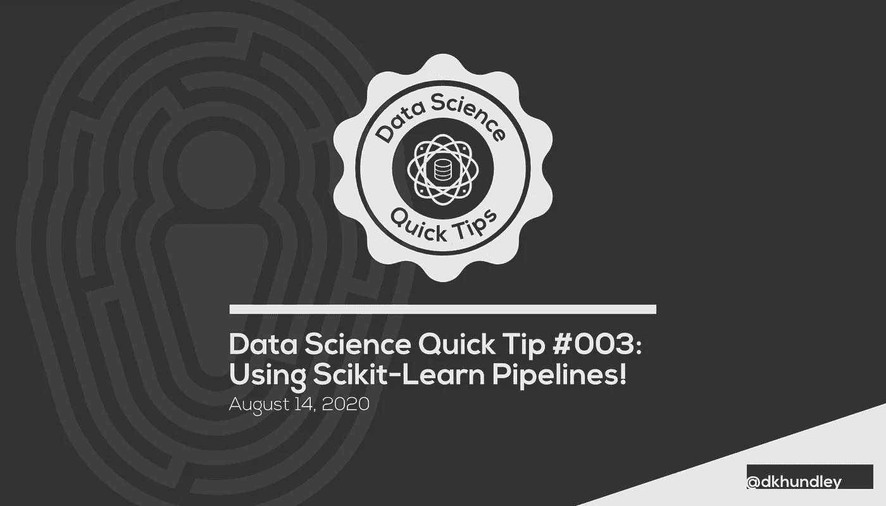
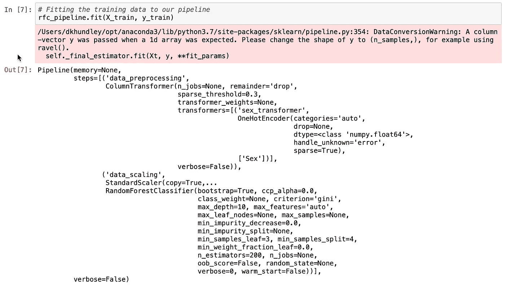
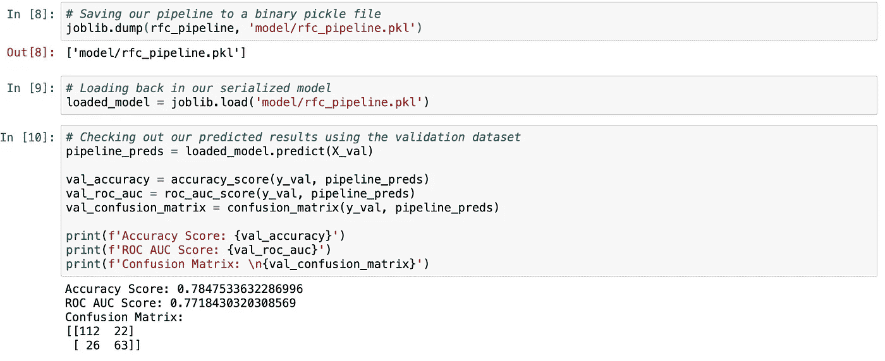

# 数据科学快速提示#003:使用 Scikit-学习管道！

> 原文：<https://towardsdatascience.com/data-science-quick-tip-003-using-scikit-learn-pipelines-66f652f26954?source=collection_archive---------23----------------------->



## 教你如何结合适当的数据转换器和预测算法在一个好的，干净的方式

又见面了，可爱的人们！本周，我们将带着另一个数据科学快速技巧回来，这个技巧分为两部分。在第一部分中，我们将介绍如何通过 Scikit-Learn 的准系统转换器使用 Scikit-Learn 管道，在下一部分中，我将教您如何在这个管道框架中使用您自己的定制数据转换器。(敬请关注那篇帖子！)

在进入正题之前，让我为这篇文章分享一下我的 GitHub，以防你想更深入地了解。我还包括了我们将要使用的数据。在此链接查看所有内容[。](https://github.com/dkhundley/ds-quick-tips/tree/master/003_sklearn_pipelines)

像往常一样，让我们从直觉开始，为什么你会想利用这样的东西。我假设您已经熟悉预测模型经常被导出到二进制 pickle 文件中的概念。这些二进制文件随后被导入到 API 等其他地方使用。这样，当您通过所述 API 接收数据时，您的反序列化 pickle 可以执行预测，并将结果发送回您热切而微笑的用户。

但是并不总是这样，您的数据将随时进入您的 API！在许多情况下，您必须做一些预处理工作，然后才能将它适当地放入模型中进行预测。我说的是像 one-hot 编码、缩放、输入等等。Scikit-Learn 包提供了许多这样的转换器，但是如果不使用管道，就必须序列化每个转换器。最后，您可能会得到 6–7 个序列化的 pickle 文件。不理想！

幸运的是，这正是 Scikit-Learn 的管道来拯救我们的地方。使用管道，您可以让数据一步一步地通过它需要采取的每个必要步骤，并最终通过模型，所有这些都在一个地方完成。在管道的最后，您得到一个序列化的 pickle 文件，它将为您完成所有适当的转换。得心应手！第一次看到这些管道时，了解它们可能会有点棘手，但是一旦掌握了窍门，就可以用它们做很多强大的事情。

所以对于我们今天在这里的项目，我们将利用[来自 Kaggle](https://www.kaggle.com/c/titanic/data) 的泰坦尼克号数据集。这是一个用于学习目的的常用数据集，因为它通常容易理解。正如你可能猜测的那样，是的，我们确实在谈论由利奥迪卡普里奥和凯特温丝莱特主演的臭名昭著的电影《泰坦尼克号》。(是的，他让我叫他利奥。)

该数据集包含了船上每个乘客的综合特征，以及他们是否幸存。大多数人使用这个数据集作为学习监督学习的手段，因为我们有一个明确定义的目标变量(“幸存”)。虽然我们对学习如何使用 Scikit-Learn 的管道感兴趣，但我不会说我们现在对获得高度准确的结果过于感兴趣。事实上，我们将从这个数据集中省略掉如此多的特征，以至于你绝对不应该指望我们的模型比掷硬币更好。

为了开始这个项目，我们将导入我们将使用的所有库以及训练数据集。我们还将继续将训练数据集分成训练集和验证集，这样您就可以看到稍后推理将如何工作。别担心，我们进口所有这些东西可能看起来令人生畏，但相对而言，每一件在这里都起着很小的作用。

```
# Importing the libraries we'll be using for this project
import pandas as pd
import joblib
from sklearn.preprocessing import OneHotEncoder, StandardScaler
from sklearn.compose import ColumnTransformer
from sklearn.pipeline import Pipeline
from sklearn.ensemble import RandomForestClassifier
from sklearn.model_selection import train_test_split
from sklearn.metrics import roc_auc_score, accuracy_score, confusion_matrix# Importing the training dataset
raw_train = pd.read_csv('data/train.csv')# Splitting the training data into appropriate training and validation sets
X = raw_train.drop(columns = ['Survived'])
y = raw_train[['Survived']]
X_train, X_val, y_train, y_val = train_test_split(X, y, random_state = 42)
```

好的，如前所述，我们将保持这个项目非常简单。对于我们的管道，我们将有三个基本步骤:数据预处理、数据缩放和使用随机森林分类器的预测建模。

首先，让我们通过对单个特征进行非常基本的转换来处理数据预处理。“性别”特征包含数据集中每个人的二元“男性”或“女性”特征，因为我们知道我们的模型需要处理数字数据，所以我们将对该特征执行简单的一次性编码。让我们设置我们的数据预处理器来做这件事。

```
# Creating a preprocessor to transform the 'Sex' column
data_preprocessor = ColumnTransformer(transformers = [
    ('sex_transformer', OneHotEncoder(), ['Sex'])
])
```

同样，这在现实世界中是一件非常糟糕的事情，因为我们只利用了一个单一的特性，但是我们这样设置我们的转换器的原因是因为我们可以在以后将定制的转换器添加到这个相同的数据预处理器中，以便用更多的特性做一些额外的有趣的事情。现在，我不想在一篇文章中做太多的事情，所以我们将在下一篇文章中讨论这个问题。

一般来说，数据预处理步骤是最复杂的，这也是我们将它分离出来的原因。其他步骤非常简单，现在我们已经创建了数据预处理器，我们可以将数据缩放器和 RandomForestClassifier 捆绑到一个统一的管道中。管道将按照您的顺序让数据通过每一个步骤，所以请确保您的步骤顺序正确！(不要担心模型超参数。我只是复制/粘贴了我曾经做过的另一个东西。)

```
# Creating our pipeline that first preprocesses the data, then scales the data, then fits the data to a RandomForsestClassifier
rfc_pipeline = Pipeline(steps = [
    ('data_preprocessing', data_preprocessor),
    ('data_scaling', StandardScaler()),
    ('model', RandomForestClassifier(max_depth = 10,
                                     min_samples_leaf = 3,
                                     min_samples_split = 4,
                                     n_estimators = 200))
])
```

和朋友，差不多就是这样。这个新的管道对象非常容易交互，因为它继承了与管道中最后一步相关的函数。在我们的例子中，这意味着就像我们用不在管道中的 RandomForestClassifier 拟合数据一样拟合我们的数据。您还可以在输出中看到管道在适当拟合数据时所经历的步骤。

```
# Fitting the training data to our pipeline
rfc_pipeline.fit(X_train, y_train)
```



将数据拟合到管道中

既然我们已经将数据放到了管道中，那么就可以对其进行序列化并用于推理了。为了说明这是成功的，我将模型转储到一个序列化的 pickle 文件中，将 pickle 文件反序列化到一个新的模型对象中，并针对我们的验证集使用新的模型对象。

```
# Saving our pipeline to a binary pickle file
joblib.dump(rfc_pipeline, 'model/rfc_pipeline.pkl')# Loading back in our serialized model
loaded_model = joblib.load('model/rfc_pipeline.pkl')# Checking out our predicted results using the validation dataset
pipeline_preds = loaded_model.predict(X_val)val_accuracy = accuracy_score(y_val, pipeline_preds)
val_roc_auc = roc_auc_score(y_val, pipeline_preds)
val_confusion_matrix = confusion_matrix(y_val, pipeline_preds)print(f'Accuracy Score: {val_accuracy}')
print(f'ROC AUC Score: {val_roc_auc}')
print(f'Confusion Matrix: \n{val_confusion_matrix')
```



使用反序列化模型对验证集执行推理

有趣的是，我们的准确性和 ROC AUC 分数并不太差，但我仍然知道这是一个糟糕的模型预测。尽管如果我没记错的话，我相信女性在泰坦尼克号的救援中被优先考虑，所以也许性别本身并不是一个坏的预测因素，就像我们在上面看到的那样。尽管如此，我永远不会把我的鸡蛋扔到单一功能的篮子里。

这篇文章到此结束！希望大家从了解 Scikit-Learn 的管道特性中获得一些价值。如上所述，请继续关注下一篇文章，这篇文章将进一步在这个管道框架中使用定制转换器。那我们就真的要用煤气做饭了！