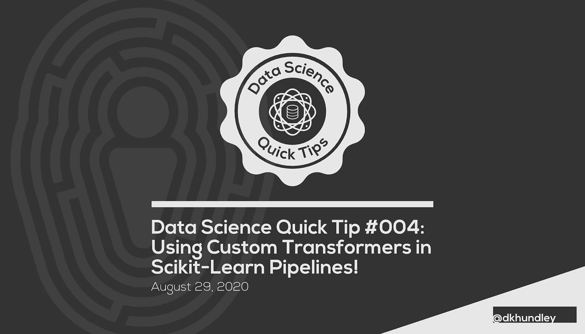

# 数据科学快速提示#004:在 Scikit 中使用自定义转换器-学习管道！

> 原文：<https://towardsdatascience.com/data-science-quick-tip-004-using-custom-transformers-in-scikit-learn-pipelines-89c28c72f22a?source=collection_archive---------37----------------------->



## 了解如何在同一个 Scikit-Learn 管道中使用定制数据转换器

大家好。关于如何创建 Scikit-Learn 管道，我们又回来了，这是上一篇文章的后续文章。如果你错过了，你现在可以点击链接查看[。(它现在正式发布到《走向数据科学》。w00t！)和往常一样，如果你想直接跟随这篇文章的代码，你可以在我的个人 GitHub](/data-science-quick-tip-003-using-scikit-learn-pipelines-66f652f26954) 找到[。](https://github.com/dkhundley/ds-quick-tips/tree/master/004_pipeline_custom_transformers)

为了快速结束上一篇文章，我们已经成功地创建了一个 Scikit-Learn 管道，它在一个干净的小包中完成了所有的数据转换、缩放和推理。但是到目前为止，我们不得不在我们的管道中使用 Scikit-Learn 的默认转换器。虽然这些变形金刚很棒，但是如果我们可以利用自己的自定义变形，那不是很棒吗？当然了！我认为这不仅很棒，而且很有必要。如果你还记得上周的帖子，我们建立了一个基于单一特征的模型。那可不太好预测啊！

因此，我们将通过添加两个转换器来转换训练数据集中的两个额外字段，从而解决这一问题。(我知道，从 1 个功能增加到 3 个功能仍然不是很好。但是，嘿，至少我们增加了 300%？)我们开始时的原始变量是“性别”(又名性别)，现在我们将为适当的“年龄”列和“上船”列添加 transformers。

在我们开始新的定制变形金刚之前，让我们先导入库。你可能还记得上一篇文章中的许多内容，但是我们增加了一些额外的内容。不要太担心它们现在是什么，因为我们将在后面的文章中进一步讨论。

```
# Importing the libraries we’ll be using for this project
import pandas as pd
import joblibfrom sklearn.preprocessing import OneHotEncoder, StandardScaler, FunctionTransformer
from sklearn.impute import SimpleImputer
from sklearn.compose import ColumnTransformer
from sklearn.pipeline import Pipeline
from sklearn.ensemble import RandomForestClassifier
from sklearn.model_selection import train_test_split
from sklearn.metrics import roc_auc_score, accuracy_score, confusion_matrix
```

我们将继续快速导入我们的培训数据。

```
# Importing the training dataset
raw_train = pd.read_csv(‘../data/titanic/train.csv’)# Splitting the training data into appropriate training and validation sets
X = raw_train.drop(columns = [‘Survived’])
y = raw_train[[‘Survived’]]X_train, X_val, y_train, y_val = train_test_split(X, y, random_state = 42)
```

好了，从现在开始，我们实际上不会改变 Scikit-Learn 管道本身。当然，我们会对其进行添加，但是请记住，我有意将我的数据预处理器设计成易于添加的方式。简单回顾一下上一篇文章，下面是构建原始管道的代码。

```
# Creating a preprocessor to transform the ‘Sex’ column
data_preprocessor = ColumnTransformer(transformers = [
   (‘sex_transformer’, OneHotEncoder(), [‘Sex’])
])# Creating our pipeline that first preprocesses the data, then scales the data, then fits the data to a RandomForestClassifier
rfc_pipeline = Pipeline(steps = [
   (‘data_preprocessing’, data_preprocessor),
   (‘data_scaling’, StandardScaler()),
   (‘model’, RandomForestClassifier(max_depth = 10,
                                    min_samples_leaf = 3,
                                    min_samples_split = 4,
                                    n_estimators = 200))
])
```

当然，在将自定义转换器添加到管道之前，我们可以做的第一件事是创建函数转换器！因此，正如您可能已经猜到的那样，定制转换器是建立在常规函数之上的，因此您可以为转换器编写任何您想要的 Python 函数。****(我们稍后将讨论所有这些星号……)

好了，我们讨论了为两个新变量添加两个转换器，现在让我们开始创建两个自定义 Python 函数吧！首先触及“年龄”列，我们将对这个变量有一点额外的乐趣。现在，我真的不知道年龄本身是否是一个预测变量，但我猜想，如果“年龄”可以以任何有意义的方式预测，它将是年龄类别/年龄箱。也就是说，我将年龄划分为“儿童”、“成人”、“老人”等类别。同样，我不知道这是否会比使用直接整数更有性能，但它让我们可以做一些有趣的事情！下面是这样的代码:

```
# Creating a function to appropriately engineer the ‘Age’ column
def create_age_bins(col):
    ‘’’Engineers age bin variables for pipeline’’’

    # Defining / instantiating the necessary variables
    age_bins = [-1, 12, 18, 25, 50, 100]
    age_labels = [‘child’, ‘teen’, ‘young_adult’, ‘adult’, ‘elder’]
    age_imputer = SimpleImputer(strategy = ‘median’)
    age_ohe = OneHotEncoder()

    # Performing basic imputation for nulls
    imputed = age_imputer.fit_transform(col)
    ages_filled = pd.DataFrame(data = imputed, columns = [‘Age’])

    # Segregating ages into age bins
    age_cat_cols = pd.cut(ages_filled[‘Age’], bins = age_bins, labels = age_labels)
    age_cats = pd.DataFrame(data = age_cat_cols, columns = [‘Age’])

    # One hot encoding new age bins
    ages_encoded = age_ohe.fit_transform(age_cats[[‘Age’]])
    ages_encoded = pd.DataFrame(data = ages_encoded.toarray())

    return ages_encoded
```

好了，接下来是“上船”专栏。现在，这已经*几乎*准备好进行直接的热编码了，但是我们不能直接跳到那里的原因是因为这个列中有一些空值。这些需要首先解决，所以这里是我们将在这里使用的自定义转换器。

```
# Creating function to appropriately engineer the ‘Embarked’ column
def create_embarked_columns(col):
    ‘’’Engineers the embarked variables for pipeline’’’

    # Instantiating the transformer objects
    embarked_imputer = SimpleImputer(strategy = ‘most_frequent’)
    embarked_ohe = OneHotEncoder()

    # Performing basic imputation for nulls
    imputed = embarked_imputer.fit_transform(col)
    embarked_filled = pd.DataFrame(data = imputed, columns = [‘Embarked’])

    # Performing OHE on the col data
    embarked_columns = embarked_ohe.fit_transform(embarked_filled[[‘Embarked’]])
    embarked_columns_df = pd.DataFrame(data = embarked_columns.toarray())

 return embarked_columns_df
```

既然我们已经编写了自定义函数，我们终于可以将它们添加到管道中了。你可能不知道，但是 Scikit-Learn 有一个特殊的方法来处理这些特殊的自定义转换器，叫做 **FunctionTransformer** 。这很容易实现，所以让我们看看当我们把它添加到我们原来的管道时是什么样子。

```
# Creating a preprocessor to transform the ‘Sex’ column
data_preprocessor = ColumnTransformer(transformers = [
    (‘sex_transformer’, OneHotEncoder(), [‘Sex’]),
    (‘age_transformer’, FunctionTransformer(create_age_bins, validate = False), [‘Age’]),
    (‘embarked_transformer’, FunctionTransformer(create_embarked_columns, validate = False), [‘Embarked’])
])# Creating our pipeline that first preprocesses the data, then scales the data, then fits the data to a RandomForestClassifier
rfc_pipeline = Pipeline(steps = [
    (‘data_preprocessing’, data_preprocessor),
    (‘data_scaling’, StandardScaler()),
    (‘model’, RandomForestClassifier(max_depth = 10,
                                     min_samples_leaf = 3,
                                     min_samples_split = 4,
                                     n_estimators = 200))
])
```

很简单，对吧？使用 Scikit-Learn function transformer 指向正确的自定义函数，并在指定的列上使用它，这很简单。从现在开始，这是模型的简单导出。

```
# Fitting the training data to our pipeline
rfc_pipeline.fit(X_train, y_train)# Saving our pipeline to a binary pickle file
joblib.dump(rfc_pipeline, ‘model/rfc_pipeline.pkl’)
```

*** * * *回到星号时代！！！**

所以……..使用定制变压器也有不好的一面…

序列化模型不存储任何自定义 Python 函数的代码本身。(至少…不是以我还没想出来的方式。)也就是说， ***为了利用这个反序列化的模型，pickle 必须能够引用为其自身二进制值*** 之外的函数转换器编写的相同代码。或者通俗地说，您需要将您的定制 Python 函数添加到您为这样的模型编写的任何部署脚本中。

现在，这是不是有点烦人？是的。但是这给了我一个不使用定制转换的理由吗？这是一个简单而坚定的答案。我知道为管道运行提供额外的定制代码不太方便，但代价是进行转换，这可能会使模型的性能比其他情况好得多。

所以，是的，这有点糟糕，但嘿，我会选择包括自定义变形金刚每次最有可能。大多数数据集包含广泛的特征，这些特征肯定不会分解成简单的转换，如插补或一次热编码。真实的数据是杂乱的，经常需要大量的特殊清理，而这些定制的转换器正好适合这项工作。

这就是这篇文章的全部内容！希望你喜欢。如果你想让我在以后的帖子中涉及任何具体的内容，请告诉我！我脑子里还有更多的想法，所以请继续关注。😃