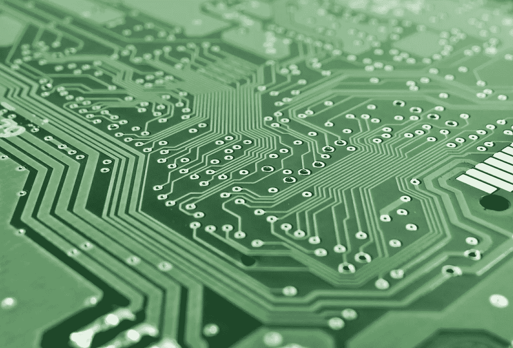

# 数据科学革命和我们的未来

> 原文：<https://towardsdatascience.com/data-science-revolution-and-our-future-f79680edc7c6?source=collection_archive---------33----------------------->

## 关于未来我们应该问自己的问题。

数据科学是应用数学和计算机科学的领域，用于理解和解释算法和机器产生的数据。这包括为利用任何数据或试图理解数据的含义而创建的类比和工具。2020 年是一个完美的时间来问我们应该如何为我们自己的利益利用数据科学。

数据科学革命

# 什么是数据科学

数据科学是一种用于大规模数据分析的软件和技术，用于根据非常少量的数据发现模式和开发统计模型。数据科学的核心是数据。多年来，为了提高数据分析的可扩展性，开发了许多工具、流程和材料。

数据科学有许多不同的方法。算法方法通常包括几个步骤。第一步是标准化。这是将数据转换成更容易处理的格式的时候。然后，数据被转换成计算机代码(例如，Python 脚本、另一种编程语言)并执行处理。一个重要的问题是模型应该做什么是否有限制。不允许做某件事的算法可能不如能做所有事的算法有用。

例如，如果法律或法规禁止将输出温度降低到 0 摄氏度，这可能会使任务变得无聊和不可能。相反，该解决方案可以在机器学习算法中实现，该算法是专门设计来遵循这些法律和法规的。

一个例子是有一个参数，称为权重，可以代表一个单独的网站的重要性。在这样的系统下，每个网站都将根据用户的评分获得权重。该模型将能够在每个网站和用户之间进行互动。然后，每个网站可以使用权重的影响来评估用户满意度，并决定是提升还是否决。与线性统计模型相比，这种系统对于监控单个网站的受欢迎程度和监控用户活动更有用。

处理多变量的一个优雅的框架是贝叶斯建模。给定模型和一些底层数据(可能包括数字和通信信号),计算模型的复杂度。数据转换为模型的方式(例如，依赖关系的形式)决定了复杂程度、参数数量以及模型与真实数据进行比较的次数。

例如，假设我们想知道镇上最受欢迎的餐馆的分数。该模型将基于客户的一些信息，如位置和评级数量。但这些信息对于真实衡量餐厅的受欢迎程度毫无价值。这需要更深入的知识来计算一个模型，比如你在什么时候提供什么样的菜肴，你的餐厅有多大，价格有多贵等等。

数据分析和数据科学有几种方法。一个简单的方法是运行一个传统的统计模型。但是，要找到具有大量数据的模式，有可能使用机器学习方法。

# 数据科学革命

我们正处于一场以数据方式出现的计算机革命之中。

您需要数据来构建业务视角并提取可操作的见解。如今，数据和数据科学可以说是成功创新的最关键因素，因为自动化创造了任何一个人都无法实现的更高效的替代方案。

数据可能是最必要的东西。数据科学家可以帮助人们可视化和理解数据，并获得基于证据的见解，以显示改进

个人计算的出现使得直接从世界任何地方收集数据成为可能，而最常用的数据点之一就是理解图片的能力。

另一个重要趋势是以低成本获取大数据。世界上有超过 10 亿人现在可以监测他们的健康状况或出于各种原因去医院就诊。数码摄影已经成为无处不在的图像来源，让我们能够快速了解我们周围的世界。

数据分析已经一次又一次地证明，它在解决严重问题方面做得非常好，例如贫困、违法犯罪、教育和事故预防。

想想大数据吧。让我们面对现实:并不是所有的数据都是有用的，尽管我们可以也应该聚合更多的数据。然而，当你分解数据时，你看到的是一幅充满噪音和中性的大图。所谓中立，我的意思是它与数据的实际意义无关。以股票期权和市场噪音为例，每天你都可以通过跟踪交易获得大量数据，如果你再加上所有的新闻，你就真正看到了大数据，而不是所有的数据都同样重要。

由于数据收集技术一年比一年好，数据科学家越来越难找。

# 数据科学教育的现在和未来

每个孩子都应该获得高质量的物理和数字教育，他们可以根据自己的兴趣自由选择学习内容。

政府应增加对自然灾害和重大灾害相关数据的研究支出，以便为人们提供更好的预防解决方案。

人们应该被允许消费他们想看的书或电影的内容，不管版权如何(或有一些豁免)，以更好地了解世界各地正在发生的事情。

数据应基于多个来源(如年龄、性别、位置和其他特征)归属于特定的人。这将允许我们控制数据科学模型中可能出现的任何偏差。

由于可视化是数据可以用来帮助人们理解他们周围发生的事情的主要领域之一，这样的方法可以应用于社会和文化。此外，算法几乎不可能掌握特定人的现实，在这方面，人工干预是必要的。但算法擅长平均，并对我们的需求给出一个“近似的好答案”。这就是为什么在我们的模型中考虑偏见是重要的。

从这个角度来看，我们要提出的主要问题是，什么是好的数据科学家。答案很简单:视情况而定。但是这需要平衡技能，背景，学习的意愿，改变，实验，失败，继续实验来理解问题的现实以及技术如何帮助解决问题。如果我们能够实现这种平衡，优秀的数据科学家将为我们提供这些服务。

# 数据科学有广泛的应用

然而，有几个领域的数据是特别重要的。

最重要的一个很可能是教育。我们在学校收集的大量数据可以用来帮助孩子们学习数学和数据科学，以及更多。基于数据的教育变革将惠及所有人。此外，教育和数据驱动的决策，如建立公共机构，在社会运作中往往是联系在一起的。

第二个最重要的领域是医疗保健。在数据领域有无数创新的医疗保健方法，如在疾病情况下生成特定数据的干预措施。数据对于制定疾病预防战略以及对某些疾病的高级监测和监控也非常有用。它还应该能够创建由受影响的个人管理健康数据的个人系统。

第三个最重要的领域是我们的社交生活。地理信息形式的数据可以提供与公共交通、购物等相关的信息。它允许我们通过建议我们可能有兴趣购买的东西来优化我们的路线或购物时间。只要数据不被用于经济利益，也必须考虑数据隐私。

第四个最重要的领域是与教育、卫生保健和技术相关的研究。总会有创新的领域，我们总会需要数据。为了确保以最有效的方式使用数据，我们在推动与数据相关的趋势时必须非常小心，以免以后搬起石头砸自己的脚。

教育我们自己需要什么是了解我们的问题并找出解决方案的最好方法。

如果你想学习数据科学，可以看看我的两篇关于你可能想读的书的文章:

*   [2020 年你应该读的数据科学书籍](/data-science-books-you-should-read-in-2020-358f70e1d9b2)
*   [2020 年你应该看的机器学习书籍](/machine-learning-books-you-should-read-in-2020-344b44d9a11e)