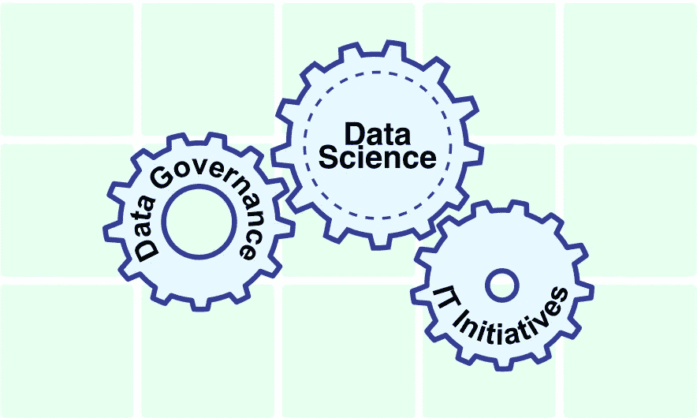
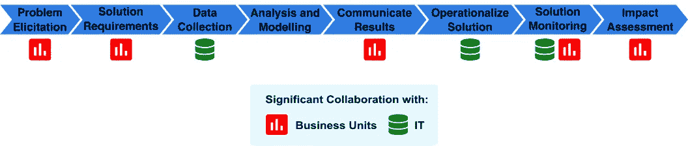

# 数据科学不应该等待

> 原文：<https://towardsdatascience.com/data-science-shouldnt-wait-c5d696c7e306?source=collection_archive---------31----------------------->

## 与其他计划并行启动数据科学

数据科学不应被推迟到数据治理和其他支持计划实施之后。虽然这需要利益相关方的额外努力，但数据驱动思想的增加、组织对数据科学工作流的熟悉程度以及对底线的影响都超过了成本。

来源:作者通过[入口实验室](https://inletlabs.com/)

**简介**

实施数据驱动型转型的企业通常从数据成熟度较低的点开始。由于孤岛式数据、糟糕的数据文档以及不熟悉数据计划等特征，在这些环境中有效实施数据科学项目非常困难。解决这些问题需要一个长期战略，包括数据治理、数据管理和合适的 IT 基础设施。但是，这并不意味着应该采取线性方法，将数据科学推迟到这些计划完成之后。相反，关键的数据科学项目应该同时实施。这使得组织能够更快、更有效地实现数据科学的竞争优势。

大多数老牌企业都没有以数字技术和分析为核心的战略。这意味着他们现有的业务结构、程序和政策既没有优化到开发数据科学解决方案，也没有得到最好的利用。这与当前的初创公司形成对比，后者从一开始就被设计为面向数据的。能够有效和高效地使用数据需要强调这些能力。没有开发这些能力的组织将具有较低的数据成熟度。

尽管数据成熟度通常应用于组织级别，但采用更细粒度的视角是有用的，尤其是在组织规模增加的情况下。这是因为不同业务部门的数据成熟度可能不同。在这里，我们考虑环境级别的数据成熟度，其中环境是根据上下文以适当的规模度量的。这使我们可以讨论这样的情况:一个组织在一个业务单元中使用数据时可能非常复杂，但在另一个业务单元中却不成熟。

本文中的低数据成熟度环境将由两个因素来定义。第一个因素是很少的数据科学能力，指的是可用于选择合适的数据科学项目并端到端实施它们的专业知识。第二个因素是缺乏数据治理/管理，这意味着没有流程来确保数据的可访问性、可用性和可靠性。

在这些环境中部署数据科学团队需要他们克服额外的障碍。可用于构建模型的数据可能不完整，收集时没有考虑背景，并且存在质量控制问题。及时获取数据通常很困难。这可能源于 IT 基础设施，因为数据存储在不同的系统中，这些系统之间可能无法互操作。对完整数据集的访问可能不会立即实现自动化。在管理方面，孤立的数据通常存在于多个利益相关者之下。获取所有相关数据可能需要协调多个业务和技术利益相关方。

鉴于这些困难，数据科学项目应该在低数据成熟度环境中开始吗？是否最好等到数据治理和数据管理等计划完成之后？

与这些计划同时启动数据科学项目提供了两个关键的业务优势。首先，尽管存在上述困难，但数据科学团队可以交付直接影响底线的产品。他们可以创造的价值通常大于在低数据成熟度环境中运营的额外成本。其次，早期项目是管理层、IT 和数据团队习惯于彼此合作的基础机会。每个企业都有独特的运营环境，需要一个将数据科学集成到工作流和流程中的迭代流程。

**早期数据科学项目可以提供出色的投资回报**

最初的数据科学工作可以提供出色的投资回报。一个好的方法是针对那些被忽视的或以初级方式解决的问题。它不应取代关键业务产品、服务或运营。经验表明，这类问题普遍存在于没有强大数据能力的企业。等到基础数据计划就绪后再解决这些问题的成本比立即着手解决这些问题的成本更高。

> 等到基础数据计划就绪后再应对挑战的成本比立即着手应对挑战的成本更高。

例如，在自然资源领域，许多机械设备现在都配备了物联网传感器，可以提供关于当前操作条件的实时信息。早期的数据科学项目可以识别数据中的异常情况，建议操作员检查特定的组件。这个项目的输出可以在以后用于数据驱动的预防性维护计划，从而最大限度地减少维修成本和停机时间。

在零售银行等行业，公司提供多种产品，其中只有一小部分与特定客户相关。这个子集随着时间和客户环境的变化而变化。虽然银行在处理风险时是高度复杂的数据用户，但许多小型和区域性银行尚未将数据驱动的营销方法列为优先事项。在这种情况下，最初的数据科学项目可以确定营销产品的下一个最佳行动。

数据科学也与管理决策相关。领导者经常用直觉来指导他们的决策，但是他们也被要求用数据来支持直觉。在最简单的层面上，数据科学团队可以用来报告相关数据，并通过汇总统计和可视化有效地交流内容。例如，在教育领域，大学需要在几年的时间内分配资源并规划固定容量的基础设施。报告允许基于当前登记和简单的历史趋势进行规划。一个更先进的数据科学项目允许对不同的场景进行建模，纳入人口变化和新政府政策等因素的影响。然后，管理层可以考虑一系列可能的结果，以及不确定性是什么。尽管存在不确定性，还是需要做出决策，因此即使早期项目提供了部分答案，它们仍然是有价值的。

**融入数据科学是一个教育过程**

构建数据科学能力对于数据科学家和组织来说都是一个教育过程。像所有的学习一样，这是一个需要时间、经验和实验的过程。在数据驱动型转型的早期推进数据科学项目将推动成熟度，并确保数据团队和组织拥有“软”技能来利用改善数据治理和管理的成果。这种教育包括什么？

> *构建数据科学能力是对数据科学家和组织的一个教育过程。像所有的学习一样，这是一个需要时间、经验和实验的过程。*

数据科学家需要了解企业如何运营、企业的战略计划以及市场定位。这为他们的工作提供了背景。没有这些知识，项目很可能交付不足，或者没有交付价值。数据科学项目失败的一个常见模式是，实施了强大的技术解决方案，但未能获取重要的业务知识。例如，一家户外运动零售商可能在 8 月份收到其装运的滑雪设备，但在冬季到来之前不会将它们存放在零售场所。在漫长的秋天，这可能不会发生，直到 11 月。一个先进的库存管理系统，天真到滑雪的季节性，已经把滑雪板在 11 月清仓，因为事实上有限的库存在那之前已经卖完了。他们的工作环境将数据科学家与组织寻求的商业价值联系起来。

成功的数据科学需要数据科学家、技术利益相关者和业务所有者之间的协调。信任是成功的关键因素。与其他计划同时开始数据科学项目可以为发展关系留出时间。被带入组织的数据科学家可能以前没有在特定部门工作过，并且其可能的业务所有者以前没有与数据科学家合作过。这要求两个团队在术语、沟通以及观点方面保持一致。这些不同的利益相关者之间的对话不仅对于执行项目至关重要，对于找到一组既符合数据科学又能创造商业价值的项目也是如此。

来源:作者通过[入口实验室](https://inletlabs.com/)

数据是数据科学项目成功的关键。但是由于数据通常是孤立的，最初很难理解哪些数据是可用的。记录的或认为收集的数据与数据库中实际发现的数据之间往往存在差异。收集数据的真实世界条件和数据收集的背景很重要。数据科学家需要了解这两者，因为它们会影响数据的质量及其对不同分析的适用性。尽早启动数据科学项目有助于确定是否应该收集额外的或不同的数据，以及是否应该通过替代数据源来扩充内部数据。数据科学家和企业所有者都需要时间来评估组织中数据收集的对象、内容、原因、地点和方式。

完成初始数据科学项目的过程将揭示价值创造的潜在未来方向。新的想法通常来自于处理数据，以及接近业务流程。数据科学家在准备和探索数据集时，往往会发现意想不到的见解。数据科学的工作就是对数据和业务流程保持好奇。在与业务利益相关方的合作中，数据科学项目可以成为创新的重要驱动力。尽早开始几个关键的数据科学项目将会为未来的项目发现新的机会。

数据科学项目不会随着分析或算法的创建而结束。输出需要在生产中实现，才能具有商业价值。在最后一英里实施数据科学将需要新的工作流程和思维。例如，嵌入在产品中的输出(例如推荐引擎)与开发人员熟悉的标准软件或 web 产品有不同的需求。对于一线员工或不习惯使用数据产品的决策者，可能需要更多时间来接受解决方案。早期数据科学项目将有助于清除这些障碍。

**结论**

数据科学不应被推迟到数据治理和数据管理计划实施之后。虽然这将需要利益相关者的额外努力，但两个关键的好处超过了成本。首先，即使在数据成熟度较低的环境中，数据科学团队也可以交付具有净收益的产品。其次，将数据科学集成到组织中的过程对于数据科学家和组织都具有重要的教育意义。这种教育所需的“软”要求只能通过实施数据科学项目来开发。

*最初发表于*[T5【https://inletlabs.com】](https://inletlabs.com/2020/01/10/ds_shouldnt_wait.html)*。*