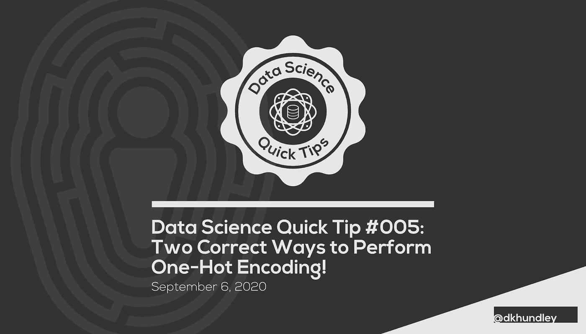
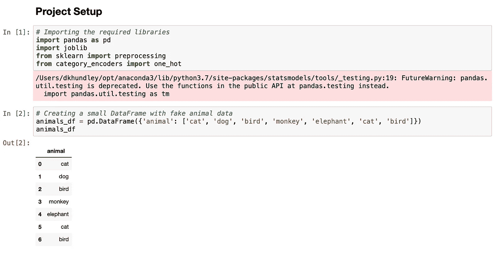
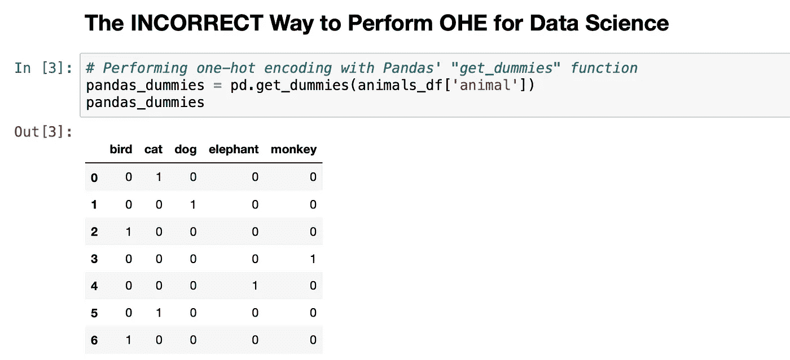
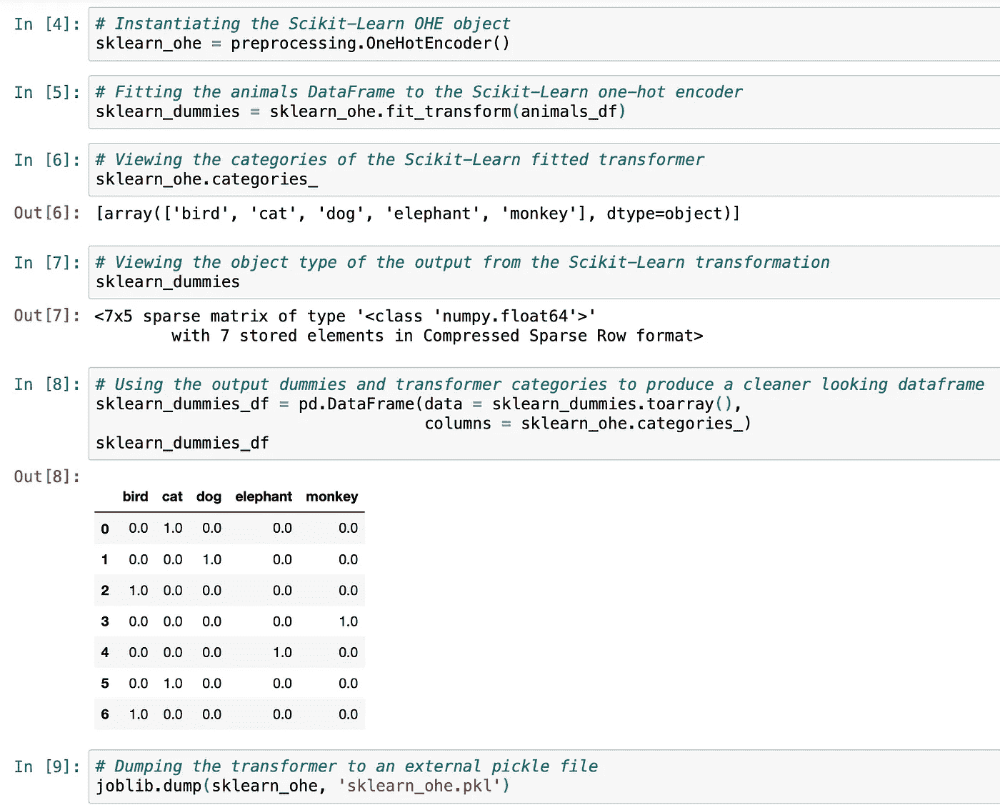
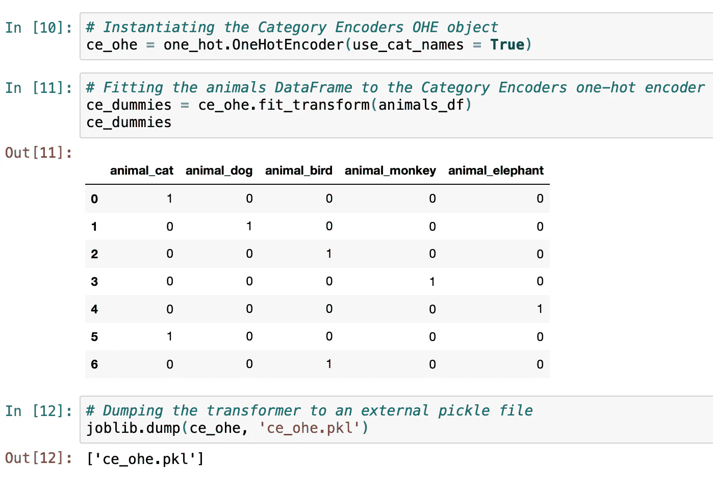
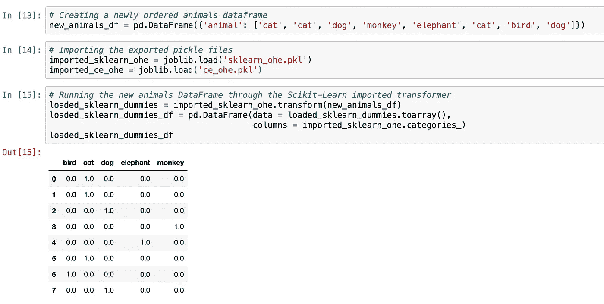
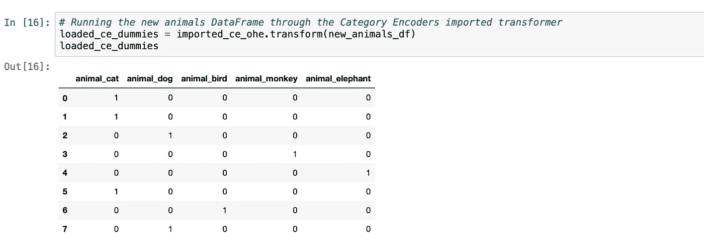

# 数据科学技巧#005:执行 One-Hot 编码的两种正确方法！

> 原文：<https://towardsdatascience.com/data-science-tip-005-two-correct-ways-to-perform-one-hot-encoding-7c21e1db7aa2?source=collection_archive---------27----------------------->



## 教你两种不同的正确方法来执行一键编码(和一种“错误”的方法)

大家好，大家好！我希望你们都享受一个愉快的劳动节周末。我个人也在周五休假，将周末延长到四天，在过去的几天里，我和女儿们度过了许多美好的时光。但是你知道我，我总是渴望保持一定的生产能力！

在我们开始这篇文章之前，请务必参考[我的个人 GitHub](https://github.com/dkhundley/ds-quick-tips/tree/master/005_two_ways_to_ohe) 中我们将在下面讨论的所有代码。这很简单，但是如果你想在一个简洁的 Jupyter 笔记本中学习，那么我鼓励你去看看。为了简洁起见，我不打算在这篇文章中讨论什么是热门编码，而是鼓励你[查看我以前的一篇文章](https://medium.com/@dkhundley/data-science-quick-tips-001-reversing-one-hot-encoding-b0c9a892356b)，在那里我会更彻底地讨论这个问题。

好的，所以当我第一次学习一键编码时，我很好奇的被告知一种我认为是数据科学领域“错误”的做法。这并不是说它不能产生编码的特征，而是它对于应用机器学习来说还不够。感觉我在遇到的所有教程中一遍又一遍地看到这种特殊的方法。

那种不正确的方式？熊猫的“get_dummies”功能。

为了演示为什么不使用 Pandas 的“get_dummies”以及为什么使用我将推荐的其他选项，让我们首先通过导入必要的 Python 库来快速设置我们的项目，并使用假动物数据创建一个微小的数据帧。(我将在下面解释我们正在导入的内容，以及如果您以前没有安装第二个选项，如何安装它。)

```
# Importing the required libraries
import pandas as pd
import joblib
from sklearn import preprocessing
from category_encoders import one_hot# Creating a small DataFrame with fake animal data
animals_df = pd.DataFrame({'animal': ['cat', 'dog', 'bird', 'monkey', 'elephant', 'cat', 'bird']})
```



如您所见，我故意复制了几个值来证明我们的编码可以工作。有了我们的数据框架，让我们继续，看看当我们使用[基本的熊猫“get_dummies”函数](https://pandas.pydata.org/pandas-docs/stable/reference/api/pandas.get_dummies.html)时会发生什么。

```
# Performing one-hot encoding with Pandas' "get_dummies" function
pandas_dummies = pd.get_dummies(animals_df['animal'])
```



你可能会想，问题出在哪里？这不是对我们有用吗？虽然它在这个非常特殊的实例中确实有效，但是这个方法*不*允许推理管道中的未来转换。J **就像我们为推理转换导出模型或数据缩放器一样，有*的*方法来导出一些东西以执行一致的一键编码**。不幸的是，熊猫的“get_dummies”不允许这样做。(为什么这一点没有在更多的数据科学课程中讲授得更好，这让我感到困惑！)

幸运的是，有一些方法可以解决这个问题，我将向您展示其中的两个方法！

第一个正确的方法内置在 Scikit-Learn 中。就像任何 ML 算法一样，有一个名为 OneHotEncoder 的 Scikit-Learn 库，它允许您将数据与实例化的编码器对象相匹配，然后根据需要转换类似的数据以适当填充所有列。

但是事情是这样的…我对 Scikit-Learn 的实现并不狂热。它可以工作，技术上也是正确的，但是它有一点点…不完整？自己看看下面的代码。

```
# Instantiating the Scikit-Learn OHE object
sklearn_ohe = preprocessing.OneHotEncoder()# Fitting the animals DataFrame to the Scikit-Learn one-hot encoder
sklearn_dummies = sklearn_ohe.fit_transform(animals_df)# Using the output dummies and transformer categories to produce a cleaner looking dataframe
sklearn_dummies_df = pd.DataFrame(data = sklearn_dummies.toarray(), 
                                  columns = sklearn_ohe.categories_)# Dumping the transformer to an external pickle file
joblib.dump(sklearn_ohe, 'sklearn_ohe.pkl')
```



正如您在 Jupyter 截图中看到的，转换后的数据帧的直接输出不是数据帧。它实际上是一个浮点值的稀疏矩阵。使用该输出确实可以生成一个数据帧，但是需要做一些额外的工作。不是不可能，但也不直观。我第一次了解这一点时，花了几个小时来思考这个输出。此外，它在结果中生成浮点值，而不是原始数据集中的整数值，这并不是预期的行为。但是这是可以改变的，所以我们仍然可以称它为正确的方法。

执行一键编码的第二个正确方法是使用[一个叫做**类别编码器**](https://contrib.scikit-learn.org/category_encoders/index.html) 的特殊 Python 库。如果你以前没有用过，你所要做的就是快速安装 pip 或 conda。为了方便起见，我将相应的 shell 命令粘贴在下面。

```
pip install category_encodersconda install -c conda-forge category_encoders
```

我实际上是在日常工作中被一些数据科学家同事介绍到这个库的，我个人更喜欢它，而不是 Scikit-Learn 的实现。我认为在下面的代码中原因很明显。[这是关于 OneHotEncoder 的 Category Encoder 版本的具体文档](https://contrib.scikit-learn.org/category_encoders/onehot.html)。

```
# Instantiating the Category Encoders OHE object
ce_ohe = one_hot.OneHotEncoder(use_cat_names = True)# Fitting the animals DataFrame to the Category Encoders one-hot encoder
ce_dummies = ce_ohe.fit_transform(animals_df)# Dumping the transformer to an external pickle file
joblib.dump(ce_ohe, 'ce_ohe.pkl')
```



如您所见，将数据拟合到转换器的输出产生了一个漂亮、干净的数据帧。此外，它将原始的“animal”列名附加上该列中的值，以生成干净的列名。现在，我实际上认为这是一个更好的实现，因为当您开始一键编码多个特性时，最好能在输出中知道它们最初来自哪个特性！

(如果有任何不好的地方，Scikit-Learn 的实现所转储的 pickle 文件要小得多，但是大小几乎可以忽略不计。我们在这里谈论的是字节对千字节，这几乎是什么，但我觉得我还是要与大家分享。)

为了证明这些变形金刚正在做我们希望它们做的事情，我从它们导出的 pickle 文件中重新导入了它们，并在一个新版本的动物数据帧上进行编码。它和原来的非常相似，但是我重新排列了值。

```
# Creating a newly ordered animals dataframe
new_animals_df = pd.DataFrame({'animal': ['cat', 'cat', 'dog', 'monkey', 'elephant', 'cat', 'bird', 'dog']})# Importing the exported pickle files
imported_sklearn_ohe = joblib.load('sklearn_ohe.pkl')
imported_ce_ohe = joblib.load('ce_ohe.pkl')# Running the new animals DataFrame through the Scikit-Learn imported transformer
loaded_sklearn_dummies = imported_sklearn_ohe.transform(new_animals_df)
loaded_sklearn_dummies_df = pd.DataFrame(data = loaded_sklearn_dummies.toarray(), 
                                         columns = imported_sklearn_ohe.categories_)# Running the new animals DataFrame through the Category Encoders imported transformer
loaded_ce_dummies = imported_ce_ohe.transform(new_animals_df)
```



瞧，成功了！当我们对原始数据集执行转换时，每个输出的转换都具有我们第一次看到的相同特征。我没有在这篇文章中演示它，但它甚至有一些内置的特性，这些特性规定了当传递未知值或空值时会发生什么样的正确行为。整洁！

这就结束了另一篇文章！尽管 Pandas 的“get_dummies”功能很好，但你真的不应该将它用于应用 ML 目的。它在类似 API 的东西中导致了一个非常容错的、不完整的实现，无论如何，使用 Scikit-Learn 或 Category Encoder 的 one-hot 编码器都更容易使用。希望你们都喜欢这个帖子！请务必查看我过去的提示，并在未来的帖子中推荐任何您想看到的内容！在那之前，我要结束了，祝你劳动节周末快乐。