# 使用数据科学和机器学习预测泰坦尼克号幸存者

> 原文：<https://towardsdatascience.com/data-science-titanic-challenge-solution-dd9437683dcf?source=collection_archive---------28----------------------->

## 海量数据下 K 近邻分类器(KNN)和决策树分类器的比较


照片由 [Alonso Reyes](https://unsplash.com/@alonsoreyes?utm_source=medium&utm_medium=referral) 在 [Unsplash](https://unsplash.com?utm_source=medium&utm_medium=referral) 上拍摄

# 介绍

这项挑战的目的是预测 20 世纪初泰坦尼克号灾难的幸存者和死亡人数。我们将使用两种机器学习算法来完成这项任务，K-最近邻分类器(KNN)和决策树分类器。我们将执行基本的数据清理和特征工程，并比较这两种算法的结果。

# 你会学到什么？

您将在这里练习两种分类算法，KNN 和决策树。您将学习如何通过清理数据和高级特征工程来准备数据以获得最佳结果。

# 问题定义

我们有两组数据。一个用于训练(train.csv ),包含我们将用于训练模型的生存和死亡信息。一个用于测试(test.csv)，没有生存和死亡信息，我们将使用它来测试我们的模型。

# 逐步解决方案

> 如果你还没有为数据科学设置你的电脑，请阅读我的文章[如何为数据科学设置你的电脑](https://medium.com/@pjarz/how-to-set-up-your-computer-for-data-science-9b880118ead)。

**创建项目文件夹**

在电脑上为一个名为“泰坦尼克号-挑战”的项目创建一个文件夹。

**从 Kaggle** 下载 train.cs 和 test.csv 数据集

[https://www.kaggle.com/c/titanic/data](https://www.kaggle.com/c/titanic/data)

将这些数据集放在项目文件夹中名为“data”的文件夹中。

**开始新的笔记本**

通过在终端/命令提示符下键入命令，进入此文件夹并启动 Jupyter Notebook:

```
$ cd “Titanic-Challenge”
```

然后

```
$ jupyter notebook
```

点击右上角的新建，选择 Python 3。


作者图片

这将在您的浏览器中打开一个新的 Jupyter 笔记本。将未命名的*项目名称重命名为您的项目名称，您就可以开始了。*

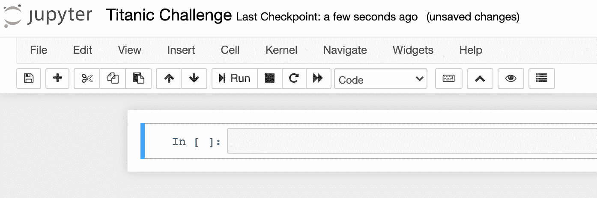

作者图片

如果您的计算机上安装了 Anaconda，那么您的计算机上已经安装了这个项目所需的所有库。

如果你正在使用 [Google Colab](https://colab.research.google.com/) ，打开一个新的笔记本。

# 加载库和设置

在新笔记本中，我们通常做的第一件事是添加我们在项目中需要使用的不同库。

# 加载泰坦尼克号数据

现在我们需要将数据集从我们下载的文件中加载到变量中，作为 Pandas 数据帧。

# 探索性数据分析

查看数据总是一个好习惯。

我们来看一下训练和测试数据。它们之间唯一的区别是*幸存者*一栏，该栏显示乘客是否在灾难中幸存。

下面也是对数据集中每个字段的解释。

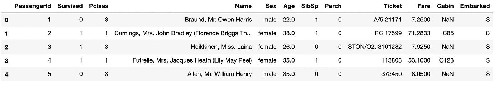

作者图片

*   PassengerId:乘客的唯一 Id
*   幸存:0 =否，1 =是
*   Pclass:乘客等级 1 =第一，2 =第二，3 =第三
*   姓名:乘客的姓名
*   性别:乘客的性别
*   年龄:乘客的年龄
*   SibSp:船上兄弟姐妹或配偶的数量
*   Parch:船上父母或孩子的数量
*   票证:票证 ID
*   票价:为车票支付的金额
*   客舱:客舱号
*   装船:装船港(C =瑟堡，Q =皇后镇，S =南安普顿)

现在让我们来看看列车数据帧的维度。

```
# Output
(891, 12)
```

我们可以看到训练数据集有 891 条记录和 12 列。

让我们对测试数据集做同样的事情。

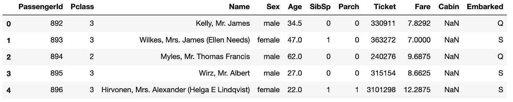

作者图片

```
# Output
(418, 11)
```

测试数据集的唯一区别是记录数为 418，列数为 11。我们在测试数据集中缺少了*幸存的*列。我们将使用我们将要构建的机器学习模型来预测*幸存的*列。

```
# Output
There are 1309 passengers in both data sets.
891 in train data set.
418 in train data set.
```

我们还可以看到，我们的数据集中有一些缺失数据(NaN 值)。为了让我们的分类模型有效地工作，我们必须对丢失的数据做些什么。我们将详细检查这一点，稍后再处理它，但现在让我们只看一下 Pandas info()函数，这样我们就可以了解丢失的值。

```
# Output
<class 'pandas.core.frame.DataFrame'>
RangeIndex: 891 entries, 0 to 890
Data columns (total 12 columns):
 #   Column       Non-Null Count  Dtype  
---  ------       --------------  -----  
 0   PassengerId  891 non-null    int64  
 1   Survived     891 non-null    int64  
 2   Pclass       891 non-null    int64  
 3   Name         891 non-null    object 
 4   Sex          891 non-null    object 
 5   Age          714 non-null    float64
 6   SibSp        891 non-null    int64  
 7   Parch        891 non-null    int64  
 8   Ticket       891 non-null    object 
 9   Fare         891 non-null    float64
 10  Cabin        204 non-null    object 
 11  Embarked     889 non-null    object 
dtypes: float64(2), int64(5), object(5)
memory usage: 83.7+ KB
```

我们可以看到在训练数据*年龄*、*舱*和*上船*有一些缺失值。

```
# Output
<class 'pandas.core.frame.DataFrame'>
RangeIndex: 418 entries, 0 to 417
Data columns (total 11 columns):
 #   Column       Non-Null Count  Dtype  
---  ------       --------------  -----  
 0   PassengerId  418 non-null    int64  
 1   Pclass       418 non-null    int64  
 2   Name         418 non-null    object 
 3   Sex          418 non-null    object 
 4   Age          332 non-null    float64
 5   SibSp        418 non-null    int64  
 6   Parch        418 non-null    int64  
 7   Ticket       418 non-null    object 
 8   Fare         417 non-null    float64
 9   Cabin        91 non-null     object 
 10  Embarked     418 non-null    object 
dtypes: float64(2), int64(4), object(5)
memory usage: 36.0+ KB
```

我们在测试数据集中也有类似的情况。

我们还可以使用 *isnull()* 函数检查*空值*。

```
# Output
PassengerId      0
Survived         0
Pclass           0
Name             0
Sex              0
Age            177
SibSp            0
Parch            0
Ticket           0
Fare             0
Cabin          687
Embarked         2
dtype: int64
```

```
# Output
PassengerId      0
Pclass           0
Name             0
Sex              0
Age             86
SibSp            0
Parch            0
Ticket           0
Fare             1
Cabin          327
Embarked         0
dtype: int64
```

这证实了我们之前的发现。

现在，让我们更详细地看一下，以便了解其中的内容。

一个好的方法是从数据中画一些图表。

在我们的项目中，我们将使用 Matplotlib 库来显示图表。

我们主要对幸存或未生还的乘客的特征感兴趣。

我们现在将创建一个函数，根据指定的特征显示乘客是否在泰坦尼克号灾难中幸存。

我们将只使用训练数据集，因为只有在这个数据集中我们才有生存信息。

现在，让我们为选定的功能构建图表。

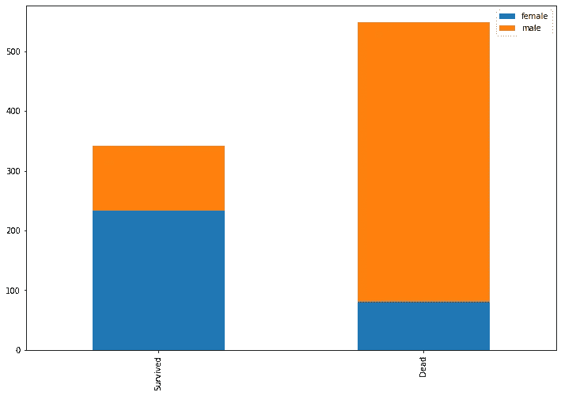

作者图片

我们可以看到存活下来的雌性明显多于雄性。我们对那些没有幸存下来的乘客有更重要的结果，女性与男性相比只占很小的比例。

现在让我们看看乘客级别。

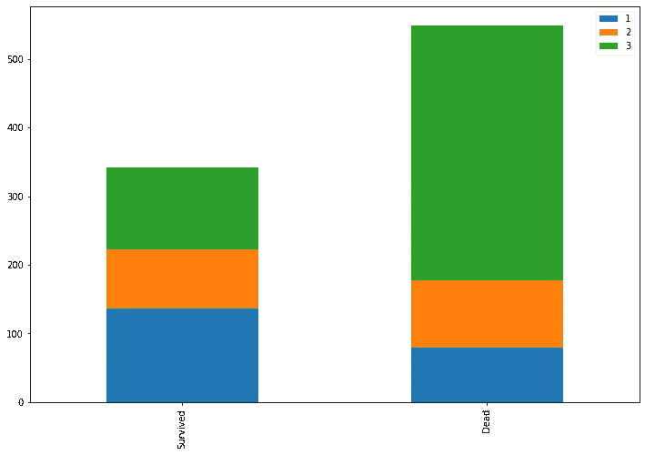

作者图片

我们可以看到，三等舱的乘客比一等舱的乘客更有可能死亡，一等舱的乘客有更高的生存机会。

特征和存活率之间的这些和其他关系对我们和我们的机器学习模型非常重要。

# 特征工程

一旦我们加载了数据集，并且很好地理解了我们正在处理的数据，我们将执行一些特征工程。

特征工程是为了提高机器学习模型的性能而从数据集中的现有特征中提取特征的过程。

通常，这意味着不仅要创建新的特征，还要替换丢失的值并移除对模型性能没有贡献的特征。

让我们再看一下我们的训练数据集中缺失的值。

```
# Output
PassengerId      0
Survived         0
Pclass           0
Name             0
Sex              0
Age            177
SibSp            0
Parch            0
Ticket           0
Fare             0
Cabin          687
Embarked         2
dtype: int64
```

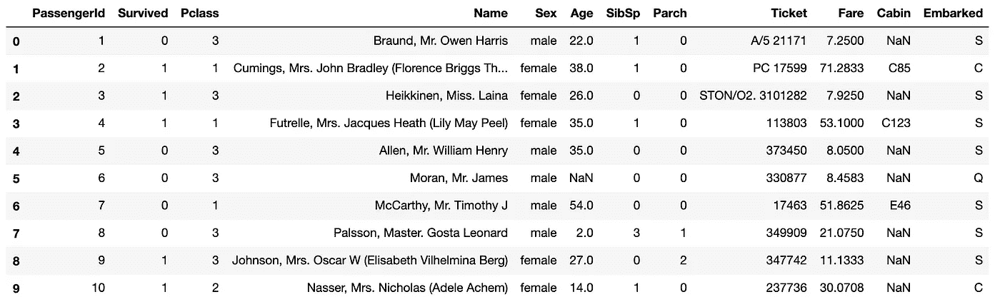

作者图片

# 用列的中值替换缺失值

“年龄”列中有许多缺失值。我们将用年龄列的中值来填充该列中所有缺失的值。中值是列的“中间”值。为了使数值更准确，我们将分别计算每个性别的中值。我们还将对训练和测试数据集执行此操作。

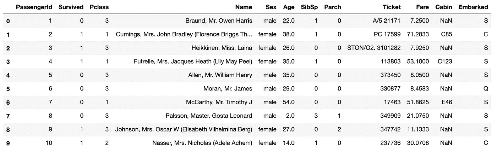

作者图片

我们可以看到所有的 *NaN* 值都被替换成了数字。

```
# Output
PassengerId      0
Survived         0
Pclass           0
Name             0
Sex              0
Age              0
SibSp            0
Parch            0
Ticket           0
Fare             0
Cabin          687
Embarked         2
dtype: int64
```

并且我们在训练数据集中不再有空值。

我们还将在这里对年龄做的是，我们可以使用一种称为数据宁滨的技术，将不同年龄的人放入不同的箱(组)中。这通常会提高机器学习模型的性能。

我们将把乘客分为四个年龄组:

*   1:(年龄<= 18)
*   2: (age > 18、<= 40)
*   3: (age > 40、<= 60)
*   4: (age > 60)

我们将对训练和测试数据执行此操作。

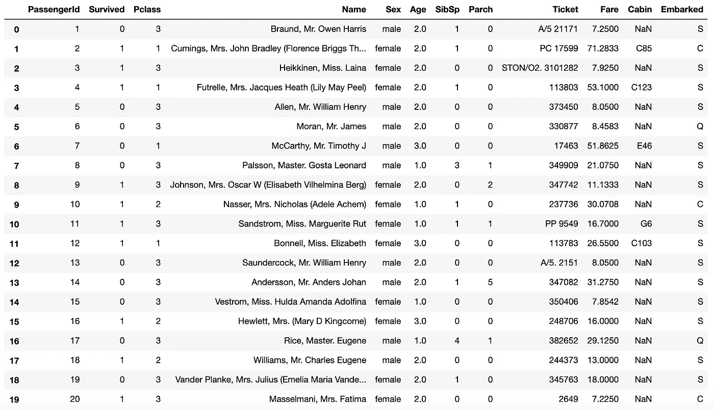

作者图片

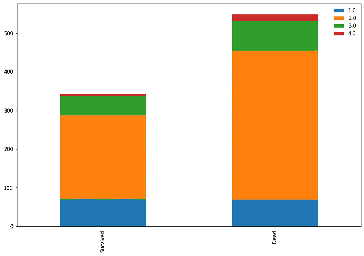

作者图片

因为机器学习模型只对数值进行操作，所以我们需要用数字替换列 *Sex* 的测试值，以创建数字类别。这些将是我们的类别:

*   0:男性
*   1:女性

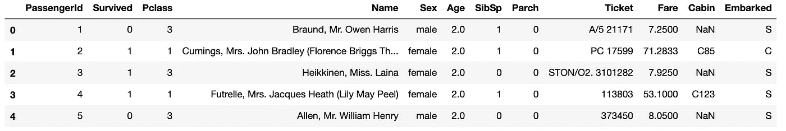

作者图片

另一件有用的事情是提取 *Title* 信息，如(先生女士小姐。)并创建与我们对*年龄*列所做的类似的框(组),然后删除*姓名*列。

让我们显示创建的值。

```
# Output
Mr          517
Miss        182
Mrs         125
Master       40
Dr            7
Rev           6
Col           2
Major         2
Mlle          2
Sir           1
Mme           1
Ms            1
Countess      1
Capt          1
Don           1
Jonkheer      1
Lady          1
Name: Title, dtype: int64
```

```
# Output
Mr        240
Miss       78
Mrs        72
Master     21
Col         2
Rev         2
Dr          1
Ms          1
Dona        1
Name: Title, dtype: int64
```

正如我们所看到的，我们这里实际上只有三个主要组，先生、小姐和夫人。我们将在这里为这些组创建四个箱(组),并将其他所有内容放入*其他*类别。我们的小组看起来像这样:

*   1:先生
*   2:小姐
*   3:夫人
*   4:其他一切

现在让我们看看标题为*数据的图表。*

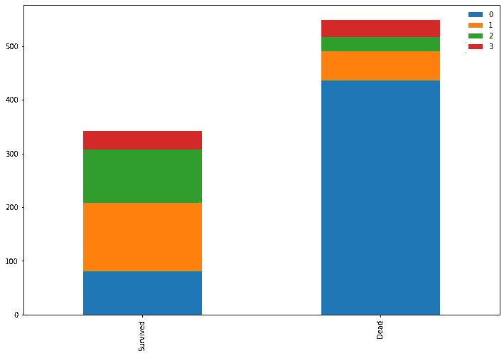

作者图片

正如我们所看到的，拥有*头衔*先生的人很少有机会生存，这对我们的机器学习模型来说应该是一个有用的信息。

# 删除不必要的功能

现在，让我们删除我们认为不需要训练模型的特征。在我们的示例中，它将是*姓名、机票、费用、舱位、登机*。我们仍然可以从中提取一些额外的特征，但现在我们决定删除它们，并在没有它们的情况下训练我们的模型。

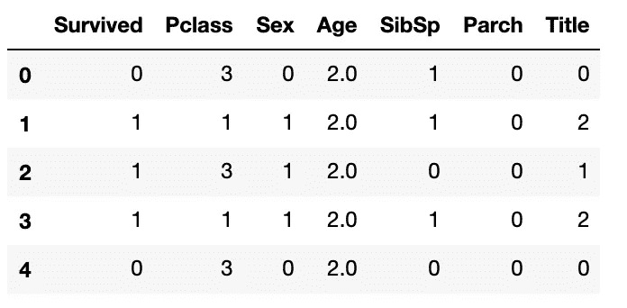

作者图片

现在，我们需要准备我们的训练数据和幸存者的目标信息，以训练我们的机器学习模型。为了做到这一点，我们需要创建另一个没有*幸存*列的数据集，并创建一个只有幸存信息的目标变量。这就是机器学习模型通常需要用于训练的数据的方式——输入(或 X 或自变量)和输出(或 Y 或因变量)。

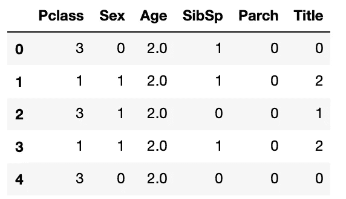

作者图片

# 构建和训练机器学习模型

现在，我们已经准备好构建和训练我们的机器学习模型。

我们将使用两种不同的算法，并比较结果，看看哪种算法的性能更好。

我们将使用[*K-最近邻(KNN)*](https://scikit-learn.org/stable/modules/generated/sklearn.neighbors.KNeighborsClassifier.html) 分类器和 [*决策树*](https://scikit-learn.org/stable/modules/generated/sklearn.tree.DecisionTreeClassifier.html) 分类器来自 [*Scikit-learn*](https://scikit-learn.org/) 库。

# k 近邻(KNN)分类器

我们将创建具有 13 个邻居 *(n_neighbors = 13)* 和交叉验证技术的 *KNN* 模型，通过混洗数据并将其分成 k 个折叠来训练我们的模型。交叉验证技术有助于防止在训练机器学习模型时出现无意的排序错误。

我们将最终获得几个机器学习分数，我们需要对这些分数进行平均，以实现模型性能的最终结果。

```
# Output
[0.82222222 0.76404494 0.82022472 0.79775281 0.80898876 0.83146067
 0.82022472 0.79775281 0.82022472 0.84269663]
```

```
# Output
Our KNN classifier score is 81.26%
```

# 决策树分类器

我们将对决策树模型进行同样的操作，并使用交叉验证技术。

```
# Output
[0.8        0.79775281 0.78651685 0.78651685 0.86516854 0.78651685
 0.84269663 0.80898876 0.78651685 0.84269663]
```

```
Our Decision Tree classifier score is 81.03%
```

正如我们所看到的，我们的两个模型都取得了相似的结果，我们已经取得了非常好的精度结果，两个模型都达到了大约 *80%* ，这很好。

通过对*票价*、*客舱*和*装载*列执行更多的功能工程，这个结果可能还会得到改善，我鼓励你这样做。

# 测试

现在，我们可以对测试数据运行我们的模型来预测值。

```
# Output
array([0, 0, 0, 0, 0, 0, 1, 0, 1, 0, 0, 0, 1, 0, 1, 1, 0, 0, 0, 0, [...], 0, 1, 0, 0, 1, 0, 1, 0, 0, 0, 0, 0, 1, 1, 1, 1, 1, 0, 1, 0, 0, 1])
```

我们现在可以将结果保存到文件中。

如果你愿意，你可以在这里上传你的结果([https://www.kaggle.com/c/titanic](https://www.kaggle.com/c/titanic))并参加卡格尔泰坦尼克号比赛。

要阅读和显示您的结果，您可以使用以下代码。

如果你想了解更多并尝试 Python 和数据科学，你可以看看我的另一篇文章[用 Python 分析药品销售数据](/analysing-pharmaceutical-sales-data-in-python-6ce74da818ab)、[用 MNIST 介绍计算机视觉](https://medium.com/@pjarz/introduction-to-computer-vision-with-mnist-2d31c6f4d9a6)或[用 Python 进行图像人脸识别](https://medium.com/an-idea/image-face-recognition-in-python-30b6b815f105)。

为了巩固您的知识，请考虑从头开始再次完成任务，不要查看代码示例，看看您会得到什么结果。这是巩固你的知识的一件极好的事情。

Jupyter 笔记本中的完整 Python 代码可在 GitHub 上获得:
[https://GitHub . com/pj online/Basic-Data-Science-Projects/tree/master/5-Titanic-Challenge](https://github.com/pjonline/Basic-Data-Science-Projects/tree/master/5-Titanic-Challenge)

编码快乐！

还没有订阅媒体？考虑[报名](https://pjwebdev.medium.com/membership)成为中等会员。每月只需 5 美元，你就可以无限制地阅读媒体上的所有报道。[订阅 Medium](https://pjwebdev.medium.com/membership) 支持我和其他作家在 Medium 上。