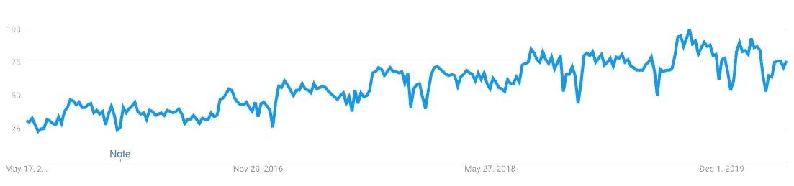

# 2020 年的数据科学趋势

> 原文：<https://towardsdatascience.com/data-science-trends-for-2020-9b2ee27af499?source=collection_archive---------17----------------------->

## 新十年的关键数据科学趋势

弗兰基·查马基在 [Unsplash](https://unsplash.com/?utm_source=unsplash&utm_medium=referral&utm_content=creditCopyText) 上拍摄的照片

> *数据科学是让数据变得有用的学科。*

毫无疑问，这十年在人工智能领域购买了大量的创新。除了人工智能，我们还见证了从数千个来源生成的数据的巨大增长。数以百万计的设备造成了如此巨大的数据峰值，这一事实将我们带到了智能利用的话题上。

> *数据科学领域带来了各种科学工具、流程、算法和从结构化和非结构化数据中提取知识的系统，用于识别其中有意义的模式。*

数据科学也有利于数据挖掘和大数据。[数据科学](/best-data-science-tools-for-data-scientists-75be64144a88)在 2001 年成为主流，此后一直在发展，并被评为有史以来最令人兴奋的职业道路之一。

**走向数据科学** [**报道:**](/what-does-the-future-of-data-science-hold-for-you-7ae47861dc22?gi=730fdfb044da)

*   目前，每天的数据输出超过 2.5 万亿字节。
*   在不久的将来，“地球上的每个人每秒将产生 1.7 Mb 的数据。”
*   各种各样的数据科学角色将推动这些海量数据负载。

谷歌搜索过去 5 年“数据科学”的受欢迎程度。由[谷歌趋势](https://trends.google.com/trends/explore?date=today%205-y&geo=US&q=data%20science)生成。

# 数据科学的趋势

随着数据问题和需求的多样化，出现了各种各样的创新解决方案。这些解决方案通常会带来大量的数据科学趋势，为企业提供所需的灵活性，同时让他们能够更深入地了解自己的数据。下面简要介绍了其中一些顶级数据科学趋势:

## 1.图表分析

随着数据从各个方向流入，分析变得更加困难。

[图形分析](https://developer.nvidia.com/discover/graph-analytics)旨在通过充当**灵活而强大的工具**来解决这个问题，该工具使用图形分析复杂的数据点和关系。使用图表背后的意图是抽象地表示复杂的数据，并以一种更容易理解和提供最大洞察力的可视化格式表示。图表分析应用于众多领域，例如:

*   过滤社交媒体上的机器人，以减少虚假信息
*   识别银行业中的欺诈
*   预防金融犯罪
*   分析电力和供水网络，寻找缺陷

## 2.数据结构

[数据结构](https://www.netapp.com/us/info/what-is-data-fabric.aspx)是一个相对较新的趋势，其核心是封装从大量来源收集的组织数据，如**API**、**可重用数据服务**、**管道**、**语义层**，提供可转换的数据访问。

创建数据结构是为了帮助数据的业务上下文，并以用户和应用程序都可以理解的方式保存数据，数据结构使您能够在灵活的同时拥有可伸缩的数据。

通过这样做，您可以根据需要以前所未有的方式处理、管理、存储和共享数据。商业智能和数据科学严重依赖于数据结构，因为它可以顺畅、干净地访问大量数据。

 [## 什么是数据结构？| NetApp

### 数据结构是一种体系结构和一组数据服务，可跨多种选择提供一致的功能…

www.netapp.com](https://www.netapp.com/us/info/what-is-data-fabric.aspx) 

## 3.设计的数据隐私

[数据隐私设计的趋势](https://gdpr-info.eu/issues/privacy-by-design/)采用了一种更安全、更主动的方法来收集和处理用户数据，同时在其上训练您的机器学习模型。

企业需要用户数据来训练他们在现实世界场景中的模型，他们从各种来源收集数据，如浏览模式和设备。

联合学习背后的想法是收集尽可能少的数据，通过给用户选择退出和随时删除所有收集的数据的选项，让用户了解情况。

虽然数据可能来自大量受众，但出于隐私原因，必须保证不可能对原始数据进行任何逆向工程来识别用户。

## 4.增强分析

[增强分析](https://www.gartner.com/en/information-technology/glossary/augmented-analytics) **是指通过排除任何不正确的结论或偏见，从手头的数据中获得更好的洞察力**，以优化决策。通过注入[人工智能和机器学习](/a-tour-of-machine-learning-algorithms-466b8bf75c0a)，增强分析帮助用户规划新模型。

通过减少对数据科学家和机器学习专家的依赖，增强分析旨在提供相对更好的数据见解，以帮助整个商业智能流程。

这种人工智能和机器学习的微妙引入通过自动化数据科学的许多方面对传统的洞察发现过程产生了重大影响。增强分析在提供更好的决策，避免分析中的任何错误和偏见方面越来越重要。

## 5.Python 是数据科学的事实语言

照片由 [Hitesh Choudhary](https://unsplash.com/@hiteshchoudhary?utm_source=unsplash&utm_medium=referral&utm_content=creditCopyText) 在 [Unsplash](https://unsplash.com/s/photos/python-programming?utm_source=unsplash&utm_medium=referral&utm_content=creditCopyText) 上拍摄

[Python](https://www.netguru.com/blog/python-for-data-science) 是一种绝对的**全能编程语言**，如果你有兴趣进入人工智能和数据科学的世界，它被认为是一个值得的切入点。

有了支持性的在线社区，您几乎可以立即获得支持，Python 中的集成只是冰山一角。

> 编写 Python 代码的乐趣应该在于看到短小、简洁、易读的类，这些类用少量清晰的代码表达了大量的动作——而不是让读者厌烦得要死的大量琐碎代码。
> 
> *——吉多·范·罗苏姆*

Python 集成了众多的[编程**语言**](/top-programming-languages-for-ai-engineers-in-2020-33a9f16a80b0) **和** [**库**](/python-libraries-for-natural-language-processing-be0e5a35dd64) **，**，这使得它成为一个极好的选择，比如说，为手头的问题创建一个快速原型，或者深入大型数据集。

**它的一些最流行的库是-**

> *●****tensor flow****，用于机器学习工作负载和处理数据集*
> 
> *●****scikit-learn****，用于训练机器学习模型*
> 
> *●****py torch***，用于计算机视觉和自然语言处理
> 
> *●****Keras****，作为高度复杂的数学计算和运算的代码接口*
> 
> *●****SparkMLlib****，像 Apache Spark 的机器学习库，用算法、实用程序之类的工具让机器学习变得人人轻松*

**Python 初学者课程—**

 [## 3 免费 Python 初学者课程:2020 版|黑客正午

### 如果你正在寻找可以用来扩展你的 Python 知识的最好的免费 Python 课程，你已经来到…

hackernoon.com](https://hackernoon.com/3-free-python-courses-for-beginners-2020-edition-j7c23y3u)  [## Python 训练营:学习 Python 编程和代码培训

### 这是 Udemy 上最全面、最直接的 Python 编程语言课程！你是否…

www.udemy.com](https://www.udemy.com/course/complete-python-bootcamp/?LSNPUBID=JVFxdTr9V80&ranEAID=JVFxdTr9V80&ranMID=39197&ranSiteID=JVFxdTr9V80-lB6TwxSdouentAk36.qjmw) 

## 6.数据科学中广泛的自动化

> *时间是至关重要的组成部分，任何时间都不应该花在重复的任务上。*

随着人工智能的发展，其自动化能力也在扩大。自动化领域的各种创新正在让许多复杂的人工智能任务变得更加简单。

数据科学领域的自动化已经简化了大部分流程，如果不是全部的话。数据科学的整个过程包括**识别问题、数据收集、处理、探索、分析以及将处理后的信息**分享给他人。

## 7.会话分析和自然语言处理

[自然语言处理](https://www.gartner.com/en/conferences/apac/data-analytics-india/gartner-insights/rn-top-10-data-analytics-trends/nlp-conversational-analytics)和对话分析通过简化我们与机器互动和在线查找信息的方式，已经在数字世界掀起了巨大的波澜。

NLP 极大地帮助我们进入了一个时代，在这个时代，计算机和人类可以用共同的自然语言进行交流，使两者之间能够进行持续而流畅的对话。

NLP 和[对话系统](https://uxdesign.cc/what-is-a-conversation-designer-and-why-will-the-role-grow-in-2020-a6d6210af28e?source=your_stories_page---------------------------&gi=f2bec35be939)的应用随处可见，比如聊天机器人，智能数字助理。据预测，基于语音的搜索的使用将在很短时间内超过更常用的基于文本的搜索。

## 8.云中的超大规模数据科学

从那时起，人工智能的出现以及由此产生的数据量一直在飙升。随着企业网上业务的增长，数据量从几千兆字节增长到几百千兆字节。

这种对数据存储和处理能力日益增长的需求催生了数据科学，以实现数据的受控和精确利用，并推动全球范围内的组织选择云解决方案。

各种云解决方案提供商，如 [**、谷歌**](/top-google-ai-tools-for-everyone-60346ab7e08) 、**亚马逊**、**微软**提供大量云计算选项，包括企业级云服务器功能，确保高可扩展性和零停机时间。

## 9.减轻模型偏差和歧视

没有一个模型完全不受偏见的影响，由于缺乏足够的数据、历史偏见和不正确的数据收集实践等因素，它们可以在任何阶段开始表现出歧视性行为。偏见和歧视是模型的常见问题，并且是一种新兴趋势。如果及时发现，这些偏差可以在三个阶段得到缓解:

*   预处理阶段
*   加工阶段
*   后处理阶段

每个阶段都有自己的一套校正方面，包括算法和技术，以优化模型的公平性，并增加其准确性，以消除任何偏差的机会。

## 10.内存计算

> [*内存计算*](https://www.gridgain.com/resources/blog/in-memory-computing-in-plain-english) *是一种新兴趋势，与我们传统的数据处理方式有很大不同。*

内存计算处理存储在内存数据库中的数据，这与使用硬盘和带有查询语言的关系数据库的传统方法相反。该技术允许实时处理和查询**数据，以进行即时决策和报告**。

随着内存变得越来越便宜，企业越来越依赖于实时结果，内存计算使他们能够拥有更丰富、更具交互性的仪表板应用程序，这些仪表板可以提供更新的数据，并且几乎可以立即准备好进行报告。

## 11.数据和分析中的区块链

[区块链](https://www.itproportal.com/features/implications-of-blockchain-in-data-science/)，简单来说，就是由一群计算机管理的带有时间戳的不可变数据集合，而不是由任何单一实体管理。这里的链指的是使用加密算法绑定在一起的每个块之间的连接。

与数据科学逐渐类似，区块链对于维护和验证记录至关重要，而数据科学则致力于数据的收集和信息提取部分。数据科学和区块链是相关的，因为它们都使用算法来管理其处理的各个部分。

# 结论

随着业务开始增长，他们会产生更多的数据，数据科学可以帮助他们分析他们需要改进的领域。随着上面提到的几个值得注意的数据科学趋势，一些人开始认为数据科学是继经验、理论和计算之后的第四种科学范式。跟上更新的趋势是企业实现最大效率和保持竞争优势的绝对必要条件。

# 更多资源—

我希望这篇文章对你有用！如果您有兴趣了解更多信息，以下是附加资源:—

**走向数据科学**——[2020 年人工智能趋势精选清单](/a-distilled-list-of-ai-trends-for-2020-e2fc83a9b092)

**business 2 community—**[2020 年值得关注的 10 大数据和分析趋势](https://www.business2community.com/business-intelligence/10-data-and-analytics-trends-to-watch-in-2020-02277191)

**Analyticsindiamag—**[未来 5 年数据科学家的工作趋势](https://analyticsindiamag.com/job-trends-for-data-scientists-in-the-next-5-years/)

**Codeit—**[2020 年顶级数据分析趋势](https://codeit.us/blog/top-data-and-analytics-trends)

> ***关于作者***
> 
> ***克莱尔 D*** *。在*[***digital ogy***](https://www.digitalogy.co/)***—****是一个内容制作者和营销人员。这是一个技术采购和定制匹配市场，根据全球各地的特定需求，将人们与预先筛选的&顶尖开发人员和设计师联系起来。连接****Digitalogy****on*[***Linkedin***](https://www.linkedin.com/company/digitalogy)*[***Twitter***](https://twitter.com/DigitalogyCorp)*[***insta gram***](https://www.instagram.com/digitalogycorp)*。***