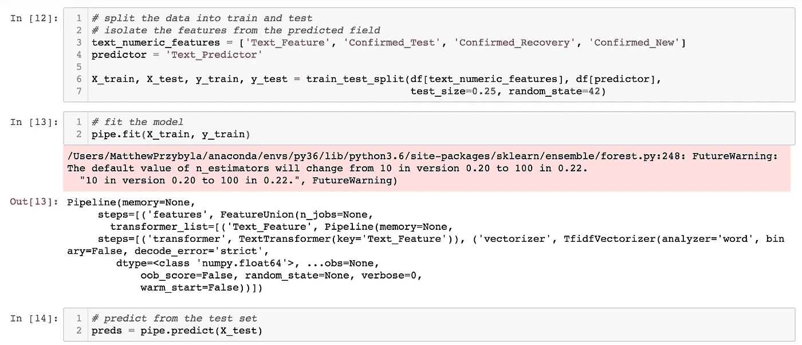

# 数据科学家 vs 数据分析师。区别就在这里。

> 原文：<https://towardsdatascience.com/data-science-vs-data-analysis-heres-the-difference-4d3da0a90f4?source=collection_archive---------5----------------------->

## 数据科学家和数据分析师的主要区别和相同点是什么？阅读下面的概要分析。


克里斯蒂娜@ wocintechchat.com 在[Unsplash](https://unsplash.com/s/photos/two-people-office?utm_source=unsplash&utm_medium=referral&utm_content=creditCopyText)【1】上的照片[。](https://unsplash.com/@wocintechchat?utm_source=unsplash&utm_medium=referral&utm_content=creditCopyText)

# 目录

1.  介绍
2.  数据科学家
3.  数据分析师
4.  类似
5.  差异
6.  摘要
7.  参考

# 介绍

尽管数据科学和机器学习领域在工作描述、雇主和公众之间存在混淆，但数据科学和数据分析之间的差异更容易区分。然而，这两个领域和工作岗位之间仍然存在相似之处和主要差异。有些人会说，要成为数据科学家，数据分析角色是成为数据科学家的先决条件。

> 本文旨在阐明作为数据科学家和数据分析师意味着什么，以及这两个领域的专业人士。

当我在学习成为一名数据科学家时，作为一名工作数据分析师，我意识到数据科学理论与数据分析理论有很大不同。这并不是说数据科学与数据分析不共享相同的工具和编程语言。人们也可以认为数据科学是数据分析的一种形式，因为最终，你是在与数据打交道——转换、可视化并得出可操作的变化的结论。那么如果它们如此相似或者一个在另一个之下，为什么要写一篇关于这两个热门领域的文章呢？原因是，进入这两个领域的人都可以从这里学到东西——他们将从这两个职业中获得什么——或者人们普遍感到好奇，并进一步展开讨论。下面，我将概述数据科学家或数据分析师的主要相似之处、不同之处，并举例说明这意味着什么。

# 数据科学家



拟合数据科学模型和预测的示例。作者截图[2]。

*惊呼——这个 DS 部分只有我从上一篇关于数据科学与机器学习的文章中收集的一些信息，以及新的信息[3]:*

[](/data-science-vs-machine-learning-heres-the-difference-530883d6de3a) [## 数据科学 vs 机器学习。区别就在这里。

### 数据科学家和机器学习工程师的主要区别和相同点是什么？阅读以下内容，了解…

towardsdatascience.com](/data-science-vs-machine-learning-heres-the-difference-530883d6de3a) 

数据科学可以被描述为一个自动化统计领域，以模型的形式帮助分类和预测结果。以下是成为数据科学家所需的顶级技能:

*   *Python 或者 R*
*   *SQL*
*   *Jupyter 笔记本*
*   *算法/建模*

***Python****——*以我个人的经验，我相信大部分公司都在寻找 Python 多于 R 作为主要编程语言。工作描述可能会列出这两者；但是，大多数和你一起工作的人，像机器学习工程师、数据工程师、软件工程师，都不会对 r 很熟悉，所以，我相信，做一个更整体的数据科学家，Python 会对你更有利。

***SQL*** 起初看起来更像是一种数据分析师技能——的确如此，但它仍然应该是一种用于数据科学的技能。大多数数据集不是在商业环境中给你的(相对于学术环境而言)，你必须自己制作——通过 SQL。现在，SQL 有很多子类型；像 PostgreSQL，MySQL，微软 SQL Server T-SQL，Oracle SQL。它们是同一种查询语言的相似形式，由不同的平台托管。因为它们非常相似，所以拥有其中任何一个都是有用的，并且可以很容易地转换成稍微不同形式的 SQL。

***Jupyter 笔记本*** ，一个数据科学家同时进行编码和建模的游乐场。一个研究环境，如果你愿意的话，允许快速简单的 Python 编码，可以合并代码外的注释，代码本身，以及一个从有用的库中构建和测试模型的平台，如 *sklearn、*和 *numpy。*

***算法*** —数据科学家的主要职能是利用算法快速准确地预测、分类和建议数据输出。当您将数据接收到模型中时，就会产生一个新的结果。关键算法类型的例子通常在非监督学习(*例如，聚类*)和监督学习(*例如，分类/回归*)中被分类。一些特定的关键算法:

*   随机森林(*集合分类*)
*   逻辑回归(*分类—非回归*)
*   K-Means ( *聚类)*
*   k-最近邻(*分类/回归*)

总体而言，数据科学家可以从事多种工作，但主要职能是:

```
— meet with stakeholders to define the business problem— pull data (*SQL*)— Exploratory Data Analysis (EDA), feature engineering, model building, & prediction (*Python, Jupyter Notebook, and Algorithms*)— depending on the workplace, compile code to .py format and/or pickled model for production
```

要了解更多关于什么是数据科学家，他们挣多少钱，该领域的前景，以及更多有用的信息，请点击加州大学伯克利分校的链接[这里](https://datascience.berkeley.edu/about/what-is-data-science/)【4】。

# 数据分析师


威廉·艾文在[Unsplash](https://unsplash.com/s/photos/data-analyst?utm_source=unsplash&utm_medium=referral&utm_content=creditCopyText)【5】上拍摄的照片。

数据分析师与业务分析师、商业智能分析师甚至 Tableau 开发人员有着相似的头衔。数据分析的重点是描述和可视化数据的当前状况，向非技术用户报告和解释数据。数据科学交叉职位是执行预测分析的数据分析师，与数据科学家有更多相似之处，但没有输出这些预测的自动化算法方法。

成为数据分析师所需的一些主要技能包括:

*   *SQL*
*   *Excel*
*   *Tableau(或其他可视化工具——谷歌数据工作室等)*

***SQL****—*正如数据科学家如何使用上述 SQL 一样，数据分析师也是如此。然而，在这个领域中，人们非常关注 SQL。一些数据科学家可以通过几个连接简单地从表中选择列，而数据分析师可以执行更复杂的查询(*例如，通用表表达式、数据透视表、窗口函数、子查询)。*有时，根据公司的不同，数据分析师可以分享数据工程师和数据科学家之间的更多相似之处。

***Excel*** —老派，没错，但是依然非常强大，甚至可以在这里进行预测分析和趋势分析。主要的缺陷通常是 Excel 的性能比其他使用 Python 的更健壮的工具要慢。

***Tableau*** —我只会说可视化工具，但根据我的经验，大多数公司都将这个工具列为数据分析师的一项特定的顶级技能。将数据拖放到 Tableau 中预先创建的图表是简单而强大的；还有更困难和复杂的功能，如计算字段和连接到动态 SQL 数据库，而不是通过静态 Excel 表进行分析。

总的来说，数据分析师也可以从事多种工作，但主要职能是:

```
— meet with stakeholders to define the business problem— pull data (*SQL*)— EDA, trend analysis, and visualizations (*Excel and Tableau*)— depending on the workplace, presenting findings and supplying actionable insights those same stakeholders
```

要了解更多关于什么是数据科学家，他们挣多少钱，该领域的前景，以及更多有用的信息，请点击[此处](https://www.northeastern.edu/graduate/blog/what-does-a-data-analyst-do/)【6】，来自西北大学。

# 类似

一些相似之处已经在前面的章节中描述过了，但是总结一下，数据科学家在编码语言、平台/工具和问题解决方面有一些共同点。

> 类似的工具包括但不限于 SQL、Tableau 以及定义问题、分析数据和输出分析结果的相同概念。

# 差异

虽然有相似之处，但这两个领域和角色之间仍然存在差异。

> 一些主要差异围绕着分析的自动化，数据科学家专注于使用 Python 等编程语言的算法来自动化分析和预测，而数据分析师使用静态或过去的数据，在某些情况下，会使用 Tableau 和 SQL 等工具来创建预测的场景。

# 摘要


Filiberto Santillán 在[Unsplash](https://unsplash.com/s/photos/data?utm_source=unsplash&utm_medium=referral&utm_content=creditCopyText)【7】上拍摄的照片。

数据科学和数据分析共享的不仅仅是名称(*数据*)，它们还包括一些重要的差异。无论您是想成为数据科学家还是数据分析师，我希望您发现这个关键差异和相似之处的概述是有用的。如果你已经是这两个角色之一，那么我希望我教了你一些新的东西，如果你有任何问题或意见，请在下面提出。

# 参考

[1]照片由[克里斯蒂娜@ wocintechchat.com](https://unsplash.com/@wocintechchat?utm_source=unsplash&utm_medium=referral&utm_content=creditCopyText)在[Unsplash](https://unsplash.com/s/photos/two-people-office?utm_source=unsplash&utm_medium=referral&utm_content=creditCopyText)【1】(2019)上拍摄

[2] M.Przybyla，Jupyter 笔记本截图，(2020)

[3] M.Przybyla，[数据科学 vs 机器学习。区别就在这里。](/data-science-vs-machine-learning-heres-the-difference-530883d6de3a)，(2020)

[4] UC Berkely，[什么是数据科学？](https://datascience.berkeley.edu/about/what-is-data-science/)(2020 年)

[5]照片由 [William Iven](https://unsplash.com/@firmbee?utm_source=unsplash&utm_medium=referral&utm_content=creditCopyText) 在[Unsplash](https://unsplash.com/s/photos/data-analyst?utm_source=unsplash&utm_medium=referral&utm_content=creditCopyText)(2015)上拍摄

【6】东北大学，[数据分析师是做什么的？](https://www.northeastern.edu/graduate/blog/what-does-a-data-analyst-do/)，(2019)

[7]由 [Filiberto Santillán](https://unsplash.com/@filisantillan?utm_source=unsplash&utm_medium=referral&utm_content=creditCopyText) 在[Unsplash](https://unsplash.com/s/photos/data?utm_source=unsplash&utm_medium=referral&utm_content=creditCopyText)(2019)上拍摄的照片