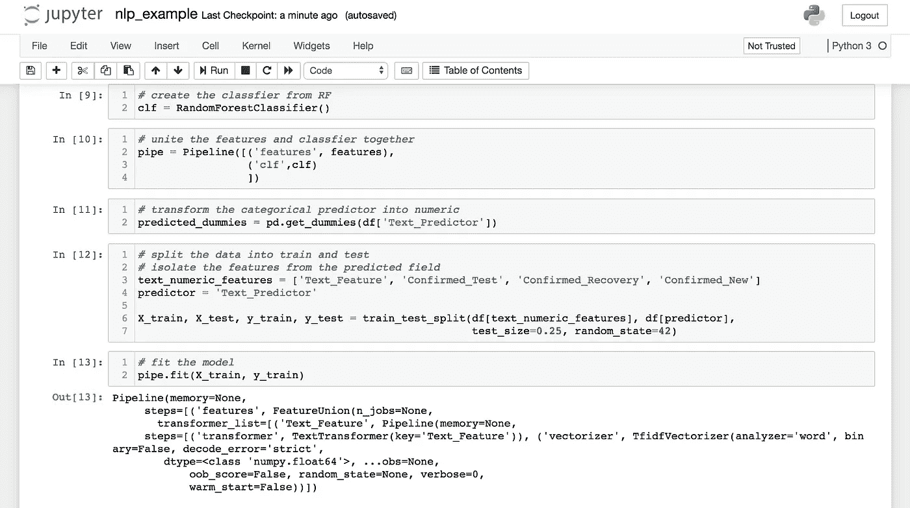
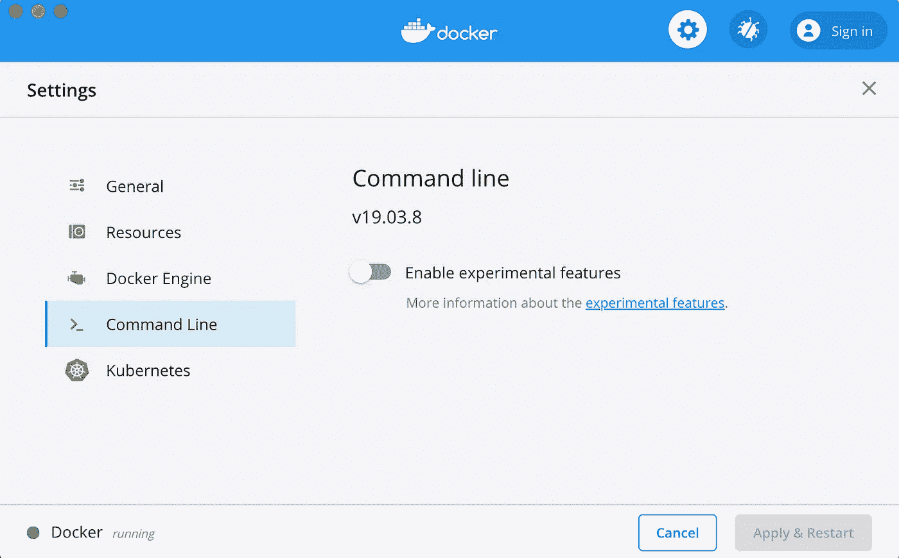

# 数据科学 vs 机器学习。区别就在这里。

> 原文：<https://towardsdatascience.com/data-science-vs-machine-learning-heres-the-difference-530883d6de3a?source=collection_archive---------8----------------------->

## 数据科学家和机器学习工程师的主要区别和相同点是什么？阅读下面的概要分析。


克里斯蒂娜@ wocintechchat.com 在[Unsplash](https://unsplash.com/?utm_source=unsplash&utm_medium=referral&utm_content=creditCopyText)【1】上的照片[。](https://unsplash.com/@wocintechchat?utm_source=unsplash&utm_medium=referral&utm_content=creditCopyText)

# 目录

1.  介绍
2.  数据科学家
3.  机器学习工程师
4.  类似
5.  差异
6.  摘要
7.  参考

# 介绍

似乎就连公司及其职位描述都不清楚什么是数据科学家和机器学习工程师。我在这里提供一些见解，解释为什么它们是分开的，以及角色在哪里可以重叠。

起初，为了成为一名数据科学家，我尴尬的不知道什么是机器学习工程师。我很快意识到这个领域类似于数据科学，但又有很大的不同，需要一套独特的技能。长话短说，数据科学是研究、构建和解释你已经建立的模型，而机器学习是该模型的产物。现在我已经在这个领域工作了几年，在这两个学科都获得了经验，我在下面列出了一个大纲，说明什么是数据科学和机器学习工程师角色，什么不是。

# 数据科学家



近距离观察数据科学家的 Jupyter 笔记本。作者截图[2]。

统计学家？算是吧。用最简单的术语来说，数据科学可以被描述为一个自动化统计领域，其形式是帮助分类和预测结果的模型。以下是成为数据科学家所需的顶级技能:

*   *Python 或者 R*
*   *SQL*
*   *Jupyter 笔记本*

**然而，大多数与你一起工作的人，如机器学习工程师、数据工程师和软件工程师，都不会熟悉 r。因此，我相信，作为一名更全面的数据科学家，Python 对你更有益。**

***SQL*** ，起初看起来更像是一个数据分析师的技能——的确如此，但它仍然应该是你在数据科学中使用的技能。大多数数据集不是在商业环境中给你的(*而不是学术界*)，你必须自己制作——通过 SQL。现在，SQL 有很多子类型；像 PostgreSQL，MySQL，微软 SQL Server T-SQL，Oracle SQL。它们是同一种查询语言的相似形式，由不同的平台托管。因为它们非常相似，所以拥有其中任何一个都是有用的，并且可以很容易地转换成稍微不同形式的 SQL。

***Jupyter 笔记本*** 几乎可以和机器学习工程师的工具包完全相反。Jupyter 笔记本是数据科学家进行编码和建模的乐园。一个研究环境，如果你愿意的话，允许快速简单的 Python 编码，可以合并代码外的注释，代码本身，以及一个从有用的库中构建和测试模型的平台，如 *sklearn、*和 *numpy。*

总的来说，数据科学家可以是多方面的，但主要职能是

—与利益相关者会面以确定业务问题

—提取数据( *SQL* )

— EDA、特征工程、建模、预测( *Python* *和* *Jupyter 笔记本*

—根据工作场所，编译代码以。py 格式和/或酸洗模型

要了解更多关于什么是数据科学家，他们挣多少钱，该领域的前景，以及更多有用的信息，请点击加州大学伯克利分校的链接[此处](https://datascience.berkeley.edu/about/what-is-data-science/)【3】。

# 机器学习工程师



机器学习工程师常用的 Docker 的设置菜单。作者截图[4]。

现在，在上面的最后一点之后，就是机器学习工程师介入的时候了。主要功能是将模型投入生产。数据科学模型有时可能非常静态，工程师可以帮助自动训练和评估相同的模型。然后，他们会将预测重新插入到您公司的数据仓库/SQL 表中。之后，软件工程师和 UI/UX 设计师将在用户界面上显示预测结果——如果需要的话。正如您所看到的，从业务问题到解决方案的整个过程都是一种可见的、易于使用的格式，这不仅仅是数据科学家的责任(*然而，是的，一些数据科学家可以做所有 x 数量的角色*)。

机器学习工程师的角色也可以命名为 ML ops(机器学习操作)。他们的工作流程总结如下:

> A.数据科学模型的 pkl_file
> 
> B.存储桶(GCP——谷歌云编辑器)
> 
> C.DAG(用于安排模型的培训者和评估者)
> 
> D.气流(可视化流程——ML 管道)
> 
> E.Docker(集装箱和虚拟化)

起初，也许数据科学和机器学习可以被视为可互换的头衔和领域；然而，通过仔细观察，我们意识到机器学习更多的是软件工程和数据工程的结合，而不是数据科学。下面，我将概述字段交叉和不交叉的地方。

要了解更多信息、可视化、流程，请点击[此处](https://cloud.google.com/solutions/machine-learning/mlops-continuous-delivery-and-automation-pipelines-in-machine-learning) [5]，查看谷歌的机器学习操作概述

# 类似

数据科学和机器学习最相似的概念可能是它们都接触模型。这两个领域共有的主要技能是:

```
SQLPythonGitHubConcept of training and evaluating data
```

比较主要是在编程方面；每个人扮演各自角色所使用的语言。这两个职位都执行某种形式的工程，无论是使用 SQL 查询数据库的数据科学家，还是使用 SQL 将来自模型的建议或预测插入到新标记的列/字段中的机器学习工程师。

这两个领域都需要 Python(或 R)知识，通常还需要版本控制、代码共享和通过 GitHub 拉请求。

例如，机器学习工程师有时可能希望了解 XGBoost 或 Random Forest 等算法是如何工作的，并且需要查看模型的超参数进行调整，以便对内存和大小限制进行研究。虽然数据科学家可以在学术界或工作中构建高度精确的模型，但由于时间、金钱和内存的限制，在工作场所会有更多的限制。

# 差异

数据科学和机器学习的上述部分已经概述了一些差异，但职业和学术研究都有一些重要的关键特征，需要指出:

```
Data Science - focuses on statistics and algorithms 
- unsupervised and supervised algorithms
- regression and classification
- interprets results
- presents and communicates resultsMachine Learning - focus on software engineering and programming
- automation
- scaling
- scheduling
- incorporating model results into a table/warehouse/UI
```

*教育*

这两种角色不仅在工作场所不同，在学术界/教育界也不同。成为数据科学家和机器学习工程师有不同的途径。数据科学家可能专注于学位本身、统计学、数学或精算科学，而机器学习工程师将主要专注于软件工程(一些机构确实专门提供机器学习作为证书或学位)。要了解更多关于成为在线数据科学家的信息，你可以在这里阅读我的另一篇文章【6】:

[](/yes-you-can-become-a-data-scientist-online-heres-how-dc73c7faae0f) [## 是的，你可以在网上成为一名数据科学家。以下是方法。

### 在线学习的专业数据科学家指导您在家开始数据科学生涯

towardsdatascience.com](/yes-you-can-become-a-data-scientist-online-heres-how-dc73c7faae0f) 

# 摘要

虽然不同的人、公司和职位描述对每一个职业有不同的版本或想法，但我当然相信这两个职位有明显的区别。有些技能确实是重叠的，但一般来说，数据科学家专注于统计、模型构建和结果解释。机器学习工程师将采用该模型，对其进行缩放，并将其部署到生产中。如果你来这里是为了学习或决定你的职业道路，我希望这篇文章有所帮助。感谢您的阅读！

# 参考

[1] [克里斯蒂娜@ wocintechchat.com](https://unsplash.com/@wocintechchat?utm_source=unsplash&utm_medium=referral&utm_content=creditCopyText)上 [Unsplash](https://unsplash.com/?utm_source=unsplash&utm_medium=referral&utm_content=creditCopyText) ，(2019)

[2] M.Przybyla，截屏——Jupyter 笔记本，(2020 年)

[3] UC Berkely，[什么是数据科学？](https://datascience.berkeley.edu/about/what-is-data-science/)(2020 年)

[4] M.Przybyla，截图——Docker，(2020 年)

[5]谷歌， [MLOps:机器学习中的连续交付和自动化管道](https://cloud.google.com/solutions/machine-learning/mlops-continuous-delivery-and-automation-pipelines-in-machine-learning)，(2020)

[6] M. Przybyla，[是的，你可以在网上成为一名数据科学家。以下是方法。](/yes-you-can-become-a-data-scientist-online-heres-how-dc73c7faae0f?source=friends_link&sk=8d4794f5552d69b7a014647913c7b38d)，(2020)