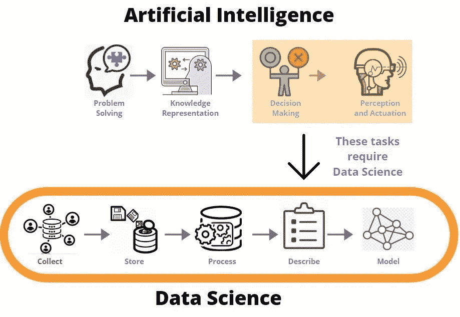
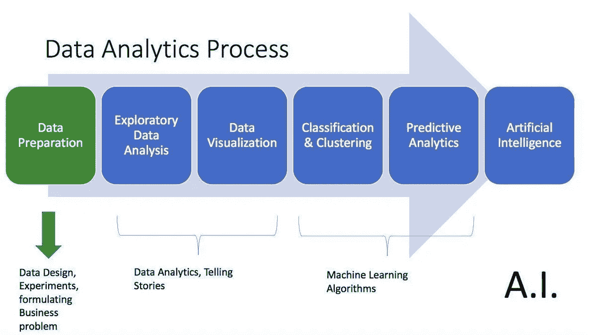
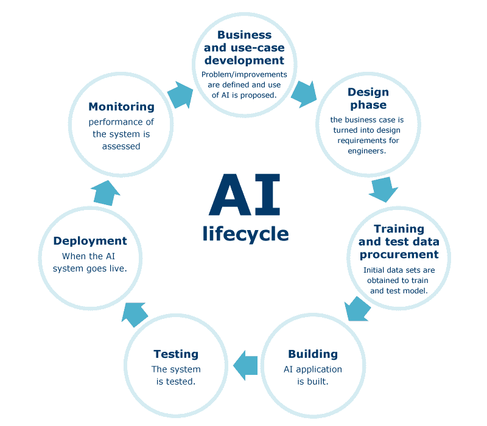
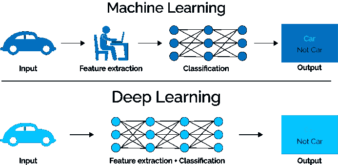

# 数据科学 vs 人工智能世界

> 原文：<https://towardsdatascience.com/data-science-vs-the-world-of-ai-793f6da8cf86?source=collection_archive---------31----------------------->

## 让我们试着理解什么是数据科学和人工智能，以及它们是如何交叉的

如果你曾经遇到过这些术语——数据科学、人工智能、机器学习、深度学习等等，请举手。但是它们是什么意思呢？我知道这些术语有些混乱。有人说数据科学和人工智能是同义词，有人说一个是另一个的子集，还有人说这些术语完全不相关。

> 混淆是由于这些术语的模糊和非技术性使用而产生的。

让我们通过扩展上述术语并了解数据科学如何与人工智能世界相交来进入细节。

## 什么是数据科学？

数据科学是使用各种技能从数据中提取有意义的见解的研究领域。我很肯定每个人都很清楚这一点。但是数据科学如何帮助世界各地的公司做出关键决策呢？让我们来看看。

XYZ 广场的交通拥堵或道路分流可能不是我们关心的问题，但优步的送餐应用 Uber Eats 非常重要。让热食快速送达是他们的首要目标。然而，要在全国范围内实现这一目标，需要先进的统计模型和更多的东西。为了优化整个配送过程，该团队必须预测每个可能的变量(从风暴到假日抢购)将如何影响交通和烹饪时间。

要了解更多关于数据科学的知识，你可以阅读我之前的博客[这里](https://medium.com/datadriveninvestor/data-science-demystified-what-is-data-science-ef031f6d0b6d)。

来源:保证推特

## 什么是人工智能？

人工智能是机器，尤其是计算机系统对人类智能过程的模拟。这些过程包括**学习、推理和自我修正**。构成人工智能的任务有:

1.  问题解决
2.  知识表达
3.  论证
4.  决策
5.  驱动和感知

资料来源:Agenparl.com

## 什么是机器学习？

机器学习是机器可以在没有明确编程的情况下自行学习的学习**。它是人工智能的一个应用，为系统提供了自动学习和从经验中改进的能力。**

> 可以说，现在人工智能的主要驱动力是机器学习。

当我们说某样东西能够“机器学习”时，它的意思是它能够利用提供给它的数据执行某种功能，并随着时间的推移变得越来越好。这就像如果你有一个手电筒，只要你说*“这是黑暗的，”*它就会打开，所以它会识别包含单词*“黑暗”的不同短语*

来源: [SAS](https://www.sas.com/en_us/insights/analytics/what-is-artificial-intelligence.html)

## 什么是深度学习？

深度学习只是机器学习的一个子集。深度**学习在技术上类似于机器学习和功能**(这就是为什么这些术语有时会松散地互换)。然而，它的能力是不同的。

虽然基本的机器学习模型确实在它们的功能方面变得越来越好，但它们仍然需要一些指导。如果人工智能算法返回不准确的预测，那么工程师就必须介入并做出调整。通过深度学习模型，算法可以通过其神经网络自行确定预测是否准确。

回到手电筒的例子:它可以被编程为在识别到有人说单词*【黑暗】*时打开。随着它继续学习，它可能最终会打开任何包含该词的短语。现在，如果手电筒有一个深度学习模型，它可以计算出当它听到*“我看不见”*或*“灯开关不起作用”*时，它应该打开，也许与光传感器串联。深度学习模型可以通过它的计算方法进行学习——这种技术使它看起来像有大脑一样。

我想你已经知道每个术语的意思了。**但是它们在现实世界中是如何相交的呢？**我们再举一个例子来理解这一点。

假设我是一个板球队的战略家。我的任务是制定一个计划来解雇对方队最好的击球手。可能有成千上万的视频捕捉到击球手的发挥。但重要的是要关注击球手被解雇的视频。收集关于击球手的表现恶化的交付类型的见解。这间接地意味着我需要首先清理数据(删除不相关的视频)，并从中推断出有用的见解，以创建一个策略。现在，我需要建立一个人工智能模型，可以针对不同的条件和可视化进行训练，以帮助找出投球手需要投球的区域来解雇击球手。(这里涉及到机器学习和深度学习，因为我们处理的是需要不断馈入模型的实时数据)。

你现在明白数据科学如何与人工智能世界相遇了吗？

然后，举起你的手…