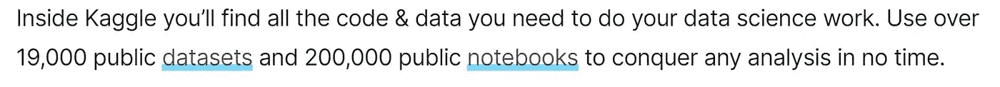

# 数据科学—我从哪里开始？

> 原文：<https://towardsdatascience.com/data-science-where-do-i-start-76693f6ae597?source=collection_archive---------54----------------------->

## 面向非程序员的数据科学实用入门工具包

作者图片

所以我遇到了很多不同背景的人(电子、机械、本科生(一/二年级)、销售、金融等)。想要探索数据科学领域的人，他们的一些问题是这样的，甚至当我开始时我也在想。—

*   我能进入数据科学领域吗？
*   不编码可以吗？
*   从哪里获取数据？
*   或者更重要的是，我能解决的问题在哪里？

嗯，第一个问题的答案是肯定的。任何人都可以进入这个领域。这都是关于持续的学习和应用逻辑。

对于其他问题，请继续阅读—

*   **你肯定需要编码技能。**ML 编码水平并没有你成为一名软件工程师所需要的那么高(至少在刚开始的时候)。编码仍然是 ML 不可或缺的一部分，因为无论你一开始使用多少工具，像 Weka 或 Alteryx(它有拖放式 ML)，最终**从长远来看你需要 R 或 Python。而且 SQL 很重要，**千万不要小看它！
*   有各种各样的学习网站**提供关于这些语言/概念的免费课程**，比如— [Udemy](https://medium.com/u/b32aa0132f1b?source=post_page-----76693f6ae597--------------------------------) 、 [Udacity](https://medium.com/u/2929690a28fb?source=post_page-----76693f6ae597--------------------------------) 、 [DataCamp Team](https://medium.com/u/e18542fdcc02?source=post_page-----76693f6ae597--------------------------------) 等。这些网站有 Python 的初级、中级、高级课程和数据科学所需的 R 的不同赛道，非常有用。如果你付钱，你甚至可以得到一个证书，你可以把它发布在 Linkedin 上。也有许多 **Youtube 频道**致力于面向初学者的**数据科学课程**并且很有帮助。
*   因此，上述课程/渠道的最佳之处在于，它们大多提供了你可以一起探索的数据集。除此之外，现在有很多开放的数据源，你可以从那里下载数据并开始工作。有网站提供了开放数据源的列表，你可以从中选择:[**【Freecodecamp】**](https://www.freecodecamp.org/news/https-medium-freecodecamp-org-best-free-open-data-sources-anyone-can-use-a65b514b0f2d/)**[**【福布斯】**](https://www.forbes.com/sites/bernardmarr/2016/02/12/big-data-35-brilliant-and-free-data-sources-for-2016/#26339872b54d)**[**学习中心**](https://learn.g2.com/open-data-sources) **等。******
*   ****世界上发生的下一件好事是[**卡格尔**](https://www.kaggle.com/) ！对于任何不知道的人(甚至两年前我也不知道，直到我最喜欢的一位教授给了我们一个关于这个的项目)， *Kaggle 是一个由数据科学家和机器学习实践者组成的在线社区，在那里真正的组织发布他们的问题陈述、数据集和他们想要的东西等。你所需要做的就是创建一个账户(免费的！！)并开始工作。在数据科学领域强烈推荐。**任何人都可以参与、下载、分享分析和代码，基本上任何你想在机器学习、深度学习或任何相关领域开始的事情。*******

********

****来源:[Kaggle.com](https://www.kaggle.com/)****

*   ****除此之外，还有几个由学习网站提供的训练营和专门课程，提供概念、数据和问题。有时，它们有助于获得可见性。****
*   ****在你使用开放数据集、笔记本等练习了这个过程之后。在接触来自你领域的真实数据时，你会更有信心。对你来说，一个优势是除了 ML 之外，你还会有领域知识，这是解决问题的基础。****
*   ****以上几点都是关于过程的。理解 ML 概念，以及该领域的新趋势，数据操作的技巧等。其中一些网站很有帮助: [KDNuggets](http://www.kdnuggets.com/) 、[走向数据科学](https://towardsdatascience.com/)、[机器学习大师](https://machinelearningmastery.com/)、 [Analytics Vidhya](http://www.analyticsvidhya.com/) 、[数据科学中心](http://www.datasciencecentral.com/)等。****

****好吧，我想我们已经走到尽头了。你知道从哪里学习概念，从哪里练习编码，从哪里获得数据集和问题陈述，甚至代码！你还在等什么？去开始吧！:D****

*****如果有其他同样可以增值的东西，留下回应！:)*****

****还有，如果你想在一个地方了解 ML 的所有步骤，可以去翻翻我之前的故事[非数据科学家的数据科学(上)](https://medium.com/datadriveninvestor/data-science-for-non-data-scientists-part-1-2689f422bea0)。****