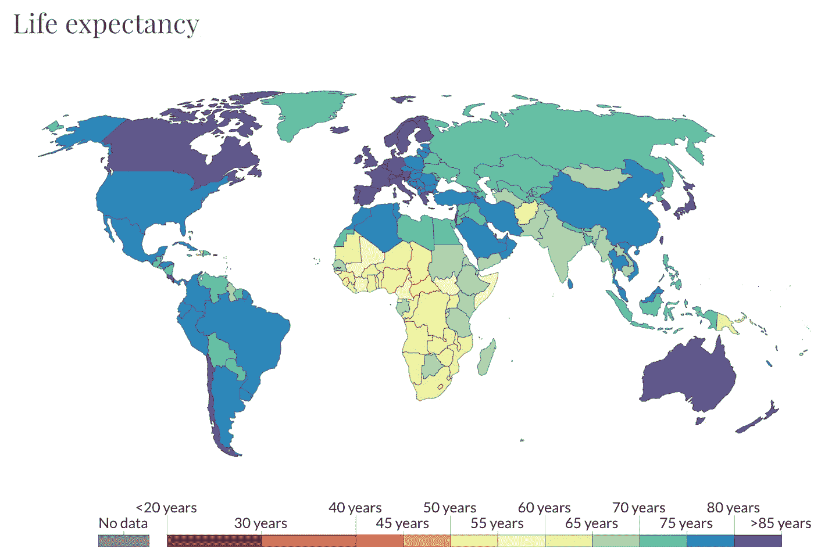
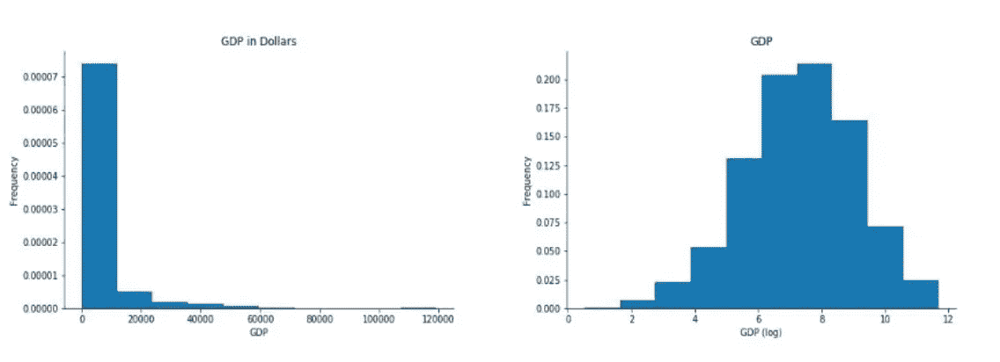
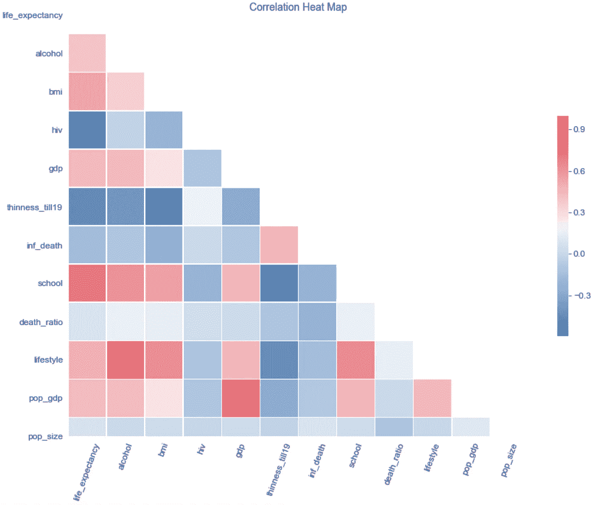
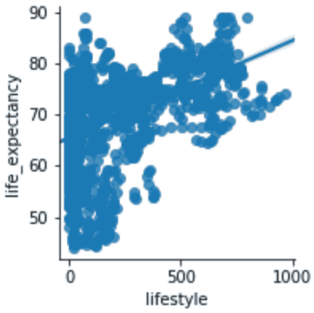
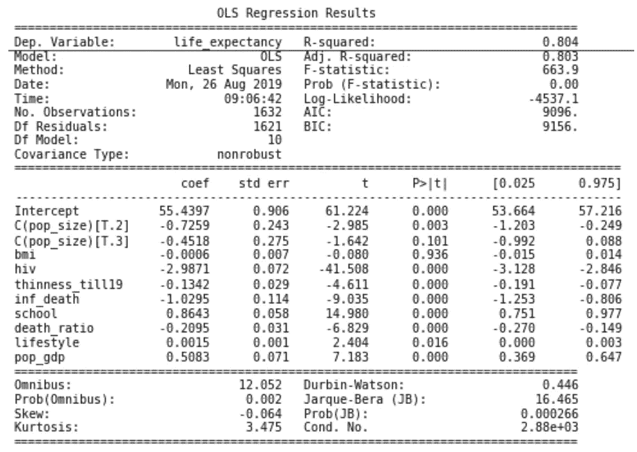
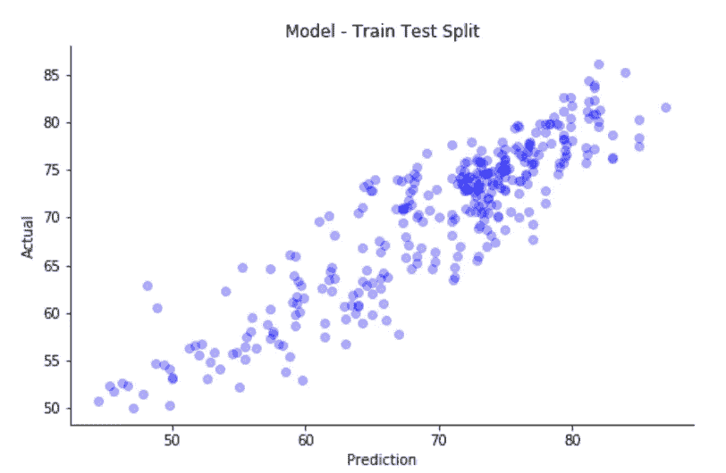

# 数据科学:哪些公共卫生因素对预期寿命影响最大

> 原文：<https://towardsdatascience.com/data-science-which-public-health-factors-have-the-greatest-impact-on-life-expectancy-52d024ee3d27?source=collection_archive---------27----------------------->

## *影响全球预期寿命的公共卫生因素多元线性回归分析*

来源: [Roser M.](http://Max Roser, Esteban Ortiz-Ospina and Hannah Ritchie (2020) - "Life Expectancy". Published online at OurWorldInData.org. Retrieved from: 'https://ourworldindata.org/life-expectancy') Via: [数据中的我们的世界](https://ourworldindata.org/life-expectancy)

# 背景:

预期寿命是评估人口健康的基本指标。它告诉我们人口的平均死亡年龄。据估计，在前现代和贫穷的世界里，世界各地的预期寿命是 30 岁。自 1900 年以来，全球平均预期寿命增加了一倍多，现已超过 70 岁。各国之间预期寿命的不平等仍然很大。最近，预期寿命最低的国家是中非共和国，为 53 岁，而日本的预期寿命高出 30 岁。

# 目的:

这个[项目](https://github.com/haahussain/Life_Expectancy_Predictor_Multiple_Regression)的目的是为了更好地理解各种公共健康因素和全球预期寿命之间的关系。各国如何更好地分配其有限的资源，以提高其人口的总体预期寿命？为了回答这个问题，建立了多元线性回归模型，然后进行评估以确定最佳拟合。 [Github 链接](https://github.com/haahussain/Life_Expectancy_Predictor_Multiple_Regression)

# 数据源:

世界卫生组织(世卫组织)下属的全球卫生观察站(GHO)数据库跟踪所有国家的健康状况以及许多其他相关因素。最终数据集包含 2939 个观察值，其中每行代表特定年份的一个国家。共有 193 个国家有 2000 年至 2015 年的数据。这些特征包括免疫因素、死亡率因素、经济因素、社会因素和其他健康相关因素。

## 功能列表:

*营养不良流行率范围是以年龄为单位

最初对于基线模型，文献综述和领域知识被用来选择哪些预测因子对预期寿命有最大的影响。此外，还创造了 4 个可能影响预期寿命和更好地解释数据的特征。

## 这些工程特性包括:

1.  人口规模——建立了一个人口范围，包括三个类别；小号、中号和大号。
2.  生活方式——一个将酒精消费和身体质量指数考虑在内的交互变量。
3.  经济——人口和国内生产总值(GDP)之间的交互变量。
4.  死亡比率——成人和婴儿死亡率之间的比率。

# 数据争论:

使用了各种 Python 库，如 [Pandas](https://pandas.pydata.org/pandas-docs/stable/index.html/) 来清理和探索数据。还使用了 [Numpy](https://www.numpy.org/) 、 [Scipy](https://www.numpy.org/) 和 [Sklearn](https://scikit-learn.org/stable/) 进行数据分析、描述性统计和建模。

首先，从数据集中移除所有碎片化的观察值。为了查看数据是否符合线性模型假设，为每个带有目标变量的预测值生成散点图并进行评估。必要时，为了满足模型假设，对某些特征进行了转换，以实现更加**线性的关系**和**正态分布**。

数据转换成更正态分布

接下来，通过创建相关热图，在选定的预测值之间评估**多重共线性模型假设**。多重共线性阈值被指定为 0.8，阈值以上的变量被剔除。

评估线性回归中多重共线性假设的相关热图

之后，通过查看盒须图和散点图来评估所有可能的异常情况。扭曲数据的极端观察被删除。

移除异常值后预测变量的散点图

# 结果:

第一个预测预期寿命的模型使用了这些特征；身体质量指数，艾滋病毒，1-19 岁，国内生产总值，死亡率，生活方式，教育，婴儿死亡率，经济和人口规模。R 的平方等于 0.804。换句话说，最初的模型解释了预期寿命 80%的变化(与平均线相比)。

基线模型的结果

建立了另一个模型，其中数据经过**缩放**，并移除了基线模型中不重要的预测值(p 值> .05)。由于各种要素具有不同的测量单位，并且数据已经过转换以满足模型假设，因此缩放数据可使结果更具可比性和可解释性。

为了测试另一个线性回归模型假设的**模型，评估了同方差**的**残差分布。残差虽然分散，但确实表明了较小的正线性关系。这种异方差性很可能是由于预测变量分布有偏差，或者可能存在数据集没有信息的缺失要素。**

估计残差同方差线性回归模型假设

使用 80%的数据训练模型，剩余 20%用于模型预测的**训练测试分割**测试也被用于评估模型。该模型的平均绝对误差为 3.02。进行了另一次列车测试分割，其中包括所有特征，甚至包括那些被认为不重要的特征，平均绝对误差略微提高到 2.99。

# 结论:

对于希望提高全球预期寿命的国家，一个建议是将资源主要集中在提高对艾滋病认识和预防的项目和政策上。有趣的是，尽管艾滋病毒的研究和维护有所增加，但它仍然是发展中国家的一个主要负担。

此外，另一项建议是各国制定更多政策，分配更多资源，增加受教育机会。结果提出了另一个问题:是某些国家没有优先考虑教育，还是它们没有足够的资源来提供更多的教育？这些国家是否过于注重生存，以至于更多的教育是次要的？

下一步可能是将“发展中”和“发达”国家分开，因为影响每一类国家的公共卫生因素可能非常不同。发展中国家仍然缺乏基本资源，而发达国家可能有完全不同的问题，如心血管疾病和癌症(更多数据！).

这里有一个到 [Github](https://github.com/haahussain/Life_Expectancy_Predictor_Multiple_Regression) 库的链接，其中包括代码，并进一步解释了我为这个项目采取的步骤。如果你有任何问题，欢迎留言或在 [LinkedIn](https://www.linkedin.com/in/haider-hussain-mph-0050307b/) 上联系我！