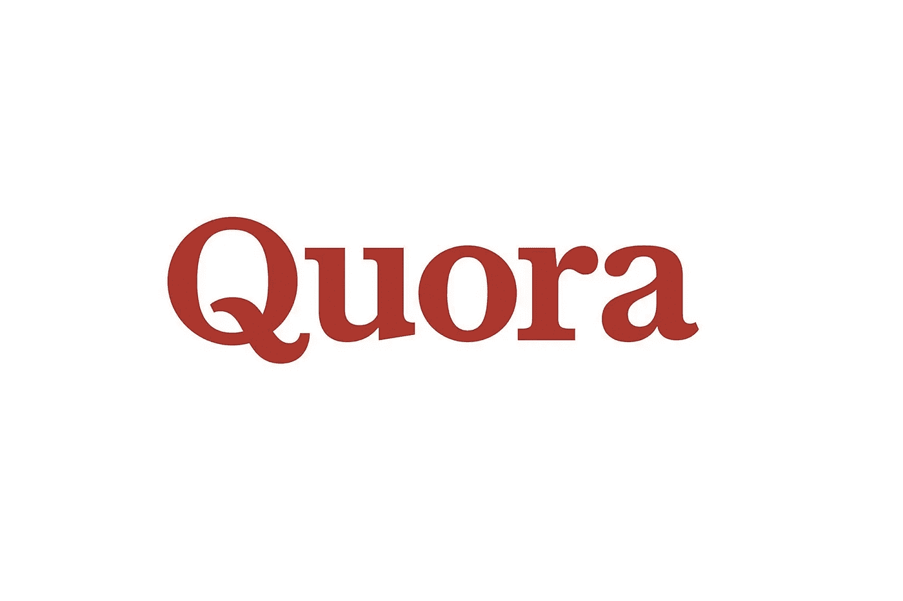
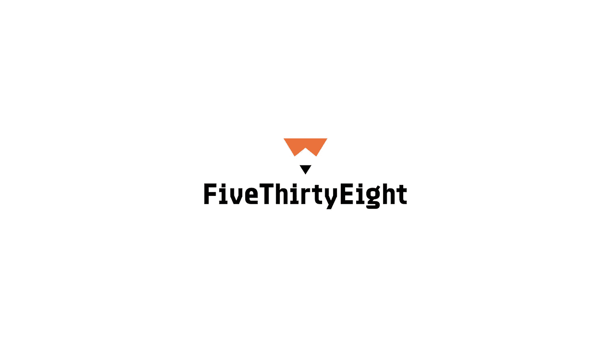
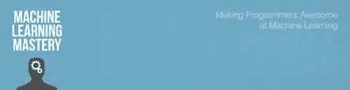
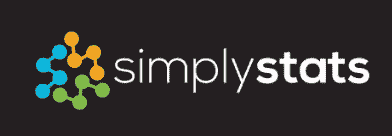

# 在家工作时的数据科学

> 原文：<https://towardsdatascience.com/data-science-while-working-from-home-b14950a69c0c?source=collection_archive---------29----------------------->

## 在家工作时如何跟上数据科学？你的导师比以往任何时候都更忙——但是不要担心，你并不孤单！


西蒙·米加吉在 [Unsplash](https://unsplash.com?utm_source=medium&utm_medium=referral) 上的照片

我们生活在一个奇怪的时代！疫情冠状病毒对“办公室工作”的影响超出了任何人的预期。虽然我更喜欢在家工作，但这并不适合所有人。由于缺乏指导，经验较少的数据科学家正经历艰难时期。许多 IT 从业人员都是内向的人，这使得这一点更加明显。

在这篇文章中，我分享了一些资源，您可以自由地使用它们来提问，跟上数据科学的新工具，并加入志同道合者的社区。

**这里有几个你可能会感兴趣的链接:**

```
- [Labeling and Data Engineering for Conversational AI and Analytics](https://www.humanfirst.ai/)- [Data Science for Business Leaders](https://imp.i115008.net/c/2402645/880006/11298) [Course]- [Intro to Machine Learning with PyTorch](https://imp.i115008.net/c/2402645/788201/11298) [Course]- [Become a Growth Product Manager](https://imp.i115008.net/c/2402645/803127/11298) [Course]- [Deep Learning (Adaptive Computation and ML series)](https://amzn.to/3ncTG7D) [Ebook]- [Free skill tests for Data Scientists & Machine Learning Engineers](https://aigents.co/skills)
```

*上面的一些链接是附属链接，如果你通过它们进行购买，我会赚取佣金。请记住，我链接课程是因为它们的质量，而不是因为我从你的购买中获得的佣金。*

# 不和谐社区


约翰·施诺布里奇在 [Unsplash](https://unsplash.com?utm_source=medium&utm_medium=referral) 上拍摄的照片

Discord 是通过语音、视频和文本进行交流的最简单的方式，无论你是学校俱乐部、夜间游戏小组、全球艺术社区的一员，还是只是想出去玩的几个朋友。

有许多数据科学不和谐服务器，所以我在这里列出了最受欢迎的:

*   [数据共享](https://discord.com/invite/eaPVRW3)是面向数据科学的官方不和谐社区。你可以在你当前的项目中得到帮助，或者在其他人的学习道路上帮助他们。
*   [数据科学](https://discord.com/invite/UYNaemm)是一个由来自不同行业和学术界的数据科学家组成的活跃、有凝聚力的团体，目的是让每个人分享他们的领域专业知识、讨论问题、探索该职业的许多不同学科，并在此过程中建立友谊。

# Reddit 社区


Kon Karampelas 在 [Unsplash](https://unsplash.com?utm_source=medium&utm_medium=referral) 上拍摄的照片

Reddit 不需要特别介绍，所以我只列出了数据科学中最受欢迎的三个子主题:

*   [r/MachineLearning](https://www.reddit.com/r/MachineLearning/) —拥有 110 万会员的机器学习社区
*   初学者问愚蠢问题和专家帮助他们的地方！
*   [r/learnmachinelearning](https://www.reddit.com/r/learnmachinelearning/) —专门学习机器学习的子编辑器。

# Quora 社区



Quora 标志

Quora 是一个获取和分享知识的地方。这是一个提问的平台，可以联系那些提供独特见解和高质量答案的人。

Quora 越来越受欢迎，因此网站上有越来越多的数据科学专家。有两个有趣的话题可以关注或提出问题:

*   [Quora 的机器学习话题](https://www.quora.com/topic/Machine-Learning)
*   [Quora 的数据科学专题](https://www.quora.com/topic/Data-Science)

# 五三八



五个三十八个标志

FiveThirtyEight 是一个 Nate Silver 的博客，使用硬数据进行统计分析，讲述关于政治、体育、科学、经济和文化的引人入胜的故事。

我养成了每天阅读几篇文章而不是阅读新闻网站的习惯。有几次，我从这篇文章中得到了一个适用的想法，帮助我进行分析。

# r 博客


R-bloggers 徽标

[R-bloggers](https://www.r-bloggers.com/) —如果你使用 R 作为数据科学的主要语言，你应该关注这个博客。它有 R 新闻和由数百个 R 博客贡献的教程。我不使用 R，但我不管不顾地阅读博客，只是为了看看 R 生态系统中正在发生什么。

# 机器学习掌握



机器学习大师徽标

[机器学习大师](https://machinelearningmastery.com/blog/)——MLM 是一个博客，它的主要目的是出售杰森·布朗利的电子书。我是这个博客的忠实读者已经有一段时间了，Jason 在用简单的术语介绍复杂的话题方面做得很好。有几次，我只是让初级数据科学家去 MLM 更新他们关于某个主题的知识。

# 简单统计



简单统计标志

[Simply Statistics](https://simplystatistics.org/) 是由三位来自常春藤大学的生物统计学教授撰写的博客。该博客有关于各种主题的高质量帖子，这些帖子都有数字支持。我只阅读(一个更好的词是“学习”)那些最适用于我的工作领域的。

# 课程

了解如何训练一个机器学习模型，并将其部署到云上(声明:我是该课程的作者)。

[](https://medium.com/@romanorac/hands-on-data-science-course-e764853f516b) [## 你在云中的第一个机器学习模型

### 一步一步的指导，将告诉你如何训练一个机器学习模型，建立一个网络应用程序，并部署到…

medium.com](https://medium.com/@romanorac/hands-on-data-science-course-e764853f516b) 

# 在你走之前

在[推特](https://twitter.com/romanorac)上关注我，在那里我定期[发关于数据科学和机器学习的](https://twitter.com/romanorac/status/1328952374447267843)推特。


照片由[Courtney hedge](https://unsplash.com/@cmhedger?utm_source=medium&utm_medium=referral)在 [Unsplash](https://unsplash.com/?utm_source=medium&utm_medium=referral) 上拍摄