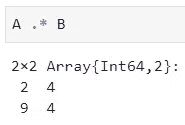

# Julia 的数据科学:线性代数

> 原文：<https://towardsdatascience.com/data-science-with-julia-linear-algebra-ee612c20e84c?source=collection_archive---------11----------------------->

## Julia 中的线性代数—提示:它甚至比 Numpy 更简单

说到数据科学，没有那么多编程语言可以选择。你可以用 Python 或者 R，或者最近用 Julia。如果你不知道 Julia 是什么，请参考我以前的一篇文章:

 [## Julia 简介:数据科学中 Python 和 R 的替代方案

### 迎接面向科学计算、数据科学和机器学习的 21 世纪编程语言。

towardsdatascience.com](/introducing-julia-an-alternative-to-python-and-r-for-data-science-dcbf98346253) 

如果你不想读完整本书(这也很酷)，这里有一句总结:

> Julia 是一种编程语言，写起来像 Python，但运行起来像 c。

由于这些原因，我想给你，我的读者朋友，一本使用 Julia 编程语言的线性代数入门书。现在，这不是线性代数的完整课程**，因为不可能在 5 分钟内教完(如果你不是你知道谁)，但是这篇文章将涵盖如何处理线性代数数据结构——向量和矩阵——以及如何用它们做很酷的事情。**

**所以，是的，这篇文章假设你至少知道一些关于这个主题的东西，并且熟悉线性代数运算，比如说 **Numpy** ，但是渴望看到 Julia 提供的东西。**

**事不宜迟，我们开始吧！我假设你已经在 Jupyter 这样的环境中安装并运行了 Julia(如果你不参考上面的文章)。您只需要导入一个库，并且您可能会猜到是哪个库:**

****

# **声明向量和矩阵**

**如果我们不知道如何声明基本向量和矩阵，谈论特征分解和欧几里德范数是没有意义的。不过这很简单，我要说比用 Python 要简单一点(不确定 R)。**

## **单行矩阵**

**要创建一个行向量，您需要用方括号将元素括起来，并且不要在元素之间放置逗号(如果放置逗号，您将得不到向量):**

****

## **列向量**

**以类似的方式，要生成列向量，您还需要在末尾加上一个单引号，其他事情都与行向量相同:**

****

## **[数]矩阵**

**创建矩阵的语法非常相似——您将逐行声明它，将分号(；)来指示元素应该在新的一行上:**

****

## **零点矩阵**

**创建一个由零组成的 **n*m** 矩阵的语法与 Python 中的非常相似，只是没有 Numpy 前缀:**

****

## **一的矩阵**

**这同样适用于一的 n*m 矩阵:**

****

## **对角矩阵**

**如果你想做一个对角线矩阵，也就是不在对角线上的元素为 0 的矩阵，你可以通过`Diagonal()`和传入对角线上元素值的数组来实现:**

****

## **单位矩阵**

**以类似的方式，您可以创建一个 **n*n** 单位矩阵:**

****

## **随机数矩阵**

**要创建一个包含均匀分布元素的 **n*m** 矩阵，可以使用`rand()`方法:**

****

## **随机数矩阵(正态)**

**或者使用`randn()`从标准正态分布(mean = 0，var = 1)中抽取元素:**

****

**现在，我们已经做了很多，但仍然没有涉及任何线性代数运算，这将在下一节中介绍。**

# **线性代数运算**

**在这一节中，我们将讨论矩阵乘法、逆矩阵、行列式、特征分解等等。我们开始吧！**

## **移项**

**要计算矩阵转置，您可以使用方便的`transpose()`函数:**

****

## **重塑**

**一个数组也可以被重新整形——这里我创建了一个包含 1 到 10 元素的数组，并将它们重新整形为一个 2 行 5 列的矩阵:**

****

## **变平**

**您可以轻松地将 **n*m** 矩阵展平为一个列向量——这在以后涉及数据科学时会有很多用例:**

****

## **点积**

**我相信你能猜到一种计算点积的方法的名字:**

****

## **矩阵乘法**

**要执行矩阵乘法，您可以使用乘法符号，而在 Python 中，您使用了 **@** 符号:**

****

## **逐元素乘法**

**要逐元素相乘，使用**。*** 符号:**

****

## **矩阵求逆**

**要计算矩阵的逆矩阵，使用`inv()`方法:**

****

## **决定因素**

**用`det()`法计算行列式:**

****

## **特征分解**

**您也可以执行矩阵的特征分解。它会返回特征值和特征向量，所以如果你想存储它们，你需要两个变量:**

****

## **向量范数**

**最后，要计算简单的欧几里德范数，您可以使用`norm()`方法:**

****

**我认为这就足够了，甚至可能有点多。我希望这对你来说不是一个大问题。对我来说，在 Julia 中线性代数感觉很自然，甚至比在 Python 中更自然。让我们希望这种说法在未来处理真实数据集时仍然成立。**

# **下一步是什么**

**在进入一些“具体的”数据科学之前，具体的意思是 EDA、数据可视化和机器学习，我想确保基础知识得到适当的覆盖。主要原因是——**你需要知道你正在使用的语言**。在网上寻找答案很酷，但不酷的是不断怀疑自己，因为你不确定自己是否做对了。**

**这就是为什么您可以期待另外三篇与本文类似的文章，涵盖:**

*   **结石**
*   **统计/概率**
*   **基本数据框架**

**只有这样，我们才能向应用数据科学迈进一步。感谢阅读，我希望你喜欢它。**

**喜欢这篇文章吗？成为 [*中等会员*](https://medium.com/@radecicdario/membership) *继续无限制学习。如果你使用下面的链接，我会收到你的一部分会员费，不需要你额外付费。***

** [## 通过我的推荐链接加入 Medium-Dario rade ci

### 作为一个媒体会员，你的会员费的一部分会给你阅读的作家，你可以完全接触到每一个故事…

medium.com](https://medium.com/@radecicdario/membership)**