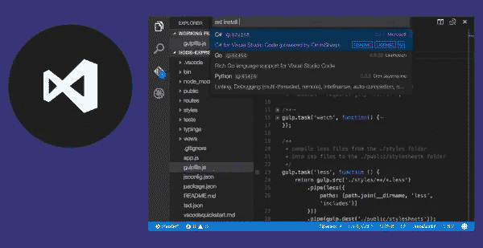

# Python 数据科学:入门

> 原文：<https://towardsdatascience.com/data-science-with-python-getting-started-4d48e28ca696?source=collection_archive---------28----------------------->

## 启动和运行的基本要素+有用的资源

[M. B. M.](https://unsplash.com/@m_b_m?utm_source=medium&utm_medium=referral) 在 [Unsplash](https://unsplash.com?utm_source=medium&utm_medium=referral) 上拍摄的照片

数据科学已经成为一项革命性的技术，似乎每个人都在谈论它。被誉为“21 世纪最性感的工作”的数据科学是一个时髦词，很少有人真正了解这项技术。虽然许多人希望成为数据科学家，但看到真实情况是必不可少的。

“数据科学是一个跨学科领域，它使用科学方法、流程、算法和系统从许多结构化和非结构化数据中提取知识和见解。”——维基百科

简而言之，数据科学是一个专注于从数据中获取洞察力的研究和实践领域。

数据科学家使用数学、统计学和机器学习技术来挖掘大型数据集，以获得可用于分析过去甚至预测未来的模式。

如果你是所有这些深度学习的新手，不要担心——我会一步一步带你经历这一切。如果你是一个老手，那么你可能想跳过一些文章。然而，我确实假设你已经编码至少一年了，并且(如果你以前没有使用过 Python)你将投入额外的时间去学习你所需要的任何 Python。

如果你有一台电脑，一个互联网连接，并愿意投入工作，这就是你所需要的一切。你不需要很多数据，不需要大学水平的数学，也不需要一个巨大的数据中心。

你会惊讶于入门是多么容易！

# 需要 GPU 吗？

我写了一篇关于[什么是 GPU 以及深度学习需要 GPU 吗](https://medium.com/@jasmcaus/what-is-a-gpu-and-do-you-need-one-in-deep-learning-8a323476e109?source=friends_link&sk=61916bb71880ddb0c8ac4e9e25040fc0)的帖子——值得一读

GPU(图形处理单元)是专门为以高帧速率渲染图像而创建的计算机硬件。由于图形纹理和着色需要并行执行的矩阵和向量操作比 CPU(中央处理器)能够合理处理的要多，因此 GPU 可以更有效地执行这些计算。

碰巧深度学习也需要超快的矩阵计算。因此，研究人员将两者结合起来，[开始在 GPU 的](http://www.machinelearning.org/archive/icml2009/papers/218.pdf)中训练模型，剩下的就是历史了。深度学习只关心每秒浮点运算(FLOPs)的次数，GPU 为此进行了高度优化。

来源:[卡尔鲁普](https://www.karlrupp.net/2013/06/cpu-gpu-and-mic-hardware-characteristics-over-time/)

在上面的图表中，您可以看到 GPU(红色/绿色)理论上可以完成 CPU(蓝色)的 10-15 倍操作。这种加速在实践中也非常适用。

如果你想在深度学习中训练任何有意义的东西，GPU 是你需要的——特别是 NVIDIA GPU(这是目前最快的一种)。

但是，尽管 GPU 看起来非常有利可图，当你开始使用它时，你并不需要它。除非你的项目是如此先进，需要一个*吨*的计算，你的 CPU 可以处理得很好。然而，如果你确实想要一个 GPU(如果你的电脑没有内置 GPU)，我会建议你租用一台已经预装了你需要的所有东西的电脑。在你使用它的时候，费用可以低至每小时 0.25 美元。

 [## 什么是 GPU，深度学习需要 GPU 吗？

### 在深度学习中，大家似乎都推荐用 GPU。它是什么，没有它你能做什么，它到底是谁…

towardsdatascience.com](/what-is-a-gpu-and-do-you-need-one-in-deep-learning-718b9597aa0d) 

# 代码编辑器和环境

Visual Studio 代码是我的首选代码编辑器

在数据科学中，一般的建议(尤其是如果你是初学者)是使用某种初学者友好的环境，如 [Jupyter](http://jupyter.org) 或 [Anaconda](http://anaconda.com) ，但是我使用 [VS Code](http://code.visualstudio.com) 来支持我的数据科学项目。

这里有一篇文章是关于[Jupyter 笔记本的入门文章](/jupyter-lab-evolution-of-the-jupyter-notebook-5297cacde6b)

# Python 的先验知识

资料来源:python.org

这个关于数据科学的迷你系列确实假设你已经编码至少一年了。哪种语言并不重要——只要你有良好的编程经验，你应该没问题。如果您对 Python 一点都不熟悉，不要担心！我会一路链接有用的资源。

如果你*没有任何代码经验，我建议你学习 Python。它(真的非常)简单，是我们将在这个数据科学迷你系列中使用的编程语言。*

# 有用的资源

由 [Ed Robertson](https://unsplash.com/@eddrobertson?utm_source=medium&utm_medium=referral) 在 [Unsplash](https://unsplash.com?utm_source=medium&utm_medium=referral) 上拍摄的照片

快速获取(或更新)Python 知识的资源

**完全初学者:**

1.  [巨蟒旋风之旅](https://github.com/jakevdp/WhirlwindTourOfPython)
2.  [真正的蟒蛇](http://realpython.org)
3.  [艰难地学 Python](https://learnpythonthehardway.org/)

**中级程序员:**

1.  [Python 的搭便车指南](https://docs.python-guide.org/)
2.  [德里克·巴纳斯——视频中的 Python](http://www.newthinktank.com/2014/11/python-programming/)
3.  [计算机程序设计](https://www.udacity.com/course/design-of-computer-programs--cs212)

**高级程序员(但可能是 Python 新手):**

1.  [在 y 分钟内学会 x](https://learnxinyminutes.com/docs/python3/)
2.  [大卫·比兹利的课程、教程和书籍](https://www.dabeaz.com/)
3.  雷蒙·赫廷格

**Python 数值编程:**

无论你是初学者还是高级程序员，这都值得一读。在本系列中，我们将使用大量的数值编程。

1.  [斯坦福 NumPy 教程](http://cs231n.github.io/python-numpy-tutorial/)
2.  [科学的课堂笔记](https://scipy-lectures.org/)
3.  [Python 数据科学手册](https://jakevdp.github.io/PythonDataScienceHandbook/)

这个数据科学小编的介绍到此结束！在下一篇文章中，我们将讨论[图像分类](https://medium.com/@jasmcaus/data-science-with-python-image-classification-with-d87e1234e20b)。

 [## 数据科学中的图像分类

### 什么是数据科学中的图像分类和用 Python 构建我们自己的图像分类器

towardsdatascience.com](/image-classification-in-data-science-422855878d2a) 

一如既往，非常感谢您的阅读！请告诉我你的想法或者希望我接下来在评论中写些什么。我也乐于接受批评！

下期帖子再见！😄

 [## 我希望在开始从事数据科学时就知道的资源

### 面向严肃数据科学家的强大学习指南

towardsdatascience.com](/resources-i-wish-i-knew-when-i-started-out-with-data-science-9a8889654c36)