# Python 数据科学:如何使用 NumPy 库

> 原文：<https://towardsdatascience.com/data-science-with-python-how-to-use-numpy-library-5885aa83be6b?source=collection_archive---------26----------------------->


NumPy 动手体验。劳伦茨·海曼在 [Unsplash](https://unsplash.com/s/photos/python-code?utm_source=unsplash&utm_medium=referral&utm_content=creditCopyText) 上拍摄的照片

## 数据科学和机器学习

## 将这一实践经验加入书签，以了解数据科学和机器学习领域的 NumPy

```
NumPy (Numerical Python) is a linear algebra library for Python.Almost all of the other libraries in the Python data ecosystem rely on NumPy as one of their main building blocks.This is the reason it is so important for data science. Additionaly, NumPy is incredibly fast and has bindings to C libraries.
```

要准备好在 Python 发行版中使用 Numpy，请在终端或命令提示符下键入以下命令:

```
pip install numpy
```

## 先决条件

如果你不熟悉 Python，下面的文章会给你一点点 Python 的介绍。

[](/python-procedural-or-object-oriented-programming-42c66a008676) [## Python:过程化编程还是面向对象编程？

### 过程化和面向对象之间有点争议，我们为什么要关心它？

towardsdatascience.com](/python-procedural-or-object-oriented-programming-42c66a008676) 

## —阵列

**Numpy** 数组本质上有两种风格，一维向量或二维矩阵。它们都可以称为数组。向量是严格的一维数组，矩阵是二维数组。另外，请注意，矩阵仍然只能有一行或一列。

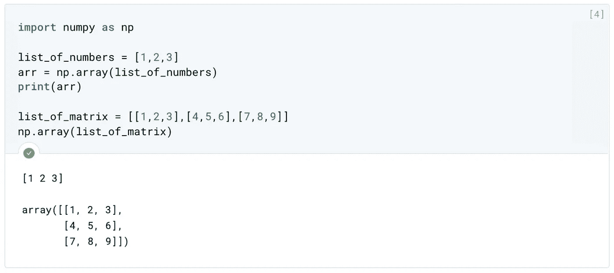

np.array 方法

我们可能会看到 list 可以作为数组使用。此外，我们可以将数组赋给变量。

## —阿兰格

这和 Python 内置的 range 函数真的很像。它用语法 **np.arrange** 表示，然后传入一个开始和停止值。请注意，我们在第三个参数中有一个开始、停止和步长。它将返回给定间隔内均匀分布的值。如果我们只是把它从 0 到 10，记住就像在 Python 中，范围索引从 0 开始。它将返回一个从 0 到 10 的值，但不包括 10。结果，我们将得到一个从 0 一直到 9 的数组，它是一个 10 位数。如果我们想得到从 0 一直到 10 的值，我们必须键入 **np.arange(0，11)** 。

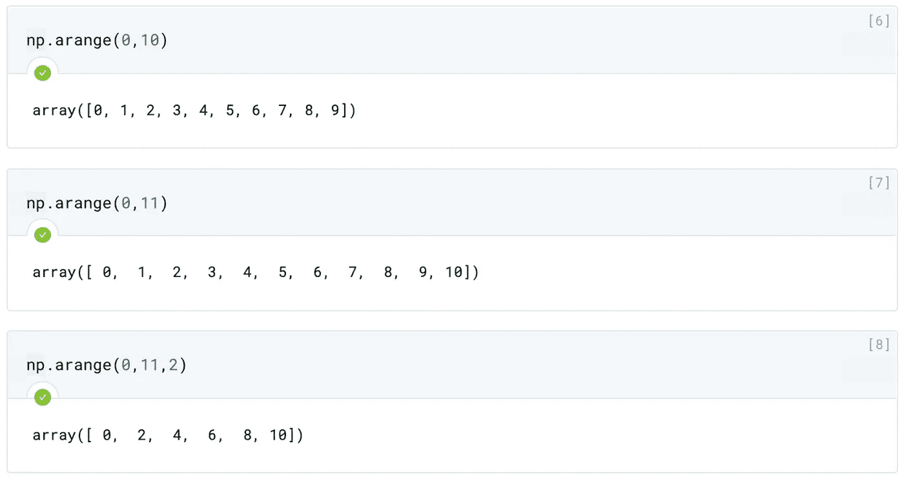

np.arange 方法

最后，我们可以添加第三个参数，即步长。例如，我们需要一个从 0 到 10 的偶数数组。我们可以插入一个参数 **0，11** 。跟随步长 2。所以，它会跳两步。总而言之，范围将是使用 NumPy 快速生成数组的最有用的函数之一。

## —零和一

NumPy 可以生成另一种类型的数组。例如，如果我们想要生成全 0 的数组，我们可以使用**零**方法。我们可以传入一位数或元组。对于单个数字，它将给出一个维度向量的结果。另一方面，在 tuple 中，第一个数字表示行数，第二个数字表示列数。例如，要生成 3 行 4 列，我们可以传入元组 **(3，4)** 。

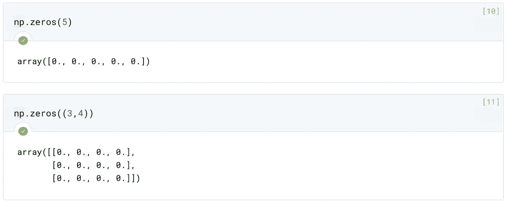

np.zeros 方法

此外，为了生成纯函数，我们可以调用方法**的函数**。类似地，我们可以为一维数组传入一个数字，或者为二维矩阵传入一个多维数组。

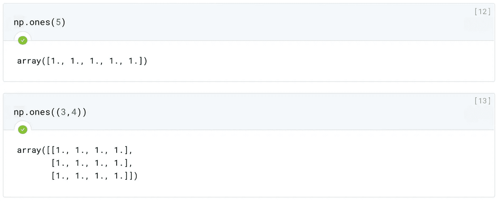

np.ones 方法

## — linspace

另一个真正有用的内置函数是 **linspace** 。该函数将返回指定间隔内的均匀分布的数字。重要的是不要混淆我们之前讨论过的 **linspace** 和**arrange**。我们可以看到， **arange** 基本上从开始、停止和给定的步长返回整数 out，而 **linspace** 将把数字的第三个参数作为我们想要的点。

例如，我们在 **linspace** 中有一个起点 0 和一个终点 5，我们希望得到 0 到 5 之间的 10 个均匀间隔的点。我们可以传入第三个参数 10。该命令将返回一个一维向量，由一组括号表示，括号中有从 0 到 5 的 10 个均匀分布的点。

此外，我们可以将第三个参数更改为任意数字。例如，如果我们想要从 0 到 5 的 100 个均匀间隔的点，我们可以在第三个参数中传递这个数字。这将返回一个更大的一维数组。尽管它看起来像一个二维数组，但由于数组前面只有一个括号，所以它是一维的。

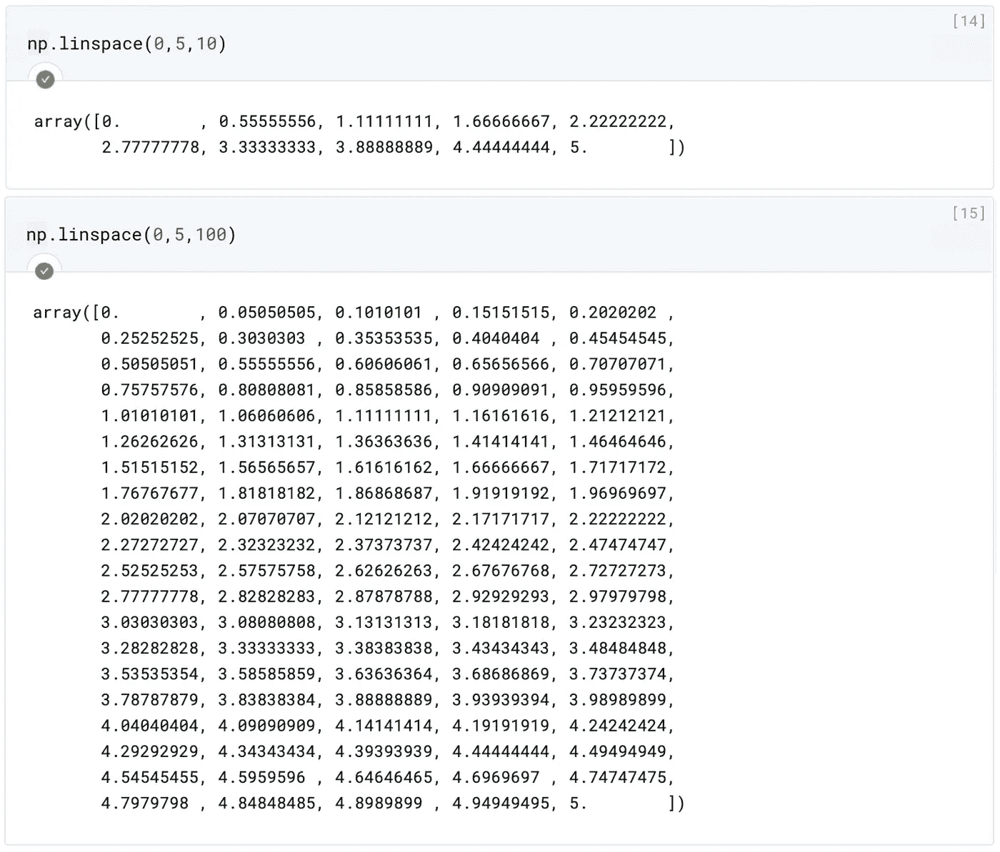

np.linspace 方法

请注意，当我们处理二维空间的时候，我们会看到在两端有两组括号。三维会有三个括号等等。

## —眼睛

我们可以使用 **eye** 用 NumPy 创建一个单位矩阵。我们只需要在参数中传递一个数字。当处理线性代数问题时，单位矩阵是一个有用的矩阵。它基本上是一个二维正方形矩阵，其中行数与列数相同。它的对角线是 1，其他都是 0。这就是它只接受一位数作为参数的原因。单位矩阵必须是正方形作为 **np.eye** 的输出。

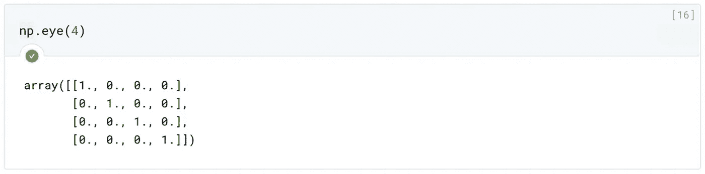

np.eye 方法

## — random.rand

NumPy 也有很多方法来创建一个随机数数组。第一个是 **random.rand** 。这个命令将从给定的形状创建一个数组。它将从 0 到 1 的均匀分布中随机抽取样本。如果我们想要 8 个从 0 到 1 均匀分布的一维随机数数组，我们可以在自变量中给出一个数字 8。但是，我们可以将维度作为单独的参数传入，以获得一个二维数组。例如，如果我们想要一个 5x5 的随机数矩阵，我们在参数中传递 **5，5** 而不是一个元组。

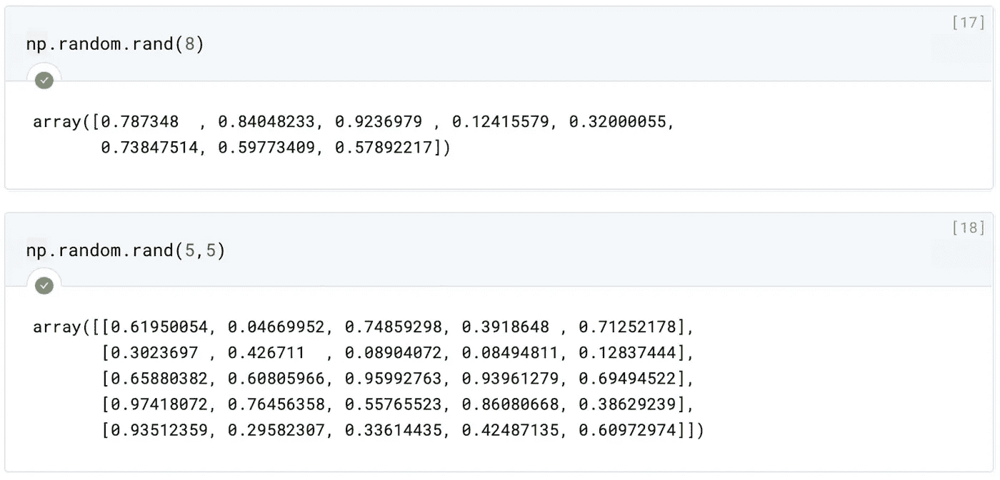

随机随机方法

## — random.randn

其次，不使用 **rand** ，我们可以使用 **randn** 从标准正态分布或高斯分布返回一个或多个样本。这不会返回从 0 到 1 的均匀分布的数字，但是，它会返回 0 附近的标准正态分布中心的数字。此外，要得到一个二维数组，我们可以传入二维参数。例如，要生成一个 4x4，我们可以传递一个参数 **4，4** 。请记住，这个参数是**而不是元组**。这是一个独立的论点，我们可以从两个括号给出的输出中了解到，这是一个二维矩阵。

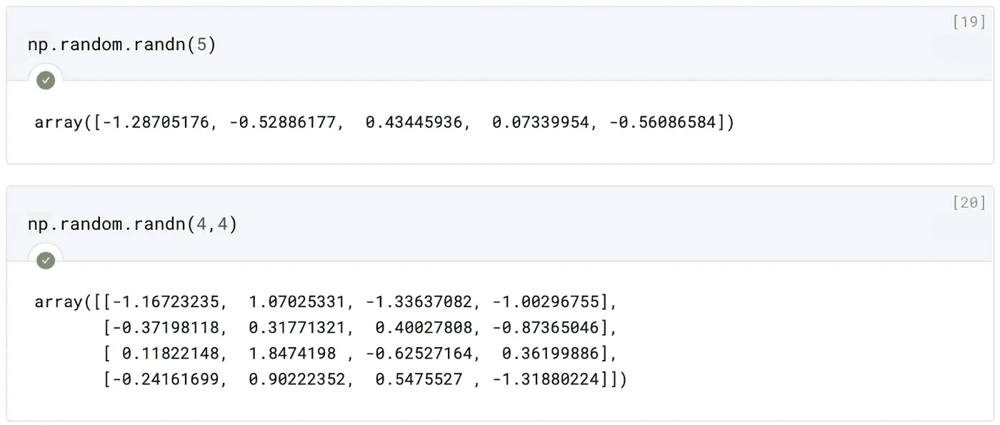

随机方法

## — random.randint

创建数组的最后一个随机方法是 **randint** 。这将返回从低到高的随机整数。例如，如果我们在参数中插入 **1，100** ，我们将得到一个介于 1 和 100 之间的随机整数。低号是包容性的，高号是排他性的。数字 1 有被选中的机会，但 100 没有。此外，如果我们想要特定数量的随机整数，我们可以在第三个参数中传递参数。

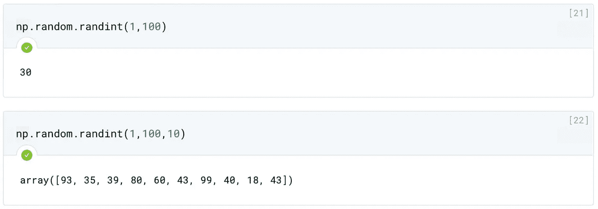

np.random.randint 方法

## —重塑

我们可以在数组上使用的最有用的方法之一是 **reshape** 方法。这个方法将返回一个新形状中包含相同数据的数组。例如，如果我们想要重塑一个包含 24 位数的数组。我们可以使用 reshape to 4x6 array 并在参数中传递行数和列数来重塑 24 位数组。请记住，如果我们不能完全填满矩阵，我们将得到一个错误。例如，如果我们要改变 24 个元素的形状，新形状的总数必须与数组中的 24 个元素相同。

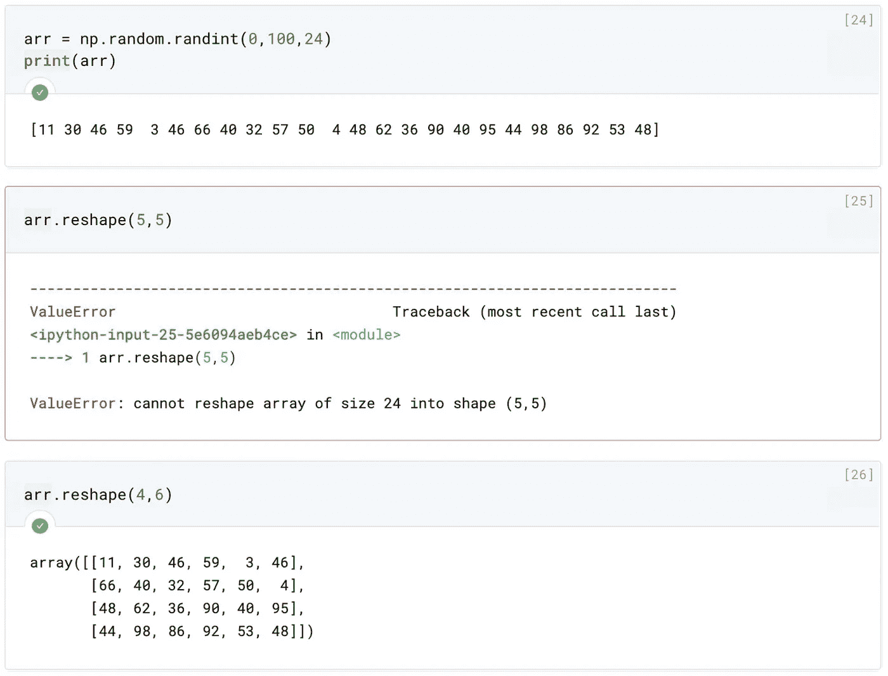

整形方法

## —最大和最小

如果我们想找到一个数组中的最大值，我们可以调用 **max** 方法，这将返回该数组的最大值。同样，如果我们想得到数组的最小值，我们可以调用 **min** 方法。

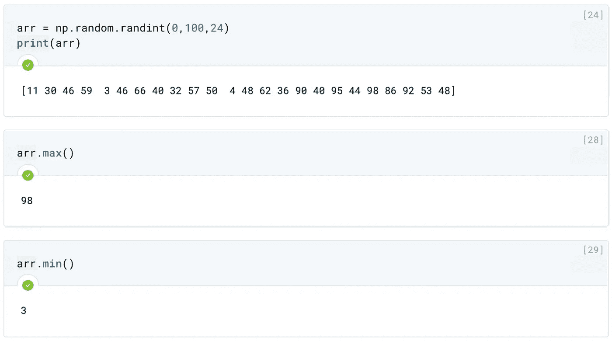

最大最小法

## — argmax 和 argmin

此外，我们实际上可以通过指定 **argmax** 或 **argmin** 方法来计算出最大值或最小值的位置。如果我们想实际知道最大数的索引值是多少，我们可以调用 **argmax** ，它将返回最大值的索引位置。另一方面，我们可以用最小值做同样的事情。我们可以调用 **argmin** ，它将返回最小值的索引位置。

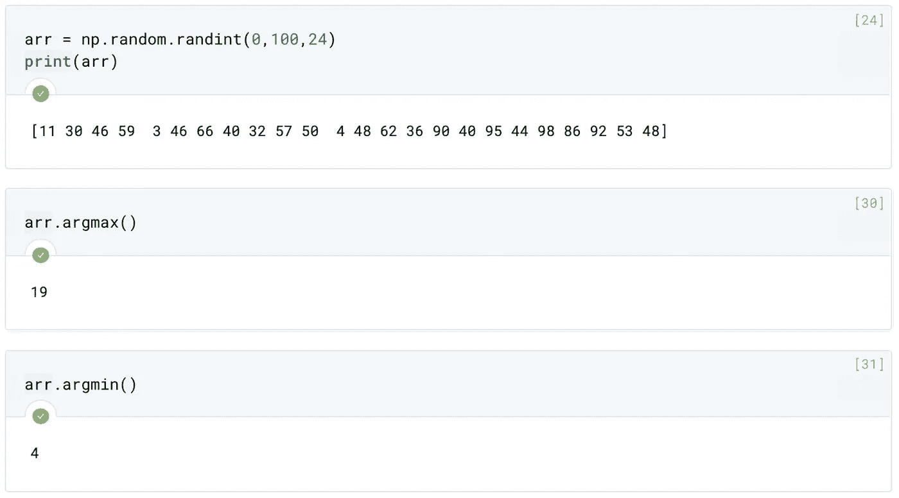

argmax 和 argmin 方法

## —形状

如果我们想弄清楚向量的形状，我们可以调用方法 **shape** ，它将返回形状。如果它是一个一维向量，它将给出元素个数的结果，后面跟一个逗号。

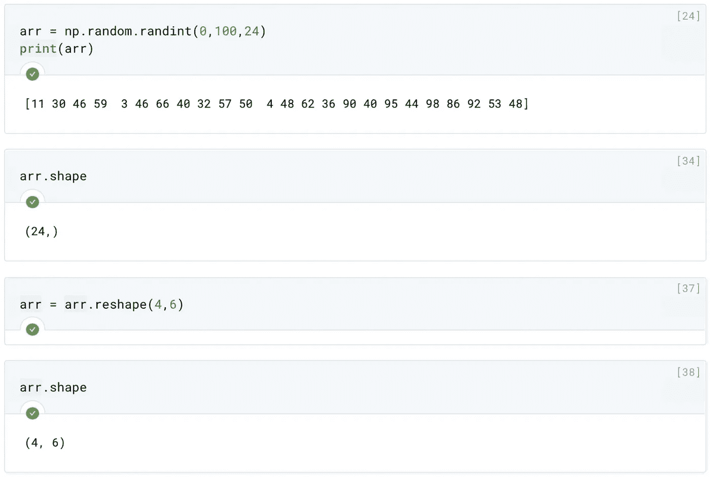

形状方法

## —数据类型

另一个有用的属性是数组中的数据类型。如果我们对数组中的数据类型感到好奇，我们可以调用 **dtype** 作为属性，它将返回数组的实际数据类型。

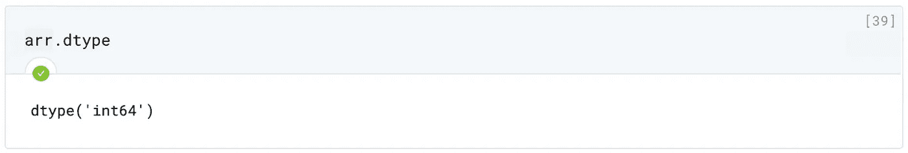

数据类型方法

## 索引和选择

从 NumPy 数组中获取一个或一些元素的最简单方法是使用括号和切片符号。让我们从声明数组本身的变量名开始；在这种情况下，我们称之为 **my_array** 。

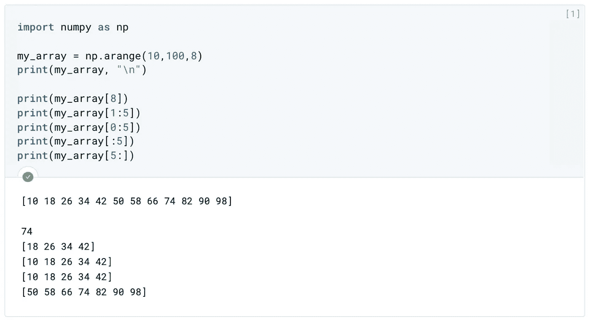

索引和选择

要从数组的特定索引返回单个值，可以在方括号内定义一个参数，例如， **my_array[8]** 从索引 8 中获取值。另一方面，要像 python 列表一样获取一个范围内的值，可以使用**切片符号**。我们需要定义开始索引和停止索引。

例如， **my_array[1:5]** ，将返回从索引 1 开始的值，一直到索引 5。记住前面的解释，在**范围**部分，第二个参数值不包括在索引中，因为索引从 0 开始。为了展示另一个例子，您可以键入 **my_array[0:5]** ，这将返回从索引 0 到索引 5 的值。

您还可以删除停止点或开始点，以表明您想要数组中的所有内容，即数组开头的所有内容。例如，如果您希望所有内容都从索引 5 开始，而不是将起始参数指定为 0，您可以放置 **my_array[:5]** ，这将返回从数组开始到索引 5 的所有内容。这和调用语法 **my_array[0:5]是一回事。**

类似地，如果您想从一个特定的索引开始并获取数组末尾的其余值，您可以使用相同的切片符号，例如， **my_array[5:]** 。

## 广播

Numpy 数组不同于标准的 Python 列表，因为它具有广播的能力。尝试运行这个语法 **my_array[0:5] = 100** 。该命令将广播到前五个索引，使它们都为 100。另一方面，您可以创建一个新变量，它等于原始数组中的某个片段。

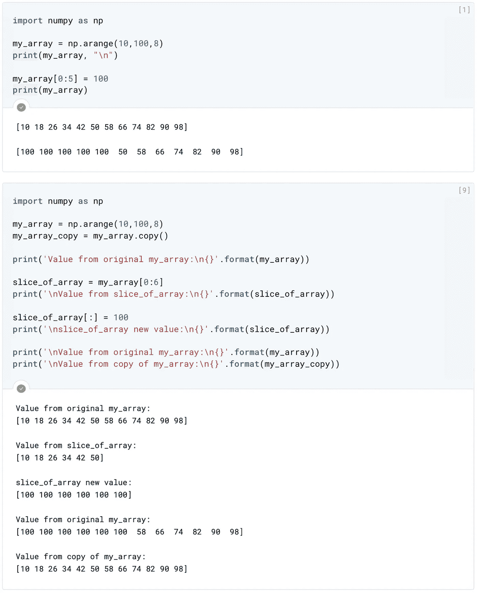

数字广播

如果这对你来说有点困惑，那也没关系。基本前提是，如果您获取数组的一部分并将其设置为一个变量，而没有明确说明您想要数组的副本，那么您应该记住，您查看的是到原始数组的链接。您所做的更改也会影响原始数组。

## 矩阵索引

现在，我们将讨论索引 2D 数组，也称为矩阵。我们这里有 **my_2d_array** 变量，我们有 3 行 3 列。它是一个二维矩阵。从 2D 数组或矩阵中获取元素有两种通用格式。有带逗号的双括号格式和单括号格式，这是推荐使用的格式。

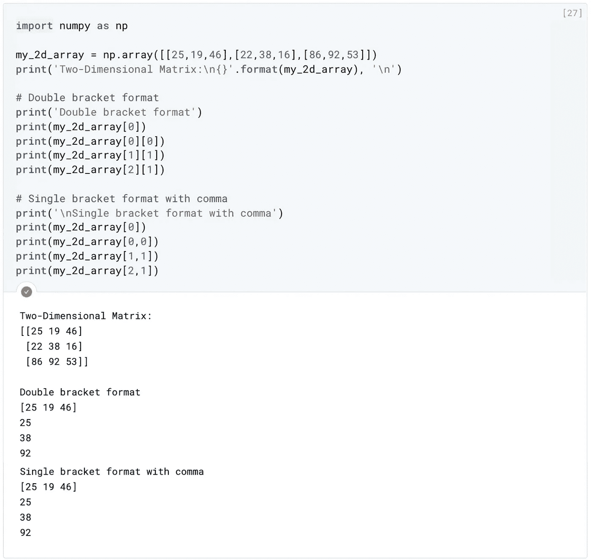

二维索引

假设您不想要单个元素，而是数组的实际块。例如，你想从矩阵中得到一些矩阵。您可以使用冒号作为切片标记来获取整个 2D 数组的某些部分。

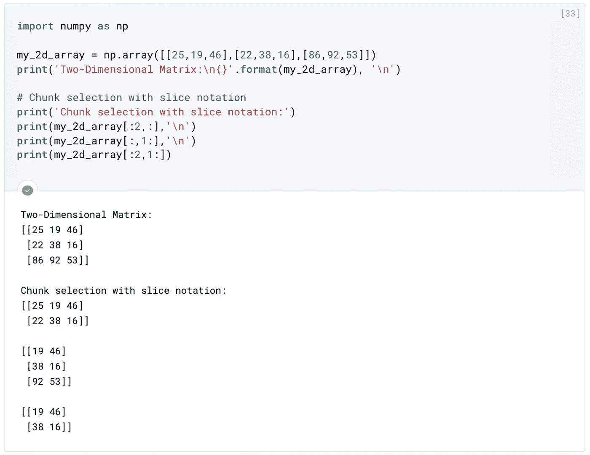

获取数组块的切片符号

## 条件选择

我们可以通过**比较运算符**用条件选择来获取数组的一些值。

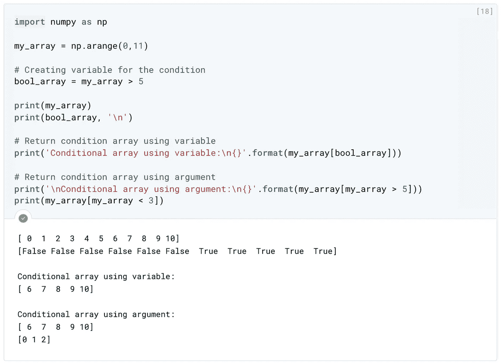

条件选择

这个过程将返回一个完整的布尔数组，指示真和假的结果。这意味着如果你将数组与一个数字进行比较，例如， **my_array > 5** ，你将得到一个布尔值数组。这些是**真或假的**值。当比较为假时返回假，如果比较为真则返回真。您可以将比较运算符分配给变量，并将其用作条件选择。

## 操作

我们将向您展示您可以在 NumPy 数组上执行的基本操作，例如带有数组操作的数组、带有标量操作的数组以及一些通用的数组函数。您可以使用简单的算术符号执行带有数组运算的数组。

例如，如果你想逐个元素地将两个数组相加，你可以说 **my_array + my_array** 。本质上，每个数字都翻倍了。减法甚至乘法也可以做同样的过程。

还可以用标量运算执行数组。比如 **my_array + 100** ，scalar 的意思是单个数字，NumPy 做的就是把那个数字广播给数组中的每一个元素。这也适用于乘法、除法和减法。也可以用指数做数组，比如 **my_array ** 2** ，这是 2 的幂的数组。

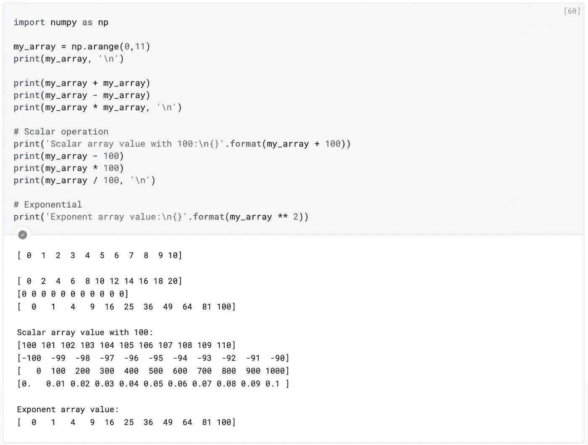

NumPy 基本操作

```
**Please Note:**
Numpy will issue a warning instead of outputting errors on certain mathematical operations, however, you still get an output.For example, **my_array / my_array**.
Any array value divided by 0, will returns:[nan  1\.  1\.  1\.  1\.  1\.  1\.  1\.  1\.  1\.  1.]
***RuntimeWarning: invalid value encountered in true_divide***On the other hand, **1 / my_array.** If 1 divided by 0, you will also get a warning:[       inf 1\.         0.5        0.33333333 0.25       0.2
 0.16666667 0.14285714 0.125      0.11111111 0.1       ] ***RuntimeWarning: divide by zero encountered in true_divide***
In this case, it will show infinity instead of nan.
```

Numpy 附带了许多通用数组函数，这些函数大多只是**数学运算**。您可以使用它来执行操作，并在整个阵列中传播它。例如，如果你想得到数组中每个元素的平方根，你可以说 **np.sqrt** ，然后在参数中传递数组。这将使数组中所有元素的平方根。

类似地，您可以说 **np.exp** 并将数组传入参数以计算指数。甚至可以用三角函数比如 **sin** 和 **cos** 。这将把每个元素转换成正弦和余弦。

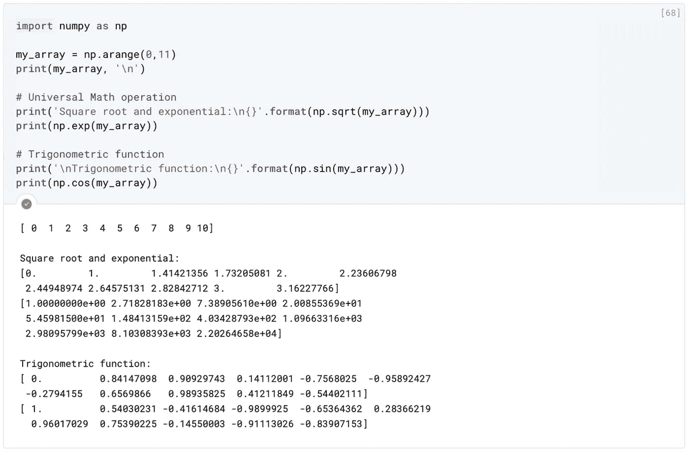

数字数学运算

动手体验到此结束。如果你用你最喜欢的 IDE 或 Jupyter 笔记本来尝试下面的练习，以了解如何使用 NumPy 来获得数据科学和机器学习的最佳运气，那将是最好的。

我们鼓励你从下面的参考链接中了解更多，以获得更多关于 NumPy 的解释。

```
**References**#1 [NumPy](http://www.numpy.org/)
#2 [Mathematical Function](https://numpy.org/doc/stable/reference/routines.math.html)
#3 [Cheat Sheet: Data Analysis in Python](https://s3.amazonaws.com/assets.datacamp.com/blog_assets/Numpy_Python_Cheat_Sheet.pdf)***Writer Note:*** *I would love to receive critiques, comments, and suggestions.*
```