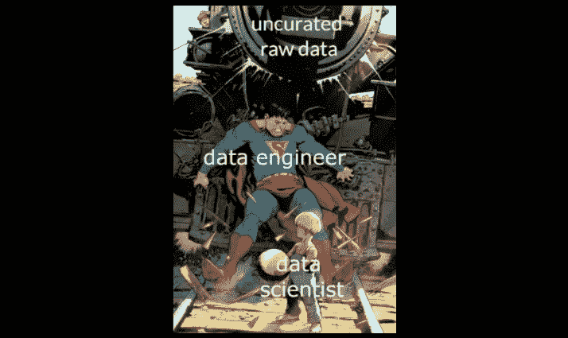
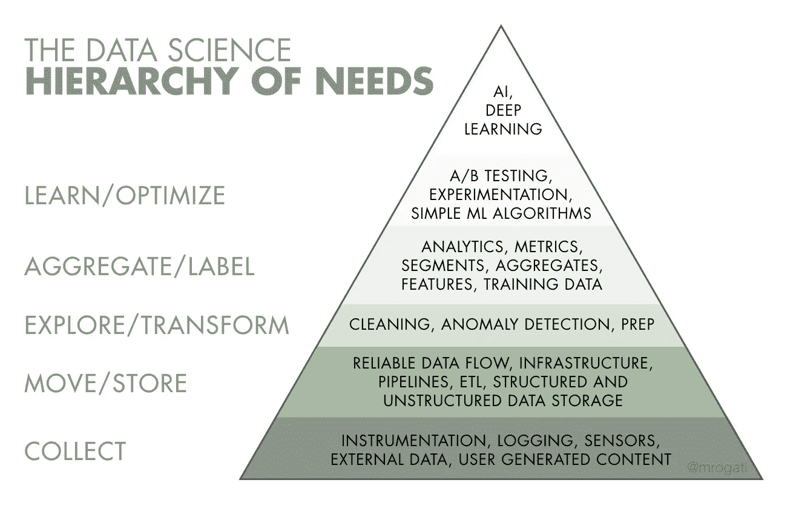

# 数据科学…没有任何数据？！

> 原文：<https://towardsdatascience.com/data-science-without-any-data-6c1ae9509d92?source=collection_archive---------2----------------------->

## 为什么尽早聘用数据工程师很重要

“你目前正在应对哪些挑战？”我问。*这位前学者说，*“看起来我被一家没有数据的公司聘为首席数据科学家了。”**

**

*“人类，碗是空的。”—数据科学家。图片:[来源](http://thumbpress.com/human-the-bowl-is-empty/#sthash.rXb8K4tr.dpbs)。*

*我不知道该笑还是该哭。你可能认为这是显而易见的，但是没有数据，数据科学就没有任何意义。唉，这不是一个孤立的事件。*

> *没有数据，数据科学就没有任何意义。*

*所以，让我继续说，这么多雄心勃勃的数据科学家(以及他们未来的雇主)似乎真的需要听到什么。*

## *什么是数据工程？*

*如果说 [**数据科学**](http://bit.ly/quaesita_datasci) 是**制作数据*有用*** 的学科，那么你可以把 [**数据工程**](http://bit.ly/quaesita_universe) 看成是**制作数据*有用*** *的学科。数据工程师是提供幕后基础设施支持的英雄，这些支持使机器日志和庞大的数据存储与数据科学工具包兼容。**

**

*模因:[来源](https://www.linkedin.com/posts/hamed-zitoun-machine-learning-freelance_datascience-dataengineering-machinelearning-activity-6730899989536505857-MCDo/)。*

> *如果说**数据科学**是**让数据*有用*** 的学科，那么**数据工程**就是**让数据*有用的学科。****

*与数据科学家不同，数据工程师往往不会花太多时间查看*数据*。相反，他们关注并使用保存数据的基础设施。数据科学家是数据管理者，而数据工程师是数据管道管理者。*

**

*图片:[来源](https://hackernoon.com/the-ai-hierarchy-of-needs-18f111fcc007)。*

> *数据科学家是数据管理者，而数据工程师是数据管道管理者。*

## *数据工程师是做什么的？*

*数据工程工作有三种主要形式:*

1.  **大规模启用数据存储(***)和交付(* ***数据管道*** *)。***
2.  ***维护推动企业运营的数据流。***
3.  ***提供数据集支持数据科学。***

## **数据科学受制于数据工程**

**没有数据就做不了数据科学。如果你被一个既没有数据也没有数据工程的组织聘为数据科学主管，猜猜谁会成为数据工程师…？你！**

**没错。**

## **数据工程有什么难的？**

**如果你只是为自己的晚餐做点什么，杂货店购物是很容易的，但是大规模会把琐碎的事情变得非常困难——你如何获得、储存和加工 20 吨冰淇淋……而不让它们融化？**

**同样，当你为你的学校项目下载一个小的电子表格时，“数据工程”是相当容易的，但是当你处理 Pb 级的数据时却令人眼花缭乱。规模本身就使它成为一门复杂的工程学科。**

****

**图片:[来源](https://pixabay.com/photos/ice-cream-ice-cream-parlor-dessert-410330/)。**

> **规模本身就使它成为一门复杂的工程学科。**

**不幸的是，了解这些学科中的一个并不意味着你了解另一个。**

## **两个学科都要学吗？**

**如果你刚刚感到想要逃离并学习这两个学科的冲动，你可能是数据专业人员必须了解数据的一切(T22、T23)这一信念的受害者。数据世界正在快速扩张，现在是我们开始认识到这个领域有多大的时候了，在其中的一部分工作并不自动要求我们成为所有领域的专家。我甚至可以说，它太大了，即使是最坚定的天才也无法吞下整个。**

> **在数据世界的一部分工作并不自动要求我们成为所有数据的专家。**

**不要期望数据人员能够做所有的事情，让我们开始问彼此(和我们自己)，" [*你是哪一种？让我们拥抱一起工作，而不是试图单干。*](http://bit.ly/quaesita_universe)**

## **但是这难道不是一个难以置信的学习机会吗？**

**也许吧。这取决于你有多热爱你已经知道的学科。数据工程和数据科学是不同的，所以如果你是一个没有接受过数据工程培训的数据科学家，你将不得不从头开始。**

> **建立您的数据工程团队可能需要数年时间。**

**这可能正是你想要的那种乐趣——只要你睁大眼睛去看。建立您的数据工程团队可能需要数年时间。当然，有一个学习新东西的借口是很好的，但十有八九，你的数据科学肌肉会因此萎缩。**

**打个比方，假设你是一名日语和英语都很流利的翻译。你得到了一份名为“翻译”的工作(到目前为止，一切顺利)，但当你到达工作岗位时，你发现你被雇佣将普通话翻译成斯瓦希里语，而这两种语言你都不会说。抓住机会成为四国语言者可能会很刺激，也很有收获，但是一定要现实地看待你将如何有效地利用初级培训(以及你的第一次绩效评估可能会有多可怕)。**

****

**谁不爱一个好的烂的翻译？图片:[来源](https://www.thesun.co.uk/living/2874290/hilarious-foreign-signs-that-definitely-got-lost-in-translation/)。**

**换句话说，如果一家公司没有任何[数据](http://bit.ly/quaesita_hist)或数据工程师，那么接受首席数据科学家的角色意味着在你建立数据工程团队的同时，将你的数据科学职业搁置几年，转而从事数据工程职业——你可能不具备这个资格。最终，你会骄傲地注视着你建立的团队，并意识到你自己做细节已经没有意义了。当你的团队对那些酷酷的神经网络或你在博士学位上研究过的花哨的[贝叶斯](http://bit.ly/quaesita_ytbayescoin)推理已经成熟时，你不得不坐下来看别人得分。**

****

**图片:[来源](https://infrastructurenews.co.za/2018/06/19/boreholes-in-the-northern-cape-have-not-dried-up-department/)。**

# **给数据科学领导者和热爱他们的人的建议**

## **提示#1:知道你将要面对的是什么**

**如果您正在考虑担任数据科学主管，您的第一个问题应该始终是， *"* [*谁负责确保我的团队拥有数据*](http://bit.ly/quaesita_22) *？"如果答案是你，那么，至少你会知道你报名参加的是什么。***

> **在接受一份数据科学的工作之前，一定要问一下数据工程的“谁”。**

## **秘诀 2:记住你是顾客**

**由于数据科学受制于数据，仅仅有数据工程同事可能还不够。如果那些同事没有认识到你是他们工作的重要客户，你可能会面临一场艰难的斗争。如果他们的态度让你想起更多的博物馆馆长，为了保存数据而保存数据，这是一个不好的迹象。**

## **技巧 3:看到更大的(组织)图景**

**虽然你确实是数据工程的重要客户，但你可能不是唯一的客户。现代企业使用数据来推动运营，其方式往往可以在没有你干预的情况下很好地运转。当你对企业的贡献是一件好事(而不是关系到你公司的生死存亡)时，表现得好像整个世界都围着你和你的团队转是不明智的。健康的平衡是健康的。**

## **秘诀 4:坚持问责制**

**让自己对数据工程决策有所影响。**

**在签约你的新工作之前，考虑协商如何让你的数据工程同事对与你的合作负责。如果将你拒之门外没有任何影响，你的组织就不可能兴旺发达。**

# **感谢阅读！喜欢作者？**

**如果你渴望阅读更多我的作品，这篇文章中的大部分链接会带你去我的其他思考。不能选择？试试这个:**

** [## 数据科学家:22 世纪最性感的工作

### 在求职面试中问这三个问题，以确保你的雇主准备好让数据科学家变得高效

towardsdatascience.com](/the-sexiest-job-of-the-22nd-century-ffe753e1d155) 

# 给大家上一门应用人工智能课程怎么样？

如果你在这里玩得开心，并且你正在寻找一个为初学者和专家设计的有趣的应用人工智能课程，这里有一个我为你制作的娱乐课程:

在这里欣赏整个课程播放列表:【bit.ly/machinefriend 

# 与凯西·科兹尔科夫联系

让我们做朋友吧！你可以在 [Twitter](https://twitter.com/quaesita) 、 [YouTube](https://www.youtube.com/channel/UCbOX--VOebPe-MMRkatFRxw) 、 [Substack](http://decision.substack.com) 和 [LinkedIn](https://www.linkedin.com/in/kozyrkov/) 上找到我。有兴趣让我在你的活动上发言吗？使用[表格](http://bit.ly/makecassietalk)取得联系。**