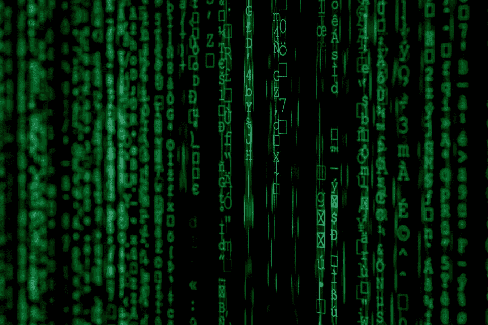

# 数据科学家——一个值得追求的职业？

> 原文：<https://towardsdatascience.com/data-scientist-a-career-worth-pursuing-44fd92a3eae1?source=collection_archive---------14----------------------->

## 让我们透过美化的噪音找出真相。

图片来源: [Unsplash](https://unsplash.com/?utm_source=medium&utm_medium=referral)

绝对是！如果说有什么不同的话，那就是成为数据科学家的最佳时机。如今，不仅对熟练数据科学家的需求旺盛，而且在供应方面也存在巨大缺口。这只能说明你有广阔的空间去追求这个[非常抢手的职业](https://www.springboard.com/blog/value-of-a-data-scientist/)，以及赚比目前任何其他领域都多的钱。

鉴于世界事务的多样性和我们对不断增强的技术的日益依赖，数据科学专业知识，如大数据、人工智能、机器学习等。只会越来越多。至少在今后的几十年里，你处于一个安全的位置，可以保持作为一名杰出的数据科学家的声望。

据报道，著名经济学家和作家安德鲁·弗劳尔斯说过:

> 越来越多的雇主希望雇佣数据科学家。

正如 Forrester Research 分析师 Brandon Purcell 认为的那样

> “对数据科学家的需求只会增长，因为组织越来越依赖于[数据驱动的见解](https://searchbusinessanalytics.techtarget.com/feature/Data-driven-culture-helps-analytics-team-generate-business-value)。

我们可以联系更多来自著名统计学家的类似支持、预测和观察，得出同样的看法，即数据科学正在塑造我们共同的未来。

那么，是什么让数据科学成为最令人兴奋的职业选择呢？让我们看看。

# 为什么数据科学具有刺激性？

图片来源: [Unsplash](https://unsplash.com/?utm_source=medium&utm_medium=referral)

增加数据科学显著性的主要因素是它为个人打开的门的数量。不像其他任何领域，如果你在其他行业徘徊，你会觉得，被认为，被当作一个不知情的外国人。你是。老实说。你是。例如，医生只知道他/她在为人们服务时所使用的先进技术，但他/她不知道创造这种特殊设备的硬件/软件开发。

然而，无论你的工作性质如何，数据科学专业知识都可以在你的职业发展中发挥重要作用。无论是商业营销、城市规划、网络零售、医疗保健、体育、安全等。，数据驱动的分析和物流正迅速成为支撑每个职业的支柱。

人们普遍认为数据科学只在技术领域有价值。这与事实相去甚远。事实上，脸书、微软、苹果、谷歌和亚马逊这五大科技公司只雇佣了美国 1%的员工。这验证了数据科学的多功能角色。

此外，自动化、人工智能、机器或深度学习、机器人等。通过简单地用更合格和更复杂的版本来代替这些方法，取代了许多职业的冗长和危险的本质。这种大规模转变的兴起使得数据科学家成为获得和保持进步的关键。

因此，如果你对计算机、数学以及通过数据分析寻找主要和次要问题的解决方案充满热情，那么追求[数据科学高级教育](https://www.northeastern.edu/graduate/program/master-of-science-in-data-science-5256/)是你成为一名熟练的数据科学家的唯一合理步骤。

根据詹姆斯·库克大学协调员里卡多·坎佩洛的说法:

> 一名合格的数据科学家擅长跨学科技能的核心集合，这些技能构成了数据的整个生命周期。他们在计算、数学、统计和面向商业的主题中接受培训，这使他们能够与几乎所有领域的领域专家一起工作。在我看来，跨学科背景是一个人简历中最重要的资产。

在数据科学领域从事职业非常值得付出每一点努力和投资。这不仅是一个明智的选择和丰厚的回报，而且数据还被定位为整个经济即将运转的枢纽。

**数据科学家技能**

图片来源: [Unsplash](https://unsplash.com/?utm_source=medium&utm_medium=referral)

数据科学家都受过良好教育，88%拥有硕士学位，46%拥有博士学位。强大的教育背景是执行所有复杂任务所需的深入知识所必需的。数据科学是一个多学科领域，与数学、统计学、编程等平行。

为了满足高度专业化的需求，数据科学家必须精通分析数据的技术技能。数据科学家还需要对编程语言以及数据构造和解构有特别的理解。

尽管由于不同领域的相反性质，数据科学家没有明确的技能集，但大多数数据驱动的职责都需要一些常见的技术/非技术技能。例如，大多数数据科学家负责将不同数量的原始数据转化为可读的见解，从而实现分析预测和操作。为了做到这一点，如果您考虑从事数据科学职业，您必须精通以下领域:

**统计与数学**:你需要在数学、概率、统计、多元微积分、算法等方面有很高的造诣。，创建数据的统计模型。

**编程语言** : Python、SAS、SQL 和 R 是数据科学应用中最常用的编程语言，无论你打算在哪个领域前进。

**数据** : 原因很明显！一个有经验的数据科学家平均花费 80%的时间处理不同的数据类型，以创建分析模型并获得有价值的洞察力。

沟通技巧:如果你不能交流你的成果和见解，技术术语只能带你走这么远，那你再怎么努力也没用。你应该能够以一种容易理解的方式交流你的发现。

**数据科学家工资**

有几个因素会影响数据科学家的薪酬待遇，例如教育、经验、领域、职位、地区，最重要的是，聘用数据科学家的机构的规模和概况。然而，根据 Glassdoor 的信息，平均金额在 95，000 美元至 250，000 美元之间波动。这似乎是对数据科学家通过数据科学家的许多职责带来的巨大价值的公平补偿。

了解大数据影响力的雇主很难找到一位能够应对工作所需所有挑战的专业人士。这反过来又成为高工资背后的驱动因素。数据科学专业人员的供需缺口甚至让刚刚起步的无经验人士受益。

我们这里有一份根据上述因素，基于 [O'Reilly 的数据科学薪资调查](http://www.oreilly.com/data/free/files/2016-data-science-salary-survey.pdf) & [BurtchWorks 报告](https://www.burtchworks.com/wp-content/uploads/2018/05/Burtch-Works-Study_DS-2018.pdf)的数据科学家薪资包明细。

# 经验工资

尽管已经有相当多的早期职业专业人员入职，但即使是入门级的数据科学家的薪酬待遇也高达 95，000 美元。虽然中级数据科学家的薪酬待遇起价为 128，750 美元，但如果这个阶段的数据科学家也参与管理任务，薪酬将增加到 185，000 美元。经验丰富的数据科学家从中级专业人员增加的工资开始，他们最终通过这里的管理角色和那里的额外任务赚到 25 万美元。

# 职位工资

以下是数据驱动型组织中最受有志和有经验的数据科学专业人士欢迎的职位。

数据科学家:8.5 万至 17 万美元

数据分析师:7.5 万至 11 万美元

数据科学/分析经理:9 万至 14 万美元

大数据工程师:11.5 万美元至 16.5 万美元

# 按领域列出的薪金

以下是数据科学家和其他数据科学专业人员收入最高的一些领域:

*   云服务、托管、软件和 CDN
*   研究和分析
*   网络社交
*   商业智能
*   银行和金融
*   安全性
*   主流媒体

# 教育工资

最高的薪水并不属于那些拥有博士或硕士学位的人，尽管它肯定给入门级的数据科学家一个体面的开始。拥有定量学科高水平教育的专业人士薪酬最高，如:

数据科学

应用数学

统计数字

计算机科学

工程

经济学

运筹学

## 以及技术技能，如:

掌握 4 种以上的计算机编程语言

掌握处理大数据的技术

精通开源工具

深入的云计算知识

数据可视化能力

拥有所有的专业知识仍然不足以成为一名成功的数据科学家。你需要知道如何最好地运用你的知识和工具，以便从公司整体的改善中获得可操作的见解。精明的商业判断、科学兴趣和令人信服的沟通技巧是在成功的职业生涯中大有帮助的额外属性。

**根据公司规模和概况的薪酬**

薪酬最高的数据科学家受雇于备受瞩目的领先科技公司，这一点也不奇怪。以下是其中一些公司的名称:

谷歌:152856 美元

推特:135360 美元

苹果:145974 美元

脸书:134715 美元

微软:123328 美元

贝宝:13.2909 万美元

Airbnb:127852 美元

**要记住的事情**

一段时间以来，数据科学一直是最热门的讨论话题。它在科学、技术、经济、就业等许多论坛上一直处于领先地位。大部分是因为好的原因，但是如果没有一点缺点，那就太好了，不像是真的。尽管数据科学领域充满荣耀和潜力，但很少有人真正成为成功的数据科学家。有没有想过为什么会这样？对此没有简单明了的答案。

我们将列出一些关于欺诈网站上点击诱饵内容暗示的“即时”概念的真相。随着一些被打破的神话，再次由不真诚的平台灌输，误导许多有抱负的数据科学家怀有错误的期望。当他们面对严酷的现实时，他们最终会失去动力，除了辞职什么都不做。这很不幸。

你需要绝对清楚的第一件事是，学习数据科学很难。你将不得不投入大量的努力和时间来获得任何像样的技能。

无论你做什么，不要陷入“在 15 天内掌握数据科学的艺术”的陷阱它的所有版本都是在利用你的热情和出生来赚快钱。

您需要真正的数据科学教育，而不是学习它，而是不断提高您的技能，以跟上技术和科学世界不断变化的维度。

比当前的数据科学和分析生态系统信息更注重培养直觉技能。机制容易改变，而技能不会，所以请帮自己一个忙，不要迷失在这个包和这个片段的细节中。

数据科学不仅仅是长期以来与之相关的时髦词汇。如果你准备好看着屏幕上杂乱无章的数字和符号，那么只有到那时，你才应该向学习数据科学迈出真正的第一步。因为作为一名数据科学家，数据清理正是您将花费大部分时间去做的事情。

不要害怕笨拙的错误！数据科学并不像他们看起来那样清晰和聪明。所有炙手可热的数据科学家都是从充满错误的代码编译或混乱的数据服务器开始的。他们通过实践获得成功，所以犯错误，从中吸取教训，不要再犯同样的错误。

最后，问问自己，数据科学真的适合我吗？我有那种坚持，努力，投入，和需要的时间吗？如果你的回答都是肯定的，那就继续下一步。

首次出版；[操行科学](https://conductscience.com/)