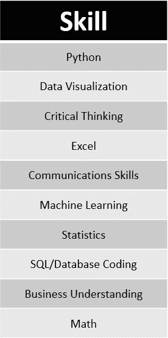
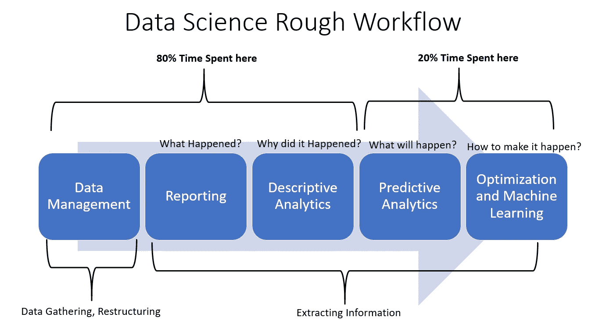

# 数据科学家的工作—值得做出牺牲吗？

> 原文：<https://towardsdatascience.com/data-scientist-job-is-it-worth-the-sacrifices-made-efdf34139aa6?source=collection_archive---------59----------------------->

## 意见

## 长话短说——的确如此(至少对我来说)

迈克尔·朗米尔在 [Unsplash](https://unsplash.com?utm_source=medium&utm_medium=referral) 上的照片

你打开网页，发现数据科学家是最性感的工作。

网上说，作为数据科学家，你将获得每年约 10 万美元的报酬。

您对前景感兴趣，并开始寻找成为数据科学家的方法。

打开每个网页标签，

看了很多文章，

收集了无数的电子书，

给 LinkedIn 上的人发消息，

在 YouTube 视频上观看课程，

报名参加网络课程，

参加线下数据科学训练营，

参加卡格尔比赛，

诸如此类。

**你牺牲了很多——时间、金钱、睡眠、精神、关系等等。**

然后你觉得自己已经准备好成为一名数据科学家了。

你填写工作申请表——有数千人申请的入门级工作，

等待电话，

很少有公司打电话来或者根本没有，

被拒绝了，

你变得更有创造力，

试着找到一种社会联系，

或者申请实习，

继续努力。

即使牺牲了这么多东西，唯一能保住工作的人还是寥寥无几。

许多人要么需要等待另一次机会，要么干脆放弃。

不是每个人都在经历类似的磨难，但有些人会感到熟悉。

值得做出的牺牲吗？

让我试着解释一下成为一名数据科学家需要什么。

> "那么，也许，仅仅是也许，数据科学家是一份值得你为之牺牲的工作."

# 成为数据科学家需要什么？

成为一名数据科学家有许多必备技能，但哪一项才是精华呢？。让我们来看看 KDNuggets 民意调查中的 10 大技能。

来源:创建自[https://www . kdnugges . com/2019/09/core-hot-data-science-skills . html](https://www.kdnuggets.com/2019/09/core-hot-data-science-skills.html)

不出所料，很多技能都是技术技能。Python 和数据可视化都位居第一和第二，批判性思维技能紧随其后。暂时，让我们忽略非技术技能，如批判性思维和商业理解。我们究竟花了多长时间学会了所有这些技能，需要付出多少代价？我们去那里取些样本。

## 在线课程

假设我们每周学习 4 个小时(这通常是在线课程推荐的时间)。

*   [**IBM 数据科学课程**](https://www.coursera.org/professional-certificates/ibm-data-science?) **在 Coursera** 提供了 Python & SQL 的课程，分析&可视化数据，建立机器学习模型。~ **10 个月。**费用:**每月 39 美元**
*   [**数据科学在线训练营**](https://www.udemy.com/course/the-data-science-course-complete-data-science-bootcamp/) **在 Udemy** 承诺学习数学、统计学、Python、Python 中的高级统计学、机器&深度学习。~28 小时在线视频。如果我们每周学习 4 小时，那将需要 2 个月。成本:**~ 200 美元，但通常时间折扣为~ 12 美元**
*   [**Data camp 上的数据科学赛道**](https://www.datacamp.com/)**其中的课程包括 Python、数据可视化、SQL、机器学习和统计学。100 小时~ **7 个月。**费用:**标准订阅每月 25 美元或每年 300 美元****

## **训练营**

**和培训师一起进行线下(或者线上，但是广泛的)训练营怎么样？他们承诺你可以成为数据科学家多久？**

*   **[**美国 Metis 数据科学训练营**](https://www.thisismetis.com/data-science-bootcamps) [课程](https://thisismetis.com/assets/Metis-Bootcamp-Curriculum-2019.pdf)说你会学习 Python、SQL、机器学习、统计学(还有很多)。 **~12 周或 3 个月。**费用:**全额学费 17000 美元****
*   **[**纽约数据科学院**](https://nycdatascience.com/data-science-bootcamp/#become-a-data-scientist-in-12-weeks) [课程](https://nycdatascience.com/data-science-bootcamp/#what-you-will-learn)包括 Python(和 R)、数据可视化、SQL、机器学习。 **~12 周或 3 个月。**费用:**全额学费 17600 美元****
*   **[**跳板数据科学赛道**](https://www.springboard.com/workshops/data-science-career-track/) 设有课程 Python、数据可视化、SQL、机器学习。 **~6 个月。**成本:**预付 7500 美元****
*   **[**新加坡 Hackwagon 数据科学课程**](https://hackwagon.com/data-science-101/) 拥有 Python、数据可视化、机器学习、数学、统计学的完整课程。 **~7 周 x 3 个疗程**或**左右~ 5 个月~ 6 个月。**费用:**；每门课程 2000 新元 x3 = 6000 新元****

**从上面的例子中，我们可以看到在线课程为你提供了许多小时的在线视频或课程。许多人建议学习六个月以上(这取决于你想每周花多长时间)。这是合理的，因为在线课程是静态的，没有任何与导师的互动，所以你需要更长的时间来理解每个概念。网络课程的主要优势是便宜；几乎每个人都可以负担得起，如果他们有多余的钱，虽然这也成为一个问题。虽然它很便宜，但它只是在没有适当指导的情况下为你建立了短暂的知识——没有方向。**

**此外，许多雇主不认为在线课程是一种资产，除非你已经有相关的学位或经验。在我个人看来，在线课程的价值与其价格相当——提高/回顾你的技能是好事，但不要仅仅依靠这一点来成为数据科学家。你可以尝试通过使用各种书籍或者只是阅读文档来学习这些技巧，但是我不确定掌握必要的技巧需要多长时间。**

**训练营怎么样？我们可以看到它要贵得多。非常贵。这是因为 Bootcamp 提供了一些在线课程没有的东西，即专业讲师、个人指导、密集的时间表和联系(尽管我知道一些 Bootcamp 没有经验丰富的员工和/或联系)。问题是值得吗？答案是肯定的，也是否定的。肯定的，因为对于一个新手来说，你需要一个方向、专业的评论和关系才能进入数据科学。否定的，因为你可以从书籍或在线课程中获得所有必要的技能。进一步考虑，在今天的条件下很难保证有人就业，就像训练营承诺你完成课程后有工作一样；对此半信半疑。**

**现在，我之前解释的都是关于技术技能的。你从哪里获得的非技术性技能，如批判性思维、沟通和商业理解？没有在线课程或训练营教你这些。对于这一点，我还没有提到获得必要技能的其他方法；就是通过获得**学位**和/或**专业就业**，就像我一样。**

**为什么许多员工喜欢有抱负的数据科学家持有学位？这是因为有些技能只有通过在学院/大学里学习才能获得。我并不一定意味着你需要一个博士学位才能成为一名优秀的数据科学家——如果你正确地学习课程，即使是学士学位也足够了。它会教你批判性思维和如何沟通，如果你的学位与雇主的业务相符，也许还会教你商业。虽然，这将需要**更长的时间**和**更高的成本**相比，我放下以上。我获得硕士学位的教育时间花了六年，其中三四年是作为研究人员的专业时间，在成为数据科学家之前，我花了几个月的时间再次复习我的技术技能。是的，总的来说，我需要大约 9-10 年的准备时间来步入数据科学的世界。**

**无论你选择哪种方式，都要准备好花费大量的时间和金钱来获得必要的技能。毕竟没有免费的午餐。你需要付出才能得到。此外，在所有这些之后，也不能保证能得到一份数据科学家的工作。你需要做好应对拒绝的心理准备。**

# **值得牺牲吗？**

**我牺牲了很多钱，时间，睡眠，关系。我花了很多钱和时间在错误的地方。我放弃了与朋友甚至是一段关系出去玩的提议，只是为了专注于学习线性代数。我醒着的时候只是为了提高我的技能。这一切值得吗？**

**现在，如果你的唯一目标是薪水，数据科学家根本不值得牺牲。仍然有许多工作在花费相似或更少的时间和金钱来掌握技能(或甚至更少的技能来学习)的情况下报酬更高。比如软件工程师，全栈开发者，律师，药剂师，甚至飞行员。仍然有许多种类的工作，更好的是花时间在更好的薪水和听起来很棒的名字上。**

**如果你成为一名数据科学家，你的工作流程大致如下。**

****

**来源:我自己创作**

**不要想象作为一名数据科学家，我们会致力于创建一个机器学习模型，或者神奇地预测接下来会发生什么。大多数时候，我们只是收集数据，创建报告，使用统计数据来理解发生的事情，演示和探索数据。还是要看你的公司是什么业务，但是很多时候，只看上面的。**

**如果你不能想象自己一直在收集和查看数据，那就不要做数据科学家。机器学习模型很酷，但不要坚持你会后悔的工作。牺牲实在太大了。**

**然而，如果你喜欢观察模式，不要介意弄脏假设，对探索数据有耐心，喜欢分析，[有数据素养天赋](/7-signs-you-are-data-literate-4a844efcdd32)，并且擅长沟通。那么，也许，仅仅是也许，数据科学家是你值得牺牲的工作。在做出这种牺牲之前，你需要知道你签约到底是为了什么。**

# **结论**

**我热爱我的职业，因为我喜欢探索我的数据，观察模式，获得一条新信息，创建一个假设，测试我的建议，以及其他许多我可以用数据做的事情。是的，我也喜欢玩机器学习，但这不仅仅是我工作中的乐趣。当然，职业前景也很好。**

**我想说的是，进入数据科学需要很多牺牲。在你做这一切之前，确保这种牺牲是值得的。对我来说，这是值得的。**

# **如果你喜欢我的内容，并想获得更多关于数据或作为数据科学家的日常生活的深入知识，请考虑在这里订阅我的[时事通讯。](https://cornellius.substack.com/welcome)**

> **如果您没有订阅为中等会员，请考虑通过[我的推荐](https://cornelliusyudhawijaya.medium.com/membership)订阅。**