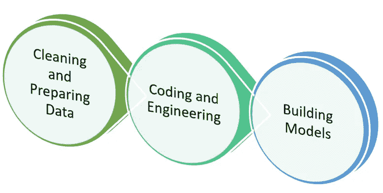
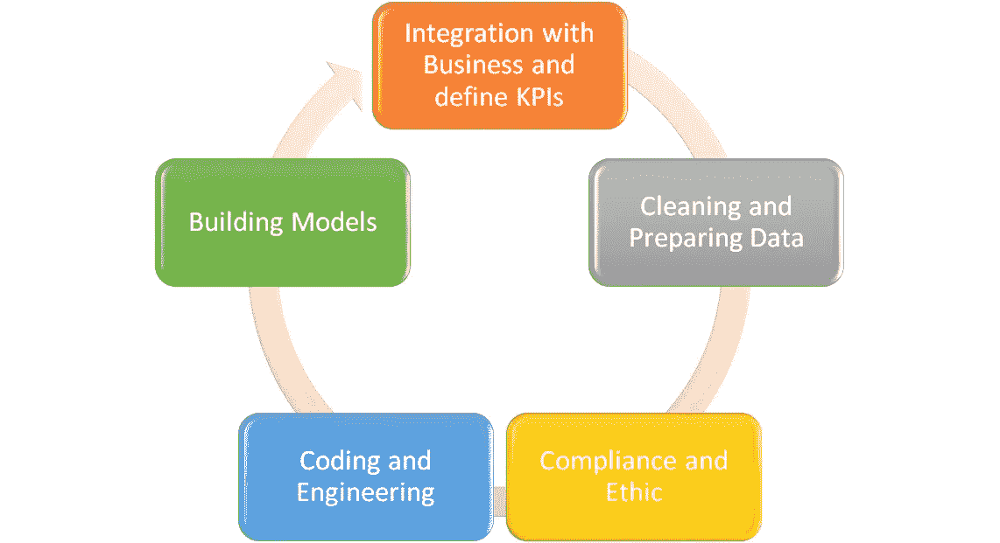

# 数据科学家必须知道:商业 x 统计

> 原文：<https://towardsdatascience.com/data-scientist-must-know-business-x-statistics-7bb8575a9525?source=collection_archive---------48----------------------->

## 为什么业务和统计之间集成对于数据科学家来说至关重要

露丝·齐默曼在 [Unsplash](https://unsplash.com?utm_source=medium&utm_medium=referral) 上拍摄的照片

根据定义，统计学是一门处理数据的收集、分类、分析和解释的科学。该领域通常由概率数学理论的使用来支持，并用于评估特定的假设。

这个定义听起来已经很专业了，而且似乎与商业没有任何关系。此外，为什么数据科学家需要知道这两件事？

嗯，统计学不仅仅是一门高等数学课。这是每个企业从竞争中获得优势的必由之路。我认为，许多伟大的商业领袖做出的商业决策不仅来自他们的直觉，也有统计数据的支持。

> 任何数据科学家项目都是解决公司任何问题的数据项目。如果你的高级深度学习模型有 99%的精度，并能猜出每个经过房间的人，这并不重要；如果它不能解决业务问题，那它就是无用的。

问题是，统计对业务到底有多重要，为什么我们作为数据科学家需要了解统计和业务的两个方面？这是你可能会疑惑的问题。好吧，让我向您解释更多关于数据科学家的业务和统计信息。

# 商业 x 统计

商业和统计看起来像两个不同的世界，不会融合，但它是重要的整合。你怎么问？下面我用几段话告诉你。

## 数据驱动的业务和统计

您可能经常在许多文章或其他数据科学相关的学习材料中听到术语**“数据驱动”**。它可能会说一些类似的话，比如“这个业务是数据驱动的”，或者“决策是基于数据的，所以它是数据驱动的”，等等。

在这里，您可能认为使用数据进行业务决策意味着您是数据驱动的。是真的吗？如果按数据，就是只看数字，根据数据快照执行决策，那么就是一个
**否**。

数据驱动的业务不仅仅如此。公司可能包含大量的数据，但是**如果这些信息与当前的业务无关，那么它们就是无用的**。

例如，已经成立十年的公司 A 想在新的市场销售一种新产品。他们要求他们的数据团队根据他们拥有的数据为他们的新产品描绘一个新的细分市场，他们声称拥有大量数据。该团队然后查看他们的公司数据，发现“大量数据”意味着许多电子表格数据只包含无用的属性，如 id、姓名、电子邮件和电话号码。

以上是一个无法解决您的业务问题的数据示例，但是如果我们有一个“可能的”数据集来细分新客户呢？先说他们的工资，职业，喜好，年龄。在这一点上，我们的业务需要**统计数据来评估数据质量，并帮助公司决定采取何种业务战略**。

## 考虑商业中的统计

我已经简单解释了为什么统计数据在商业中至关重要，但是什么样的统计数据在商业中特别重要。这里，我们需要回到业务的核心**“你的业务问题中最重要的是什么？”**；是销售数字，还是利润，或者任何你可以问的问题。这就是我们所说的**关键指标**。

例如，公司 A 的关键指标是他们的月销售额。在这种情况下，公司 A 需要解决的是他们希望从他们的关键指标中得到什么样的分析。嗯，最明显的一个是这些年来的月销售额。下面我举一个数据例子。

作者创建的数据示例图

现在，通过一个简单的统计和分析，我们可以看到销售数量一直在增加，直到二月份，每年的销售额都在大幅下降。在这种情况下，统计数据可以提供每年下降的准确百分比，从业务角度来看，值得调查以确定下降的原因。

这就是统计如何帮助企业；这不仅仅是指出公司存在的问题，帮助企业做出商业决策，还包括了解企业的销售状况。

## 数据科学家的商业和统计

那么，数据科学家呢？我上面解释的似乎只适用于业务，不适用于数据科学家。嗯，我们可能需要定义数据科学家大部分时间做什么。

由作者创建的学术数据科学家图表

上图是数据科学家每天进行的理论活动。虽然这没有错，但工作环境中的现实却大相径庭。

作者创建的真实数据科学家活动图

在上图中，我们可以看到，这不仅仅是清理和准备数据，我们还需要遵守数据合规性和道德规范，以及将我们的任何数据项目与业务问题相集成。

任何数据科学家项目都是解决公司任何问题的数据项目。如果你的高级深度学习模型有 99%的精度，并能猜出每个经过房间的人，这并不重要；如果它不解决商业问题，它就是无用的。

每一个数据科学家都需要了解你的公司正在从事什么样的业务，以及你试图解决什么样的业务问题。当你在公司工作时，与其他部门的互动是不可避免的。

例如，销售部门想要增加销售数量。为此，销售团队要求数据科学团队创建一个新的客户预测模型。你可能会认为只需提取数据并将其训练到任何机器学习模型，对吗？

不，事实往往不是这样。你首先需要做的是说服销售部门这个项目是否可行，并设定一个合理的目标。这就是为什么数据科学家也需要了解业务和统计方面。

要确定您是否可以执行数据项目，您需要有用的数据。在这种情况下，**你需要一个统计来评估你的数据质量**。

而且，经常，不处理数据的人会设立一个不合理的目标。例如，销售部门希望下个月的销售数字增加 100%。要证明这个目标是否合理，需要从你目前的数据来评估。简单的趋势分析和估计就可以了，但是你只有理解了统计数据和业务才能做到这一点**。**

你可能会说，“难道机器学习模型不是为了提高销量而创建的吗？如果是这样，这种估计就没用了”。当然，拥有机器学习模型的目的是为了解决业务问题，比如增加销售数量。虽然这是事实，但你仍然需要将你的目标控制在一个合理的数字之下。

会有一个你的机器学习模型无法预见的问题；比如业务员辞职、部门重组、配送事故等等。有雄心壮志固然很好，但要努力在合理的范围内实现你承诺的目标。

选择适当的关键指标也可能是数据科学家的责任，尤其是当公司刚刚涉足数据驱动型业务时。在这种情况下，商业和统计会成为你最好的朋友。

# 结论

不了解业务和统计数据，数据科学家就无法工作。这两个方面都是数据科学家的工作装备，了解这些可以让你成为更好的数据科学家。

作为一名数据科学家，您需要了解业务和统计方面，因为:

1.  数据项目不仅仅是清理数据和创建模型，它还涉及解决业务问题，
2.  评估数据项目对于解决业务问题是否可行需要统计，
3.  统计还需要为您的数据项目设定一个合理的目标，因为您的机器学习模型无法预见一切，而且
4.  商业和统计是你可以用来提高你在公司中的地位的知识，或者当你申请数据科学家职位时。

希望有帮助！

# 如果您喜欢我的内容，并希望获得更多关于数据或数据科学家日常生活的深入知识，请考虑在此订阅我的[简讯。](https://cornellius.substack.com/welcome)

> 如果您没有订阅为中等会员，请考虑通过[我的介绍](https://cornelliusyudhawijaya.medium.com/membership)订阅。