# 数据科学家必备的统计数据

> 原文：<https://towardsdatascience.com/data-scientist-must-know-statistics-a161fa7c1bca?source=collection_archive---------10----------------------->

在 [Unsplash](https://unsplash.com?utm_source=medium&utm_medium=referral) 上由 [Carlos Muza](https://unsplash.com/@kmuza?utm_source=medium&utm_medium=referral) 拍摄的照片

## 统计学中最重要和最基本的概念

初学者通常会忽略最基本的统计知识。为了更好地理解不同的模型和各种技术，这些概念是必不可少的。这些是数据科学、机器学习和人工智能中涉及的各种概念的基础知识。

下面是本文涵盖的概念列表。

1.  集中趋势测量
2.  传播的量度
3.  人口和样本
4.  中心极限定理
5.  取样和取样技术
6.  选择偏差
7.  相关性&各种相关系数

让我们开始吧！

# 1 —集中趋势的度量

集中趋势的**度量**是试图通过识别一组数据中的中心位置来描述该组数据的单个值。用作中心测量的三个最常见的值是，

**— Mean** 是数据中所有值的平均值。

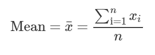

“n”个数据值的平均值

**— Median** 是排序数据的中间值。中位数是比平均值更好的中心度量，因为它不受异常值的影响。

**—模式**是数据中出现频率最高的值。

# 2 —扩散的测量

**分布测量**描述了某一特定变量(数据项)的一组观察值的相似程度或变化程度。**分布的度量**包括范围、四分位、四分位间范围、方差和标准差。

**—范围**是数据中最小值和最大值之差。

**—四分位数**将有序数据集分成四个相等的部分，并引用四分之一之间的点的值。
*下四分位数(Q1)* 是介于最低的 25%值和最高的 75%值之间的值。它也被称为第 25 百分位。
*第二个四分位数(Q2)* 是数据集的中间值。它也被称为第 50 百分位，或中位数。
*上四分位数(Q3)* 是最低的 75%和最高的 25%之间的值。它也被称为第 75 百分位。

四分位数的分布(图片由作者提供)

**四分位数范围(IQR)** 是上四分位数(Q3)和下四分位数(Q1)之间的差值，描述了从最低到最高排序的中间 50%的值。**IQR 通常被视为比极差更好的分布度量，因为它不受异常值的影响。**

****—** 所有均值为μ的数据点的**方差**，每个数据点用 *Xi* 表示， *N* 个数由下式给出:**

**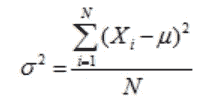**

**方差的数学公式**

****标准差**是方差的平方根。总体的标准偏差由 *σ表示。***

**在分布较小的数据集中，所有值都非常接近平均值，从而产生较小的方差和标准差。数据集越分散，值就越远离平均值，从而导致更大的方差和标准差。**

****

# **3 —总体和样本**

*   ****群体**是可能的数据值的整个集合。**
*   **数据集的**样本**包含总体的一部分或子集。样本的大小总是小于被抽取样本的总体大小。**

**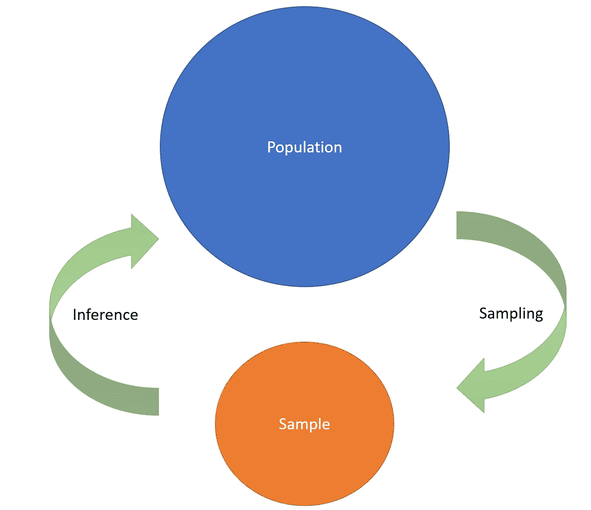**

**说明人口和样本的简单草图(图片由作者提供)**

**例如，*一个国家*所有人的集合是' ***人口*** '，而*一个人的子集*是' ***样本*** '通常小于人口。**

****

# **4 —中心极限定理**

**中心极限定理是概率论中的一个关键概念，因为它意味着适用于正态分布的概率和统计方法可以适用于许多涉及其他类型分布的问题。**

> **CLT 表示，“使用足够大的样本量从总体中取样，样本的平均值，即样本平均值，将是正态分布的。不管人口分布如何，都是如此。”**

**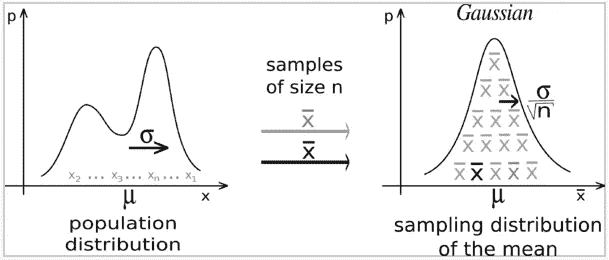**

**不管总体的分布如何，抽样分布都是正态的。(图片来自[维基百科](https://en.wikipedia.org/wiki/Central_limit_theorem))**

**其他来自 CLT 的 acumens 是，**

*   **样本均值以概率收敛，并且几乎肯定收敛于总体均值的期望值。**
*   **总体的方差等于样本的方差与每个样本中元素数量的乘积。**

****

# **5—取样和取样技术**

**抽样是一种统计分析技术，用于选择、操作和分析数据点的代表性子集，以识别所观察的较大数据集中的模式和趋势。**

**从数据中抽取样本有许多不同的方法；理想的取决于数据集和手头的问题。常用的取样技术如下:**

*   ****简单随机抽样:**在这种情况下，样本中的每个值都是完全随机选择的，总体中的每个值都有同等的机会或概率被选中。**
*   ****分层抽样:**在这种方法中，首先将人群分成具有相似特征的亚组(或阶层)。当我们可能合理地预期不同子群之间的兴趣测量不同，并且我们想要确保所有子群的代表性时，使用它。**
*   ****整群抽样:**在一个整群样本中，总体的子群被用作抽样单位，而不是单个数值。人群被分成称为集群的子群，这些子群被随机选择包括在研究中。**
*   ****系统抽样:**每隔一段时间从抽样框中选取一个数值。选择间隔以确保足够的样本量。如果你需要一个样本大小为 *x* 的总体中的 *n* 的样本，你应该选择每个 *x/n* 个体作为样本。**

****

# **6 —选择偏差**

**选择偏倚(也称为抽样偏倚)是由于总体中的非随机样本引起的系统误差，导致总体中的一些值比其他值更不可能被包括在内，从而产生有偏倚的样本，其中所有的值不是同等平衡或客观表示的。**

**这意味着没有实现适当的随机化，从而确保获得的样本不能代表要分析的人群。**

**在一般情况下，仅靠现有数据的统计分析无法克服选择偏差。通过检查相关性可以评估选择偏差的程度。**

****

# **7 —相关性**

**简单地说，相关性是衡量变量(或特征或样本或任何组)相互关联程度的一个指标。几乎在任何数据分析中，数据科学家都会比较两个变量以及它们之间的关系。**

**以下是最广泛使用的相关技术，**

1.  **协方差**
2.  **皮尔逊相关系数**
3.  **斯皮尔曼等级相关系数**

## **1.协方差**

**对于两个样本，比如说 *X 和 Y* ，设 *E(X)，E(Y)* 分别为 *X，Y* 的平均值，‘*n*为数据点的总数。X，Y 的协方差由下式给出:**

**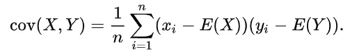**

**X，Y 的协方差的数学公式**

**协方差的符号表示变量之间线性关系的趋势。**

**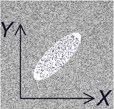****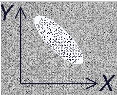

当协方差(X，Y)分别为正和负时，X，Y 的示例图(图片来自[维基百科](https://en.wikipedia.org/wiki/Covariance)** 

## **2.皮尔逊相关系数**

**皮尔逊相关系数是一种统计量，它也测量两个特征之间的线性相关性。对于两个样本，X，Y 设σX，σY 分别为 X，Y 的标准差。X，Y 的 PCC 由下式给出:**

**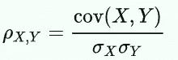**

**X，Y 的 PCC 的数学公式**

**它的值介于-1 和+1 之间。**

**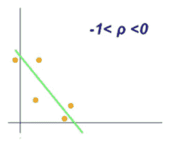****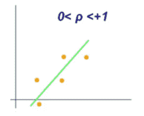

PCC 值分别在-1 和 0、0 和+1 之间的变量样本图** **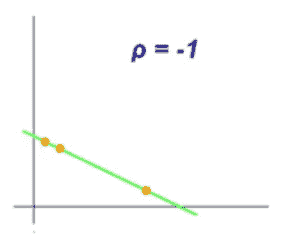****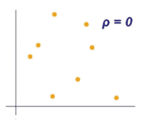****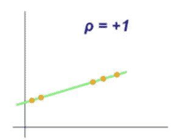

值分别为 PCC -1，0，1 的变量样本图** 

## **3.斯皮尔曼等级相关系数**

**斯皮尔曼等级相关系数(SRCC)评估两个样本之间的关系可以使用*单调函数(无论线性与否)*描述的有多好，其中 PCC 只能评估线性关系。**

**两个样本之间的 Spearman 等级相关系数等于这两个样本的等级值之间的 *Pearson 相关系数*。 *Rank* 是变量内观测值的相对位置标签。**

> ***直观地说，当两个变量之间的观测值具有相似的等级时，两个变量之间的 Spearman 等级相关系数会很高，而当两个变量之间的观测值具有不同的等级时，该系数会很低。***

**Spearman 等级相关系数位于+1 和-1 之间，其中**

*   **1 是一个**完全正相关****
*   **0 是**不相关****
*   **—1 是一个**完美负相关****

**要了解更多相关技术以及何时使用哪种技术，请查看下面的文章。**

** [## 在数据中寻找联系？相关技术来拯救！

### 简单地说，相关技术

medium.com](https://medium.com/towards-artificial-intelligence/looking-for-connections-in-your-data-correlation-techniques-come-to-rescue-53121a149f96) 

谢谢你的阅读。我也将在未来写更多初学者友好的帖子。请在[媒体](https://medium.com/@ramyavidiyala)上关注我，以便了解他们。我欢迎反馈，可以通过 Twitter [ramya_vidiyala](https://twitter.com/ramya_vidiyala) 和 LinkedIn [RamyaVidiyala](https://www.linkedin.com/in/ramya-vidiyala-308ba6139/) 联系我。快乐学习！**